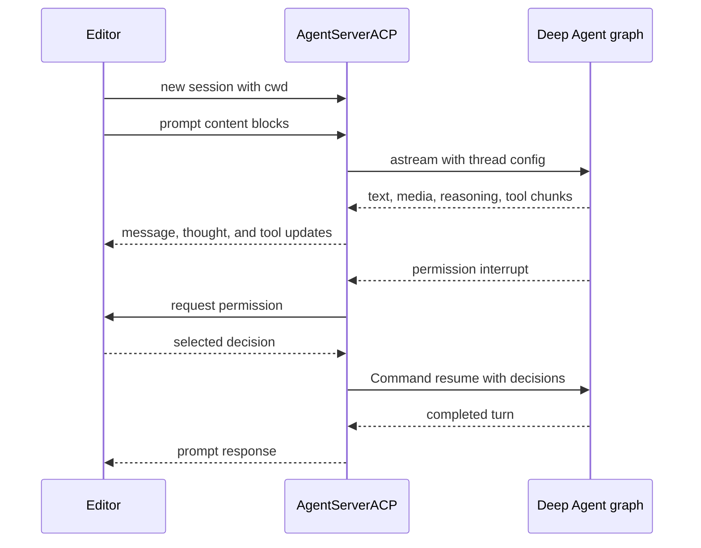

# ACP Integration

[Agent Client Protocol (ACP)](https://agentclientprotocol.com/overview/introduction) lets an editor such as [Zed](https://zed.dev/) run an agent process over stdio. This repository provides two deliberately different ACP entry points:

- **`deepagents-acp`** is the reusable adapter. `AgentServerACP` projects a supplied LangGraph graph into the ACP server interface; it does not define a particular coding agent or automatically load editor-provided MCP servers.
- **`dcode --acp`** is a dcode factory around that adapter. It builds the preconfigured Deep Agents Code graph for each ACP session, including dcode's filesystem and shell tools, configured MCP tools, and subagents.

Neither is dcode's normal client/server path: the normal remote client talks to a LangGraph server over HTTP+SSE and adapts that stream for the Textual UI. `--acp` instead runs an ACP server over stdio rather than launching that UI. See [Code Agent architecture](/openwiki/architecture/code-agent.md) for the coding graph, [MCP integration](/openwiki/integrations/mcp.md) for MCP configuration, and [Permissions & Human-in-the-Loop](/openwiki/concepts/permissions-hitl.md) for dcode policy.

## Reusable `deepagents-acp` adapter

`AgentServerACP` subclasses ACP's `Agent` interface. Construct it with either a compiled `CompiledStateGraph`, or a factory accepting `AgentSessionContext(cwd, mode, model)` and returning a graph. The factory form isolates graph construction by editor working directory and selected configuration. `modes` and `models` are factory-only: passing either with a compiled graph raises `ValueError`.

```python
import asyncio

from acp import run_agent
from deepagents import create_deep_agent
from langgraph.checkpoint.memory import MemorySaver

from deepagents_acp.server import AgentServerACP


async def main() -> None:
    agent = create_deep_agent(
        tools=[...],
        checkpointer=MemorySaver(),
    )
    server = AgentServerACP(agent)
    await run_agent(server)


asyncio.run(main())
```

The bare example is launched from Zed through `run_demo_agent.sh`. Its `uv` project is the script directory, while the process keeps the editor's current working directory. The example expects `ANTHROPIC_API_KEY` in `.env`; LangSmith tracing can additionally use `LANGSMITH_TRACING`, `LANGSMITH_API_KEY`, and `LANGSMITH_PROJECT`.

### Sessions and configuration

On `initialize`, the adapter advertises image-prompt support and advertises `session/load` only when constructed with `load_sessions=True`. `new_session` generates an ACP session ID, stores the supplied `cwd` and MCP descriptors, initializes mode/model state, and returns selectors when modes or models were configured. The adapter supports old and new ACP schema forms: it dynamically handles the optional `SessionConfigOption` wrapper and distinguishes legacy positional MCP-server arguments from `additional_directories`.

Mode and model selectors are ACP session config options. A valid selection updates state and resets the session graph, so a factory receives the new context. With durable loading enabled, metadata is persisted as well; the LangGraph thread ID is the ACP session ID, so changing models rebuilds the graph without changing the conversation thread. Unknown option IDs, invalid selector values, and non-string selector values are invalid-parameter errors.

### Prompt stream, output, and cancellation

The adapter converts inbound text, image, resource-link, and embedded-resource blocks to LangChain content. An inbound ACP audio block is currently **not supported**: its conversion raises `NotImplementedError`, despite the prompt method accepting that schema type. By contrast, normalized assistant text, image, and audio blocks can be emitted as ACP updates. Provider-exposed plaintext reasoning blocks become `AgentThoughtChunk` updates in their original block order; encrypted/redacted or otherwise non-plaintext reasoning is not exposed. Only top-level graph text and reasoning are sent to the editor—subagent text and reasoning remain internal.

It calls `astream` with `stream_mode=["messages", "updates"]` and `subgraphs=True`. Message chunks drive assistant content and tool lifecycle updates; `todos` state updates become ACP plans. Tool-call arguments are accumulated until they parse as JSON before a tool start is sent, and results complete the matching call. If a graph has no checkpointer, `prompt` attaches `MemorySaver` so the thread can run; that fallback is not restart-durable.



*ACP prompt processing streams visible top-level output and resumes permission-style graph interrupts.*

`cancel` sets a cancellation flag checked before and during stream iteration; a detected cancellation returns `PromptResponse(stop_reason="cancelled")`. A completed turn returns `end_turn`. On an interrupt update, the adapter waits for the stream iterator to close before reading graph state, which avoids a stale snapshot when an asynchronous persistent checkpointer has not yet made the interrupt visible.

### Fixed-decision interrupts and temporary approvals

ACP can render fixed permission decisions, not arbitrary questions. Thus a free-form LangGraph `interrupt()` value is rejected as a `RequestError`; a compatible graph must use the permission-style `action_requests` and review configuration emitted by `HumanInTheLoopMiddleware`.

For every action request, the adapter offers **Approve**, **Reject**, and **Always allow**, and resumes the graph with the resulting decisions. A cancelled permission request is treated as rejection. `write_todos` receives special handling: rejection clears the ACP plan and adds feedback asking the agent to seek a better plan; updates to an approved incomplete plan are subsequently auto-approved.

Always-allow state is in-memory and scoped to the ACP session, not checkpointed authorization. Non-shell tools are remembered by tool name. For `execute`, the adapter records extracted command signatures; a later compound command is auto-approved only if every signature is allowed and the command contains no dangerous shell pattern such as expansion, substitution, redirects, control characters, or standalone backgrounding.

## Durable load and replay

`load_sessions=True` promises ACP `session/load`, but persistence depends on the graph's checkpointer surviving server restarts. `MemorySaver` is appropriate for tests, not process-restart recovery. When durable sessions are created or reconfigured, the adapter writes ACP marker, `cwd`, and available mode/model selections into the LangGraph thread metadata.

Loading requires a checkpointed graph and an ACP-marked thread. Missing or unrelated threads yield `resource_not_found`; a `cwd` that differs from the recorded directory yields `invalid_params`. For a valid session, the adapter restores saved supported selectors, rebuilds a factory graph when needed, and replays persisted user messages, assistant content—including visible reasoning—and tool starts/results through `session/update` before returning. Consequently, loading cannot be used to move a session into another editor working directory. See [State & Persistence](/openwiki/concepts/state-persistence.md) for the wider checkpoint model.

## MCP boundary

The generic adapter retains ACP MCP descriptors supplied on `new_session` or `load_session`, but `AgentSessionContext` exposes only `cwd`, mode, and model. It neither turns those descriptors into tools nor passes them to the factory; an adapter consumer that needs dynamic editor MCP must implement that boundary explicitly.

dcode has a different model: before creating its ACP server it resolves configured MCP tools using dcode configuration, project trust, and plugin-discovered configurations, then gives the resulting fixed tool set to every session graph. Missing MCP configuration or tool-loading failure is written to stderr and exits with code 1; the MCP session manager is cleaned up on exit. `--no-mcp` and `--mcp-config` are mutually exclusive and exit with argument error code 2.

## Prebuilt dcode server

Install and configure an ACP-capable editor to launch the CLI:

```sh
uv tool install -U deepagents-code --with deepagents-acp
```

```json
{
  "agent_servers": {
    "Deep Agents Code": {
      "type": "custom",
      "command": "dcode",
      "args": ["--acp", "--model", "anthropic:claude-sonnet-4-5"]
    }
  }
}
```

`--acp` bypasses Textual dependency checks and lazily imports `acp` and `deepagents-acp`; absent dependencies produce a reinstall hint and nonzero exit. Provider credentials come from the environment as in terminal dcode, and model specifications use `provider:model-name`.

### dcode factory, state, and approval modes

`_run_acp_cli_async` resolves the startup model, creates its selectable model list, loads built-in web tools, MCP tools, and async subagents, and opens/initializes dcode's checkpointer. It then creates `AgentServerACP(build_agent, models=models, load_sessions=True)` and runs it over ACP. `build_agent` selects the session model or startup model and calls `create_cli_agent` with the shared checkpointer, session `cwd`, tools, MCP information, subagents, filesystem allowlist, and project context. Model selection therefore rebuilds a dcode graph while preserving the durable thread.

Do not conflate the adapter's rendering limitation with dcode's approval decision:

- **Manual** leaves normal gated tool actions for ACP to render if they interrupt.
- **Auto** selects dcode's `deepagents_code.acp.AgentServerACP` subclass. It wraps each graph in `_AutoGraph`, writes trusted Auto approval payload into the shared store, injects `CLIContextSchema` with Auto enabled, and attaches text-prompt metadata per turn for the classifier. It does not make arbitrary free-form LangGraph interrupts compatible with ACP.
- **YOLO** passes `auto_approve=True` to `create_cli_agent`, so gated tools do not produce the interrupts ACP would render. ACP mode requires a prior YOLO acknowledgement made in the interactive TUI.

`--auto-classifier-model` is valid in ACP mode only with Auto. The factory passes `auto_approve=yolo` and `auto_mode_enabled=auto`, so ACP's fixed-decision UI applies only when dcode's selected policy leaves an interrupt to display.

## Focused verification

The ACP tests cover capability negotiation; session config and compatibility; text, media, and visible-reasoning streaming; top-level output ordering; cancellation; permission decisions and plan clearing; command allowlisting; durable replay including reasoning and tool calls; and cwd/session validation. The dcode integration smoke test starts `deepagents --acp --no-mcp` as a subprocess, initializes ACP, opens a session, and checks that a session ID is returned.
