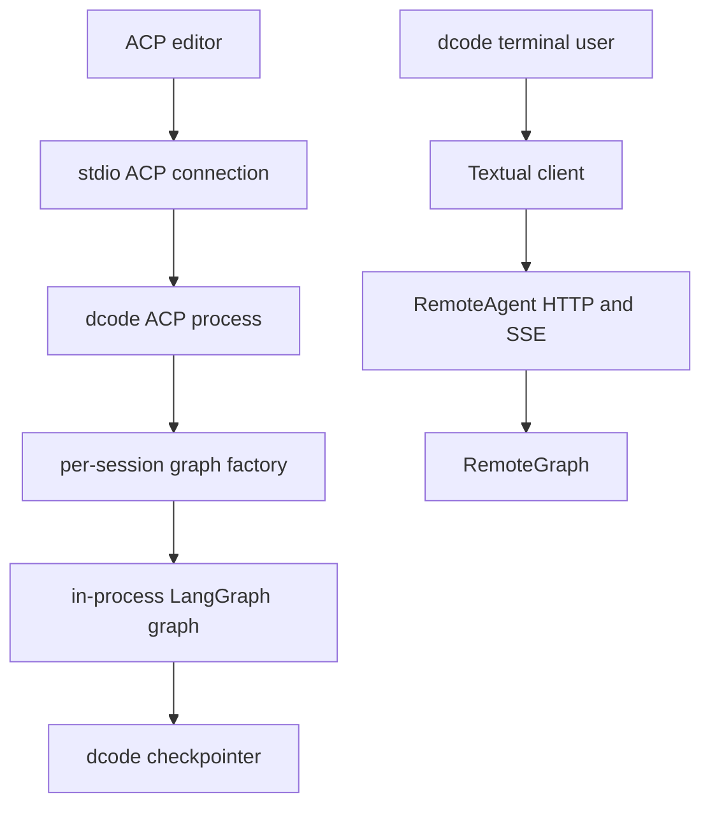
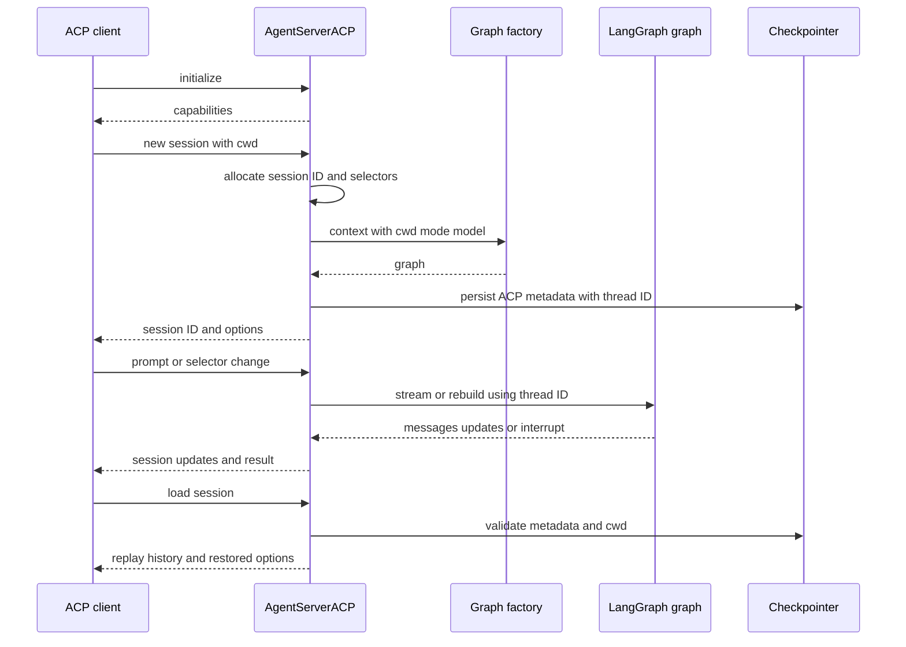

# Agent Client Protocol

[Agent Client Protocol (ACP)](https://agentclientprotocol.com/overview/introduction) lets an editor communicate with an agent process over stdio. `deepagents-acp` supplies `AgentServerACP`, an ACP `Agent` implementation that translates ACP session operations and LangGraph stream events. It is an adapter, not another agent runtime: the embedding application owns graph construction, tools, checkpoint storage, and interrupt policy.

There are two ways this repository uses that boundary:

- A custom ACP process calls `run_agent` with `AgentServerACP` around a compatible compiled LangGraph graph or graph factory.
- `dcode --acp` runs an ACP server over stdio in the dcode process. It constructs its session graphs locally; it does **not** start the normal dcode Textual UI or attach to a `RemoteGraph`.

`deepagents-acp` version `0.0.12` requires Python 3.11 or later and `agent-client-protocol>=0.10.1`. Its `0.0.12` release scoped cancellation to the requested ACP session; the two prior releases added visible reasoning chunks and persistent-session loading.

## Execution boundary in dcode

Do not conflate ACP sessions with normal interactive dcode sessions. Normal interactive dcode uses `RemoteAgent` over HTTP and SSE; its client lazily creates a `RemoteGraph`. In ACP mode, dcode instead creates the graph factory, checkpointer, ACP adapter, and stdio protocol runner in one process. The editor is the ACP client and no `RemoteGraph` participates.


```mermaid
flowchart TD
    Editor["ACP editor"] --> Stdio["stdio ACP connection"]
    Stdio --> Acp["dcode ACP process"]
    Acp --> Factory["per-session graph factory"]
    Factory --> LocalGraph["in-process LangGraph graph"]
    LocalGraph --> Saver["dcode checkpointer"]

    Terminal["dcode terminal user"] --> Tui["Textual client"]
    Tui --> Remote["RemoteAgent HTTP and SSE"]
    Remote --> RemoteGraph["RemoteGraph"]
```

*ACP graph construction and protocol handling are in-process, whereas the normal terminal client uses a remote graph connection.*

Dcode applies a local ownership fence to ACP checkpoint threads. Its wrapper acquires a per-thread lease before graph configuration, adds the lease token to the runnable configuration, releases it when a session is forgotten or the ACP runner exits, and refuses a thread already open elsewhere. The SQLite saver validates that token for checkpoint writes, preventing a stale or disconnected ACP owner from writing after ownership changes.

## Generic adapter: graph and session lifecycle

`AgentServerACP` accepts either a compiled `CompiledStateGraph` or a factory taking `AgentSessionContext(cwd, mode, model)`. Selectable modes and models are only valid with a factory; pairing them with a compiled graph raises `ValueError`. The adapter retains one active graph: it reuses a compiled graph, but rebuilds a factory graph on a session change or reset. The ACP `session_id` is used unchanged as the LangGraph `thread_id`.

At `initialize`, the adapter advertises image input and advertises `session/load` only when `load_sessions=True`. `new_session` creates a UUID-derived ID, records the supplied working directory and ACP MCP descriptors, initializes selector defaults, and returns its mode/configuration options. When session loading is enabled, it writes ACP metadata to the graph checkpoint before returning.


```mermaid
sequenceDiagram
    participant Client as ACP client
    participant Bridge as AgentServerACP
    participant Factory as Graph factory
    participant Graph as LangGraph graph
    participant Store as Checkpointer
    Client->>Bridge: initialize
    Bridge-->>Client: capabilities
    Client->>Bridge: new session with cwd
    Bridge->>Bridge: allocate session ID and selectors
    Bridge->>Factory: context with cwd mode model
    Factory-->>Bridge: graph
    Bridge->>Store: persist ACP metadata with thread ID
    Bridge-->>Client: session ID and options
    Client->>Bridge: prompt or selector change
    Bridge->>Graph: stream or rebuild using thread ID
    Graph-->>Bridge: messages updates or interrupt
    Bridge-->>Client: session updates and result
    Client->>Bridge: load session
    Bridge->>Store: validate metadata and cwd
    Bridge-->>Client: replay history and restored options
```

*The ACP session ID scopes the LangGraph thread; the adapter projects graph state rather than maintaining a separate durable transcript.*

### Selectors and durable recovery

The `mode` and `model` ACP configuration options accept strings only. Unknown option IDs, unavailable modes, and unavailable models produce invalid-parameter errors; a valid selection resets the session graph and is persisted when loading is enabled. Factory calls receive the resulting `cwd`, mode, and model.

`load_sessions=True` is a protocol capability, not storage. Creating or loading a durable session requires a graph compiled with a checkpointer, and restart recovery requires that checkpointer to outlive the server; the `MemorySaver` fallback used for a prompted graph without a saver is only ephemeral. Loading requires an ACP-marked checkpoint thread and the exact original cwd. It restores only still-supported persisted mode/model selections, rebuilds a factory graph when required, and replays conversation, visible assistant content and thoughts, tool activity, and plans through ACP updates. A missing, unrelated, or relocated session is rejected. For the underlying persistence model, see [State persistence](/openwiki/concepts/state-persistence.md).

## Prompt, stream, and permission projection

A prompt converts ACP text, images, resource links, and embedded resources to LangChain content. Resource-link paths are made relative to the session root; embedded blobs become data URIs. Audio input is unsupported. The adapter streams LangGraph `messages` and `updates` with subgraphs enabled but exposes only top-level assistant output. Plain-text reasoning becomes ACP thought chunks, `write_todos` becomes plan updates, and fragmented tool arguments are accumulated until JSON parses before a tool-start update is emitted.

Cancellation is in-memory and session-scoped. `cancel(session_id)` sets that session's flag; the prompt path clears an old flag for a new turn and checks it before and during streaming, returning `stop_reason="cancelled"` when observed. It returns `end_turn` on normal completion.

ACP can show only fixed permission choices. Free-form LangGraph `interrupt()` values are rejected; compatible graphs emit `HumanInTheLoopMiddleware`-style `action_requests`. After an interrupt stream update, the adapter waits for the stream iterator to close before reading checkpoint state, requests a decision from the client, and resumes with `Command(resume={"decisions": ...})`. A cancelled permission request is rejection.

The offered choices are Approve, Reject, and Always allow. “Always allow” is adapter-memory state scoped to one ACP session, not durable authorization. Non-shell tools are allowlisted by name. For `execute`, all extracted command signatures must already be allowed and the command must not contain dangerous shell patterns before it is auto-approved. Dcode can remove those interrupts independently: its resolved YOLO policy passes `auto_approve=True` to graph creation, so the ACP adapter renders only interrupts the chosen dcode policy leaves for a human.

## MCP ownership

The generic adapter retains ACP-provided MCP descriptors per session, but does not expose them through `AgentSessionContext`, pass them to the factory, or turn them into graph tools. A custom ACP host that intends to honor editor-provided MCP configuration must implement that bridge itself.

Dcode deliberately has a separate configuration-owned MCP path. Before opening ACP it resolves MCP tools from explicit or normal configuration, project-trust context, and plugin configurations; the resulting tools and server information are captured by its graph factory. A missing MCP configuration file or tool-loading failure is reported to stderr and returns exit code 1. Its MCP session manager is cleaned up when the ACP server ends. See [MCP](/openwiki/integrations/mcp.md) for the broader integration boundary.

## Launching dcode ACP

Use an ACP-capable editor to run dcode with `--acp`; for example:

```sh
uv tool install -U deepagents-code --with deepagents-acp
```

```json
{
  "agent_servers": {
    "Deep Agents Code": {
      "type": "custom",
      "command": "dcode",
      "args": ["--acp", "--model", "anthropic:claude-sonnet-5"]
    }
  }
}
```

Dcode detects raw `--acp` before parsing to bypass Textual dependency checks and imports ACP dependencies lazily. If `acp` or `deepagents-acp` is unavailable, it prints an install hint and exits nonzero. Startup resolves the initial model and selector list, builds web/MCP/subagent tools, opens dcode's checkpointer, and supplies a factory sensitive to the session cwd and selected model to an ownership-aware `AgentServerACP(load_sessions=True)`.

`--no-mcp` and `--mcp-config` are mutually exclusive. ACP YOLO requires an acknowledgement made first in the interactive TUI, and `--auto-classifier-model` is accepted only in resolved Auto mode. In Auto mode, dcode uses its specialized ACP subclass: each graph stream writes trusted Auto approval state, attaches text-prompt metadata to the final human message, and passes `CLIContextSchema` with Auto settings. This adds dcode policy context; it does not make free-form interrupts representable in ACP.

## Focused verification

`libs/code/tests/integration_tests/test_acp_mode.py` launches `deepagents --acp --no-mcp`, connects an ACP pipe client, initializes, opens a session, and checks for a returned session ID. `libs/code/tests/unit_tests/test_main_acp_mode.py` covers ACP-only argument validation, Auto classifier resolution, and ownership-fenced persistence: a second server cannot load an open thread, and an old configuration cannot write after the lease changes. The generic adapter tests cover session capabilities and recovery, selector validation, streaming, cancellation, and fixed-decision interrupts.
