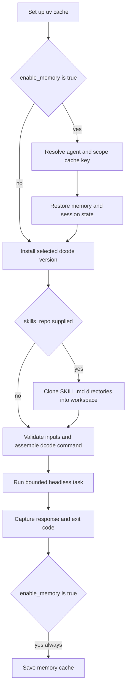

# GitHub Action Integration

The repository-root `langchain-ai/deepagents` composite action is a workflow adapter for one headless `dcode` task in the job checkout. It installs the CLI and translates action inputs into dcode arguments; dcode itself owns configuration resolution, model creation, tools, MCP discovery, sandbox lifecycle, and agent execution. For the underlying runtime, see [Run & Extend a dcode Session](/openwiki/workflows/run-dcode-session.md).

## Minimal workflow

Check out the target repository first. The default `working_directory` is `.`, so the agent operates in the checkout. Put provider credentials in GitHub secrets, grant the job only the permissions it needs, and pin the action to a reviewed commit SHA for production use.

```yaml
name: dcode review
on:
  workflow_dispatch:

permissions:
  contents: read

jobs:
  review:
    runs-on: ubuntu-latest
    steps:
      - uses: actions/checkout@9c091bb21b7c1c1d1991bb908d89e4e9dddfe3e0 # v7.0.0
      - uses: langchain-ai/deepagents@main
        with:
          prompt: "Review this repository and summarize the highest-risk issues."
          model: "openai:gpt-5.5"
          openai_api_key: ${{ secrets.OPENAI_API_KEY }}
          shell_allow_list: "recommended,git,gh"
          max_turns: "8"
          task_timeout: "600"
          quiet: "true"
```

`github_token` defaults to `${{ github.token }}`. The action exports it as `GITHUB_TOKEN` for dcode and uses it when cloning `skills_repo`; supply a differently scoped token only when necessary. The three provider-key inputs are exported as `ANTHROPIC_API_KEY`, `OPENAI_API_KEY`, and `GOOGLE_API_KEY` only on the dcode run step.

## Lifecycle and failure behavior



Caption: The action restores eligible state before dcode runs and saves it afterward even if the agent step fails.

The action sets up `uv` and verifies an installation with `uvx --from deepagents-code dcode --version`; an empty `cli_version` selects the latest package. A supplied version must be at least `0.1.0`. That is only a floor for the action’s always-used flags: an old pin can still fail when an optional input maps to a flag that did not exist in that dcode release.

The run step constructs a Bash argument array, rather than interpolating input text into a command string. It requires a nonempty `prompt` and runs from `working_directory`:

- normally, it invokes `dcode ... --non-interactive "$prompt"`;
- with `stdin: "true"`, it invokes `dcode ... --stdin` and feeds the prompt through standard input.

`stdin` and `skill` are mutually exclusive. With both, dcode would route piped input into an interactive skill path rather than the intended headless task. The wrapper has an outer `timeout` in minutes (default `30`), while `task_timeout` becomes dcode’s `--timeout` in seconds. The outer timeout utility normally reports expiry as exit code `124`; dcode also uses `124` when its own time or turn budget expires.

Before execution, the wrapper validates positive integers for `timeout`, `max_turns`, `task_timeout`, and `rubric_max_iterations`; `max_retries` is non-negative, so zero is valid. Boolean flag inputs accept only `true`, `false`, or empty. `interpreter` is tri-state: `true` adds `--interpreter`, `false` adds `--no-interpreter`, and empty leaves dcode’s default intact. When `jq` is available, `model_params` and `profile_override` must be JSON objects; dcode remains responsible for rejecting malformed JSON if that best-effort check cannot run.

## Public input contract

All `with:` values are strings. An empty optional value generally means the wrapper does not forward the corresponding value flag. The following is the complete action input surface.

| Area | Inputs | Action behavior |
| --- | --- | --- |
| Task, location, and installation | `prompt` (required), `working_directory` (default `.`), `cli_version`, `timeout` (default `30`), `task_timeout`, `max_turns` | Chooses the task, workspace, package version, outer action budget, and dcode’s inner time/turn budgets. |
| Model | `model`, `model_params`, `max_retries`, `profile_override` | Maps to `--model`, `--model-params`, `--max-retries`, and `--profile-override`. Model parameters and profile overrides are JSON-object inputs. CLI profile overrides are merged on top of configured profile overrides; model parameters are passed to model creation. |
| Credentials | `anthropic_api_key`, `openai_api_key`, `google_api_key`, `github_token` | Become the provider and GitHub environment variables for the run; `github_token` also authenticates skills cloning. |
| State and identity | `enable_memory` (default `true`), `memory_scope` (default `repo`), `agent_name` (default `agent`) | Controls whether cache steps run, the cache scope, and dcode’s `--agent` identity/memory namespace. |
| Skills and startup | `skills_repo`, `skill`, `startup_cmd` | Optionally installs repository skills, passes `--skill`, and passes `--startup-cmd`. dcode runs a startup command before the task; its nonzero result warns but does not itself abort the task. |
| Shell | `shell_allow_list` (default `recommended,git,gh`) | Passes `--shell-allow-list`; this is the headless shell authority control, described below. |
| MCP | `mcp_config`, `no_mcp` (default `false`), `trust_project_mcp` (default `false`) | Maps to `--mcp-config`, `--no-mcp`, and `--trust-project-mcp`. |
| Interpreter | `interpreter`, `interpreter_tools` | Maps to `--interpreter` or `--no-interpreter`, and to the JS interpreter PTC allowlist flag `--interpreter-tools`. |
| Sandbox | `sandbox`, `sandbox_id`, `sandbox_snapshot_name`, `sandbox_setup` | Maps directly to the corresponding sandbox flags. An empty `sandbox` leaves the action on local runner execution. |
| Rubric | `rubric`, `rubric_model`, `rubric_max_iterations` | Maps to acceptance criteria, optional grader model, and grader iteration cap. `rubric` can be literal text or `@path`. |
| Rendering and transport | `quiet`, `no_stream`, `json`, `stdin` (all default `false`) | Adds `--quiet`, `--no-stream`, `--json`, and/or `--stdin` only when `true`. |

The action deliberately does not expose `--auto-approve` as an input. Although dcode’s parser recognizes that interactive/ACP-oriented option, it warns that it is ignored in headless mode; action users must reason from the headless shell policy instead.

### Skills installation

If `skills_repo` is set, the action accepts `owner/repo`, `owner/repo@ref`, or a full HTTPS/SSH URL. It clones into a temporary directory with `gh repo clone` and the supplied token, then finds every `SKILL.md` and copies each containing directory into `<working_directory>/.deepagents/skills`. Clone failure, or finding no such directory, fails the action.

This makes the skills repository an executable-instruction supply-chain input. Pin a reviewed ref and do not give its clone token broader access than required. A selected `skill` is later resolved and read by dcode from its discovered skill roots.

### Memory cache

With `enable_memory: "true"`, the action restores and saves an `actions/cache` entry containing:

- `~/.deepagents/<agent_name>/`;
- the global sessions SQLite database and its WAL/SHM files; and
- `<working_directory>/.deepagents/AGENTS.md`.

`agent_name` contributes to the namespace. `memory_scope` selects the other key component: `pr` uses a pull-request or issue number when present and otherwise the ref name; `branch` uses the ref name; `repo` uses one repository-wide key. An unknown scope emits a warning and falls back to the conservative PR/ref behavior.

The restore key appends the current run ID, so it cannot exactly match a prior save; restore prefixes first seek the chosen scope and then any scope for the same agent name. The broad fallback means state from another scope may be restored for that agent. Use distinct agent names and a conservative scope when cross-context recall would be unsafe. `cache_hit` is empty when memory is disabled. The save condition includes `always()`, allowing a failing run to persist changed state.

## Security, configuration, and extension boundaries

### Headless tools and shell authority

The action always uses dcode’s headless mode. In that mode, an absent shell allow list disables shell access while auto-approving other tools; a restrictive list enables shell but gates its commands; and `all` enables every shell command and auto-approves tools. `all` must be the sole list item. The action default is not unrestricted, but it does grant dcode’s `recommended` commands plus `git` and `gh` in the checkout. Treat the prompt, checkout, skill content, and resulting tool output as untrusted inputs, and review them before widening authority. See [Permissions and Human Approval](/openwiki/concepts/permissions-hitl.md) and [Security Boundaries and Runbook](/openwiki/operations/security.md).

`mcp_config` is merged above auto-discovered MCP configuration; `no_mcp: "true"` disables all MCP loading. `trust_project_mcp: "true"` trusts repository-level MCP definitions, including stdio and remote servers, without an interactive approval prompt. Do not enable it for an unreviewed checkout. The action has no inputs for dcode’s project-hook or project-extension trust flags, so their explicit headless opt-ins are not part of this workflow contract.

The interpreter default is sandbox-aware in dcode: with no action value, it is enabled by default outside a sandbox. `interpreter_tools` accepts `safe`, `all`, or a comma-separated tool list; it controls interpreter PTC authority and deserves review separately from the shell allow list. Sandbox provider support and attachment/setup semantics remain dcode concerns.

Action inputs become CLI flags and environment variables in dcode’s normal resolution model; they do not replace its configuration precedence. Use action inputs for a workflow-local override, and only allow repository-controlled configuration where its trust boundary is acceptable. See [dcode Configuration Layering](/openwiki/concepts/config-layering.md).

## Outputs and downstream use

| Output | Meaning |
| --- | --- |
| `response` | Complete captured combined stdout and stderr from the dcode/timeout command. It is raw agent and tool output, not secret-redacted or safe to evaluate, interpolate into a shell, or publish without review. |
| `exit_code` | The captured dcode/timeout pipeline-head exit code. The action exits with the same code, so a nonzero result fails the action step. |
| `cache_hit` | The `actions/cache/restore` hit indicator when memory is enabled; empty otherwise. |

The wrapper sends combined output through `tee` and reads `PIPESTATUS[0]`, so a successful `tee` cannot mask an agent failure. It uses a randomly generated heredoc delimiter when writing `response` to `$GITHUB_OUTPUT`, preventing agent-controlled output from closing the record and forging extra GitHub output entries. If output-file writing fails, it emits a warning and preserves an existing agent failure code; if delimiter generation fails after a successful agent run, it fails instead of writing an unsafe output record.

For downstream automation, `json: "true"` asks dcode for machine-readable output, but the action still captures a combined stream. Parse it as data and avoid feeding it to a shell, issue comment, PR body, or external service without appropriate escaping and review.

## Regression focus

`.github/scripts/tests/workflows/test_github_action.py` parses `action.yml` and dcode’s root parser to ensure every forwarded action flag remains parser-compatible and to prevent `--auto-approve` from entering the contract. Its Bash harness executes the actual `Run dcode` script body with stubbed `uvx` and `timeout`, covering validation, empty-prompt and `stdin`/`skill` rejection, version command construction, interpreter tri-state behavior, leading-zero timeout arithmetic, agent exit propagation, and the stdin producer-SIGPIPE case. Changes should preserve these wrapper guarantees alongside dcode’s headless semantics.
