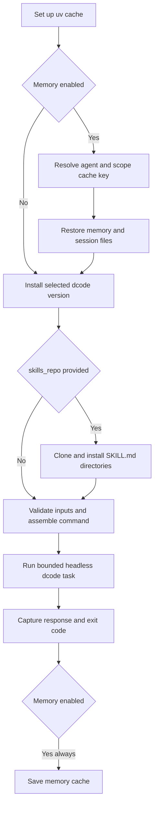

# GitHub Action Integration

The repository-root composite action, `langchain-ai/deepagents`, is a GitHub Actions adapter for a single headless `dcode` task. Its public contract is **only** the inputs and outputs declared in root `action.yml`: the wrapper installs `deepagents-code`, validates selected values, passes credentials through its process environment, and translates supported inputs into `dcode` arguments. dcode—not the composite action—owns its broader configuration layering, model/runtime behavior, tool execution, and sandbox implementation. See [Run a dcode Session](/openwiki/workflows/run-dcode-session.md) for that runtime.

## Use in a job

Check out the target repository before invoking the action. The action runs in `working_directory`, which defaults to `.`, so that checkout is also the agent's local workspace unless a sandbox is selected. Keep provider keys in GitHub secrets and use least-privilege job `permissions`. For production, pin the action reference to a reviewed commit SHA rather than `main`.

```yaml
name: dcode review
on:
  workflow_dispatch:

permissions:
  contents: read

jobs:
  review:
    runs-on: ubuntu-latest
    steps:
      - uses: actions/checkout@9c091bb21b7c1c1d1991bb908d89e4e9dddfe3e0 # v7.0.0
      - uses: langchain-ai/deepagents@main
        with:
          prompt: "Review this repository and summarize the highest-risk issues."
          model: "openai:gpt-6-astra"
          openai_api_key: ${{ secrets.OPENAI_API_KEY }}
          shell_allow_list: "recommended,git,gh"
          max_turns: "8"
          task_timeout: "600"
          quiet: "true"
```

`github_token` defaults to `${{ github.token }}`. In the run step, it becomes `GITHUB_TOKEN`; `anthropic_api_key`, `openai_api_key`, and `google_api_key` become `ANTHROPIC_API_KEY`, `OPENAI_API_KEY`, and `GOOGLE_API_KEY`. The token is also supplied to `gh repo clone` when `skills_repo` is used. Therefore the model-directed task has the authority of the job token and any credentials available to tools in its execution environment; do not grant broader access merely to make a task convenient.

## Lifecycle and failure boundary



*The composite action's control flow: restore happens before dcode and cache saving is attempted after the run even when the run fails.*

The action sets up `uv` with its cache enabled, then verifies the selected CLI using `uvx --from deepagents-code dcode --version`, or `uvx --from "deepagents-code==${INPUT_CLI_VERSION}" dcode --version` for a pin. `cli_version` must be at least `0.1.0`. That is only a floor for always-used flags: an older pinned dcode can still reject an optional action input whose corresponding dcode flag did not exist in that release.

The run step builds an argument array, requires a nonempty `prompt`, and dispatches either:

- `dcode ... --non-interactive "$prompt"` by default; or
- `dcode ... --stdin`, with the prompt supplied through standard input when `stdin: "true"`.

`stdin` and `skill` are mutually exclusive because the combination routes piped input into dcode's interactive skill path rather than a headless task. The wrapper's `timeout` is an outer wall-clock timeout in **minutes** (default `30`); `task_timeout` is independently forwarded as dcode `--timeout` in **seconds**. A wrapper timeout normally exits `124`.

The wrapper validates positive integers for `timeout`, `max_turns`, `task_timeout`, and `rubric_max_iterations`; `max_retries` accepts zero but not negative or nonnumeric values. Flag-adding boolean inputs accept only `true`, `false`, or empty. `interpreter` is deliberately tri-state: `true` adds `--interpreter`, `false` adds `--no-interpreter`, and empty leaves dcode's default intact. When `jq` is available, `model_params` and `profile_override` must be JSON objects; without it, malformed values are left for dcode to reject.

## Public input contract

All `with:` values are strings. An empty optional value is generally not forwarded, while a `true` boolean adds its flag. The table describes the action API, not an exhaustive dcode configuration reference.

| Concern | Public inputs | Wrapper behavior |
| --- | --- | --- |
| Task, identity, and location | `prompt` (required), `working_directory`, `agent_name`, `cli_version` | Selects task text, process directory, memory/agent identity, and package version. |
| Model | `model`, `model_params`, `max_retries`, `profile_override` | Maps to `--model`, `--model-params`, `--max-retries`, and `--profile-override`. Model parameters and profile overrides are JSON-object inputs. |
| Credentials | `anthropic_api_key`, `openai_api_key`, `google_api_key`, `github_token` | Exports provider keys and `GITHUB_TOKEN` for the dcode invocation; the GitHub token also authenticates skill cloning. |
| Headless task | `shell_allow_list`, `skill`, `startup_cmd`, `stdin`, `max_turns`, `task_timeout`, `timeout` | Sets shell policy and startup behavior, chooses prompt transport, and controls turn, dcode, and wrapper time limits. |
| Response form | `quiet`, `no_stream`, `json` | Adds `--quiet`, `--no-stream`, and `--json`. `quiet` makes dcode send status to stderr while response text remains on stdout, but the action captures both. |
| Rubric | `rubric`, `rubric_model`, `rubric_max_iterations` | Passes acceptance criteria (literal text or `@path`), optional grading model, and iteration limit. |
| Integrations | `mcp_config`, `no_mcp`, `trust_project_mcp`, `interpreter`, `interpreter_tools`, `sandbox`, `sandbox_id`, `sandbox_snapshot_name`, `sandbox_setup` | Directly maps the supported MCP, interpreter, and sandbox controls to dcode flags. |
| Persistent memory | `enable_memory`, `memory_scope` | Enables the cache lifecycle described below; defaults are `true` and `repo`. |

Notably, `--auto-approve` is not an action input and is not forwarded. Adding a dcode option does not automatically expand this public action contract; it must be intentionally declared and mapped in `action.yml`.

## Memory cache scopes

With the default `enable_memory: "true"`, the action restores and saves an `actions/cache` entry containing:

```text
~/.deepagents/<agent_name>/
~/.deepagents/.state/sessions.db
~/.deepagents/.state/sessions.db-wal
~/.deepagents/.state/sessions.db-shm
<working_directory>/.deepagents/AGENTS.md
```

`agent_name` defaults to `agent` and contributes to the cache namespace. `memory_scope` selects its scope suffix:

- `pr`: a pull request or issue number when present, otherwise `github.ref_name`;
- `branch`: `github.ref_name`;
- `repo`: a repository-wide scope, and the default.

An unknown scope emits a warning and falls back to the conservative PR/ref calculation. The restore lookup first uses the selected scope prefix and then the agent-wide prefix, while each save key is suffixed with `github.run_id`. A broad fallback can therefore restore an entry from a different scope for the same `agent_name`; choose a distinct agent name and a narrow scope when cross-context recall is undesirable. `cache_hit` is the restore step result and is empty when memory is disabled. The save step has `always()`, so a failed run can still save changed memory, session state, or `AGENTS.md`.

## Skills, MCP, sandbox, and headless authority

### Skills repository

If `skills_repo` is nonempty, the action accepts `owner/repo`, `owner/repo@ref`, or full HTTPS/SSH clone URLs. It performs a shallow `gh repo clone` into a temporary directory, finds every `SKILL.md`, and copies each containing directory into `<working_directory>/.deepagents/skills/<directory-name>`. Clone failure or a repository containing no `SKILL.md` fails the action.

This is an instruction supply-chain boundary, not merely data installation. Pin a reviewed skills revision and give `github_token` only the access necessary to read it. `skill` then asks dcode to invoke a named discovered skill before the headless prompt; loading, validation, and semantics of that skill remain dcode behavior.

### MCP, interpreter, and sandbox

The action passes `mcp_config`, `no_mcp`, and `trust_project_mcp` through to dcode. `no_mcp: "true"` disables MCP loading. `mcp_config` identifies an explicit config file; at the dcode layer it has highest precedence among discovered MCP configuration. Project stdio MCP is not trusted by default, so `trust_project_mcp: "true"` is an explicit authority grant for project-controlled subprocesses or connections. Review the checked-out repository before enabling it; see [MCP Integration](/openwiki/integrations/mcp.md).

For interpreter support, `interpreter_tools` is passed as dcode's PTC allowlist, while `interpreter` controls enable/disable/default as described above. Sandbox inputs map directly to `--sandbox`, `--sandbox-id`, `--sandbox-snapshot-name`, and `--sandbox-setup`. An empty `sandbox` selects local execution on the GitHub runner, not isolation. Provider selection, provisioning, reuse, and containment are dcode concerns; use a remote sandbox when runner-host isolation is required.

In dcode headless mode, `shell_allow_list` is the meaningful approval boundary. No allow list disables shell access while other tools are auto-approved; `recommended` or explicit entries enable shell but gate commands through the list; `all` allows any shell command and auto-approves all tools. The action's default is `recommended,git,gh`, not `all`, but it still grants the listed categories against the checkout. Treat prompts, checkout content, skills, MCP configuration, and `response` as untrusted inputs. For the wider deployment boundary, see [Security Boundaries and Runbook](/openwiki/operations/security.md).

## Outputs and automation

| Output | Meaning |
| --- | --- |
| `response` | Full combined dcode stdout and stderr. It is raw agent output and is not secret-redacted or safe to evaluate, shell-interpolate, or publish without review. |
| `exit_code` | The dcode/outer-timeout status. The run step exits with this same status, so a nonzero code normally fails the action. |
| `cache_hit` | Result of the memory restore step, or empty when memory is off. |

The action pipes combined output through `tee`, but captures `PIPESTATUS[0]` so a successful `tee` cannot conceal an agent or timeout failure. It writes the response using a random heredoc delimiter in `$GITHUB_OUTPUT`, preventing agent-controlled text from forging another GitHub output record, and finally exits with the captured code. If output-file writing fails, it warns without replacing a prior agent failure. The stdin branch uses process substitution rather than a `printf | timeout` pipeline so a producer SIGPIPE cannot be mistaken for the dcode result.

For machine processing, set `json: "true"` and parse the result as data; do not treat agent-generated JSON or text as trusted code or commands.

## Change and regression focus

`action.yml` is the compatibility surface to review when changing this integration. Keep its declared input list, run-script flag mapping, defaults, validation, outputs, and cache paths aligned. The focused action tests parse `action.yml` and dcode's root argument parser to detect flag drift and prevent reintroducing `--auto-approve`. They also execute the real run-script body with stubbed `uvx` and `timeout`, covering validation, stdin/skill exclusion, CLI-version command construction, timeout arithmetic including leading zeros, exit propagation, and the stdin SIGPIPE case. For local development and repository CI practices, see [Development, CI, and Releases](/openwiki/operations/development.md).
