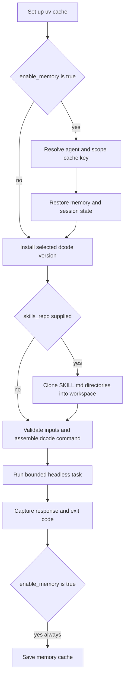

# GitHub Action Integration

The repository-root composite action (`langchain-ai/deepagents`) installs and invokes `dcode` for one headless task in the job workspace. It is a workflow adapter, not a separate agent runtime: action inputs are validated and translated to `dcode` flags, while dcode remains responsible for model selection, configuration resolution, tools, MCP, sandbox creation, and headless execution. For the underlying session model, see [Run & Extend a dcode Session](/openwiki/workflows/run-dcode-session.md).

## Minimal workflow

Check out the repository first; the action's default working directory is `.` and its agent is intended to inspect or change that checkout. Supply provider credentials as GitHub secrets, not literals. Pin the action to a reviewed commit SHA in production rather than tracking `main`.

```yaml
name: dcode review
on:
  workflow_dispatch:

permissions:
  contents: read

jobs:
  review:
    runs-on: ubuntu-latest
    steps:
      - uses: actions/checkout@9c091bb21b7c1c1d1991bb908d89e4e9dddfe3e0 # v7.0.0
      - uses: langchain-ai/deepagents@main
        with:
          prompt: "Review this repository and summarize the highest-risk issues."
          model: "openai:gpt-5.5"
          openai_api_key: ${{ secrets.OPENAI_API_KEY }}
          shell_allow_list: "recommended,git,gh"
          max_turns: "8"
          task_timeout: "600"
          quiet: "true"
```

Use least-privilege job `permissions`. `github_token` defaults to `${{ github.token }}`, is exported as `GITHUB_TOKEN`, and is also used to clone a private `skills_repo`; override it with a scoped token only when the job needs different access. The action exports `ANTHROPIC_API_KEY`, `OPENAI_API_KEY`, and `GOOGLE_API_KEY` from the corresponding inputs only for the `dcode` invocation.

## Execution lifecycle



*The composite action restores state before execution and saves it after execution even when the agent fails.*

The action sets up `uv`, then runs `uvx --from deepagents-code dcode` by default. `cli_version` pins the installed package; it must be at least `0.1.0`, but a pin can still fail if an enabled optional input maps to a flag introduced after that release. With `skills_repo`, the action clones `owner/repo`, `owner/repo@ref`, or a full HTTPS/SSH URL using `gh repo clone`, finds every `SKILL.md`, and copies each containing directory into `<working_directory>/.deepagents/skills`. Clone failure or a repository with no skills fails the action.

The run step builds an argument array rather than shell-interpolating values. It requires a nonempty `prompt`, runs in `working_directory`, and chooses one dispatch:

- default: `dcode ... --non-interactive "$prompt"`;
- `stdin: "true"`: `dcode ... --stdin` with the prompt supplied on standard input.

`stdin` cannot be combined with `skill`, because that combination would enter dcode's interactive skill path instead of a headless run. The wrapper applies its own `timeout` in **minutes** (default `30`), while `task_timeout` is forwarded to dcode as `--timeout` in **seconds**. Positive integer validation applies to both timeouts, `max_turns`, and `rubric_max_iterations`; `max_retries` may be zero. `model_params` and `profile_override` are checked as JSON objects when `jq` is available. Boolean inputs that add a flag accept only `true`, `false`, or empty; `interpreter` is tri-state (`true` → `--interpreter`, `false` → `--no-interpreter`, empty → let dcode decide).

The action pipes both dcode stdout and stderr through `tee`, captures the actual agent/timeout stage exit code rather than `tee`'s, writes it to `exit_code`, and exits with that code. A wrapper timeout conventionally returns `124`. It uses a random heredoc delimiter when writing the captured output to `$GITHUB_OUTPUT`, preventing agent-controlled output from injecting additional output records. A failure to write outputs warns but does not replace an existing agent failure code.

## Input contract

All `with:` values are strings. Leave an optional value empty to avoid forwarding its associated value flag.

| Concern | Inputs | Behavior |
| --- | --- | --- |
| Task and workspace | `prompt` (required), `working_directory`, `cli_version`, `timeout`, `task_timeout`, `max_turns` | Selects the task, package version, directory, and outer-minute/inner-second time budgets. |
| Model | `model`, `model_params`, `max_retries`, `profile_override` | `model` accepts `provider:model` or supported bare model names; JSON overrides map to dcode model/profile flags. |
| Credentials and GitHub | `anthropic_api_key`, `openai_api_key`, `google_api_key`, `github_token` | Provider keys and GitHub token become process environment variables; never print them or pass untrusted prompts access beyond the job's intended permissions. |
| Shell and startup | `shell_allow_list`, `startup_cmd`, `skill`, `stdin` | The default shell list is `recommended,git,gh`; `startup_cmd` and startup skill behavior are dcode behavior. |
| Output | `quiet`, `no_stream`, `json` | Forward `--quiet`, `--no-stream`, and `--json`. `quiet` keeps dcode status on stderr so response text is clean on stdout; the action's `response` still captures both streams. |
| Rubric | `rubric`, `rubric_model`, `rubric_max_iterations` | Forwards acceptance criteria, optional grader model, and grader iteration cap. |

### Memory cache

`enable_memory` defaults to `"true"`. When enabled, the action restores and subsequently saves an `actions/cache` entry covering `~/.deepagents/<agent_name>/`, the global sessions SQLite database and WAL/SHM files, and `<working_directory>/.deepagents/AGENTS.md`. This can carry agent-specific memory and session state between workflow runs; set `enable_memory: "false"` for isolated runs.

`agent_name` (default `agent`) names the dcode agent and cache namespace. `memory_scope` controls the key suffix:

- `pr`: PR/issue number when available, otherwise the ref name;
- `branch`: ref name;
- `repo` (default): one repository-wide namespace.

An unknown scope warns and falls back to the conservative PR/ref behavior. The restore key includes a run ID so it never exactly matches a prior save, then uses the scoped prefix and finally the agent-wide prefix as restore keys. Consequently, a broad fallback can restore prior state from another scope for the same agent name; choose distinct `agent_name` values and conservative scopes where cross-context recall is unacceptable. `cache_hit` is the restore action's result and is empty when memory is disabled. The save step runs under `always()`, so a failed agent can still persist its updated files.

## Tools, extensions, and security controls

### Headless approval and shell authority

The action intentionally does **not** expose interactive-only `--auto-approve`. It always invokes dcode headlessly, where `shell_allow_list` is the operational shell control: no list disables shell access; `recommended` or explicit entries enable only allowed commands; `all` permits unrestricted shell commands and auto-approves tools. The action default is restrictive rather than unrestricted, but `recommended,git,gh` still grants those command categories in the checked-out repository. Review the task text, checkout provenance, and job token before widening it. See [Permissions and Human Approval](/openwiki/concepts/permissions-hitl.md).

`startup_cmd` runs before the prompt, and a requested `skill` is resolved by dcode. A skills repository is executable instruction supply-chain input: the action copies all discovered skill directories from it into the workspace without a per-skill approval step. Pin a reviewed skills ref and use a token with only necessary repository access.

### MCP, interpreter, and sandbox

The action forwards these dcode integration controls unchanged:

- **MCP:** `mcp_config`, `no_mcp`, and `trust_project_mcp`. `no_mcp: "true"` disables loading. `mcp_config` supplies an explicit configuration path; `trust_project_mcp: "true"` opts into project MCP trust and can permit repository-controlled configurations to launch stdio programs or connect to endpoints. Review it first; see [MCP](/openwiki/integrations/mcp.md).
- **Interpreter:** `interpreter` and `interpreter_tools`, the latter mapping to dcode's PTC allowlist.
- **Sandbox:** `sandbox`, `sandbox_id`, `sandbox_snapshot_name`, and `sandbox_setup`. An empty `sandbox` means local execution on the GitHub runner, not isolation. Provider capabilities and lifecycle—including whether an existing ID can be attached—remain dcode concerns; see [Sandbox & Partner Integrations](/openwiki/integrations/sandbox-partners.md).

The action does not replace dcode configuration precedence. Environment values and forwarded CLI flags participate in its normal configuration resolution, so use explicit action inputs for per-run overrides and repository/user configuration only where its trust boundary is appropriate. See [dcode Configuration Layering](/openwiki/concepts/config-layering.md).

## Outputs and downstream use

| Output | Meaning |
| --- | --- |
| `response` | Complete captured dcode stdout and stderr. It is raw agent output, not secret-redacted or safe to interpolate into a shell, issue, PR comment, or another service. |
| `exit_code` | Agent or wrapper exit code. The run step itself exits with this value, so ordinary nonzero results fail the action. |
| `cache_hit` | Memory restore hit indicator; empty when memory is disabled. |

Treat `response` as untrusted text. If a later step needs structured automation, prefer `json: "true"`, parse it without evaluating it, and still avoid exposing secrets. A nonzero `exit_code` is preserved even if output capture or output-file writing encounters a problem.

## Regression focus

The action test suite parses `action.yml` and dcode's root parser to catch input-to-flag drift and ensure `--auto-approve` is not reintroduced. It also executes the actual run-script body with stubbed `uvx` and `timeout` to cover validation, interpreter tri-state behavior, empty prompt and `stdin`/`skill` rejection, version command construction, leading-zero timeout arithmetic, exit-code propagation, and the stdin producer-SIGPIPE case. Changes to the action should preserve those wrapper contracts as well as dcode's headless semantics.
