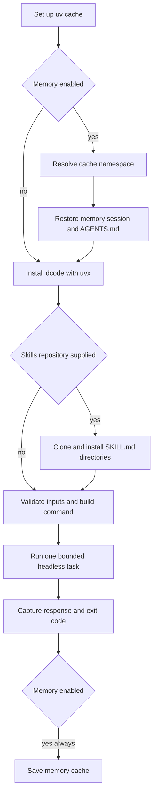

# GitHub Action Integration

The repository-root composite action runs `dcode` once for a workflow task in the checked-out workspace. It is an adapter rather than a separate agent runtime: it validates workflow-string inputs, installs the selected `deepagents-code` package through `uvx`, maps supported inputs to dcode CLI flags, and invokes dcode headlessly. Model resolution, configuration precedence, tool policy, MCP loading, sandbox lifecycle, and agent execution remain dcode responsibilities. For the underlying runtime, see [Run a dcode Session](/openwiki/workflows/run-dcode-session.md).

## Minimal workflow

Check out the repository first. The action defaults `working_directory` to `.` and is intended to inspect or change that checkout. Use secrets for provider credentials and least-privilege job permissions. Production workflow references must be pinned to reviewed full commit SHAs; replace the placeholder below with the reviewed action commit rather than tracking a branch or tag.

```yaml
name: dcode review
on:
  workflow_dispatch:

permissions:
  contents: read

jobs:
  review:
    runs-on: ubuntu-latest
    steps:
      - uses: actions/checkout@9c091bb21b7c1c1d1991bb908d89e4e9dddfe3e0 # v7.0.0
      - uses: langchain-ai/deepagents@<reviewed-full-commit-sha>
        with:
          prompt: "Review this repository and summarize the highest-risk issues."
          model: "openai:gpt-5.5"
          openai_api_key: ${{ secrets.OPENAI_API_KEY }}
          shell_allow_list: "recommended,git,gh"
          max_turns: "8"
          task_timeout: "600"
          quiet: "true"
```

`github_token` defaults to `${{ github.token }}`. The run step exports it as `GITHUB_TOKEN`, and the skills-install step uses it to clone a private `skills_repo`; override it only with an appropriately scoped token. `anthropic_api_key`, `openai_api_key`, and `google_api_key` become the corresponding provider environment variables for the dcode run. Do not place credentials in the prompt or expose a broadly privileged token to an untrusted checkout.

## Composite-action lifecycle



The wrapper restores eligible state before dcode starts and saves it after the run even if dcode fails.

`cli_version` selects `uvx --from "deepagents-code==..." dcode`; an empty value uses the latest package. The action rejects a pin below `0.1.0`, the floor required for its always-used flags. This is not compatibility validation for every optional flag: an older accepted pin can still fail in dcode if a configured optional input requires a newer CLI flag.

If `skills_repo` is set, the action accepts `owner/repo`, `owner/repo@ref`, or a full HTTPS/SSH URL, shallow-clones it to a temporary directory with `gh repo clone`, and copies every directory containing `SKILL.md` into `<working_directory>/.deepagents/skills`. A clone error or no discovered skill is a hard failure. Treat that repository and its ref as instruction supply-chain input; pin and review it.

## Invocation and input contract

All `with:` values are strings. Optional value inputs are omitted when empty. The action builds an argument array rather than interpolating values into a shell command, requires a nonempty `prompt`, and runs in `working_directory`.

- Normally it calls `dcode ... --non-interactive "$prompt"`.
- With `stdin: "true"`, it calls `dcode ... --stdin` and supplies the prompt on standard input.
- `stdin` and `skill` are mutually exclusive: that combination would route piped input to dcode's interactive skill path, not a headless task.

| Concern | Inputs | Effect |
| --- | --- | --- |
| Task and budgets | `prompt`, `working_directory`, `cli_version`, `timeout`, `task_timeout`, `max_turns` | Select the task and workspace. `timeout` is the wrapper's minutes budget; `task_timeout` becomes dcode `--timeout` in seconds. |
| Model | `model`, `model_params`, `max_retries`, `profile_override` | Map to model and override flags. `model_params` and `profile_override` are JSON-object overrides. |
| Startup and skills | `agent_name`, `shell_allow_list`, `startup_cmd`, `skill`, `stdin` | Select memory identity, shell policy, and dcode startup behavior. |
| Output and rubric | `quiet`, `no_stream`, `json`, `rubric`, `rubric_model`, `rubric_max_iterations` | Map to the corresponding headless output and acceptance-criteria flags. |
| Integrations | `mcp_config`, `no_mcp`, `trust_project_mcp`, `interpreter`, `interpreter_tools`, `sandbox`, `sandbox_id`, `sandbox_snapshot_name`, `sandbox_setup` | Pass MCP, interpreter, and sandbox controls directly to dcode. |

The wrapper accepts only `true`, `false`, or empty for boolean flag inputs; invalid forms fail before invocation. `interpreter` is deliberately tri-state: `true` adds `--interpreter`, `false` adds `--no-interpreter`, and empty lets dcode select its default. Positive-integer validation applies to `timeout`, `task_timeout`, `max_turns`, and `rubric_max_iterations`; `max_retries` is non-negative and may be zero. JSON-object checking is best-effort when `jq` is available, while dcode remains the final parser.

The outer `timeout` is converted to seconds using base-10 arithmetic, including values such as `08`. It surrounds dcode; `task_timeout` is passed inward. The action records the exit code of the `timeout`/dcode side of the output pipeline, not `tee`, and finally exits with that code. Thus a wrapper timeout conventionally yields `124` and a dcode failure fails the action.

## Memory state and cache scope

`enable_memory` defaults to `"true"`. When enabled, `actions/cache` restores and saves:

- `~/.deepagents/<agent_name>/`;
- the global sessions SQLite database with its WAL and SHM files; and
- `<working_directory>/.deepagents/AGENTS.md`.

`agent_name` defaults to `agent` and forms the cache namespace. `memory_scope` selects the namespace suffix: `pr` uses a PR/issue number when present or the ref name otherwise; `branch` uses the ref name; and `repo` (the default) shares one repository namespace. An unknown scope warns and falls back to the PR/ref behavior.

The restore key includes the current run ID, then falls back first to the selected scope prefix and then to the agent-wide prefix. The broad fallback can therefore recover state produced in another scope for the same `agent_name`. Choose distinct agent names and a narrow scope when cross-context recall is unacceptable. `cache_hit` is the restore step result and is empty if memory is disabled. Saving is guarded by `always()`, so a failed run can persist updated state.

## Tool authority and extensions

The action exposes MCP configuration/trust, interpreter, and sandbox inputs as direct dcode flag mappings; `--auto-approve` is intentionally absent from the action contract.

In dcode headless mode, `shell_allow_list` controls shell authority: omitting it disables shell access, a restrictive list enables shell use only for allowed commands, and `all` permits unrestricted shell commands and auto-approves tools. The action defaults it to `recommended,git,gh`, not `all`; nevertheless, evaluate its authority alongside repository provenance and the job token. `startup_cmd` runs before the task. A chosen `skill` is loaded by dcode after the action has installed any external skills.

For MCP, `no_mcp` disables loading, `mcp_config` supplies an explicit configuration path, and `trust_project_mcp: "true"` permits project MCP trust. In headless dcode, project stdio MCP loading is false by default. Repository-controlled MCP configuration can cause process launches or network connections, so review it before granting trust. See [MCP Integration](/openwiki/integrations/mcp.md).

For sandboxes, an empty `sandbox` means local runner execution rather than isolation. dcode validates selected providers and determines whether sandbox IDs and snapshots are supported. An empty interpreter input likewise delegates to dcode's sandbox-aware default. These flags participate in ordinary dcode configuration resolution; use explicit action inputs for per-run overrides and consult [dcode Configuration Layering](/openwiki/concepts/config-layering.md) for precedence. Operational trust and containment guidance is in [Security Boundaries and Runbook](/openwiki/operations/security.md).

## Outputs and downstream handling

| Output | Meaning |
| --- | --- |
| `response` | Combined captured dcode stdout and stderr. |
| `exit_code` | The dcode or wrapper exit code; the action exits with it. |
| `cache_hit` | The memory restore cache-hit indicator, or empty when memory is disabled. |

The action writes `response` using a random heredoc delimiter, preventing agent-controlled text from forging additional `$GITHUB_OUTPUT` records. A failure to write outputs emits a warning but does not mask a prior dcode failure. Treat `response` as untrusted text: it is not secret-redacted and must not be evaluated by a shell or blindly posted to another system. For structured follow-on automation, request `json: "true"` and parse the result without evaluation.

## Regression focus

Focused tests parse `action.yml` and dcode's root parser to keep action input-to-flag mappings compatible and ensure `--auto-approve` is not introduced. They also execute the actual `Run dcode` shell body with stubbed `uvx` and `timeout`, rather than reimplementing it, covering validation, interpreter tri-state behavior, empty-prompt and stdin/skill rejection, version construction, base-10 timeout arithmetic, exit propagation, and the stdin producer-SIGPIPE case. Run these focused wrapper tests when changing the action, then use the broader guidance in [Testing Strategy and Change Validation](/openwiki/testing/testing-guide.md).
