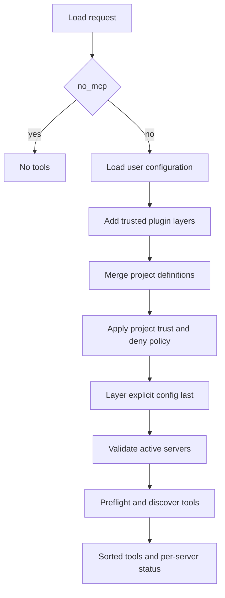
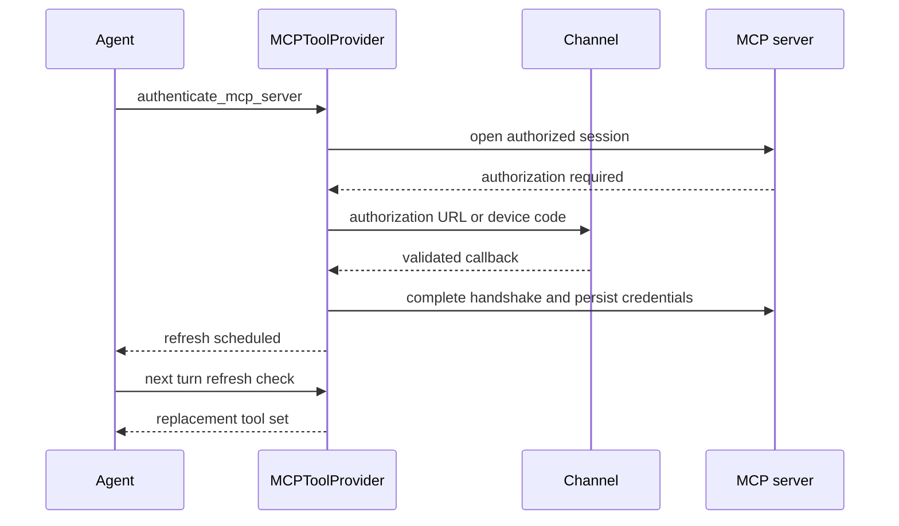

# Model Context Protocol Integration

Model Context Protocol (MCP) adds agent tools supplied by local processes or remote
services. dcode and Talon consume related `mcpServers` JSON documents, but they are
independent integrations. In particular, a dcode project approval does not authorize
Talon, and neither runtime shares the other’s token files or live connections.

Treat three things as distinct trust boundaries:

1. **Configuration** determines a command, endpoint, headers, and tool selection.
2. **Credentials** authenticate a permitted remote endpoint; a token is not approval
   for a project-controlled definition.
3. **External MCP tools** execute outside the agent runtime. Their schemas,
   annotations, responses, and connection failure behavior are server supplied.

## Configuration contract

A document has an `mcpServers` object. A server can specify `type` or `transport`;
when omitted, a `url` implies `http`, otherwise it implies `stdio`. dcode accepts
`stdio`, `http`, and `sse`, treating `streamable_http` and `streamable-http` as
`http`; Talon converts HTTP to its `streamable_http` adapter connection. Remote
servers require `url`, while stdio servers require `command`. Arguments, stdio
environment variables, and remote headers are supported as appropriate.

Both runtimes expand `${VAR}` and `${VAR:-default}` in `command`, `url`, `args`,
`env`, and `headers`, producing a copy rather than altering the raw definition. The
`:-` default is used for an unset or empty variable. An unset required variable,
malformed braced reference, or invalid supported-field type is an error, not a
silently changed command or destination. Talon looks in `TalonConfig.env` before the
process environment; dcode uses its active configuration environment.

`auth: oauth` is only valid for remote HTTP/SSE servers and cannot coexist with a
static `Authorization` header. `allowedTools` and `disabledTools` are mutually
exclusive non-empty lists of glob patterns. Filtering tests both the adapter’s
server-prefixed tool name and its original name.

## dcode: layered discovery and project trust

`resolve_and_load_mcp_tools` is dcode’s loader entrypoint. Unless `no_mcp=True`, it
loads usable user files, injected plugin layers, and discovered project files, then
layers an optional explicit file last. An explicit file is therefore highest
precedence and its errors are fatal. By contrast, login resolution loads an explicit
`--mcp-config` by itself, giving `dcode mcp login` one unambiguous target.

Project configuration is a security boundary: it can start a local process, make a
network request, or interpolate a secret into a header during discovery. Project
servers are excluded unless this invocation grants `trust_project_mcp=True`, or an
entry matches a user-scoped approval for both its project root and fingerprint.
Explicit user denial wins even for a trusted project. An unreadable user policy fails
closed for saved approvals and whole-project trust, while explicitly environment-
enabled names may remain available. dcode merges project precedence before this
gate, so rejecting a winning override does not reveal an older approved definition.

Plugins are a separate extension boundary. Enabled plugin definitions are namespaced
as `plugin__<plugin-id>__<server-name>` after plugin-runtime substitution. Installing
the plugin constitutes trust for bundled servers, but a user deny still removes one,
and an unreadable deny policy fails closed. Malformed plugin declarations surface as
configuration errors rather than disappearing silently.

This is dcode’s configuration-to-tool lifecycle; configuration trust is decided
before a project entry is activated.

### Login and credentials

For a configured OAuth server without a token, dcode reports `unauthenticated`
before discovery. A remote 401 Bearer protected-resource challenge can also mark a
server unauthenticated and direct the operator to `dcode mcp login <server>`, even
when configuration did not declare `auth: oauth`.

The UI-neutral login resolver applies the same project filtering and returns typed
outcomes for explicit-load failure, no discovered config, no usable config, unknown
server, and invalid server configuration. The CLI assigns exit code 2 only to
no-config; other resolution errors use exit code 1. `mcp_auth.login` supports any
remote HTTP/SSE target through discovery-based OAuth, resolves environment values,
runs provider-policy login, and opens a one-shot session to complete the handshake.
It rejects stdio. Reauthorization uses a fresh view of token storage, so an aborted
flow does not erase a previously saved credential.

Dcode stores OAuth state separately from configuration in the selected profile state
directory’s `mcp-tokens` directory. Files are keyed by validated server name and the
resolved URL hash, isolating same-named endpoints. Token writes are private and
atomic; storage serializes same-file updates, including rotating token state. Do not
log token values or resolved secret headers.

### Discovery, runtime connections, and recovery

Dcode performs bounded-concurrency preflight and discovery. Setup, discovery, and
tool-conversion failures are isolated to their server; statuses retain configuration
order and returned tools are sorted by name. Interpolation-sensitive configuration
errors are redacted in failure reporting.

Tools receive a `{server_name}_{tool_name}` name and metadata identifying their MCP
server and original name. Read-only use and auto-mode approval require coherent
explicit annotations: `readOnlyHint` must be true, `destructiveHint` must not be
true, and supplied hints must be booleans. Missing or malformed hints never grant
read-only treatment.

A successful stateful load builds a router in front of connected backends; its
`MCPSessionManager` owns the router client and every adopted backend stack until
cleanup. Earlier loads remain alive when a manager adopts a later load, so tools
from an earlier load continue to work. Stateless loading instead closes discovery
connections before returning and reconnects for each invocation. Cleanup rejects
later adoption, bounds resource teardown at five seconds, continues past ordinary
teardown failures, and preserves cancellation after cleanup completes. The server
graph owns its process-wide manager; catalog and metadata use temporary managers
and clean them up in `finally`.

At the proxy boundary, dcode recognizes disconnected transports across wrapped
exception trees, invalidates the affected backend under a per-backend lock, and does
not replay the operation: a returned error warns that it may have completed. The
next tool call can establish a fresh connection. Server-returned tool errors are not
mistaken for disconnects.

## Talon: one selected configuration and isolated load failures

Talon selects exactly one configuration: `DEEPAGENTS_TALON_MCP_CONFIG` from
`TalonConfig.env` or the process environment, else `~/.deepagents/.mcp.json`. A
missing file means no MCP tools. It resolves and validates the document before
connection, uses `MultiServerMCPClient` with a 30-second per-server load timeout,
and preserves healthy servers when one fails. Tools are sorted by name; OAuth
failures have `unauthenticated` status and other operational failures have `error`
status. Talon rejects dangerous stdio environment variables such as `LD_PRELOAD`,
`PYTHONPATH`, and `BASH_ENV`.

Talon’s interceptors keep external tool behavior within the agent loop. Authorization
is bound to the exact LangGraph tool-call ID. Protocol errors become model-visible
tool errors containing the server code and message but not unbounded server-supplied
error data. Optional string-like arguments supplied as `""` are omitted; required
arguments and explicitly non-string fields remain.

Talon stores OAuth credentials separately under `~/.deepagents/mcp-tokens`, keyed by
server name and URL hash. The directory is owner-private and token files are
atomically written with private permissions. A refresh response that omits a refresh
token retains the stored one; a fresh authorization does not carry an old grant’s
refresh token forward.

## Talon OAuth and reload lifecycle

`MCPToolProvider` adds management tools to the loaded external tools. Status output
contains server name, status, and whether authentication is possible, not server
error detail. `authenticate_mcp_server` exists only when configured OAuth servers
exist and accepts only those names. It reports usable credentials as
`already_authenticated` unless `reauthenticate=True`; successful authentication
schedules a later tool refresh rather than changing the current turn’s capability
set.

This shows the OAuth/reload flow: channel interaction and persisted credentials stay
outside model-facing configuration output, and new schemas activate only after a
successful subsequent reload.

Authorization URLs, device codes, and callback requests travel through the current
Talon authorization channel rather than normal tool output. Without an interactive
channel, authorization fails. Callback handling accepts only configured localhost
callback endpoints with `code` and `state`; OAuth metadata and endpoint requests are
restricted to safe public HTTPS, reject redirects, and validate issuer/endpoint
relationships.

Refresh requests increment a revision. Reloading is lock-serialized and loads only
when the requested revision exceeds the applied one unless forced. A request arriving
during a load remains newer and causes a later load. Cancellation leaves a revision
retryable; an ordinary failed load marks that attempted revision applied until a new
request. `reload_mcp_configuration` and configuration updates report
`after_successful_reload`; running work retains its initial capabilities and
`get_agent_tools` can verify later activation.

## Talon configuration management is mediated, not confidential

`MCPConfigStore` binds `get_mcp_configuration` and `update_mcp_server` to the
operator-selected path and warns, rather than rejects, workspace placement. This is
not a confidentiality boundary: Talon’s execution-capable default shell backend can
read an absolute path outside the workspace. Keep literal secrets in a location the
Talon process cannot read, or use environment references.

The read tool returns a process-local HMAC-derived revision and a redacted view.
Literal strings are redacted except transport/auth enum values and exact `${ENV_VAR}`
references, which are not expanded. This avoids exposing commands, URLs, headers,
arguments, and literal secrets through this management API, but not through another
filesystem or shell capability.

`update_mcp_server` adds, replaces, or removes a complete definition after checking
the expected revision. It validates the supported schema without resolving
environment references or contacting a server. `<redacted>` can retain a previous
literal at the same field. POSIX locking, symlink/non-regular-file rejection, and
atomic replacement protect the write; refresh is scheduled only after success.
Conflicts and validation or I/O failures use generic messages that avoid revealing
stored strings. When `DEEPAGENTS_TALON_MCP_CONFIG_AUTO_APPROVE=true`, an update
reusing `<redacted>` can change only `allowedTools` or `disabledTools`; any other
managed-setting change is rejected because it could redirect a hidden value.

## Focused verification

Dcode tests cover OAuth login and token storage, trust-policy and fingerprint
gating, plugin composition, isolated discovery failures, annotation handling,
connection lifetime, cancellation, and no-replay recovery. Talon tests cover path
selection, timeout and per-server status isolation, channel-bound OAuth and callback
validation, argument normalization, reload races and cancellation, redacted reads,
revision conflicts, symlink protection, atomic-write failure, and concurrent updates.

## Related pages

- [Runtime behavior](/openwiki/architecture/runtime-behavior.md)
- [Permissions and human approval](/openwiki/concepts/permissions-hitl.md)
- [Tools and filesystem](/openwiki/concepts/tools-filesystem.md)
- [Talon runtime](/openwiki/integrations/talon.md)
- [Security operations](/openwiki/operations/security.md)
- [Run a dcode session](/openwiki/workflows/run-dcode-session.md)
