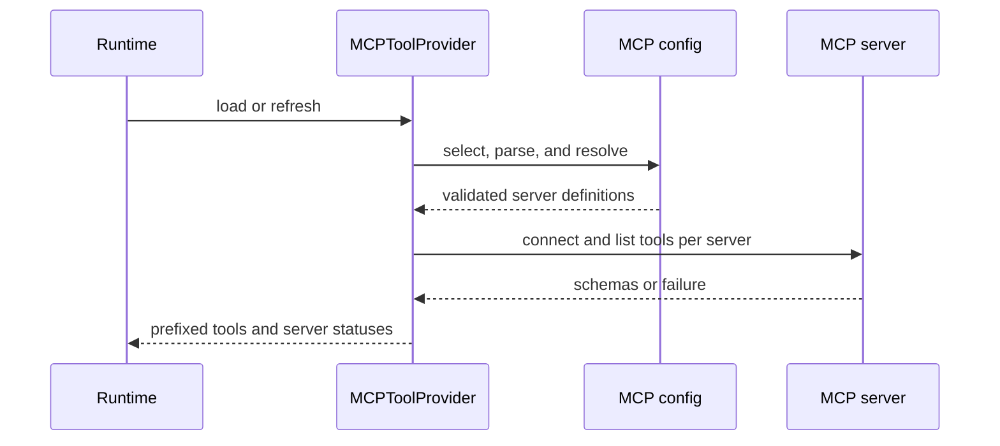
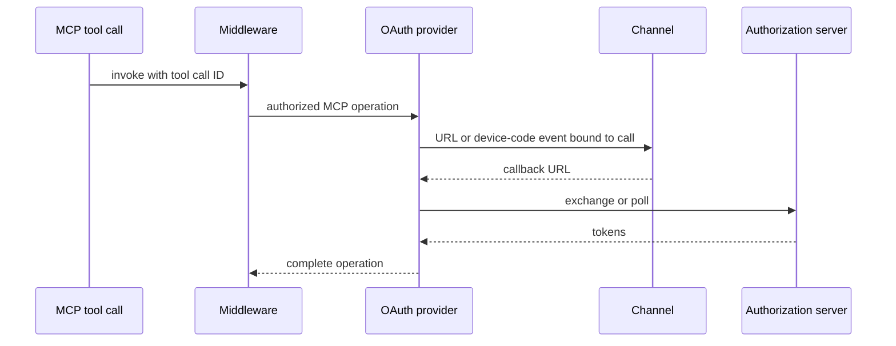

# MCP Integration Across Products

This page documents the Talon implementation of Model Context Protocol (MCP) integration. Talon treats the configured file as an operator-selected source of executable local commands, remote endpoints, headers, and OAuth settings. It validates it before connecting, exposes server state rather than failing the entire tool set for one unavailable server, and makes configuration changes go through a redacted, revision-checked management interface. MCP tools, credentials, and their connection lifecycle are Talon-specific.

## Configuration and loading boundary

Talon reads exactly one configuration: `DEEPAGENTS_TALON_MCP_CONFIG` from `TalonConfig.env` takes precedence over the process environment; without it, the path is `~/.deepagents/.mcp.json`. A missing or non-file path means no configured MCP servers rather than a startup failure. A present document must be a JSON object with an `mcpServers` object and names limited to letters, numbers, `_`, and `-`; these document-level failures happen before any server connection.

Each definition is resolved against `TalonConfig.env` first and then the process environment. Talon expands `${NAME}` and `${NAME:-default}` in command, URL, arguments, environment, and headers; an unset reference, malformed reference, or wrong field type is an error. This resolution produces the connection definition; the management read path deliberately does not expand values.

A definition selects `stdio` when it has `command` and no declared transport, otherwise HTTP; `http` is implemented as `streamable_http`, while `sse` remains SSE. Stdio requires a non-empty command and string arguments, and rejects loader-influencing environment variables such as `LD_PRELOAD`, `PYTHONPATH`, and `BASH_ENV`. Remote servers require a URL. Only `auth: oauth` is supported, only for remote connections, and it cannot be combined with a static `Authorization` header.

`allowedTools` and `disabledTools` are mutually exclusive non-empty string glob lists. Filters are evaluated after Talon prefixes a discovered tool as `<server>_<tool>` and can match either that prefix form or the original tool name.

This shows the validated configuration-to-tool discovery path; a failure from one server is represented in its status while later servers are still considered.

`load_mcp_tools` discovers each server through a separate `MCPAdapter` and applies a 30-second discovery timeout per server. Discovered tools are tagged with `_deepagents_talon_mcp`, prefixed, filtered, and sorted by name. Success produces `ok` metadata including a copied input schema. Expected connection, OAuth, protocol, timeout, and validation failures become a per-server `error` or `unauthenticated` status with no tools, so healthy servers remain usable. `MCPServerInfo` enforces that only `ok` may omit an error and carry tools, and that a pending reconnect is only valid for a disabled server.

## Provider capabilities and revision-safe refresh

`MCPToolProvider` composes loaded MCP tools with management tools. When servers exist it adds `get_mcp_server_status`, which reports name, availability, and whether the configured server can authenticate without exposing the stored failure detail. It adds `authenticate_mcp_server` only if at least one loaded definition uses `auth: oauth`; unknown or no-longer-OAuth names fail rather than initiating arbitrary remote authorization. `reload_mcp_configuration` schedules a refresh and tells callers that replacement tools become available only after a successful reload. Running work retains its original tools; callers can inspect a subsequent agent tool listing to verify activation.

Refresh is a revision counter protected by an async lock. A no-op refresh returns nothing when its requested revision is already applied. The loader snapshots the requested revision before loading: if another request arrives during the load, its newer revision remains pending and causes a later load. Concurrent refreshes serialize. Cancellation does not mark the revision applied and is retryable; a non-cancellation load failure is marked applied to prevent an automatic retry storm until another request or a forced reload occurs.

## OAuth: credentials, safe discovery, and channel binding

For normal loading, a remote `auth: oauth` server with no stored tokens is reported as `unauthenticated` before tool discovery. The operator can run `deepagents-talon mcp login <server>` to force an interactive remote OAuth flow; stdio is rejected. In an agent conversation, the proactive `authenticate_mcp_server` tool instead opens the session through the current channel. Existing usable credentials yield `already_authenticated`; `reauthenticate=true` makes the first token read appear absent, triggering a new grant without deleting the old credential beforehand. Once credentials persist, Talon schedules a refresh even if session teardown later fails.

OAuth tokens and client registration live outside the MCP configuration in `~/.deepagents/mcp-tokens`. The filename combines the server name and a hash of its server URL, so changing endpoints does not reuse a credential. Token storage uses owner-only directories and files, a lock for read-modify-write updates, and atomic replacement. It persists an absolute expiry so an expired token can be refreshed after restart; refresh responses that omit a refresh token retain the stored one, while a fresh authorization grant does not inherit it.

OAuth metadata, resource discovery, dynamic registration, device authorization, and refresh requests use a proxy-ignoring, SSRF-safe HTTPS client. Discovery and DNS resolution have separate time bounds, redirects are rejected, response bodies are size-limited, and discovered endpoints are validated before credential-bearing requests. Device flows require a public client and use an exact GitHub endpoint only for its preseeded client; Slack gets its registered callback configuration only for Slack hostnames.

This shows channel authorization: the authorization binding carries the current tool-call ID and expires, so a callback is associated with the invocation that initiated it.

Channel handlers require an active authorization handler, invocation ID, and attempt; scheduled jobs and background subagents without a channel fail with guidance to use interactive login. Callback parsing accepts only the configured localhost callback endpoint and requires both `code` and `state` (while preserving an optional issuer). Completion or failure events are sent to the channel handler, but delivery errors cannot undo OAuth state or expose it. The CLI flow prints the authorization URL and prompts for the same validated callback URL.

## Invocation middleware and protocol failures

The Talon MCP middleware applies only to tools marked `_deepagents_talon_mcp`; local tools pass through unchanged. Before invoking a marked tool it removes an empty string only when the corresponding schema property is optional and not explicitly non-string. Required string fields, schema-free fields, and explicitly non-string fields are retained. It then binds authorization context to the actual tool-call ID for the duration of the call and clears that context afterwards.

An MCP protocol `MCPError` becomes an error `ToolMessage` containing the protocol code and message. It intentionally excludes server-provided error `data`, which can be arbitrary or sensitive. Other exceptions propagate normally instead of being misreported as protocol errors. MCP elicitation is not treated as an approval: until Talon supplies elicitation UI, valid requests are resumed with a cancel response for every request key.

## Mediated configuration updates

`MCPConfigStore` is bound to the selected configuration path. `get_mcp_configuration` returns a process-local HMAC-derived revision and a redacted view of managed server fields. Literal strings are replaced with `<redacted>`; supported transport/auth enum values and exact `${ENV_VAR}` references remain visible. Unmanaged fields are neither shown nor removed by an update, allowing operator annotations to survive a mediated edit.

`update_mcp_server` adds, replaces, or removes one complete definition only when the supplied revision matches the bytes currently read. `<redacted>` can restore a string only at the same existing position. The store validates managed fields and environment-reference syntax without expanding variables or contacting a server, rejects symlinks and non-regular files, uses a bounded POSIX sidecar lock, and writes an owner-only replacement atomically. It returns generic read/write errors to avoid echoing configured values and schedules refresh only after a successful write; a stale revision or lock timeout is reported as a conflict.

The update tool is normally approval-sensitive in the runtime. If it is auto-approved, reuse of any `<redacted>` value permits changes only to `allowedTools` or `disabledTools`; changes to command, transport, URL, headers, or another managed setting are rejected because they could redirect an unseen secret. A request that supplies new `${ENV_VAR}` references rather than restoring literal data can make such a change.

Redaction and placement are safeguards for the management tools, not a confidentiality boundary. Talon warns when its configuration or token directory lies within the agent workspace, but the default execution-capable shell backend can read an absolute path outside that workspace. Keep real secrets in environment references, an OS credential store, or a location inaccessible to the agent process rather than relying on config-tool redaction.

## Focused verification

Talon tests cover configuration-path selection, whole-document validation before connection, per-server timeout and failure isolation, transport and tool filtering, and refresh races, cancellation, and failed-reload behavior. OAuth tests cover private atomic storage, persisted expiry and refresh-token preservation, forced reauthorization, callback validation and call binding, safe HTTPS discovery, SSRF and redirect rejection, response limits, and device-flow behavior. Middleware and real-adapter tests verify prefixed invocation, optional-empty argument normalization, redacted protocol errors, elicitation cancellation, and that refreshed tools do not break an in-flight tool call. Configuration-store tests cover redaction and restore, revision conflicts, approval gating, symlink resistance, atomic-write cleanup, lock contention, and the auto-approval secret-redirection guard.

## Related pages

- [Configuration layering](/openwiki/concepts/config-layering.md)
- [Permissions and human approval](/openwiki/concepts/permissions-hitl.md)
- [Talon runtime](/openwiki/integrations/talon.md)
- [Security operations](/openwiki/operations/security.md)
- [Testing guide](/openwiki/testing/testing-guide.md)
