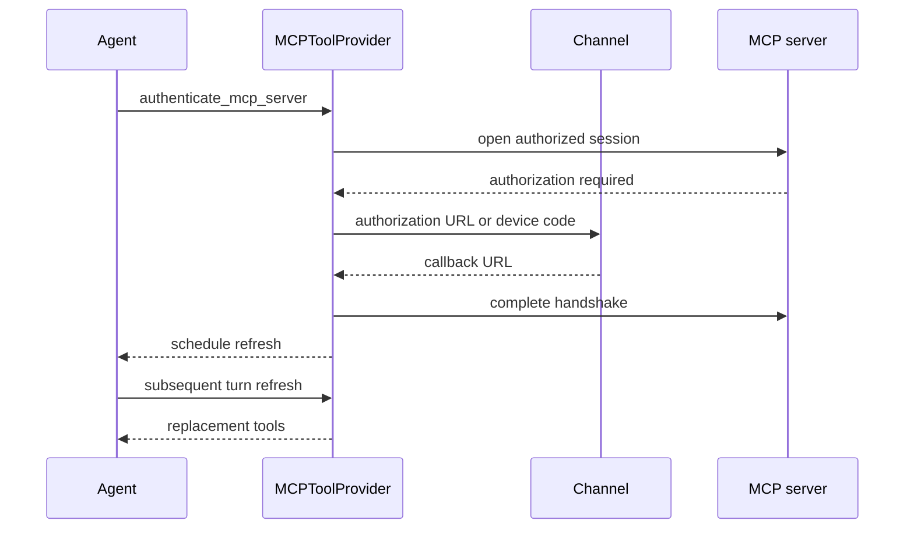

# MCP Integration

Model Context Protocol (MCP) supplies tools from local processes and remote services. dcode and Talon consume similar `mcpServers` documents, but they are independent integrations. dcode composes layered configuration and treats repository configuration as untrusted code; Talon uses one operator-selected file and provides mediated management tools for it. Neither project approvals, credentials, nor live sessions are shared.

## Configuration contract

An MCP document has an `mcpServers` object. A server can use `type` or `transport`; if neither is provided, a `url` implies HTTP and its absence implies `stdio`. dcode accepts `stdio`, `http`, and `sse`, normalizing `streamable_http` and `streamable-http` to HTTP; Talon maps HTTP to `streamable_http`. Remote servers require `url`, while stdio servers require `command`; `args`, `env`, and remote `headers` are supported.

Both implementations interpolate `${VAR}` and `${VAR:-default}` in `command`, `url`, argument elements, environment values, and header values without mutating the raw definition. `:-default` applies for an unset **or empty** variable. A required unset variable, malformed braced reference, or wrong supported-field type is an error rather than a silently altered command, endpoint, or secret. dcode reads its active configuration environment; Talon consults `TalonConfig.env` before the process environment.

`auth: oauth` is only valid for remote HTTP/SSE servers and cannot coexist with a static `Authorization` header. `allowedTools` and `disabledTools` are mutually exclusive, non-empty lists of glob patterns. Filtering checks both the prefixed tool name and the original MCP name.

## dcode: discovery is a trust decision

`resolve_and_load_mcp_tools` is dcode's loading entrypoint. Unless `no_mcp=True`, it layers usable user files, plugin-provided configuration, and trust-filtered project files, then applies an optional explicit configuration at highest precedence. An explicit configuration's load and structural errors are fatal. The login resolver deliberately differs: an explicit `--mcp-config` is loaded by itself, giving `dcode mcp login` an unambiguous target.

Project MCP is a security boundary. A checked-in definition can launch a local process, call a remote endpoint, or interpolate a secret into a header. Accordingly, project entries are untrusted unless the invocation grants `trust_project_mcp=True`, or the individual server matches a user-scoped approval for both project root and server fingerprint. Explicit user denials still win. If the user trust policy cannot be read, saved approvals and whole-project trust fail closed; explicitly environment-enabled names can remain available. dcode resolves precedence before that gate, so rejecting a winning override never revives an older approved definition.

Plugins are a separate extension boundary. Enabled plugins contribute namespaced `plugin__<plugin-id>__<server-name>` definitions after plugin runtime substitution. Installing a plugin is treated as trust in its bundled server definitions, but the user's deny policy still applies and an unreadable deny policy fails closed. Malformed plugin MCP declarations surface as configuration errors.

### Login and credentials

Trust answers whether a definition may connect; OAuth answers how an allowed remote definition authenticates. A token does not approve a project configuration, and project trust does not authenticate an endpoint.

For a configured `auth: oauth` server without a token, dcode reports `unauthenticated` before tool discovery. It also recognizes a remote 401 Bearer protected-resource challenge and reports an unauthenticated server with a `dcode mcp login <server>` hint even when the configuration did not opt into OAuth. A static `Authorization` header takes precedence over a stored OAuth credential.

`dcode mcp login <server>` uses the UI-agnostic resolver and therefore applies project trust filtering. Resolution has typed outcomes for explicit-load failure, no configuration, no usable configuration, unknown server, and invalid server configuration; the CLI maps only no configuration to exit code 2 and the other resolution failures to exit code 1. `mcp_auth.login` works by OAuth discovery for remote HTTP and SSE servers even without `auth: oauth`: it resolves environment values, uses provider-policy login, and opens a one-shot session for the handshake. It rejects stdio, and an aborted reauthorization preserves any previous stored credential.

## dcode: throwaway discovery, persistent runtime calls

This shows dcode's throwaway discovery session followed by lazy persistent-session use.

dcode preflights and discovers tools with bounded concurrency. Setup, discovery, and conversion failures are isolated to their server; status rows preserve configuration order and returned tools are sorted by name. Failure detail for a definition using environment interpolation is redacted so a resolved secret is not exposed.

The wrapper exposes tools as `{server_name}_{tool_name}` and attaches MCP metadata identifying the server and original name. Read-only use and Auto-mode approval require coherent, explicit annotations: `readOnlyHint` must be literally `true`, `destructiveHint` must not be `true`, and every supplied hint must be boolean. Missing or malformed hints grant no read-only treatment.

`MCPSessionManager` owns actual runtime calls, rather than discovery. It lazily creates and initializes one persistent session per server, and rejects incompatible connection reconfiguration once sessions exist. A failed transport can invalidate a cached session for later recreation. `cleanup()` prevents future creation and closes cached entries concurrently with a five-second bound per server; ordinary teardown errors do not block other cleanup, while cancellation propagates. The server graph owns the process-wide manager at shutdown; catalog and metadata callers clean up temporary managers in `finally`.

## Talon: one configuration and isolated server loading

Talon selects exactly one file: `DEEPAGENTS_TALON_MCP_CONFIG` from `TalonConfig` or the process environment, otherwise `~/.deepagents/.mcp.json`. A missing or non-file path means no MCP tools. It parses and resolves the document before connecting, then loads each server through `MultiServerMCPClient` with a 30-second tool-load timeout. One server's operational failure does not remove healthy servers; tools are sorted by name. Failed authentication becomes `unauthenticated`, while other load failures become `error` status metadata. Talon also rejects dangerous stdio environment variables such as `LD_PRELOAD`, `PYTHONPATH`, and `BASH_ENV`.

`MCPServerInfo` makes status internally consistent: an `ok` row has no error, non-`ok` rows have an error and no tools, and `pending_reconnect` is valid only for a `disabled` server. `get_mcp_server_status` exposes a deliberately narrow model-facing summary—server name, status, and `can_authenticate`—rather than error detail.

Talon's client uses interceptors to turn protocol errors into model-visible tool errors, bind authorization, and normalize arguments. Optional string-like parameters given as `""` are omitted; required parameters and parameters explicitly declared non-string are retained. Tool filtering follows the same prefixed/original-name glob behavior described above.

## Talon OAuth and refresh lifecycle

`MCPToolProvider` adds management capabilities to loaded MCP tools. It adds `authenticate_mcp_server` only if at least one configured server uses `auth: oauth`, and that tool accepts only the currently configured OAuth server names. An existing usable credential returns `already_authenticated` unless `reauthenticate=True`; a completed authorization schedules refresh.

This shows authorization outside model-visible tool output and activation on a later turn.

OAuth authorization is bound through context-local state to the exact tool-call ID and channel handler. Browser URLs, callback requests, and device codes travel through that current channel, and a missing channel fails the authorization attempt. Callback parsing requires the configured callback endpoint plus both `code` and `state`. OAuth discovery and token requests use a safe public-HTTPS transport, do not follow redirects, and validate metadata issuer and endpoints.

Refresh requests increment a revision counter. The provider serializes loads with a lock, snapshots the requested revision, and reloads only when it is newer than the applied revision unless forced. A request received during a load remains newer and causes a subsequent load. Cancellation leaves that revision retryable; a normal failed reload marks that revision applied until a new request arrives. `reload_mcp_configuration` and successful configuration updates return `available: after_successful_reload`: running work retains its original capabilities, while the runtime replaces its graph and tools only after a successful later refresh. The host also supports an explicit reload command without restarting Talon and returns generic failure text rather than configuration or transport detail.

Talon stores OAuth tokens separately from its configuration in `~/.deepagents/mcp-tokens`, keyed by server name and URL hash. It uses owner-only directories, POSIX locking to serialize read-modify-write updates, and atomically written `0600` token files. Refresh responses that omit a refresh token retain the stored one; a fresh reauthorization does not carry the old grant forward.

## Talon configuration management is mediated, not confidential

`MCPConfigStore` is bound to the operator-selected path and exposes `get_mcp_configuration` plus `update_mcp_server`. A path inside the agent workspace produces a warning, not a rejection. This is not a confidentiality boundary: Talon's execution-capable default shell backend can read or write an absolute path, bypassing redaction, compare-and-swap, and approval. To keep a literal credential from the agent, place it somewhere the process cannot read or use an unexpanded environment reference.

The read tool returns an HMAC-derived process-local revision and a redacted view. Stored strings are replaced with `<redacted>` except transport/auth enum values and exact `${ENV_VAR}` references; references are never expanded. Thus literal URLs, commands, arguments, header values, and secrets do not flow through this management tool, but may remain reachable through other agent capabilities.

`update_mcp_server` adds, replaces, or removes one complete server definition and requires the expected revision. It validates the narrow supported schema without resolving environment variables or contacting a server. `<redacted>` at the same field retains the prior literal, and fields outside Talon's managed schema are preserved but never shown. The store uses a POSIX sidecar lock, rejects symlink and non-regular reads, atomically replaces the file, and schedules refresh only after a successful update. Stale revisions return a conflict; malformed, validation, and I/O failures return generic messages that avoid leaking stored strings.

Normal runtime approval policy protects `update_mcp_server`; cron-triggered work is not approved through that channel mechanism. With `DEEPAGENTS_TALON_MCP_CONFIG_AUTO_APPROVE=true`, an update that restores `<redacted>` may change only `allowedTools` or `disabledTools`. Any other managed-setting change is rejected, preventing a hidden credential from being redirected to a different command or endpoint.

## Focused verification

The dcode tests exercise OAuth/header exclusion, discovery-based login and retained credentials, project fingerprint policy, plugin composition, server-level failure isolation, annotation handling, and session cleanup/reconfiguration. Talon tests exercise path selection, environment resolution, timeouts and isolated statuses, channel-bound OAuth and callback validation, optional-empty argument normalization, refresh races and cancellation, redacted views, revision conflicts, symlink handling, atomic-write failure, and concurrent updates.

## Related pages

- [Code agent architecture](/openwiki/architecture/code-agent.md)
- [Talon runtime](/openwiki/integrations/talon.md)
- [Security operations](/openwiki/operations/security.md)
- [Run a dcode session](/openwiki/workflows/run-dcode-session.md)
