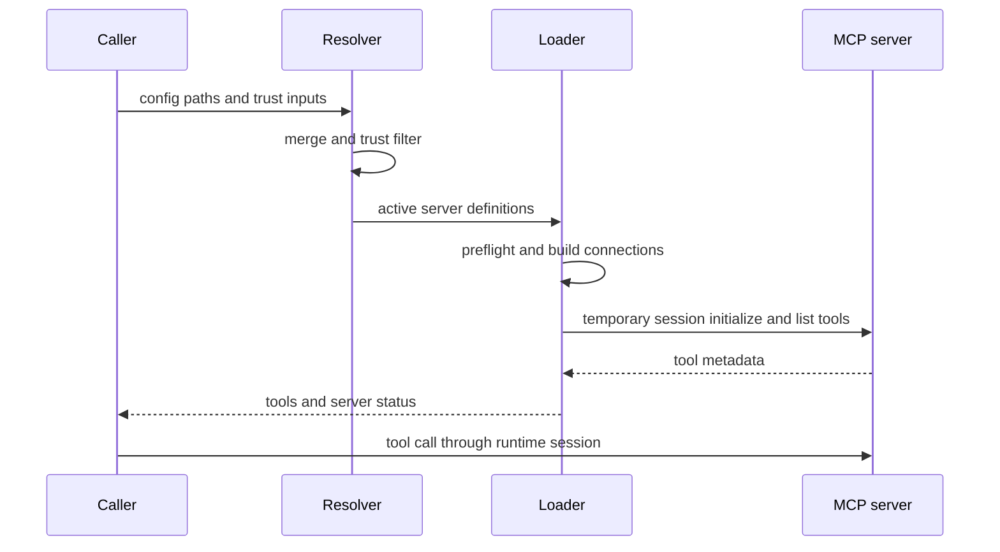
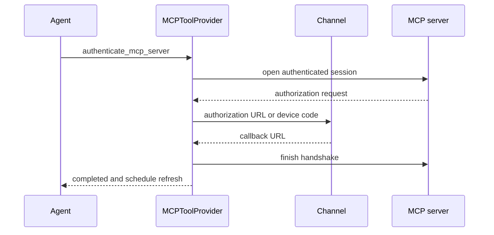

# Model Context Protocol Integration

Model Context Protocol (MCP) adds tools supplied by external processes or remote
services. dcode and Talon both accept MCP-style JSON, but they are **separate
integrations**: dcode has layered discovery, project trust controls, plugin
composition, and a reusable session manager; Talon loads one operator-selected
file and supplies its own tool, authorization, and configuration-management
surfaces. Do not assume a setting, approval, or token store is shared between
the two runtimes.

## Configuration shape

An MCP document is a JSON object with an `mcpServers` object whose keys are
server names. A server can use `type` or `transport`; if absent, `url` implies a
remote HTTP server and no `url` implies `stdio`. dcode accepts `stdio`, `http`,
and `sse`, and normalizes `streamable_http` and `streamable-http` to `http`.
Remote servers require `url`; stdio servers require `command` and may use
`args` and `env`. Remote servers may use `headers`.

`auth: oauth` opts a remote server into OAuth. Validation permits it only for
HTTP/SSE servers and rejects a configuration that combines it with a static
`Authorization` header. Tool selection can use exactly one of
`allowedTools` or `disabledTools`, each a non-empty list of string patterns.
The filters are applied after discovery and match both the server-prefixed
LangChain name and the original name.

Both implementations expand `${VAR}` and `${VAR:-default}` in `command`,
`url`, `args`, `env`, and `headers`. The latter form uses its default when the
variable is unset or empty; a missing bare variable and malformed braced
reference fail rather than silently producing an endpoint or credential value.
Expansion returns a copy, not a mutation of the input configuration. Talon
looks first in its `TalonConfig.env` and then in the process environment;
dcode uses its active configuration environment.

## dcode: source layering and project trust

dcode discovers existing files in increasing precedence:

1. `~/.deepagents/.mcp.json` (user scope)
2. `<project-root>/.deepagents/.mcp.json` (project scope)
3. `<project-root>/.mcp.json` (project scope)

`resolve_and_load_mcp_tools` is the composition entrypoint. It loads usable
user configs, then plugin-provided layers, then trust-filtered project configs,
and finally layers `explicit_config_path` on top when supplied. An explicit file
is loaded by itself for login resolution, but in runtime tool loading it is the
highest-precedence additional layer; its parse and structural errors are fatal.
`no_mcp=True` returns no tools and performs no discovery.

Project scope is a security boundary, not merely a search location. A committed
configuration can start a stdio program, contact a remote URL, or interpolate a
secret header. Before preflight it is therefore filtered using policy read only
from the user's configuration. Whole-config permission requires
`trust_project_mcp=True`; `False` and `None` do not grant it. In the absence of
whole-config trust, a server must match a scoped approval for both its project
root and fingerprint. Explicit user-level project denies apply even to a trusted
configuration. If the trust policy cannot be read, scoped approvals and
whole-config trust fail closed, though explicitly environment-enabled names may
remain available.

Precedence is resolved before the trust decision: rejecting a winning,
higher-precedence server does not revive an older approved definition beneath
it. Invalid project entries are reported as configuration status rows only after
the trust filter; they cannot bypass the gate.

### Plugins are an explicit extension boundary

Enabled plugins contribute `additional_configs`. Their `.mcp.json` files and
inline manifest declarations are combined per plugin, namespaced as
`plugin__<plugin-id>__<server-name>`, and have plugin paths/data/project values
substituted before entering the dcode merge path. A manifest declaration wins
over a plugin file with the same unscoped name. Installing a plugin is treated
as the user's decision to trust its bundled servers, but the user's deny policy
still applies; an unreadable trust policy causes plugin servers to fail closed.
Malformed plugin `mcpServers` is surfaced as a configuration error.

## Trust and credential boundaries

Trust filtering decides **whether configuration is allowed to cause a connection
or subprocess launch**. Authentication decides **how an already permitted
remote connection proves identity**. In particular, a saved OAuth token does
not approve a project configuration, and a project-trust decision does not make
a remote endpoint safe or authenticate it.

For dcode remote servers, a provider is attached when the entry specifies
`auth: oauth`, or when matching stored OAuth tokens exist and no static
`Authorization` header takes precedence. An opted-in server without tokens is
reported as `unauthenticated` before discovery. A remote 401 Bearer challenge
that advertises protected-resource metadata also becomes `unauthenticated` with
a `dcode mcp login <server>` hint, including when the config did not opt into
OAuth.

`FileTokenStorage` stores dcode credentials under the selected profile state
folder's `mcp-tokens` directory. The server name must match `[A-Za-z0-9_-]+`,
and the file name also includes a hash of the resolved URL, isolating tokens for
the same name at different endpoints. Credential writes use private
permissions and atomic replacement. Persisted absolute expiry lets the OAuth
provider refresh before expiry; a cross-process lock serializes refreshes so
rotating refresh tokens are not raced. Token values must not be logged.

`dcode mcp login <server>` first resolves the target through the UI-agnostic
login service, so auto-discovered project entries receive the same trust
filtering as tool loading. `mcp_auth.login`, invoked by `dcode mcp login
<server>`, performs discovery-based OAuth login for remote `http` and `sse`
servers even without `auth: oauth`, rejects stdio, resolves environment
references, invokes provider-policy login and a one-shot handshake, and
preserves an existing stored credential if re-authorization aborts.

The UI-agnostic login resolver reports explicit-load, no-config, no-usable-config,
unknown-server, and invalid-server-config outcomes as typed error kinds; the CLI
maps only no-config to exit code 2 and other resolution errors to exit code 1.
For auto-discovered login targets, `resolve_mcp_config` applies project trust
filtering and returns skipped project paths plus policy, legacy,
malformed-approval, and load-error diagnostics as structured result fields; an
explicit config is instead loaded by itself.

## dcode discovery and session lifetime

After source composition and trust filtering, dcode disables names persisted in
its user MCP-disabled policy before validating or connecting them. An unreadable
managed deny policy disables every server rather than potentially starting one
an administrator blocked. Disabled servers have no tools and no connection, but
remain visible as `disabled` `MCPServerInfo` entries for the UI.

The dcode load path uses temporary sessions for discovery and creates runtime
sessions only when a tool is invoked.

Preflight expands environment references, checks remote reachability or the
stdio executable, and builds a connection. Discovery initializes a throwaway
session and lists tools. The two passes use bounded concurrency, preserve config
order for server status, and sort returned tools by name. A config/setup,
discovery, or conversion failure affects that server's `MCPServerInfo` instead
of hiding healthy peers. When a config contains environment interpolation,
dcode redacts failure details that might contain a resolved secret. Its stdio
stderr sink drains the child pipe unconditionally and logs only bounded,
sanitary DEBUG lines, preventing a verbose server from blocking on stderr.

A discovered tool is LangChain-wrapped and named `{server_name}_{tool_name}`.
Its metadata identifies it as MCP, retains its server and original tool name,
and carries protocol annotations. dcode adds these tools to the agent surface.
Read-only contexts and Auto-mode approval treat an MCP tool as read-only only
when its annotations are coherent: `readOnlyHint` is literally true,
`destructiveHint` is not true, and every present hint is a boolean. Everything
else requires the normal review path.

`MCPServerInfo` reports `ok`, `unauthenticated`, `error`, `disabled`, or the
UI-only `awaiting_reconnect` state. An `ok` entry has no error; every other
state has an error and no tools; `pending_reconnect` is valid only for a
disabled entry. These invariants let UI and catalog consumers distinguish a
configuration error from a server that merely needs login.

`MCPSessionManager` owns dcode runtime sessions. It lazily caches one initialized
session per server on the runtime event loop; discovery sessions are never
reused. A caller may supply a manager (as `server_graph` does), receive a new
one for non-stateless loading, or request `stateless=True`, in which case tools
open a session per call and no manager is returned. Once a manager has active
sessions, changing its connection signature is rejected so a live session
cannot be rebound to different transport or authentication settings. A transient
transport error can invalidate a cached session so a later call recreates it.

The owner must call `cleanup()`: it marks the manager closed, prevents new
sessions, and concurrently closes cached sessions with a five-second per-server
limit. Teardown failures are logged and do not stop cleanup of other servers;
cancellation propagates. dcode's server-launch shutdown owns cleanup of its
process-wide manager, while metadata-only callers such as `tool_catalog` clean
up the temporary manager in `finally`.

## Talon: isolated file, tools, and channel authorization

Talon does not use dcode's layered loader. `mcp_config_path` selects
`DEEPAGENTS_TALON_MCP_CONFIG` from Talon's config environment or the process
environment; without it, Talon loads only `~/.deepagents/.mcp.json`. A missing
file produces an empty MCP result. Talon validates the complete JSON document
before connecting, then loads each server with `MultiServerMCPClient` under a
30-second timeout. Per-server operational failures become `error` or
`unauthenticated` status entries while other servers continue; tools are sorted
by name.

Talon blocks dangerous stdio environment keys such as `LD_PRELOAD`,
`PYTHONPATH`, and `BASH_ENV`. Its `FileTokenStorage` is separate from dcode's:
it uses `~/.deepagents/mcp-tokens/<name>-<url-hash>.json`, creates the directory
with mode `0700`, and atomically writes token files with mode `0600`.

`MCPToolProvider` adds more than discovered MCP tools to a Talon runtime:

- `get_mcp_server_status` exposes only server name, status, and whether OAuth is
  available—not detailed errors.
- `authenticate_mcp_server` exists only if configured OAuth servers are present
  and only accepts one of those server names. It reports existing credentials
  without reauthorizing unless `reauthenticate=True`.
- `reload_mcp_configuration`, plus the redacted configuration tools described
  below, schedules availability changes for the next agent turn.

For an MCP tool invocation, Talon's authorization interceptor binds OAuth events
to that exact LangGraph tool-call ID. Browser URLs, callback requests, and device
codes are delivered through the current Talon channel rather than model-visible
output; a missing interactive channel fails authorization. Callback parsing
requires the configured localhost endpoint plus `code` and `state`. OAuth
metadata and endpoint requests are constrained to safe public HTTPS endpoints,
reject redirects, and validate issuer/endpoint relationships.

Talon routes an OAuth exchange through the current channel and makes newly
available schemas eligible for reload on the next turn.

Talon's `MCPConfigStore` manages that fixed operator-selected file without using
workspace filesystem tools. `get_mcp_configuration` returns an HMAC-based
revision and redacts strings except transport/auth enums and exact environment
references. `update_mcp_server` replaces or removes exactly one server only when
the supplied revision matches; it can preserve an existing secret by sending
`<redacted>` in the same field. Reads reject symlinks and non-regular files,
writes use a POSIX lock and atomic replacement, and successful updates schedule
a refresh. This limits the model-facing configuration API, but operators should
still treat any approved MCP configuration change as security-sensitive because
it can launch commands or send credentials.

The provider serializes reloads with a lock and revision counters. A requested
change during a load remains pending for a later reload; cancellation leaves the
revision retryable, while a normal failed reload is considered applied until a
new request. Talon passes `refresh_if_needed` and forced `reload` into
`DeepAgentRuntime`; it does not expose dcode's `MCPSessionManager`, so session
lifetime for loaded Talon tools is owned by its `MultiServerMCPClient` adapter
rather than a Talon-managed cache.

## Focused verification

The MCP tests cover configuration shape and environment interpolation, OAuth
versus static-header exclusion, trust-policy failures, per-server failure
isolation, tool filtering and metadata, and the session-manager cleanup and
reconfiguration invariants. Talon's tests additionally exercise the isolated
config path, dangerous stdio environment rejection, redacted configuration
updates, channel-bound callback and device authorization, status-tool secrecy,
and refresh races including cancellation and a request arriving during reload.

## Related pages

- [Configuration layering](/openwiki/concepts/config-layering.md)
- [Tools and filesystem](/openwiki/concepts/tools-filesystem.md)
- [ACP integration](/openwiki/integrations/acp.md)
- [Talon runtime](/openwiki/integrations/talon.md)
- [Security operations](/openwiki/operations/security.md)
