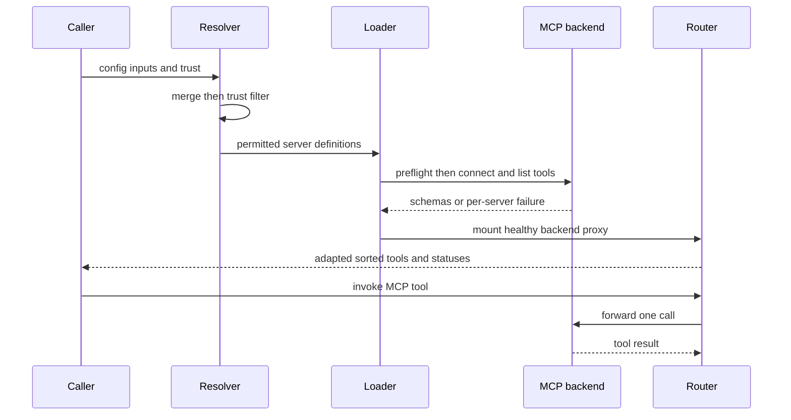
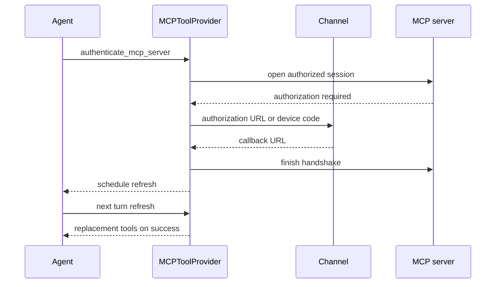

# MCP Integration Across Products

MCP adds tools from local processes and remote services. dcode and Talon accept
similar `mcpServers` documents, but they are independent integrations: dcode
layers user, plugin, and project sources behind an explicit trust decision;
Talon loads one operator-selected file and offers mediated configuration tools.
Their approvals, OAuth credentials, and live connections are not shared.

## Common server shape

A server can use `stdio`, `http`, or `sse`. dcode normalizes
`streamable_http` and `streamable-http` to `http`; Talon maps HTTP to its
`streamable_http` adapter connection. Without a declared transport, `url`
implies remote HTTP and otherwise the server is stdio. Remote servers require a
URL; stdio requires a command. Arguments, environment values, headers, and
non-empty `allowedTools` or `disabledTools` glob lists are supported; the two
filters cannot be combined and match bare and server-prefixed names.

Both products resolve `${VAR}` and `${VAR:-default}` in connection-bearing
fields without changing the raw definition. An unset required reference,
malformed reference, or incorrect field type fails rather than silently
altering a command, endpoint, or header. Talon checks `TalonConfig.env` before
the process environment. `auth: oauth` is remote-only and cannot coexist with
a static `Authorization` header.

## dcode: layered configuration and trust

`resolve_and_load_mcp_tools` returns immediately for `no_mcp=True`; otherwise
it layers user files, plugin layers, trusted project files, and an optional
highest-precedence explicit config. Auto-discovery considers the profile MCP
file, `<project-root>/.deepagents/.mcp.json`, and
`<project-root>/.mcp.json`, retaining provenance. An explicit configuration is
fatal when unreadable or structurally invalid; discovered user/project errors
are surfaced as status rows instead of preventing usable peers from loading.
For login, an explicit file is intentionally loaded alone so its target is
unambiguous.

Project MCP is an execution boundary: a committed entry may launch a process,
contact a remote endpoint, or interpolate a secret into a header. Project
servers therefore require `trust_project_mcp=True` or a user-scoped approval
matching both project root and server fingerprint. Explicit user denials win,
and an unreadable policy fails closed. Precedence is resolved before this gate,
so rejecting a winning override cannot resurrect an older approved server.

Enabled plugins add namespaced `plugin__<plugin-id>__<server-name>` servers
after runtime substitution. Installation constitutes trust for bundled servers,
but the user's deny policy still applies and an unreadable policy prevents them
from bypassing a saved denial.

### dcode OAuth login

`dcode mcp login <server>` first resolves the target with the same project
trust filtering. The UI-agnostic resolver reports explicit-load, no-config,
no-usable-config, unknown-server, and invalid-server outcomes; the CLI assigns
exit code 2 only to no-config and code 1 to other resolution failures.

`mcp_auth.login` uses discovery-based OAuth for any remote HTTP/SSE server,
even if it lacks `auth: oauth`; stdio is rejected. It resolves environment
references, lets the selected provider policy prepare login, then opens a
one-shot FastMCP session to drive the handshake. Explicit login hides an
existing token during authorization rather than deleting it, so an aborted or
failed reauthorization retains the working credential. At normal load time,
`auth: oauth` without a stored token is unauthenticated before dialing; a
Bearer protected-resource challenge can also turn an otherwise unmarked remote
server into an actionable unauthenticated status. Static Authorization headers
override stored OAuth credentials.

Credentials live separately under dcode's profile state `mcp-tokens` directory
and use a path-safe server name plus a hash of the resolved URL. Token writes
are atomic and private; refresh writes are serialized, so token values must not
be logged.

## dcode connection-to-tool lifecycle

This sequence shows dcode's merged configuration, per-server discovery, and
router-backed runtime call path.

The loader preflights and connects with bounded concurrency. Environment
resolution, setup, discovery, and conversion failures are isolated to their
server; status order follows configuration order and returned tools sort by
name. If a raw definition contained environment interpolation, connection
failure detail is redacted to avoid echoing resolved secrets.

Healthy backends are mounted under encoded namespaces on one FastMCP router.
The resulting tools have server-prefixed names and MCP ownership metadata.
`MCPBackendMiddleware` serializes recovery per backend: it invalidates a broken
connection and preserves a nested reauthentication error, but never replays a
call after disconnect because the operation may already have completed. A later
call can establish a fresh backend session.

`MCPSessionManager` owns the router client and every adopted backend stack. A
normal load retains those live connections, including stdio subprocesses, until
cleanup; repeated adoption deliberately retains older loads so tools created by
earlier loads remain usable. `stateless=True` instead makes each tool call open
and close its own session. Cleanup rejects later adoption, closes router and
backend resources with a five-second bound per close, continues after ordinary
teardown failures, and completes teardown before propagating cancellation. The
server graph supplies a process-wide manager and cleans it up at shutdown;
catalog/metadata loading cleans temporary managers in `finally`.

Read-only use and Auto-mode approval do not trust missing annotations:
`readOnlyHint` must explicitly be `true`, `destructiveHint` cannot be `true`,
and supplied hints must be booleans.

## Talon: one file, isolated server load

Talon selects `DEEPAGENTS_TALON_MCP_CONFIG` from `TalonConfig.env` or the
process environment, otherwise `~/.deepagents/.mcp.json`. A missing or
non-file path supplies no MCP tools. The document is validated before any
connection; then each server loads through its own `MultiServerMCPClient` with
a 30-second timeout. One server's failure becomes `error` or `unauthenticated`
status metadata while healthy peers and their name-sorted tools remain usable.
Talon rejects dangerous stdio environment variables such as `LD_PRELOAD`,
`PYTHONPATH`, and `BASH_ENV`.

Talon prefixes tool names and applies the same filter concepts. Its interceptor
omits `""` only for optional string-like arguments, retaining required or
explicitly non-string fields. A protocol `McpError` becomes a model-visible
error result containing only the server error code and message, not the
unbounded server-provided `data` payload; this prevents an invalid MCP call
from aborting the whole turn or injecting arbitrary details.

## Talon authorization and reload

`MCPToolProvider` exposes server status, configuration tools, and reload
scheduling with loaded MCP tools. It adds `authenticate_mcp_server` only when
configured OAuth servers exist; that tool accepts only those names and returns
`already_authenticated` when existing credentials work unless
`reauthenticate=True` requests a new flow.

This sequence shows that authorization and configuration changes schedule,
rather than mutate, a running turn's tool set.

OAuth events are bound to the current LangGraph tool-call ID and Talon channel;
a missing channel fails authorization. Callback parsing requires the configured
callback endpoint plus both `code` and `state`. Tokens are separate from dcode,
stored below `~/.deepagents/mcp-tokens` by server name and URL hash in a private
directory with atomically written private files.

Refresh requests increment a revision. Reload is lock-serialized and reloads
only a newer revision unless forced. A request made during a load stays newer
and receives a later load; cancellation remains retryable, while a normal
failed reload is considered applied until another request. Reload and update
responses say `after_successful_reload`: running work retains its original
capabilities, and a later tool listing can verify activation.

## Talon configuration tools are mediated, not secret storage

`MCPConfigStore` is bound to the selected path and only warns if it lies in the
workspace. `get_mcp_configuration` returns an HMAC-derived process-local
revision and a redacted view: literal strings are hidden except supported
transport/auth enums and exact `${ENV_VAR}` references, which are not expanded.
This reduces disclosure through its management tools, not through Talon as a
whole. The default execution-capable shell backend can read an absolute path,
so neither redaction nor storing the file outside the workspace is a
confidentiality boundary.

`update_mcp_server` adds, replaces, or removes a complete server definition
against an expected revision. It validates without resolving variables or
contacting a server, may preserve a same-position literal using `<redacted>`,
rejects symlink and non-regular reads, locks on POSIX, atomically writes, and
schedules refresh only after success. Reads and write errors are deliberately
generic to avoid leaking stored strings. With
`DEEPAGENTS_TALON_MCP_CONFIG_AUTO_APPROVE=true`, a request restoring redacted
values may change only tool filters; other managed-setting changes are refused
so a hidden credential cannot be redirected. Otherwise this configuration write
is approval-sensitive in the Talon runtime.

## Focused verification

The dcode lifecycle tests cover retained versus stateless backend ownership,
failed/cancelled discovery cleanup, bounded connection concurrency, reconnect
after a dead backend, and the no-replay guarantee. Talon tests cover path
selection, pre-connection validation, timeout and per-server isolation,
OAuth-channel/callback behavior, argument normalization, protocol error
redaction, refresh races and cancellation, redacted configuration reads,
revision conflicts, symlink protection, atomic-write failure, and concurrent
updates.

## Related pages

- [Configuration layering](/openwiki/concepts/config-layering.md)
- [Permissions and human approval](/openwiki/concepts/permissions-hitl.md)
- [Tools and filesystem](/openwiki/concepts/tools-filesystem.md)
- [Talon runtime](/openwiki/integrations/talon.md)
- [Security operations](/openwiki/operations/security.md)
