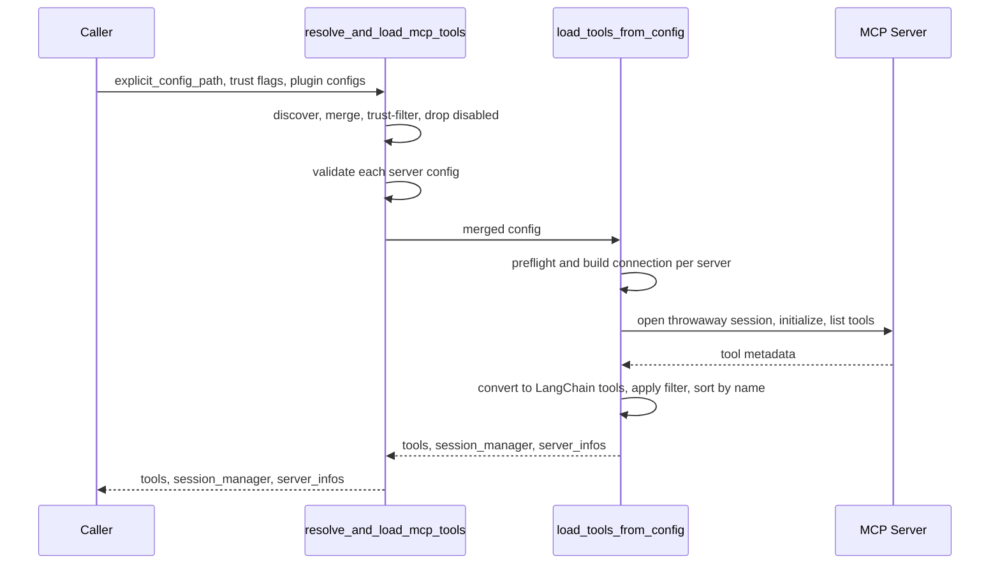
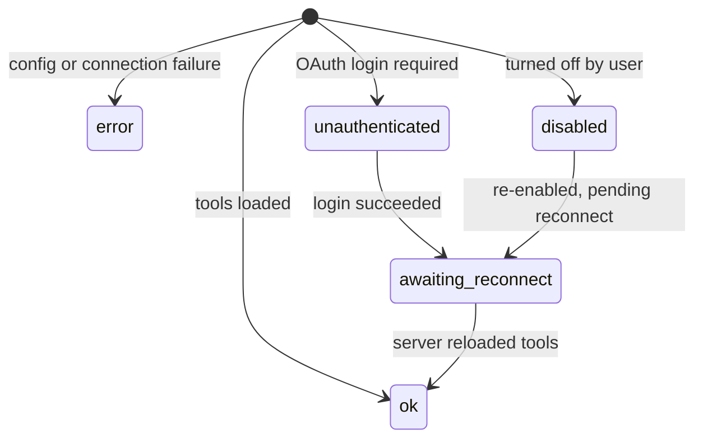

# MCP Integration

Model Context Protocol (MCP) servers extend the agent with externally hosted
tools. dcode and talon share one loader in `deepagents_code.mcp_tools` that
discovers `.mcp.json` files, validates and expands their entries, opens throwaway
sessions to enumerate each server's tools, converts those tools into LangChain
tools, and folds per-server status into a list of `MCPServerInfo` records. This
page explains that pipeline, the config precedence and trust rules, the OAuth
login flow, and how MCP tools join the tool surface and interact with approvals.

## Server configuration format

An MCP config is a JSON document with a top-level `mcpServers` mapping of server
name to a server definition. The repository's own `.mcp.json` declares two remote
HTTP servers, `docs-langchain` and `reference-langchain`, each with a `type` of
`http` and a `url`.

Server entries support both stdio and remote transports. `McpServerSpec`
documents the accepted shape: `type`/`transport` (`stdio`, `http`, or `sse`),
`url` and `headers` for remote servers, `command`/`args`/`env` for stdio servers,
and `auth: oauth` to opt a remote server into OAuth login. `auth: oauth` is
valid only for remote HTTP/SSE servers and cannot be combined with a static
`Authorization` header. The MCP spec's `streamable_http`/`streamable-http`
transport names normalize to the app's `http` so pasted upstream configs
validate.

`mcp_config.resolve_mcp_server_env` expands `${VAR}` and `${VAR:-default}`
references in the `command`, `url`, `args`, `env`, and `headers` fields; every
other field is copied verbatim and the input is never mutated. A `${VAR:-default}`
reference falls back to `default` when `VAR` is unset or empty (POSIX `:-`
semantics); a bare `${VAR}` that is unset with no default is a hard error, and a
malformed `${...}` reference is rejected rather than silently emitted so a typo
cannot inject a garbage value into a URL, command, or header.

## Discovery and precedence

`discover_mcp_config_sources` probes three locations in ascending precedence:
the user-level profile config (`~/.deepagents/.mcp.json`), then
`<project-root>/.deepagents/.mcp.json`, then `<project-root>/.mcp.json`. Each
discovered path carries an immutable trust provenance (`MCPConfigScope.USER` or
`PROJECT`) rather than re-deriving trust from path shape at each call site. When
a user path collides with a project path (for example a relocated home that
equals the repo), the collision resolves toward project scope so relocating the
profile never self-trusts the repo's own MCP file.

`resolve_and_load_mcp_tools` is the single entry point that ties discovery,
merge, trust filtering, disable filtering, validation, and loading together. It
layers configs lowest-to-highest: auto-discovered user configs, plugin-provided
`additional_configs`, trusted project configs, and finally an
`explicit_config_path` when supplied (the highest-precedence source, whose parse
errors are fatal). When `no_mcp` is `True` it returns empty results immediately.

## Trust gating for project servers

Because an attacker-controlled `.mcp.json` could SSRF or exfiltrate `${VAR}`
headers during the discovery preflight, project servers — stdio and remote alike
— are gated before any connection is attempted. Whole-config trust comes only
from `trust_project_mcp=True` (the `--trust-project-mcp` flag or the interactive
approval prompt). `False` and `None` are treated identically: no whole-config
trust, so project servers load only via the user's scoped allow policy.

The user-level allow/deny policy (`[mcp].enabled_project_server_approvals`,
`[mcp].disabled_project_servers`, and env equivalents) is sourced only from the
user's own config, never the repo, so a committed `.mcp.json` cannot self-approve.
Scoped approvals load a server from an otherwise-untrusted config only when the
project root and server fingerprint match, and explicitly denied servers are
dropped even from a trusted config. If that policy cannot be read, the loader
fails closed rather than honoring whole-config trust or bypassing a saved
rejection. Trust is resolved after precedence, so rejecting a higher-precedence
definition never reveals a stale approved definition beneath it.

Installing a plugin is treated as the user's trust decision for its bundled
servers, so `additional_configs` servers load without per-server approval, but
the user-level deny policy still applies and an unreadable policy still fails
closed.

## Load pipeline

`_load_tools_from_config` builds connections from a validated config and loads
tools. Per-server config, auth, and setup failures are captured in the returned
`MCPServerInfo` list rather than propagated, so one bad server never hides the
others. Loading proceeds in two bounded-concurrency passes:

Two-phase MCP tool loading: preflight and connect, then discover and convert.

Preflight (`_preflight_and_connect`) expands `${VAR}` references, runs a
connectivity check (a remote reachability probe or, for stdio, a `shutil.which`
executable check off the event loop), and builds the transport-specific
connection. Discovery (`_discover_server`) opens a throwaway session per server
that survived preflight, initializes it, lists tools, and converts them. Both
passes run through `_gather_bounded`, and results are folded back in config order
so `server_infos` stays deterministic and tools stay sorted by name regardless of
which probe finished first.

When error messages could echo a resolved secret (the config used environment
interpolation), failure details are redacted; plain configs keep full detail.
For stdio servers, `_MCPStderrSink` drains the subprocess's stderr so a chatty
server cannot block on a full pipe, and logs bounded, sanitized lines at DEBUG.

### Stateless vs. session-managed tools

Runtime tools bind in one of three ways: to a caller-owned `MCPSessionManager`
(server mode), to a new local manager returned to the caller, or fully stateless,
opening a fresh session per tool call. `MCPSessionManager` caches one lazily
created session per server; once any session is active it refuses to be
reconfigured to a different connection signature, preventing live sessions from
being rebound to different transports or auth providers. The `server_graph`
builder loads MCP tools with `stateless=True` against a shared session manager;
`tool_catalog` discovery cleans up the returned manager after enumerating
metadata.

### Server status and lifecycle

Each configured server ends in one of `ok`, `unauthenticated`,
`awaiting_reconnect`, `error`, or `disabled`. `MCPServerInfo` enforces a
consistency invariant: an `ok` server carries no error, a non-`ok` server
carries an error message and no tools, and `pending_reconnect` requires
`status='disabled'`. `uses_oauth` is set when the connection carried an OAuth
provider, letting the TUI offer re-authentication only where it is meaningful.

Load states a configured MCP server can reach.

## Disabling servers

`mcp_disabled` persists user-disabled server names under `[mcp].disabled_servers`
in `~/.deepagents/config.toml`. Disabled servers are dropped at merge time via
`get_disabled_servers`, so their tools never reach the agent and no connection is
attempted, but each is still surfaced as a `disabled` `MCPServerInfo` so the user
can re-enable it (F2 in the `/mcp` viewer). The store keys on server name alone.
If a managed (administrator) deny list is present but unreadable, the loader fails
closed and disables every server rather than starting one an administrator may
have blocked.

## MCP tools on the tool surface and approvals

Discovered MCP tools are converted with `tool_name_prefix=True`, so each tool's
LangChain name is `{server_name}_{tool_name}`. The converter attaches a metadata
marker (`_deepagents_code_mcp`) plus the server name and the server's protocol
hints (`readOnlyHint`, `destructiveHint`, `idempotentHint`, `openWorldHint`).
`server_graph` appends these tools to the agent's other tools; MCP tools are
included in read-only contexts such as criteria drafting only when their
annotations explicitly declare them read-only.

Approvals use those markers. `auto_mode.is_mcp_tool` recognizes the marker, and
`mcp_tool_is_coherently_read_only` returns `True` only when `readOnlyHint` is
literally `true`, `destructiveHint` is not `true`, and every present hint is a
real boolean. In Auto mode, `_deterministic_allow` auto-approves an MCP tool call
only when it is coherently read-only; otherwise it requires review. The hint
metadata is passed to the classifier as trusted metadata for its decision.

## OAuth authentication

`mcp_auth` implements OAuth login and token storage for remote MCP servers. A
remote server gets an OAuth provider when the config opted in with `auth: oauth`,
or when a prior login stored tokens and no static `Authorization` header
overrides them (static headers take precedence over stored OAuth). If a server
opted into OAuth but has no stored tokens, preflight returns `unauthenticated`
and requires an upfront login before connecting.

Tokens are persisted per server by `FileTokenStorage` under the profile's
`mcp-tokens` state directory. The token-file stem combines the server name (which
must match `[A-Za-z0-9_-]+` so it cannot escape the token directory) with a hash
of the resolved server URL, so tokens are keyed on server identity. An absolute
expiry is written as a sidecar so a cold-started provider can trigger the SDK's
`refresh_token` grant instead of a full browser re-auth; a
`_REFRESH_SAFETY_MARGIN_SECONDS` margin refreshes ahead of the advertised expiry
to absorb clock skew. A cross-process file lock serializes token refreshes so
concurrent processes don't fight over rotating refresh tokens.

`build_oauth_provider` constructs the provider. When interactive, it uses a
loopback callback server if the provider policy supports one — reusing a prior
DCR port so the registered `redirect_uri` stays valid — or a paste-back handler
otherwise; when non-interactive it installs handlers that surface a re-auth
requirement instead of prompting.

`login` (`dcode mcp login <server>`) is discovery-based: it can authenticate any
remote `http` or `sse` server, including one that was discovered from an RFC 9728
401 challenge and did not declare `auth: oauth`. It rejects `stdio`, resolves
config environment references, invokes the selected provider policy (loopback,
paste-back, or RFC 8628 device flow), and drives a one-shot MCP handshake. A
completed provider login reports success; a fresh-login storage wrapper keeps an
existing stored credential intact if re-authorization aborts. Static headers are
passed to that handshake, so the project-config trust gate must run before this
point. During discovery, a token-refresh failure is classified as
`unauthenticated`, and a remote 401 OAuth challenge on a server not opted into
OAuth is likewise surfaced as `unauthenticated` with a `dcode mcp login` hint
rather than an opaque connection error.

Token material is never logged: `mcp_auth` deliberately passes only structural
facts ("refreshed token for server X"), and expected re-auth log records from the
SDK are filtered out because the app replaces them with an actionable hint.

### UI-agnostic login surfaces

`mcp_oauth_ui` defines the `OAuthInteraction` protocol — display the authorize
URL, accept a pasted callback URL, show device-code instructions, and report
success, notices, or failure — so the CLI (`print`/`input`) and TUI widgets
satisfy the same interface. Implementations must never embed token material in
user-facing messages.

`mcp_login_service` is the UI-agnostic boundary before the handshake. Its pure
`resolve_mcp_config` and `select_server` functions perform discovery, project
trust filtering, merge, and selected-entry validation without printing, and
return `ConfigResolution`/`ServerSelection` or a typed `ConfigResolutionError`.
The error discriminator distinguishes an explicit-load failure, no discovered
config, no usable config, an unknown server, and an invalid selected server.
Auto-discovery reports skipped untrusted project paths and load/policy migration
notices as structured fields; an explicit `--mcp-config` is loaded by itself.
The CLI maps only `NO_CONFIG_FOUND` to exit code 2 and other resolution failures
to 1, while the TUI turns the same results into in-app status. This separation
keeps login target resolution and its fail-closed trust behavior consistent
without making either UI parse terminal output.

## Talon

`deepagents_talon.mcp` reuses the same `deepagents_code.mcp_tools` loader.
`load_mcp_tools` calls `resolve_and_load_mcp_tools` with an
`explicit_config_path` taken from the first set of
`DEEPAGENTS_TALON_MCP_CONFIG`/`MCP_CONFIG` (checked in the Talon config env then
the process environment) and a `ProjectContext` derived from
`DEEPAGENTS_TALON_WORKSPACE`. It passes `trust_project_mcp=None` (no whole-config
trust) and wraps config errors in `MCPConfigError`, returning an `MCPTools`
record of the loaded tools and per-server statuses.

Talon also reuses the shared discovery order: `discover_mcp_config_paths` returns
the same existing config files lowest-to-highest, and `print_mcp_config_paths`
renders `MCP_CONFIG_DISCOVERY_PATHS` with found/missing markers, including
`~/.deepagents/.mcp.json` and the two project locations.

## Related pages

- [Tools and filesystem](/openwiki/concepts/tools-filesystem.md)
- [Talon runtime](/openwiki/integrations/talon.md)
- [Run a dcode session](/openwiki/workflows/run-dcode-session.md)
