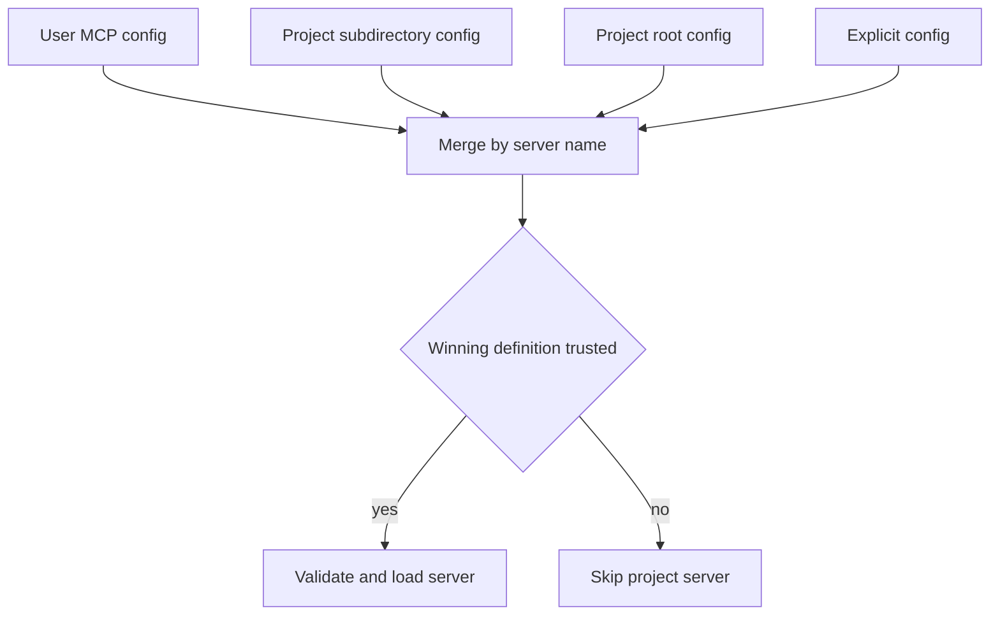
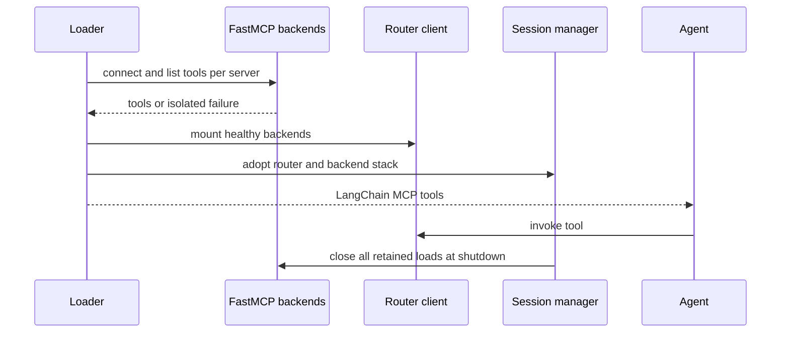
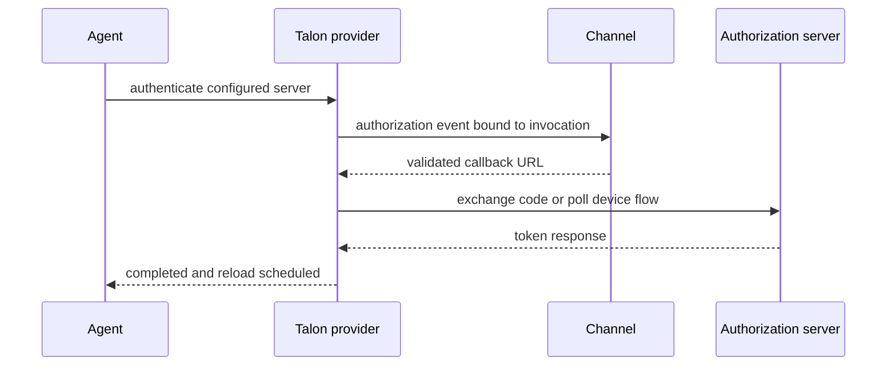

# MCP Integration Across Products

Model Context Protocol (MCP) is implemented separately by Deep Agents Code (`dcode`) and Talon. They share familiar server shapes—stdio, SSE, and HTTP configurations—but neither configuration selection nor process lifetime is shared. In particular, Talon does **not** use dcode's discovery, layer merge, project trust, FastMCP router, or TUI model.

The boundary is intentional:

- **dcode** finds user and repository configurations, resolves precedence, decides whether repository-controlled servers are trusted, and translates live MCP state into tool catalog and `/mcp` UI metadata. It delegates connection lifetime, transport behavior, authentication, and stdio process persistence to FastMCP.
- **Talon** selects one operator path, validates and connects it itself, exposes narrow configuration-management and status tools to an agent, and binds interactive OAuth to the invoking channel.

## dcode: discovery, precedence, and trust

Unless MCP is disabled, `resolve_and_load_mcp_tools()` discovers existing files in ascending precedence: the selected profile's user `.mcp.json`, `<project-root>/.deepagents/.mcp.json`, then `<project-root>/.mcp.json`. Later definitions replace earlier definitions by server name. An explicitly supplied configuration is loaded as the final, highest-precedence layer and is fatal when invalid; automatically discovered files instead become visible synthetic configuration-error entries where possible.

Repository configurations are an executable-input boundary, not merely a convenience layer: stdio entries can launch commands, while remote entries can cause network requests or interpolate environment values into headers. dcode therefore preserves each discovered file's `USER` or `PROJECT` provenance through discovery and applies trust **after** project precedence has selected the winning definition. A project definition loads only when whole-project trust is granted or a user-owned scoped approval or explicit environment allowlist matches it; an explicit user deny always wins. An unreadable trust policy fails closed for whole-project trust. Plugin MCP layers are trusted by plugin installation, but still obey user denials and are rejected when that policy cannot be read.

This shows dcode's source precedence and the fact that trust applies to the winning project definition rather than to a shadowed file.

Validation checks server names, configuration shape, transport, OAuth compatibility, and mutually exclusive non-empty `allowedTools` / `disabledTools` glob lists. `${VAR}` and `${VAR:-default}` expansion is deliberately deferred to individual-server activation: one missing variable becomes that server's error rather than invalidating healthy siblings. The active dcode environment supplies expansion values. Tool filters match the original MCP name and the exported server-prefixed name.

## dcode: FastMCP sessions and isolated loading

dcode's `MCPSessionManager` owns the resources its wrappers need but does not replace FastMCP. It holds the router client and an `AsyncExitStack` for all adopted backend loads. FastMCP has one client per configured server; its transport/auth state—and an alive stdio subprocess—remain available across tool calls. dcode mounts connected backends under encoded namespaces behind one router client, then builds LangChain-facing tools through that router.

A reload never closes an earlier adopted load, because tools already handed to an agent may still invoke it. `cleanup()` instead closes every retained router/backend pair in reverse adoption order, gives each teardown five seconds, logs ordinary teardown failure, and continues closing remaining resources. Server mode supplies one event-loop-bound manager; stateless discovery closes its temporary sessions and turns each tool invocation into a fresh single-server load.

This shows why dcode can keep stdio-backed tools alive while allowing a newer load to coexist with in-flight tools.

Preflight and backend connection are bounded-concurrency, per-server operations. A missing stdio command, unreachable remote endpoint, interpolation failure, failed schema adaptation, OAuth challenge, or connection error produces an `MCPServerInfo` entry rather than suppressing unrelated servers. Error text is redacted when the raw server configuration used environment interpolation. Names are made provider-safe, bounded, and collision-free while metadata retains the original server/tool owner for dispatch and filtering.

`MCPServerInfo` is the cross-layer status contract. `ok` may carry tools and no error; every non-`ok` state must carry an error and no tools; `pending_reconnect` is valid only for `disabled`. Statuses distinguish `ok`, `unauthenticated`, `error`, user `disabled`, and transient `awaiting_reconnect`. The TUI can therefore render server-specific failure details, offer login only where OAuth is actually usable, sort attention-needed servers first, and retain reconnect guidance without performing another discovery. The CLI `/tools` catalog uses the same metadata to show unavailable servers rather than silently omitting them.

## Talon: fixed configuration and provider refresh

Talon independently loads a single MCP configuration selected by `DEEPAGENTS_TALON_MCP_CONFIG` or `~/.deepagents/.mcp.json`; it validates before connection, applies a 30-second per-server tool-load timeout, and isolates each server failure into status metadata.

It resolves configuration environment references from `TalonConfig.env` before the process environment and validates server settings before connection. Stdio definitions reject loader-influencing environment variables; OAuth is remote-only and cannot accompany a static `Authorization` header. Discovered tools are server-prefixed, marked for Talon middleware, filtered with allow or disable globs, and ordered by name. Its `MCPServerInfo` follows the same status/error/tool consistency invariant, but is a Talon-local type rather than evidence of a shared loader.

`MCPToolProvider` adds management capabilities around loaded tools: status reporting, OAuth authorization only for configured OAuth servers, a reload scheduler, and redacted fixed-file configuration tools. Refresh revisions are lock-serialized. A request that arrives while a load is active remains pending for the next reload; cancellation leaves it retryable, while an ordinary failed load is marked applied to avoid a retry storm until another request or forced reload. A scheduled or mediated configuration update affects a later successful reload, so running work retains its original tools.

## Talon OAuth and invocation safety

For an OAuth server without tokens, normal Talon loading reports `unauthenticated` rather than attempting discovery. Operators can use `deepagents-talon mcp login <server>` for the interactive remote flow. In an agent session, `authenticate_mcp_server` is constrained to the current configured OAuth server and channel; reauthentication starts a fresh grant without deleting the old credential first. A persisted successful grant schedules a reload even if session teardown subsequently fails.

This depicts Talon's channel-bound authorization flow; it is separate from dcode's `/mcp` interface.

Talon keeps OAuth credentials in a separate user token directory keyed by server name and URL hash, with a private directory and atomically written private token files. Its OAuth client persists expiry, retains an existing refresh token if a refresh response omits one, and uses SSRF-safe public HTTPS validation, no redirects or ambient proxies, and bounded discovery, DNS resolution, and response sizes.

Talon middleware applies only to metadata-marked MCP calls. It binds authorization context to the current tool call and clears it afterwards, removes an empty string only for optional string-like arguments, and turns protocol `MCPError` into a model-visible result containing code and message but not server-provided data. Non-protocol errors continue to propagate.

## Talon mediated configuration is not containment

`MCPConfigStore` is bound to Talon's selected path. Its management tools expose a process-local HMAC revision and a redacted view: literal strings are hidden, while recognized transport/auth enums and exact environment references remain readable. A revision-checked update replaces one server, preserves invisible unmanaged fields, rejects symlink and non-regular reads, uses a POSIX sidecar lock plus atomic owner-only writes, and requests refresh only after the write succeeds. Generic failures avoid reflecting configured values.

When the update is auto-approved, restoring `<redacted>` strings may change only tool filters. Altering another managed setting is refused because it could redirect an unseen credential; using new `${ENV_VAR}` references instead does not restore the concealed literal. Redaction and locating the file outside the workspace are safeguards for these tools, not a confidentiality boundary: Talon's execution-capable default shell can read accessible absolute paths. Keep secrets in references, a credential store, or a location the agent process cannot access.

## Focused verification and safe change points

The dcode MCP tests exercise discovery ordering and provenance collisions, merge-before-trust behavior, deny precedence and fail-closed policy errors, deferred interpolation, tool-name collisions and filtering, real in-memory FastMCP adapter paths, per-server failure isolation, and manager cleanup. They also assert status invariants and stateless versus retained-session behavior. When changing dcode, preserve the separation between source/trust policy and FastMCP connection ownership; do not close sessions solely because a new configuration load succeeded.

Talon tests cover fixed-path selection, validation, per-server timeout and failure isolation, filtering, refresh races and cancellation, token persistence, callback binding, SSRF-safe OAuth traffic, redacted configuration updates, approval gating, locking, and atomic-write cleanup. Changes to its OAuth or management tools should preserve the channel/invocation binding and avoid treating redaction as an access-control boundary.

## Related pages

- [Source map](/openwiki/architecture/source-map.md)
- [Code configuration layering](/openwiki/concepts/config-layering.md)
- [Talon runtime](/openwiki/integrations/talon.md)
- [Security operations](/openwiki/operations/security.md)
- [Run a dcode session](/openwiki/workflows/run-dcode-session.md)
