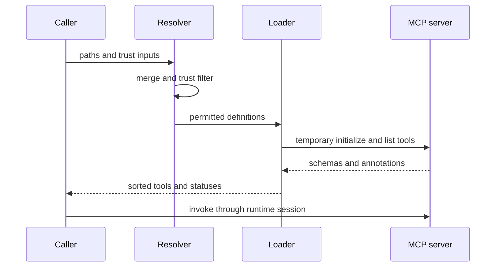
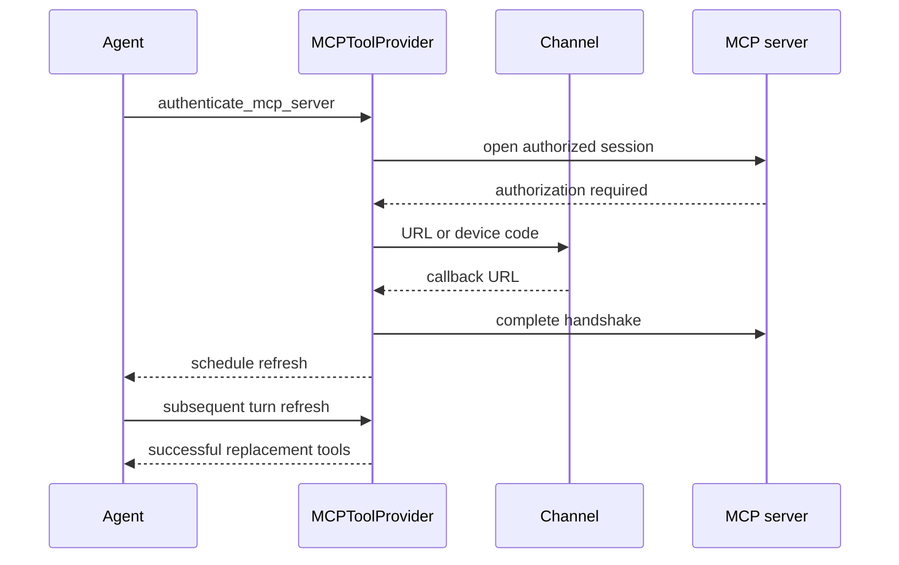

# MCP Integration and Credential Lifecycle

Model Context Protocol (MCP) contributes tools from local processes and remote
services. dcode and Talon accept comparable MCP documents, but are separate
integrations: dcode composes layered sources with project trust and plugins,
whereas Talon loads one operator-selected file and offers a deliberately narrow
agent-facing management surface. Configuration approval, credential files, and
runtime sessions are not shared between them.

## Configuration contract

An MCP document contains an `mcpServers` object. A server may declare `type` or
`transport`; an omitted transport means `http` when `url` is present and `stdio`
otherwise. dcode accepts `stdio`, `http`, and `sse` and normalizes
`streamable_http` and `streamable-http` to `http`; Talon maps HTTP to its
`streamable_http` connection. Remote servers require a URL; stdio servers
require a command. `args`, `env`, and remote `headers` are supported.

Both implementations resolve `${VAR}` and `${VAR:-default}` in the command,
URL, arguments, environment, and headers, without mutating the raw definition.
The default applies when a variable is unset or empty. An unset required
variable, malformed braced expression, or wrong field type is an error rather
than a silently altered endpoint or secret. Talon consults `TalonConfig.env`
before the process environment; dcode uses its active configuration environment.

`auth: oauth` is a remote authentication choice. It cannot be combined with a
static `Authorization` header. `allowedTools` and `disabledTools` are mutually
exclusive non-empty lists of glob patterns; filtering recognizes both the
server-prefixed tool name and its original name.

## dcode: discovery is also a trust decision

`resolve_and_load_mcp_tools` is dcode's loading entrypoint. Unless `no_mcp=True`,
it combines usable user files, plugin-provided layers, and trust-filtered project
files, then applies an optional explicit config as the highest-precedence layer.
An explicit file's load and structural errors are fatal. The login resolver has
a different explicit-file behavior: it loads that file alone so `dcode mcp login`
has an unambiguous target.

Project MCP is a security boundary: a checked-in file can launch a process,
make a remote request, or interpolate a secret header. Project definitions are
therefore untrusted unless the current invocation sets `trust_project_mcp=True`,
or an individual server matches a user-scoped approval for both the project root
and server fingerprint. Explicit user denials still win. If the user trust policy
cannot be read, saved approvals and whole-project trust fail closed; explicitly
environment-enabled names can still remain available. dcode resolves precedence
before applying this gate, so rejecting a winning override cannot resurrect an
older approved definition.

Plugins form a separate, intentional extension boundary. Enabled plugins
contribute namespaced `plugin__<plugin-id>__<server-name>` definitions after
plugin runtime substitution. Installing the plugin counts as trust for bundled
servers, but user denies still apply and unreadable deny policy fails closed.
Malformed plugin MCP declarations become visible configuration errors.

### Login and stored credentials

Trust determines whether a definition may connect; OAuth determines how an
allowed remote connection authenticates. A token does not approve a project
configuration, and a trust decision does not authenticate an endpoint.

For an `auth: oauth` server with no token, dcode reports `unauthenticated`
before discovery. It also recognizes a remote 401 Bearer protected-resource
challenge and reports that server as unauthenticated with a `dcode mcp login
<server>` hint, even when the config did not opt into OAuth. A static
`Authorization` header takes precedence over a stored OAuth credential.

`dcode mcp login <server>` uses the UI-agnostic resolver, including project
trust filtering. Its typed results distinguish an explicit-file load failure, no
file, no usable config, unknown server, and invalid server definition; the CLI
maps only no-config to exit code 2 and the other resolution failures to exit code
1. On a remote HTTP or SSE target, `mcp_auth.login` resolves environment values,
uses provider-policy discovery/login, and opens a one-shot session to finish the
handshake. It rejects stdio, and a failed reauthorization does not discard a
previous stored credential.

Credentials are stored separately from configuration under dcode's selected
profile state directory in `mcp-tokens`. The filename combines the validated
server name with a hash of the resolved URL, separating same-named endpoints.
Private, atomic file writes and refresh serialization protect persisted rotating
tokens; do not log token values.

## dcode: discovery versus runtime calls

This shows dcode's throwaway discovery session followed by lazy runtime session use.

dcode preflights connections and discovers tools using bounded concurrency.
Setup, discovery, and conversion failure is isolated to that server; status order
stays in configuration order and tools are sorted by name. Configurations with
environment interpolation receive redacted failure detail to avoid exposing a
resolved secret.

Tools are wrapped with `{server_name}_{tool_name}` names and metadata recording
that they are MCP tools, their server, and their original name. Read-only use and
Auto-mode approval require coherent explicit annotations: `readOnlyHint` must be
literally true, `destructiveHint` must not be true, and every supplied hint must
be boolean. Missing or malformed hints do not grant read-only treatment.

`MCPSessionManager` owns runtime calls, not discovery. It lazily creates one
persistent initialized session per server and prevents incompatible connection
reconfiguration once sessions exist. A failed transport can invalidate a cached
session for later recreation. `cleanup()` prevents new sessions and concurrently
closes each cached entry with a five-second bound; ordinary teardown failures do
not block other cleanup, while cancellation propagates. The server graph owns
its process-wide manager at shutdown; catalog and metadata callers clean up their
temporary manager in `finally`.

## Talon: isolated loading and tool normalization

Talon selects exactly one file: `DEEPAGENTS_TALON_MCP_CONFIG` from `TalonConfig`
or the process environment, otherwise `~/.deepagents/.mcp.json`. A missing file
means no MCP tools. It validates the document before connecting, loads each
server through `MultiServerMCPClient` with a 30-second timeout, keeps healthy
servers when one fails, and returns tools sorted by name. A failed OAuth load is
reported as `unauthenticated`; other per-server operational failures are `error`.
Talon rejects dangerous stdio environment variables including `LD_PRELOAD`,
`PYTHONPATH`, and `BASH_ENV`.

Talon uses interceptors to bind authorization to the exact LangGraph tool-call
ID and to normalize arguments: optional string-like arguments supplied as `""`
are omitted, but required values and explicitly non-string fields are retained.
Its OAuth credentials are distinct from dcode's, stored below
`~/.deepagents/mcp-tokens` with a server-name/URL-hash filename, a `0700`
directory, and atomic `0600` token files.

`MCPToolProvider` adds Talon management capabilities alongside loaded MCP tools:

- `get_mcp_server_status` reports only server name, status, and whether it can
authenticate; it intentionally omits error detail.
- `authenticate_mcp_server` is present only when configured OAuth servers exist,
accepts only those names, and reports usable existing credentials without a new
flow unless `reauthenticate=True`.
- `reload_mcp_configuration`, `get_mcp_configuration`, and
`update_mcp_server` schedule capability changes rather than mutating the current
turn's tool set.

## Talon OAuth and reload lifecycle

This shows that successful OAuth schedules a reload and new MCP schemas activate on a subsequent turn.

Browser URLs, callback requests, and device codes travel through the current
Talon authorization channel rather than model-visible tool output. A missing
interactive channel fails authorization. Callback parsing requires the configured
localhost callback endpoint and both `code` and `state`; OAuth metadata and
endpoint requests are constrained to safe public HTTPS, reject redirects, and
validate issuer/endpoint relationships.

Refresh requests increment a revision counter. `MCPToolProvider` serializes
reloads with a lock, snapshots the requested revision, and only reloads when it
is newer than the applied revision unless forced. A request arriving while a load
runs remains newer and therefore receives a later reload. Cancellation leaves
the revision retryable; a normal failed reload marks that revision applied until
a new request is made. Reload and configuration tools explicitly describe their
availability as `after_successful_reload`: running work retains its original
capabilities, and `get_agent_tools` can verify the later activation.

## Talon agent-facing configuration is narrow and safe

`MCPConfigStore` is bound to the operator-selected configuration path outside
the agent workspace; agents must use its tools rather than filesystem tools.
`get_mcp_configuration` returns an HMAC-derived, process-local revision and a
redacted view. Stored strings are redacted except recognized transport/auth enum
values and exact `${ENV_VAR}` references; references are not expanded. This keeps
literal URLs, commands, headers, arguments, and secrets out of model-facing
reads.

`update_mcp_server` adds, replaces, or removes one complete server definition.
It requires the expected revision, validates the narrow supported schema without
resolving environment variables or contacting a server, and can retain a prior
literal by placing `<redacted>` in the same field. It takes a POSIX lock, rejects
symlink and non-regular reads, atomically replaces the file, and schedules a
refresh only after a successful write. A stale revision returns a conflict, and
validation, I/O, and malformed-file errors return generic messages that do not
leak stored strings. Configuration writes are approval-sensitive in the Talon
runtime unless a valid auto-approve setting applies to a channel trigger; cron
triggers are not approved this way.

Even with these protections, approving a configuration update is security
sensitive: it can authorize a command launch or credentials sent to a remote URL.
Use environment references for credentials rather than supplying literal secrets.

## Focused verification

The dcode tests cover OAuth/header exclusion, login behavior, project policy and
fingerprint gating, plugin composition, per-server failure isolation, annotations,
and persistent session cleanup/reconfiguration. Talon tests cover its standard
path, timeout/failure status isolation, OAuth-channel binding and callback
validation, optional-empty argument normalization, refresh races and cancellation,
redacted reads, revision conflicts, symlink protection, atomic-write failure, and
concurrent configuration updates.

## Related pages

- [Configuration layering](/openwiki/concepts/config-layering.md)
- [Permissions and human approval](/openwiki/concepts/permissions-hitl.md)
- [Talon runtime](/openwiki/integrations/talon.md)
- [Security operations](/openwiki/operations/security.md)
- [Run a dcode session](/openwiki/workflows/run-dcode-session.md)
