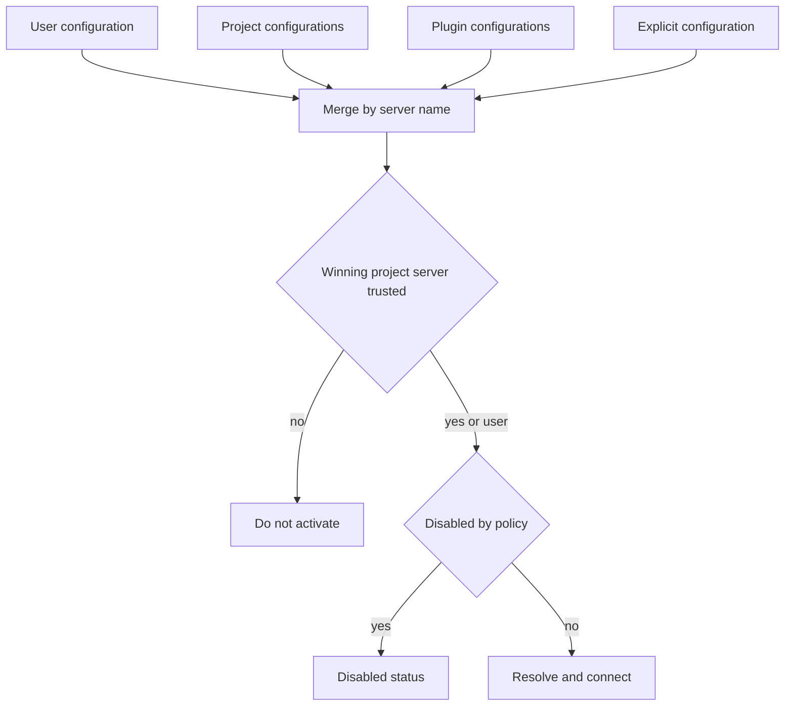
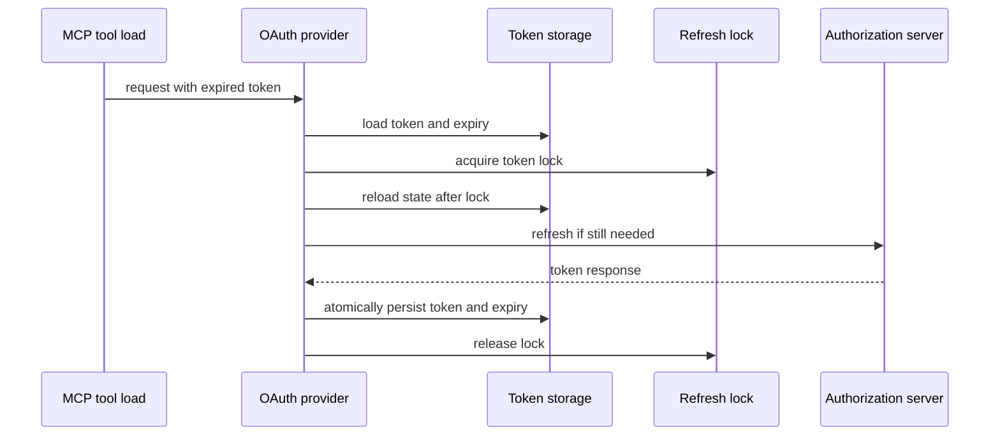

# MCP Servers, Trust, OAuth, and Tool Execution

MCP configuration is executable integration input: a stdio entry can start a local command and a remote entry can make requests or interpolate values into headers. dcode therefore keeps **discovery provenance and trust**, **disabled-server policy**, **connection lifecycle**, **OAuth login**, and **per-call execution failures** as separate concerns. An explicit configuration is an operator-selected layer, not a way for a repository file to self-authorize.

## Discovery, precedence, and trust

`resolve_and_load_mcp_tools()` is the runtime entry point. Unless `no_mcp` is set, it searches the selected profile's user `.mcp.json`, then `<project-root>/.deepagents/.mcp.json`, then `<project-root>/.mcp.json`, in ascending precedence. Definitions merge by server name, so later layers win; plugin layers and an explicit config can add later layers, with the explicit config highest. Its load errors are fatal, whereas auto-discovered bad files are reported as server-status errors while healthy servers continue.

The winning definition retains `USER` or `PROJECT` provenance. Project trust is evaluated *after* precedence: whole-project trust or a matching, definition-bound persisted approval can enable a project server, but an explicit denial wins. Remote fixed-URL approvals may use the Git common directory and cover linked worktrees; local commands and environment-dependent remote definitions remain exact-worktree scoped. An unreadable trust policy fails closed for whole-project trust.

```mermaid
flowchart TD
    User["User configuration"] --> Merge["Merge by server name"]
    Project["Project configurations"] --> Merge
    Plugin["Plugin configurations"] --> Merge
    Explicit["Explicit configuration"] --> Merge
    Merge --> Trust{"Winning project server trusted"}
    Trust -->|"no"| Skip["Do not activate"]
    Trust -->|"yes or user"| Disabled{"Disabled by policy"}
    Disabled -->|"yes"| Status["Disabled status"]
    Disabled -->|"no"| Activate["Resolve and connect"]
```
This flow shows that precedence selects the definition before project trust and disabled-server policy decide activation.

The separate `[mcp].disabled_servers` store persists names in user configuration. A name disables every same-named definition and is filtered before connection, though metadata makes it visible in the UI. User and managed denies are combined; an unreadable managed deny policy disables all servers rather than allowing an uncertain configuration.

## Activation, connection, and status

`resolve_mcp_server_env` deep-copies one server definition and expands only braced `${VAR}` and `${VAR:-default}` references in `command`, `url`, `args`, `env`, and `headers`. Resolution is intentionally per-server at activation: malformed references or missing required values fail that server rather than invalidating siblings. dcode then validates the server shape, performs stdio/remote preflight, builds a FastMCP transport, connects and lists tools. Setup, connection, schema adaptation, and tool construction are isolated and concurrency-bounded per server. Failure details are redacted when the original configuration contained interpolation, preventing resolved secret values from being surfaced.

Connected backends are mounted behind a FastMCP router. dcode adapts their tools to LangChain with provider-safe names and records the original server and tool identity in metadata. `MCPSessionManager` owns retained router/backend loads: it does not close an older adopted load just because a reload succeeds, preserving in-flight calls; cleanup is bounded and best-effort. `MCPServerInfo` is the loader-to-UI contract: only `ok` carries tools without an error, while unavailable states represent error, unauthenticated, disabled, or reconnect-pending servers for the tool catalog and `/mcp` viewer.

## Tool-call boundary: arguments, timeout, cancellation, and retry

Tool adaptation applies `normalize_mcp_arguments` directly to the adapted coroutine, and agent middleware applies it again at the generic tool-call boundary. For an optional string-like parameter, an empty string is removed so the MCP server sees omission; required fields, `None`, and explicitly non-string typed fields remain unchanged. This protects servers that reject a model-supplied `""` identifier while leaving actual required-field and type validation to the server.

Every marked MCP tool call receives `MCPToolMiddleware`; non-MCP tools pass through. The middleware obtains `mcp.tool_timeout` through the normal configuration resolver. The default is 120 seconds and accepted finite float values are bounded to 1–900 seconds; invalid values fall through to a lower-precedence source or the default. The option is available as `[mcp].tool_timeout` and `DEEPAGENTS_CODE_MCP_TOOL_TIMEOUT`.

A timeout cancels the awaited local task and returns a failed `ToolMessage` naming the server, tool, and deadline. It deliberately warns that the operation may still be running at the server and that retrying may duplicate work—timeout is not proof that the remote side did nothing. `asyncio.CancelledError` is not converted to a tool error and propagates. Existing `ToolException` content is preserved. A nested `MCPReauthRequiredError` is converted to an actionable failed tool message that directs the user to login.

The backend proxy has a related but distinct connection-recovery policy. On a closed/disconnected transport it serializes forced invalidation of that backend but **does not replay** the operation, because it may have completed; it returns an error asking the user to verify the outcome before retrying. If disconnect cleanup reveals a reauthentication failure, that actionable login error is returned instead.

The middleware is attached both to the primary agent stack and each delegated subagent stack when MCP tools are present. In the primary stack it is ordered inside the server hooks wrapper, so timeout failures participate in `PostToolUseFailure`. Custom, general-purpose, and forked delegated agents therefore receive the same configured deadline and can recover rather than remaining stalled.

## OAuth lifecycle and login

`FileTokenStorage` isolates credentials by a path-safe server name and effective endpoint. It keeps token, client registration, OAuth metadata, and expiry in private atomically replaced files, and moves blocking storage work off the event loop. `_ExpiryAwareOAuthClientProvider` restores stored expiry/metadata and serializes refresh through a cross-process sidecar lock; after acquiring the lock it reloads state and avoids an unlocked refresh if locking fails.

```mermaid
sequenceDiagram
    participant Tool as MCP tool load
    participant Provider as OAuth provider
    participant Store as Token storage
    participant Lock as Refresh lock
    participant Auth as Authorization server
    Tool->>Provider: request with expired token
    Provider->>Store: load token and expiry
    Provider->>Lock: acquire token lock
    Provider->>Store: reload state after lock
    Provider->>Auth: refresh if still needed
    Auth-->>Provider: token response
    Provider->>Store: atomically persist token and expiry
    Provider->>Lock: release lock
```
This is the refresh critical section: the post-lock reload prevents reuse of a refresh token another process may have rotated.

Runtime loading is non-interactive. Missing OAuth credentials, failed refresh, and authentication challenges become an unauthenticated server result; the provider raises `MCPReauthRequiredError` rather than prompting in an agent execution path. The execution middleware converts that exception from a later tool call into the same actionable login guidance.

`dcode mcp login` resolves an explicit config alone or follows normal precedence and trust-gated discovery. Re-login hides existing tokens from the authorization flow instead of deleting them, preserving a prior credential if the new authorization is abandoned or fails. CLI and Textual presentation share the `OAuthInteraction` boundary for browser, callback/paste-back, and device-code steps. After successful Textual login, the server is marked for reconnect because the running agent retains the old tool construction.

## Operations and focused tests

Use `--no-mcp` to suppress all MCP loading, `--mcp-config PATH` to select an explicit configuration, and `--trust-project-mcp` only when project definitions should receive whole-project trust. Use `dcode mcp login <server>` or `/mcp login <server>` for authentication, then reconnect/restart to construct tools with the newly stored token. Keep a static `Authorization` header separate from OAuth configuration: it takes precedence over stored OAuth credentials.

Focused tests cover config precedence/trust and per-server load isolation; argument normalization for optional, required, unknown, and typed fields; configured timeout output, cancellation propagation, and reauthentication conversion; no-replay disconnect recovery; and timeout propagation through custom/general-purpose and forked delegated agents. They also verify that timeout reaches `PostToolUseFailure` and resuming a hook does not rerun the timed-out call.

## Related pages

- [Code agent architecture](/openwiki/architecture/code-agent.md)
- [Configuration layering](/openwiki/concepts/config-layering.md)
- [Talon integration](/openwiki/integrations/talon.md)
- [Security operations](/openwiki/operations/security.md)
