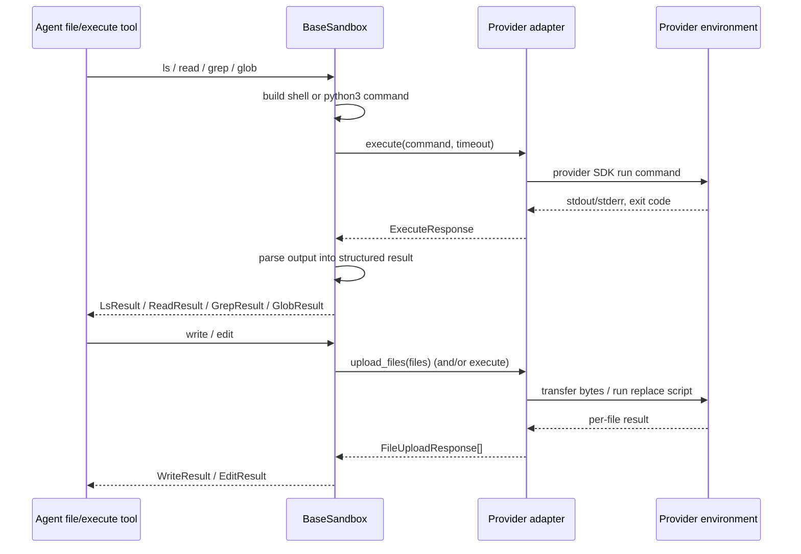

# Sandbox & Partner Integrations

A **sandbox backend** lets a deep agent run shell commands and manipulate files
inside an isolated execution environment (a container, VM, or remote host)
supplied by an external provider. The agent code never talks to the provider SDK
directly: it talks to a small, uniform interface, and one provider-specific
adapter translates that interface into provider API calls. This page explains
how that adapter connects to a provider, how every file operation and the
`execute`/shell tool route through a single primitive, why sandboxes are the
system's execution-isolation boundary, and what each partner package under
`libs/partners/` contributes.

See also: [Backends](../concepts/backends.md), the
[Architecture overview](../architecture/overview.md), and
[Security](../operations/security.md).

## The sandbox contract: `SandboxBackendProtocol`

`SandboxBackendProtocol` extends the generic `BackendProtocol` with shell
execution. Beyond the file operations every backend provides, it adds
`execute()`/`aexecute()` for running a full shell command string and an `id`
property identifying the sandbox instance. It is designed for backends running
in isolated environments — containers, VMs, or remote hosts.

An agent created with `create_deep_agent` gets an `execute` tool for running
shell commands, but that tool only works when the configured backend implements
`SandboxBackendProtocol`; for non-sandbox backends the `execute` tool returns an
error message instead.

`execute()` takes a full shell command string plus an optional `timeout` (in
seconds; `None` means the backend default) and returns an `ExecuteResponse`
carrying combined stdout/stderr `output`, an `exit_code`, and a `truncated`
flag. The default `aexecute()` simply runs `execute()` on a worker thread via
`asyncio.to_thread`, forwarding `timeout` only when the concrete backend's
`execute` actually accepts it (checked by `execute_accepts_timeout`).

## `BaseSandbox`: one primitive, all operations derived

`BaseSandbox` is the abstract base class that implements
`SandboxBackendProtocol` and does the heavy lifting so provider adapters stay
small. A concrete subclass implements only four things: `execute()`,
`upload_files()`, `download_files()`, and the `id` property. Every other
operation is *derived* from those primitives:

- `ls`, `grep`, `glob`, and `read` are built by generating a shell command (or a
  small `python3 -c` script) and running it through `execute()`, then parsing
  the output.
- `write` delegates content transfer to `upload_files()` (after a
  preflight that creates parent directories).
- `edit` uses a server-side `execute()` script for payloads under
  `_EDIT_INLINE_MAX_BYTES`, and for larger edits falls back to uploading the old
  and new strings as temp files and running a server-side replace script.

This is why a new provider integration is cheap: implement command execution and
byte transfer, and inherit a complete file toolset. `BaseSandbox` explicitly
does **not** reduce or partition the trust boundary of `execute()` — its helpers
are convenience wrappers that assume any caller who can use the backend already
has whatever shell-execution capability the backend exposes.

*How derived file operations and the `execute`/shell tool both funnel through the
provider adapter's `execute()`/`upload_files()` primitives.*

## Sandboxes as the execution-isolation boundary

The security value of a sandbox backend is that **arbitrary model-controlled
shell commands run inside an isolated provider environment, not on the host**.
The `execute` tool and every derived file operation issue commands that execute
in the container/VM the adapter is wired to; a compromise or a destructive
command is contained there.

This contrasts sharply with `LocalShellBackend`, which extends the filesystem
backend to run commands directly on the local machine with `subprocess.run(...,
shell=True)` and **no sandboxing** — the command string is passed straight to the
system shell and can touch any path on the host. Sandbox backends exist precisely
to avoid that: they move untrusted execution off the host and behind a provider's
isolation.

Because commands and globs are model-supplied and run over an untrusted tree,
`BaseSandbox` also enforces resource bounds inside the scripts it generates (see
below) so a hostile or accidental pattern cannot hang or exhaust the sandbox.
The delete operation is candid about its blast radius: `shlex.quote` only
neutralizes shell metacharacters, so whatever the sandbox shell can reach, delete
can remove — the isolation of that reach is the sandbox's job, not the tool's.
See [Security](../operations/security.md) for the surrounding threat model.

## Bounds and timeouts

Sandbox operations run on untrusted, potentially huge trees, so both the remote
scripts and the host-side wrappers are bounded.

Inside the generated `glob` script (`sandbox.py`), the walk over the sandbox
filesystem is capped by three constants: `MAX_EXPANSIONS = 1000` on brace
expansion, `MAX_MATCHES = 10000` on emitted matches, and `TIME_BUDGET = 5.0`
seconds on the walk itself. Exceeding any of them sets a `truncated` warning on
the result rather than failing, so a partial result is never silently mistaken
for an exhaustive one. `TIME_BUDGET` is the sandbox-side analogue of the
filesystem backend's glob timeout and is deliberately the same 5 seconds. The
script also prunes pseudo-filesystems (`proc`, `sys`, `dev`) when rooted at `/`
so a bare pattern does not burn the whole budget in `/proc`.

The remote script's own budget covers only the walk — not interpreter startup,
the round-trip, or transferring up to `MAX_MATCHES` records — so the async
wrappers add an *outer* bound defined in `protocol.py`. `aglob` is bounded by
`ASYNC_GLOB_TIMEOUT = 30` seconds and `agrep` by
`ASYNC_GREP_TIMEOUT = (2 * DEFAULT_GREP_TIMEOUT) + 5` seconds. On timeout each
returns a structured error telling the model to narrow its pattern or path,
rather than hanging the caller indefinitely on a wedged sandbox.

`read()` output is separately capped to roughly 500 KiB (`MAX_OUTPUT_BYTES`), and
binary previews to `MAX_BINARY_BYTES`, to avoid backend stdout/log transport
failures; over-cap reads append `TRUNCATION_MSG` guiding the model to paginate.

## Capture-at-source offload for large `execute` output

`BaseSandbox` exposes `execute_with_offload()` (and its async twin) so large
command output need not round-trip back through the agent process. When enabled,
the command's combined output is captured to a file at `capture_path` in the
sandbox; output at or below `max_inline_bytes` is returned inline, otherwise only
a head/tail preview returns and the caller surfaces a `read_file` pointer.
Captured output is hard-capped at `max_capture_bytes` without killing the
command, preserving the exit code.

This behavior is opt-in per backend via the `enable_capture_offload` class
attribute, which defaults to `False` because the capture wrapper relies on shell
and coreutils assumptions not guaranteed on every sandbox image. When it is
`False`, `execute_with_offload` runs the command unwrapped and returns the full
output (`offloaded=False`) so the middleware falls back to inline execution plus
generic eviction.

## Partner packages under `libs/partners/`

Each partner package is an independently versioned distribution that owns its own
environment, `pyproject.toml`, `Makefile`, and tests. Wiring a new partner into
the repository (CI, labeling, release automation, secret inventory, and — for
sandbox-backed partners — Harbor sandbox options and credential checks) is
described in the partner guidance doc.

The four remote-execution partners (`daytona`, `modal`, `runloop`, `vercel`) each
subclass `BaseSandbox`, so their code is essentially just `execute()`, byte
transfer, and `id` mapped onto the provider SDK; the fifth (`quickjs`) is a
different kind of sandbox entirely — an in-process JavaScript REPL, not a remote
shell.

### `daytona` — `langchain-daytona`

`DaytonaSandbox` wraps an existing `daytona.Sandbox`. Its `execute()` runs the
command asynchronously in a per-command Daytona *session*, polls the session's
command status until the exit code appears (delay controlled by
`sync_polling_interval`), then collects the session logs; a timeout returns exit
code `124`. `timeout=0` means "wait indefinitely" in Daytona.

### `modal` — `langchain-modal`

`ModalSandbox` wraps an existing `modal.Sandbox`. `execute()` runs the command via
`sandbox.exec("bash", "-c", command, timeout=...)`, waits, and combines stdout and
stderr; file transfer uses the Modal sandbox's `open()`/`read()`/`write()`. The
sandbox `id` is the Modal object id, and `timeout=0` means wait indefinitely.

### `runloop` — `langchain-runloop`

Runloop adds a lifecycle **provider** on top of the sandbox. `RunloopProvider`
(constructed with a Runloop API bearer token) exposes `get_or_create(...)` to
create or attach a Runloop devbox — optionally booting from a named *blueprint*
(create-if-missing, resolved in the order `RUNLOOP_SANDBOX_BLUEPRINT_ID` →
`snapshot` kwarg → `RUNLOOP_SANDBOX_BLUEPRINT_NAME` → empty devbox) — and
`delete(sandbox_id=...)` to shut one down. `get_or_create` returns a connected
`RunloopSandbox`, translates a missing `sandbox_id` into a `KeyError`, and maps
auth/connection failures to `RuntimeError`.

### `vercel` — `langchain-vercel-sandbox`

`VercelSandbox` wraps an existing `vercel.sandbox.Sandbox`. Its constructor
rejects a negative default `timeout` (`ValueError`), treats `timeout=0` as
"wait indefinitely", and the `id` is the Vercel `sandbox_id`.

### `quickjs` — `langchain-quickjs`

`langchain-quickjs` is not a remote shell backend. It is a `deepagents`
middleware (`CodeInterpreterMiddleware`) that gives an agent a persistent,
sandboxed **JavaScript REPL** tool backed by an embedded QuickJS engine. The
model writes one block of JavaScript that orchestrates work in-loop — variables
and functions persist across `eval` calls, `Promise.all` runs concurrent work,
configured subagents are dispatchable via `await task({...})`, and (opt-in) the
agent's own tools are callable as `await tools.<name>(...)` (programmatic tool
calling).

Its sandbox is capability-based isolation rather than OS isolation: the REPL runs
in a QuickJS context with **no ambient capabilities** — no filesystem, no
network, no `fetch`, no `require`, no `process`, and no wall-clock time — and
capabilities are only added explicitly via PTC. Execution is bounded by a
per-call wall-clock timeout (default 5 s), a runtime-wide memory limit (default
64 MiB, surfacing `OutOfMemory`), and a per-call PTC host-call budget (default
256). Each LangGraph `thread_id` gets its own QuickJS `Runtime`, so separate
conversations cannot see each other's globals.
