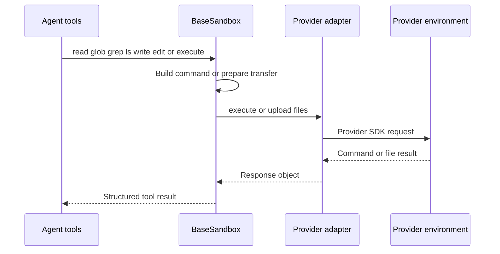

# Sandbox and Partner Integrations

A sandbox integration has two separate responsibilities. A **backend adapter** makes an existing execution environment satisfy the deepagents filesystem-and-shell contract. A dcode **provider** owns its lifecycle: create or attach, establish readiness, and delete a sandbox that dcode created. This boundary lets `BaseSandbox` provide common agent-facing file behavior while provider SDK code remains at the integration edge.

`SandboxBackendProtocol` is a shell-execution capability contract, not an isolation certification. It is intended for containers, VMs, and remote hosts, but `LocalShellBackend` implements it while executing directly on the host. Provider configuration, rather than the protocol, determines isolation, reachable files and networks, credentials, quotas, retention, and teardown. See [Backends](../concepts/backends.md), [Code agent architecture](../architecture/code-agent.md), and [Filesystem tools](../concepts/tools-filesystem.md).

## Backend contract and derived operations

The protocol extends `BackendProtocol` with an `id` and `execute()`/`aexecute()`. `execute(command, timeout=...)` takes a full shell command and produces an `ExecuteResponse` with combined output, exit code, and truncation status. The default async method dispatches the synchronous implementation through `asyncio.to_thread`; when a timeout is supplied, it forwards it only if the concrete `execute` signature accepts it. Callers should use non-negative integer timeouts portably; `None` selects a backend default and some adapters use `0` to wait indefinitely.

The agent's `execute` tool works only with a `SandboxBackendProtocol`; another backend yields an error. A normal adapter subclasses `BaseSandbox` and supplies `execute()`, `upload_files()`, `download_files()`, and `id`. Batch transfer implementations must preserve partial success by returning an error response for each failed file instead of failing the entire batch.

*File operations funnel through the adapter's command-execution and byte-transfer primitives.*

`ls`, `read`, `grep`, and `glob` create a shell command or `python3` program, execute it remotely, then parse output. `write` preflights parent-directory creation and uploads UTF-8 bytes. `edit` executes a server-side replacement script for small payloads; for larger payloads it uploads randomized temporary old/new files and replaces server-side, without downloading the source. An empty old string is rejected; without `replace_all`, multiple matches are an error. The separate preflight and write calls necessarily leave a TOCTOU window.

These helpers do not restrict shell authority. Delete shell-quotes a path only to make it one `rm -rf` argument, not to confine it: whatever the sandbox shell can reach, delete can remove.

### Bounded results and failure behavior

- Text `read()` pages output in the sandbox and caps text at about 500 KiB; binary previews have a separate cap. Truncation includes guidance to paginate.
- The generated glob program limits brace expansion to 1,000 candidates, matches to 10,000, and walking time to 5 seconds. A limit produces a truncated warning, not an apparently exhaustive result. Because that budget excludes startup, transport, and transfer, `aglob` has a 30-second outer timeout and `agrep` uses `(2 * DEFAULT_GREP_TIMEOUT) + 5`; each returns a structured narrowing error when it expires.
- `execute_with_offload()` is opt-in (`enable_capture_offload=False` by default) because its wrapper assumes shell/coreutils support. When enabled, it captures oversized combined output in the environment, returns a head/tail preview, and caps capture without killing the command so its exit status survives. When disabled it returns ordinary unwrapped output.

## dcode provider selection and ownership

`SandboxProvider` standardizes `get_or_create(sandbox_id=..., **kwargs)` and `delete(sandbox_id=..., **kwargs)`; async variants run them in worker threads. Its metadata describes working directory, an installation hint, and support for reattachment and snapshot names, allowing discovery before providers that need credentials are instantiated.

`SandboxRegistry` combines curated built-ins, third-party `deepagents_code.sandbox_providers` entry points, and config-declared providers. Collision precedence is **config > entry point > built-in**. Config can set a `class_path`, working directory, installation package, capability flags, and `params` passed to `get_or_create()`. Since a `class_path` imports arbitrary Python under the user account, config is a trusted local-administration boundary.

`create_sandbox()` resolves provider metadata before provisioning. It rejects an unsupported snapshot and forbids combining a snapshot with an attached ID. Registry `params` are merged with call-time parameters, then a provider creates or attaches the backend. An optional setup file runs only after that step is ready: `${VAR}` values are substituted from the active workspace environment and the result runs as `bash -c`. A nonzero setup exit aborts startup.

```mermaid
flowchart TD
    Start["dcode sandbox provider"] --> Resolve["Resolve provider and validate capabilities"]
    Resolve --> Provision["Provider get or create"]
    Provision --> Setup{"Setup file supplied"}
    Setup -->|yes| RunSetup["Expand workspace variables and run bash -c"]
    Setup -->|no| Use["Use backend in agent"]
    RunSetup --> Use
    Use --> Exit{"Context exits"}
    Exit -->|fresh sandbox| Delete["Provider delete by backend id"]
    Exit -->|attached sandbox| Retain["Leave sandbox running"]
```

*Fresh and attached environments have different cleanup ownership; setup follows successful provisioning.*

Only a newly created sandbox (`sandbox_id is None`) is deleted when the context exits. Cleanup failure is reported and never hides the original error; attached environments are retained. A dcode server keeps this context open for the process lifetime and caches runtime construction, so creation and cleanup registration occur once. Its first workspace claims the process-wide sandbox and another workspace is rejected rather than sharing it.

### Built-in provider lifecycle differences

The built-in registry includes `agentcore`, `daytona`, `langsmith`, `modal`, `runloop`, and `vercel`. `daytona` cannot attach by ID; dcode creates it, probes `echo ready`, and deletes it if startup expires. `modal` can create or attach; a fresh sandbox uses `/workspace`, is probed for readiness, and is terminated on failed startup. `vercel` creates a `python3.13` sandbox with a 30-minute lifetime or gets an existing ID, then waits for `running`; terminal state or timeout fails startup, and dcode stops a failed fresh Vercel sandbox.

## Separately released partner packages

Each `libs/partners/` package is independently versioned and owns its environment, `pyproject.toml`, `Makefile`, and tests. The Daytona, Modal, Runloop, and Vercel distributions declare a compatible `deepagents>=0.7.0,<0.8.0` dependency alongside their provider SDK; `langchain-quickjs` adds the embedded engine and LangChain/LangGraph dependencies. Adding a sandbox-backed partner also requires CI, release, labeling, credentials, and Harbor configuration beyond the adapter itself.

| Package | Boundary | Key behavior |
| --- | --- | --- |
| `langchain-daytona` | `DaytonaSandbox` | Command sessions and Daytona batch file APIs. |
| `langchain-modal` | `ModalSandbox` | `bash -c` execution and Modal file handles. |
| `langchain-runloop` | `RunloopSandbox` and `RunloopProvider` | Devbox execution/file APIs and blueprint-aware lifecycle. |
| `langchain-vercel-sandbox` | `VercelSandbox` | Detached commands, polling, log retrieval, and Vercel file APIs. |
| `langchain-quickjs` | `CodeInterpreterMiddleware` | In-process JavaScript REPL with explicit capability bridges, not a remote shell backend. |

### Daytona, Modal, Runloop, and Vercel adapters

`DaytonaSandbox.execute()` creates a unique session for each command, starts it asynchronously, polls its status until an exit code appears, reads session logs, and deletes the session in `finally`. `sync_polling_interval` may be fixed or computed from elapsed time. A timeout returns exit code `124`; `0` waits indefinitely. Its transfer API requires absolute paths and maps batched Daytona transfers to deepagents responses.

`ModalSandbox.execute()` invokes `sandbox.exec("bash", "-c", command, timeout=...)`, waits, and combines stdout/stderr. Its ID is Modal's `object_id`; it uses binary `open()` handles for transfers and maps expected filesystem failures to response errors. It also interprets `0` as no timeout.

`RunloopSandbox` uses `devbox.cmd.exec` and Devbox file upload/download APIs. `RunloopProvider` can attach by ID, create an empty devbox, or boot from a blueprint. For new devboxes its resolution order is `RUNLOOP_SANDBOX_BLUEPRINT_ID`, `snapshot`, `RUNLOOP_SANDBOX_BLUEPRINT_NAME`, then an empty devbox. Named blueprints are reused only when build-complete; a missing name is built using `blueprint_dockerfile` or `FROM python:3\n`. Missing attached IDs become `KeyError`, while credential, connectivity, and creation errors are contextual `RuntimeError`s. `delete()` shuts down the devbox.

`VercelSandbox` wraps an existing Vercel object, exposes `sandbox_id`, rejects a negative default timeout, and treats `0` as an indefinite wait. It runs `bash -lc` detached, waits locally, and returns exit code `124` after a timeout while attempting a best-effort kill. If log retrieval fails after completion, it preserves the exit code and marks output unavailable. Output is capped at 100,000 bytes. File methods require absolute paths and preserve unrecognized SDK errors instead of calling them missing files.

## QuickJS: capability isolation, not a remote sandbox

`langchain-quickjs` provides `CodeInterpreterMiddleware`, which installs a persistent JavaScript `eval` tool backed by embedded QuickJS. Default `mode="thread"` preserves globals across calls and turns for one LangGraph `thread_id`; `turn` limits persistence to a turn and `call` starts fresh each evaluation. Each thread gets its own worker/runtime/context slot, so globals cannot cross conversations. Thread-mode snapshots may be checkpointed; with `snapshot_signing_key`, missing or invalid HMAC signatures are discarded before restore.

The guest has no ambient filesystem, network, `fetch`, `require`, `process`, or real-clock capability. Authority is added only via configured `tools.<name>` programmatic tool calling (PTC) or the optional `task(...)` subagent bridge. Thus it is capability isolation, not OS/process isolation: a bridged tool receives its actual authority. Both PTC and the subagent bridge bypass normal `ToolNode` routing, so `interrupt_on`/HITL is not automatically enforced per bridged call. Gate `eval`, give subagents approval middleware, or disable bridges when per-operation approval is required.

The default shared runtime memory limit is 64 MiB, VM execution timeout is 5 seconds, and PTC budget is 256 host calls per evaluation. Host-call waiting is outside the VM timeout, so it does not bound total wall-clock duration. `max_ptc_calls=None` allows unbounded host-call loops and is unsuitable for untrusted prompts. Returned result and console blocks are separately capped at 4,000 characters.

## Test boundaries

The remote partner integration suites subclass `SandboxIntegrationTests`, provision a real provider sandbox/devbox, yield its adapter, and tear it down in the fixture. Daytona creates/deletes a Daytona sandbox; Modal explicitly requires `MODAL_TOKEN_ID` and `MODAL_TOKEN_SECRET`; Runloop requires `RUNLOOP_API_KEY`; Vercel creates/stops a 30-minute `python3.13` sandbox. These tests exercise the shared backend contract against provider behavior rather than mocking it.

Keep provider lifecycle behavior separately unit-tested: Runloop tests cover blueprint precedence, reuse/build readiness, attachment/not-found translation, and error messages; Vercel tests cover timeout/kill/log and file-error mapping. QuickJS tests focus independently on thread affinity, persistence and snapshots, PTC limits, and asynchronous end-to-end behavior. Those tests do not certify remote-provider isolation.
