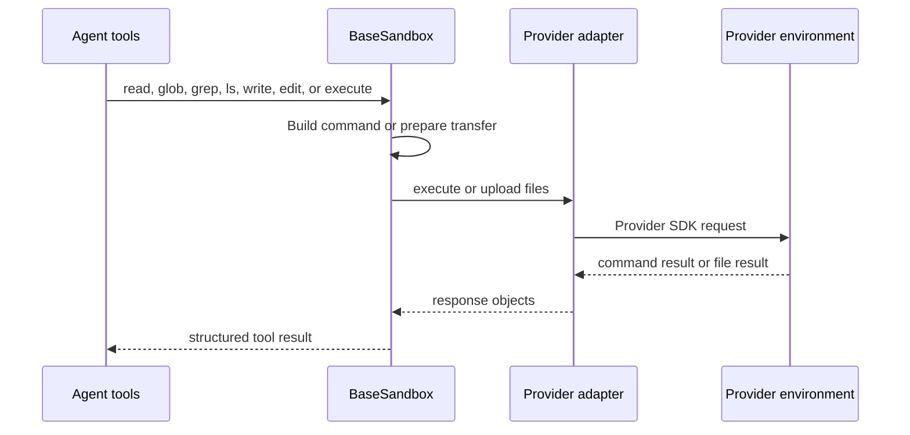
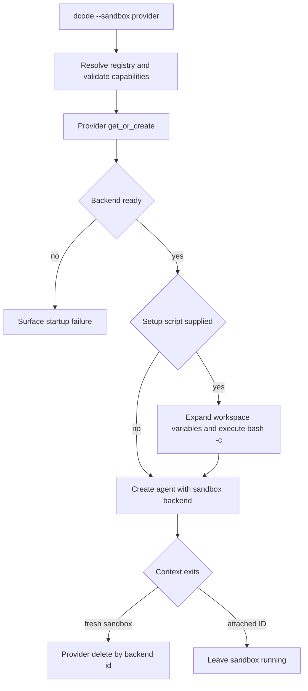

# Sandbox & Partner Integrations

A sandbox integration has two deliberately separate responsibilities. A **backend** makes an already-existing execution environment look like the deepagents filesystem-and-shell interface. A dcode **provider** owns the environment lifecycle: create or attach, wait until ready, and delete it when appropriate. This separation keeps provider SDK code at the boundary while `BaseSandbox` supplies the common agent-facing file semantics.

A `SandboxBackendProtocol` is an execution capability interface, not an isolation certification. It is intended for containers, VMs, and remote hosts, but `LocalShellBackend` also implements it and executes commands unrestricted on the host. Isolation, reachable network/files, identity, resource quotas, retention, and teardown guarantees are properties of the selected provider environment and its configuration—not of the protocol or of Talon/dcode local-shell operation. See [Backends](../concepts/backends.md), [Code agent architecture](../architecture/code-agent.md), [Filesystem tools](../concepts/tools-filesystem.md), and [Security](../operations/security.md).

## Backend contract and derived operations

`SandboxBackendProtocol` extends `BackendProtocol` with an `id` and synchronous/asynchronous `execute()` methods. `execute(command, timeout=...)` accepts a complete shell command and returns an `ExecuteResponse` containing combined output, an exit code, and whether output was truncated. For direct async use, the default `aexecute()` sends the synchronous implementation to `asyncio.to_thread`; it only forwards a supplied timeout when signature inspection says that implementation supports it. Portable callers should use non-negative integer timeouts: `None` delegates to the backend default and a provider may interpret `0` as no timeout.

The agent's `execute` tool is usable only when its configured backend implements this protocol; otherwise it returns an error. A provider adapter normally subclasses `BaseSandbox`, implements `execute()`, `upload_files()`, `download_files()`, and `id`, and inherits the other filesystem operations. Upload/download implementations must report individual file failures in their response objects rather than abandon a whole batch by raising.

*Agent filesystem operations funnel through the adapter's command-execution and byte-transfer primitives.*

`ls`, `read`, `grep`, and `glob` generate a shell command or `python3` script, execute it in the environment, and parse the result. `write` first creates parent directories, then uploads UTF-8 bytes. `edit` runs a server-side replacement script for small old/new payloads; for larger payloads it uploads randomly named temporary old/new files and performs the replacement without downloading the source file. The preflight/write split has an inherent TOCTOU window. The edit operation rejects an empty old string; without `replace_all`, multiple matches are an error.

These conveniences do not constrain shell authority. In particular, delete uses shell quoting only to make the target one literal `rm -rf` argument; it cannot confine traversal or deletion beyond what the sandbox shell can already reach. Treat permission rules and the provider's environment boundary—not quoting or `BaseSandbox`—as the control point.

### Output and traversal failure semantics

`BaseSandbox` is designed to return bounded, interpretable results rather than silently presenting an incomplete search as complete:

- Text reads are paginated server-side and capped at roughly 500 KiB; binary previews have a separate cap. A cap appends a pagination-oriented truncation message.
- The generated glob program limits brace expansion to 1,000 candidates, matches to 10,000, and walking time to 5 seconds. It emits a warning/truncated result when a limit is reached, and separately reports unreadable-tree walk errors. At `/`, it prunes `proc`, `sys`, and `dev`; symlink targets escaping the search root and non-files are omitted.
- The internal glob time budget excludes interpreter startup, transport, and output transfer. Therefore async `aglob` applies a 30-second outer timeout; `agrep` applies `(2 * DEFAULT_GREP_TIMEOUT) + 5` seconds. Both return a structured “narrow the query” error instead of waiting forever.
- `execute_with_offload()` is an opt-in optimization for middleware. Backends leave `enable_capture_offload` false unless their shell/coreutils image supports its wrapper. When enabled, large combined output is captured in the environment, with a head/tail preview and a file pointer; capture is capped without killing the command so its exit status survives. When disabled, the ordinary unwrapped output is returned and generic eviction remains responsible for handling it.

## dcode: provider discovery, startup, and ownership

The dcode `SandboxProvider` abstraction exposes `get_or_create(sandbox_id=..., **kwargs)` and `delete(sandbox_id=..., **kwargs)`; its async wrappers use worker threads. Registry metadata supplies a provider working directory, installation hint, and support flags for reattachment and snapshot names without having to instantiate providers that may require credentials.

The `SandboxRegistry` merges curated built-ins, packages advertising the `deepagents_code.sandbox_providers` entry-point group, and `[sandboxes.providers]` configuration. Name precedence is **config > entry point > built-in**. A config provider provides `class_path`, working directory, optional installation package, capability flags, and `params` forwarded to `get_or_create()`. `class_path` imports arbitrary Python with the user's privileges, so configuration is a trusted local-administration boundary. A configured default only resolves a bare `--sandbox`; it never turns a launch that omitted `--sandbox` into a sandboxed launch.

The CLI accepts `--sandbox TYPE`, `--sandbox-id`, `--sandbox-snapshot-name`, and `--sandbox-setup`. It validates the provider and its metadata before launch: snapshot names are only accepted where supported, and a provider that cannot reattach rejects `--sandbox-id`. A bare `--sandbox` resolves `[sandboxes].default`; malformed or unreadable user configuration is surfaced while unrelated startup can continue.

`create_sandbox()` validates that snapshot and existing ID are not combined, merges configuration parameters with call parameters, and calls the provider. It runs an optional setup file only after the backend is ready: `${VAR}` is expanded from the workspace environment and the resulting content runs as `bash -c` in the sandbox. A nonzero setup exit aborts startup. A fresh environment (`sandbox_id is None`) is deleted on context exit; an attached environment is deliberately retained. Cleanup errors are reported but do not mask the original failure.

*The dcode lifecycle differentiates fresh ownership from attachment and runs setup after readiness.*

In the LangGraph server, sandbox creation is held open for the server-process lifetime and the cached runtime ensures it happens once rather than once per request. The first workspace claims a process-wide sandbox; another workspace is rejected instead of sharing it. Startup errors are rendered as machine-readable failures and exit the graph process. The agent receives the remote backend directly for file operations and `execute`; dcode does not add its local shell middleware in sandbox mode, and its QuickJS interpreter integration is unavailable with a remote sandbox.

### Built-in lifecycle differences

dcode currently registers `agentcore`, `daytona`, `langsmith`, `modal`, `runloop`, and `vercel`; the four partner packages described below are optional extras except bundled LangSmith. Daytona cannot attach by ID: dcode creates it and readiness-polls `echo ready`, deleting it on a startup timeout. Modal can create or attach; fresh sandboxes use `/workspace`, are polled for an `echo ready` command, and are terminated on failed startup. Vercel creates a `python3.13` sandbox with a 30-minute lifetime or gets an ID, then waits for `running`; a terminal status or timeout fails, and only a newly-created failed startup is stopped. These operational differences matter when choosing whether a sandbox can survive a dcode restart.

## Partner package boundaries

Each directory under `libs/partners/` is an independently versioned distribution with its own environment, `pyproject.toml`, Makefile, and tests. Adding a partner requires repository-level CI, labels, release, credential, and Harbor sandbox-option work as well as the package adapter. The remote packages all depend on the compatible `deepagents` range and keep their provider SDK dependency local to the package.

| Package | Boundary | Execution and lifecycle notes |
| --- | --- | --- |
| `langchain-daytona` | `DaytonaSandbox` wraps a Daytona sandbox | Per-command session execution, polling, and SDK filesystem batch transfer. dcode creates but cannot attach by ID. |
| `langchain-modal` | `ModalSandbox` wraps a Modal sandbox | Runs `bash -c`; uses Modal file handles. dcode may create or attach. |
| `langchain-runloop` | `RunloopSandbox` plus `RunloopProvider` | Devbox command/file APIs and a blueprint-aware lifecycle API. |
| `langchain-vercel-sandbox` | `VercelSandbox` wraps Vercel Sandbox | Detached command followed by polling/log retrieval; dcode waits for provider readiness. |
| `langchain-quickjs` | `CodeInterpreterMiddleware` | In-process JavaScript REPL and explicit capability bridges, not a `BaseSandbox` remote-shell backend. |

### Daytona and Modal

`DaytonaSandbox.execute()` creates a unique session for each command, starts the command asynchronously, polls until it has an exit code, obtains session logs, and deletes the session in `finally`. Its polling delay can be a fixed `sync_polling_interval` or an elapsed-time strategy. Timeout returns exit code `124`; `0` waits indefinitely. Its file methods require absolute paths and map batch upload/download requests to deepagents responses.

`ModalSandbox.execute()` calls `sandbox.exec("bash", "-c", command, timeout=...)`, waits for completion, and joins stdout and stderr. Its ID is Modal's `object_id`; its file methods use `open()` in binary mode and convert expected filesystem errors to response errors. It too treats `0` as an infinite wait.

### Runloop

`RunloopSandbox` executes through `devbox.cmd.exec`, combines stdout/stderr, and transfers bytes through the Devbox file API. Its provider is the significant extension: it can attach to an existing devbox, create an empty one, or boot from a blueprint. For a new devbox, resolution order is `RUNLOOP_SANDBOX_BLUEPRINT_ID`, then the `snapshot` argument, then `RUNLOOP_SANDBOX_BLUEPRINT_NAME`, then an empty devbox. A named blueprint is looked up and must already be build-complete; if absent it is built from `blueprint_dockerfile` or `FROM python:3\n`.

The provider translates a missing attached devbox to `KeyError`; dcode maps that case to `SandboxNotFoundError` when an ID was requested. Authentication/permission, connectivity/timeout, and other creation failures become actionable `RuntimeError`s. `delete()` shuts the devbox down. The `timeout` argument is retained for cross-provider API parity but is not used by the Runloop provider's startup path.

### Vercel

`VercelSandbox` rejects a negative default timeout and exposes `sandbox_id`. It runs `bash -lc` as a detached command and waits locally; `0` waits indefinitely. On timeout it attempts to kill the command and returns exit code `124`, but a failed kill may leave the provider command running. Log fetch happens after completion; a log transport failure preserves the exit code and returns an explicit output-unavailable marker. Output is capped at 100,000 bytes with `truncated=True`. File reads/writes require absolute paths, and unrecognized SDK errors are surfaced rather than mislabeled as missing files.

### QuickJS is capability isolation, not a remote sandbox

`langchain-quickjs` supplies `CodeInterpreterMiddleware`, which adds a persistent `eval` JavaScript tool backed by embedded QuickJS. By default its state persists across calls and turns for a LangGraph thread; modes can instead retain it only for a turn or create a fresh REPL per call. Each thread has its own worker/runtime/context slot, preventing globals from leaking between conversations. Thread-mode snapshots can be persisted through the graph state; when a signing key is configured, snapshots are HMAC-signed before checkpointing and invalid/missing signatures are discarded on restore.

The guest has no ambient filesystem, network, `fetch`, `require`, `process`, or real clock. Capabilities enter only through configured programmatic tool calling (`tools.<name>`) or the optional `task(...)` subagent bridge. This is not OS/process isolation: a bridged tool receives its own real authority. Moreover, programmatic tool and subagent calls bypass the normal `ToolNode` route, so per-call `interrupt_on`/HITL does not automatically apply; gate the enclosing `eval`, give subagents their own approval middleware, or do not enable those bridges.

The default 64 MiB QuickJS heap is shared across contexts under a runtime. VM evaluation has a default 5-second per-call timeout, but time spent awaiting Python host calls is outside that budget and can make elapsed wall-clock time longer. A per-evaluation programmatic-tool-call budget defaults to 256; disabling it with `max_ptc_calls=None` permits unbounded host-call loops and is unsafe for untrusted prompts. Results and captured console output are each truncated to 4,000 characters before being returned to the model.

## Verification focus

When changing the contract, exercise the core sandbox backend tests for command-derived file operations, parsing, truncation, glob bounds, temporary-file edit cleanup, and async timeout behavior. Provider tests should mock lifecycle and SDK boundaries: readiness/termination and ID attachment in dcode, Runloop blueprint resolution and error translation, and Vercel timeout/kill/log and file-error mapping. QuickJS tests focus separately on thread affinity, persistence/snapshots, PTC limits, and end-to-end async behavior; they cannot validate remote-provider isolation.
