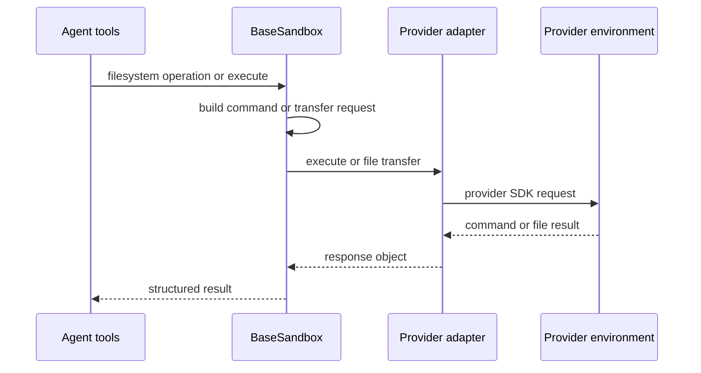
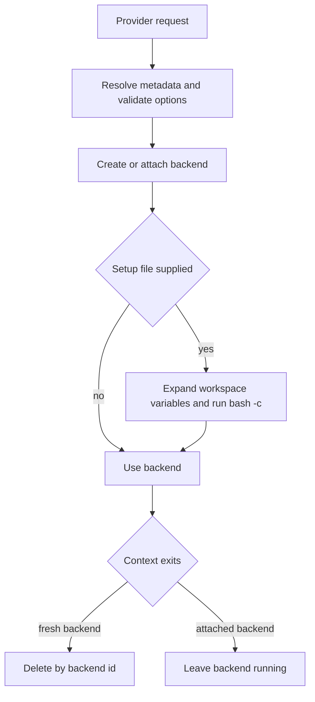

# Sandbox and Partner Integrations

A sandbox integration has two distinct roles. A **backend adapter** exposes a provider environment through the deepagents filesystem-and-shell contract. A dcode **provider** owns lifecycle: it creates or attaches an environment, establishes readiness, and deletes environments that dcode created. This separation keeps provider SDK concerns at the edge while `BaseSandbox` supplies common agent-facing filesystem behavior.

`SandboxBackendProtocol` is a shell-execution capability contract, not an isolation certification. Although designed for containers, VMs, and remote hosts, `LocalShellBackend` implements it while executing directly on the host. Treat provider configuration—not the protocol—as the authority on isolation, accessible files and networks, credentials, quotas, retention, and teardown. See [Backends](../concepts/backends.md), [Runtime behavior](../architecture/runtime-behavior.md), [Filesystem tools](../concepts/tools-filesystem.md), and [Security](../operations/security.md).

## Backend contract and derived operations

The protocol extends `BackendProtocol` with an `id` and `execute()`/`aexecute()`. `execute(command, timeout=...)` takes a complete shell command and returns combined output, an exit code, and truncation status. The default async implementation runs the synchronous method in a worker thread; it forwards a supplied timeout only when the concrete `execute` method accepts that keyword. Use non-negative integer timeouts portably: `None` uses the backend default, and some adapters interpret `0` as no timeout.

The agent's `execute` tool works only when its configured backend implements `SandboxBackendProtocol`; otherwise it reports an error. A normal adapter subclasses `BaseSandbox` and implements four primitives: `execute()`, `upload_files()`, `download_files()`, and `id`. Transfer implementations are expected to return one response per file and preserve partial failure as response errors rather than aborting a whole batch.

*Agent filesystem operations funnel through adapter command-execution and byte-transfer primitives.*

`ls`, `read`, `grep`, and `glob` generate a shell command or a `python3` program, execute it in the environment, and parse its output. `write` first creates parent directories, then uploads UTF-8 bytes. `edit` uses a server-side replacement script for small payloads; for larger ones it uploads randomized temporary old/new files and replaces server-side, so it does not download the source. Empty search text is rejected; multiple matches require `replace_all=True`. The separate preflight and write calls leave an inherent TOCTOU window.

These helpers do not narrow shell authority. Delete uses shell quoting only to pass the target as one `rm -rf` argument; it does not confine traversal or reachable paths. A recursive delete can partially complete before reporting a nonzero exit.

### Bounded results and failure behavior

- `read()` performs text pagination in the environment and caps text output at about 500 KiB; binary previews have a separate cap. A cap appends pagination guidance.
- The generated glob program limits brace expansion to 1,000 candidates, results to 10,000 matches, and walking time to 5 seconds. A limit yields a truncated warning, not an apparently exhaustive result. Since that budget excludes interpreter startup and transport, `aglob` has a 30-second outer timeout and `agrep` uses `(2 * DEFAULT_GREP_TIMEOUT) + 5`; both return a structured narrowing error on expiry.
- `execute_with_offload()` is opt-in through `enable_capture_offload=False` by default because its wrapper requires shell/coreutils behavior that images may lack. When enabled, oversized combined output is captured in the environment and represented by a head/tail preview; capture is capped without killing the command, preserving its exit code. When disabled, execution is unwrapped and returns `offloaded=False`.

## dcode provider selection, setup, and ownership

`SandboxProvider` standardizes synchronous `get_or_create(sandbox_id=..., **kwargs)` and `delete(sandbox_id=..., **kwargs)` plus worker-thread async wrappers. Static `SandboxProviderMetadata` lets dcode describe a working directory, installation hint, reattachment support, snapshot support, and an optional dependency probe without constructing credential-dependent providers.

`SandboxRegistry` combines curated built-ins, third-party providers advertised through the `deepagents_code.sandbox_providers` entry-point group, and providers declared in `[sandboxes.providers]` in user configuration. Collision order is **config > entry point > built-in**. Config can specify a `class_path`, working directory, package/install hint, capability flags, and `params` forwarded to `get_or_create()`. A configured `class_path` imports Python under the user account, so configuration is a trusted local-administration boundary.

`create_sandbox()` resolves metadata before provisioning. It rejects snapshots that the provider does not advertise and rejects combining `snapshot_name` with an existing `sandbox_id`. Configured parameters are merged with call-time parameters, with call-time keys winning; the snapshot is forwarded as `snapshot`. Only after a backend is ready does an optional setup file run. `${VAR}` expansion reads the active workspace environment—not the server process environment—and the expanded content executes as `bash -c`; a nonzero exit raises `RuntimeError` and aborts startup.

*Setup follows successful provisioning; only a fresh environment belongs to this context's cleanup.*

A context deletes only a sandbox created with no `sandbox_id`; attached environments are retained. Cleanup exceptions are reported but do not mask an exception from the context body. `verify_sandbox_deps()` performs a lightweight `find_spec` preflight when metadata names a backend module and supplies either an in-app `/install` or CLI `dcode install` remedy.

### Server lifetime and workspace restriction

A dcode server keeps the opened sandbox context in process-level state and registers cleanup at `atexit`. Its runtime factory cache is load-bearing: it prevents duplicate sandbox creation, duplicate cleanup registration, and repeated MCP discovery. The server may cache up to 32 workspace runtimes, but a configured sandbox is process-wide: the first workspace that needs it reserves it and a different workspace is refused instead of sharing its environment. Start a separate server to serve another sandboxed workspace.

### Built-in provider lifecycle differences

The curated set is `agentcore`, `daytona`, `langsmith`, `modal`, `runloop`, and `vercel`. `langsmith` and `runloop` advertise snapshot support; AgentCore does not support attachment by ID.

- **Daytona:** cannot attach by ID. dcode creates a sandbox, repeatedly probes `echo ready`, and deletes it if readiness does not arrive before the startup timeout.
- **Modal:** can create or attach. A new sandbox uses `/workspace`, is probed for readiness, and is terminated on startup failure. dcode fails closed when a workspace supplies only one of `MODAL_TOKEN_ID` and `MODAL_TOKEN_SECRET`, preventing fallback to a broader server identity.
- **Runloop:** dcode delegates lifecycle to the partner `RunloopProvider`; a missing requested ID is surfaced as `SandboxNotFoundError` at the dcode boundary.
- **Vercel:** creates a `python3.13` sandbox with a 30-minute lifetime or retrieves an existing ID, then waits for `running`. Terminal status or timeout fails startup, and dcode stops a newly created sandbox when readiness fails. Workspace-scoped explicit Vercel credentials must be complete and cannot mix workspace and inherited server fields.
- **AgentCore:** validates workspace AWS credential combinations before constructing a session where possible; it avoids silently substituting server credentials when a workspace pinned a distinct, invalid credential configuration.

## Partner adapters

Partner packages under `libs/partners/` are independently versioned distributions with their own environment, `pyproject.toml`, `Makefile`, and tests. Adding a sandbox-backed partner involves release and operational wiring—CI, labels, release metadata, credential inventory, integration-test secret gating, and Harbor sandbox options—not only an adapter.

| Package | Boundary | Key behavior |
| --- | --- | --- |
| `langchain-daytona` | `DaytonaSandbox` | Per-command sessions and Daytona batch file APIs. |
| `langchain-modal` | `ModalSandbox` | `bash -c` execution and Modal file handles. |
| `langchain-runloop` | `RunloopSandbox` and `RunloopProvider` | Devbox execution/file APIs and blueprint-aware lifecycle. |
| `langchain-vercel-sandbox` | `VercelSandbox` | Detached commands, polling, logs, and Vercel file APIs. |
| `langchain-quickjs` | `CodeInterpreterMiddleware` | In-process JavaScript REPL with explicit capability bridges, not a remote shell backend. |

### Daytona, Modal, Runloop, and Vercel

`DaytonaSandbox.execute()` creates a unique session per command, starts it asynchronously, polls status until an exit code is available, reads session logs, and deletes the session in `finally`. `sync_polling_interval` may be fixed or derived from elapsed time. A timeout returns exit code `124`; `0` waits indefinitely. Its batch transfer methods require absolute paths and preserve request ordering.

`ModalSandbox.execute()` uses `sandbox.exec("bash", "-c", command, timeout=...)`, waits, and combines stdout/stderr. Its ID is Modal's `object_id`; transfers use binary `open()` handles and map expected filesystem failures to structured errors. `0` also means no timeout.

`RunloopProvider` attaches to a requested devbox or creates one. For fresh devboxes its blueprint selection order is `RUNLOOP_SANDBOX_BLUEPRINT_ID`, `snapshot`, `RUNLOOP_SANDBOX_BLUEPRINT_NAME`, then an empty devbox. A named blueprint is reused only when build-complete; otherwise it is built from `blueprint_dockerfile` or the default Dockerfile. Missing attachments become `KeyError` in the partner provider, while authentication, connectivity, and creation failures become contextual `RuntimeError`; `delete()` shuts the devbox down.

`VercelSandbox` wraps an existing Vercel object, exposes `sandbox_id`, rejects a negative default timeout, and interprets `0` as an indefinite wait. It starts `bash -lc` detached and polls locally; timeout returns `124` after a best-effort kill. If logs cannot be fetched after completion, it preserves the command exit code and reports unavailable output. Combined output is capped at 100,000 bytes. Its file methods require absolute paths and preserve unrecognized provider errors rather than labeling them missing files.

## QuickJS: capability isolation, not a remote sandbox

`langchain-quickjs` installs `CodeInterpreterMiddleware`, which gives an agent a persistent JavaScript `eval` tool backed by an embedded QuickJS engine. In the default `mode="thread"`, state persists across calls and turns for one LangGraph `thread_id`; `turn` limits it to a turn and `call` creates a fresh REPL for every evaluation. Each thread has an isolated worker/runtime/context slot. Thread-mode snapshots can be persisted, and supplying `snapshot_signing_key` HMAC-signs them; missing or invalid signatures are discarded before restore.

The guest has no ambient filesystem, network, `fetch`, `require`, `process`, or real-clock capability. Authority enters only through configured `tools.<name>` programmatic tool calling (PTC) or the optional `task(...)` subagent bridge. This is capability isolation rather than OS isolation: a bridged tool receives its actual authority. PTC and the subagent bridge bypass normal `ToolNode` routing, so `interrupt_on`/HITL approval is not automatically applied per bridged invocation. Gate `eval`, add approval middleware inside subagents, or disable bridges when per-operation approval is required; see [Permissions and HITL](../concepts/permissions-hitl.md).

Defaults are a 64 MiB runtime memory limit, a 5-second QuickJS VM execution timeout, 256 PTC host calls per evaluation, and 4,000-character result/console blocks. The VM timeout does not include waiting for Python host calls, so it is not a total wall-clock bound. `max_ptc_calls=None` permits unbounded host-call loops and is unsuitable for untrusted prompts.

## What the focused tests establish

The Daytona, Modal, Runloop, and Vercel partner suites extend `SandboxIntegrationTests` against real provider environments and clean those environments in class-scoped fixtures. Modal rejects a run lacking `MODAL_TOKEN_ID` or `MODAL_TOKEN_SECRET`; Runloop rejects one lacking `RUNLOOP_API_KEY`. These tests verify the shared backend contract at the provider boundary rather than claiming that a provider is isolated.

The dcode integration tests exercise provisioning and transfer behavior for the built-in providers (including AgentCore when AWS credentials are available); they are skipped in the release pipeline and retain some explicitly skipped error-handling cases. The Daytona-based `BaseSandbox` operation suite reuses one class-scoped sandbox and covers write/read/edit/list/search/glob semantics and edge cases. Keep lifecycle and credential fail-closed behavior unit-tested independently of these remote suites.
