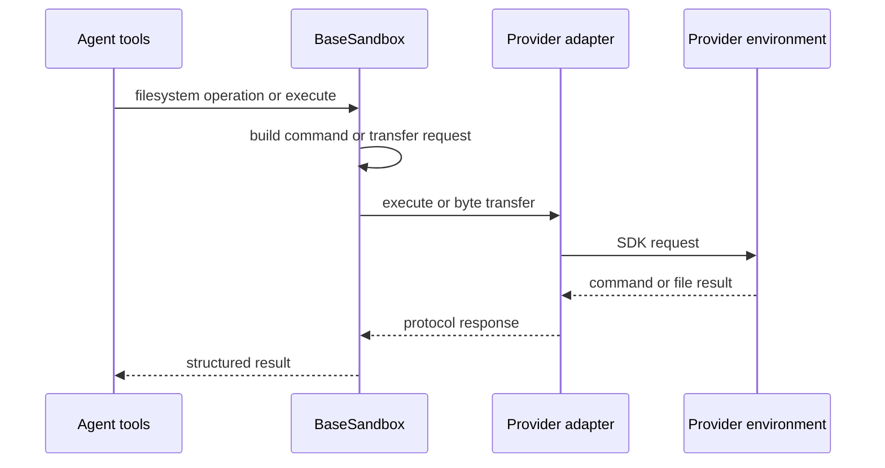
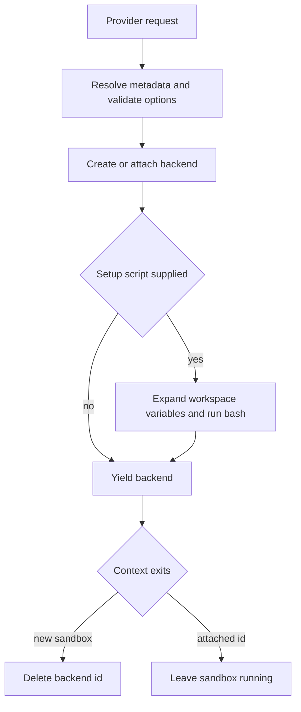

# Sandbox and Partner Backends

A sandbox integration has two separate responsibilities:

- A **backend adapter** presents an execution environment to Deep Agents through the filesystem and shell contract.
- A dcode **provider** creates or attaches that environment and owns its lifecycle.

Keeping those boundaries separate lets provider-specific SDK code stay in an adapter or provider while `BaseSandbox` supplies common agent-facing behavior.

> `SandboxBackendProtocol` is a capability contract, not an isolation certification. It is designed for containers, VMs, and remote hosts, but `LocalShellBackend` also implements it and runs commands directly on the host. Isolation, accessible files and networks, credentials, quotas, retention, and teardown are properties of the selected environment and its deployment—not of the protocol.

See [Backends](../concepts/backends.md), [Filesystem tools](../concepts/tools-filesystem.md), and [Security](../operations/security.md).

## Contract and adapter boundary

`SandboxBackendProtocol` extends the generic `BackendProtocol` with a stable `id`, synchronous `execute()`, and asynchronous `aexecute()`. A command result contains combined output, an exit status (which can be unknown), and a transport-truncation flag. `aexecute()` normally dispatches the synchronous method to a worker thread and only forwards `timeout` when the concrete method accepts it. For portable callers, a timeout should be a non-negative integer; `None` means the backend default and some backends use `0` to mean no timeout.

A `BaseSandbox` subclass supplies four provider-facing primitives:

1. `execute()` to run a complete shell command;
2. `upload_files()` for byte transfer to the environment;
3. `download_files()` for byte transfer from it; and
4. `id`.

Batch transfer is an important compatibility boundary: implementations return one response for each input, in input order, and put a per-file failure in that response instead of abandoning the whole batch. This allows an agent-facing operation to report partial success consistently even when an SDK transfer fails for one path.



*Filesystem helpers are derived from the adapter's command-execution and transfer primitives.*

## Filesystem operations derived from execution

`BaseSandbox` uses commands and structured parsing rather than downloading files for ordinary operations:

- `ls()`, `grep()`, and `glob()` build a command, execute it, and parse records.
- `read()` runs a server-side Python program, detects text or binary content, and paginates text in the environment. Text output is capped at roughly 500 KiB and tells the caller to continue with a different offset or smaller limit; non-UTF-8 data is returned as base64.
- `write()` first creates/checks parent directories, then uploads UTF-8 bytes. The separate preflight and transfer create an unavoidable TOCTOU window.
- `edit()` rejects an empty search string. Small old/new payloads use one server-side replacement script; larger payloads are uploaded as randomized temporary files and replaced server-side, so the source file does not leave the environment. Without `replace_all=True`, multiple matches are an error. Matching accommodates LF and CRLF views and preserves the matched line-ending style; on a mixed-ending file, a replace-all operation applies only the first matching style.
- `delete()` probes for a path (including a broken symlink) and then uses `rm -rf`. Quoting makes the supplied path one shell argument but does not restrict traversal or confine deletion to a root; recursive deletion can partially finish before a nonzero exit is reported.

The helper layer does not reduce the authority of `execute()`: anyone allowed to use a `BaseSandbox` has whatever shell access the adapter exposes. It also assumes the environment can run the helper programs, including `python3` for read and several glob/search cases.

### Search and result bounds

The results returned to an agent need not be exhaustive:

- `grep()` searches literal text. A basename-only include pattern uses `grep --include`; a pattern containing `/` is evaluated with a Python path glob relative to the requested search root. `max_count` stops after the requested total and marks the result as truncated.
- The generated glob walker treats absolute-looking patterns as relative to its search root and rejects `..` traversal. It bounds brace expansion, matching, and walk time; a walk warning or transport truncation means the result is not complete.
- The synchronous remote walk budget does not cover interpreter startup, provider transport, or response transfer. `aglob()` therefore has a 30-second outer timeout, while `agrep()` has an outer timeout sized for its search phases. On expiry they return a structured error asking for a narrower query rather than pretending an empty result is complete.

### Optional command-output offload

`execute_with_offload()` is deliberately opt-in through `enable_capture_offload`, which defaults to `False`. When enabled, a POSIX-shell wrapper captures combined output inside the environment. Output at or below `max_inline_bytes` is returned inline; larger output remains at `capture_path` and the caller receives a head/tail preview. Capture is hard-capped at `max_capture_bytes` without killing the child command, preserving its exit code; a truncation flag records a capped capture or lower-level transport truncation.

The wrapper has shell and coreutils assumptions that sandbox images may not meet, explaining the conservative default. If its metadata line is missing or malformed, the parser returns the original response as unoffloaded and does not rerun the command. With offload disabled, the command is run unwrapped and its full response is returned with `offloaded=False`.

## Provider discovery, configuration, and lifecycle

A `SandboxProvider` standardizes synchronous `get_or_create(sandbox_id=..., **kwargs)` and `delete(sandbox_id=..., **kwargs)` plus `asyncio.to_thread` wrappers. Its optional immutable `SandboxProviderMetadata` describes a working directory, attachment and snapshot capabilities, installation guidance, and an optional module used for dependency preflight. Metadata enables UI and discovery without constructing providers that may require credentials.

`SandboxRegistry` merges three sources:

1. curated dcode providers;
2. third-party providers registered in the `deepagents_code.sandbox_providers` entry-point group; and
3. local `[sandboxes.providers]` declarations.

A collision resolves **config > entry point > built-in**. A configured provider can specify `class_path`, working directory, package/install hint, capability flags, and `params`; configuration parameters are forwarded to `get_or_create()`. A `class_path` imports arbitrary Python under the local user account, so this configuration is a trusted-administrator boundary. A `[sandboxes].default` only selects a default after the user explicitly enables sandbox mode; it does not enable shell execution by itself.

`create_sandbox()` validates metadata before provisioning. It rejects a snapshot unsupported by the selected provider and rejects a snapshot combined with an attached `sandbox_id`. It merges configured parameters with invocation parameters (invocation values win), forwards a snapshot as `snapshot`, and yields the acquired backend. An optional setup script runs only after acquisition: `${VAR}` expansion uses the active workspace environment, then the expanded content is passed to `bash -c`. A nonzero setup exit raises `RuntimeError`.



*Only a sandbox created without an attached ID belongs to the context's cleanup.*

If acquisition succeeded for a newly created sandbox, cleanup also runs when setup or the context body fails. Cleanup errors are reported but do not mask an original error. An attached environment is deliberately retained.

### Server ownership

When dcode constructs a sandboxed server runtime, it opens the context once, stores it in process-level state, and registers close at `atexit`. Runtime caching makes that lifecycle significant: it prevents duplicate sandbox creation and cleanup registration. The sandbox is process-wide, however, so the first sandboxed workspace reserves it; a different workspace is refused rather than silently sharing the environment. Run another server process for an independent sandboxed workspace.

## Partner integration guidance

A partner adapter should implement only provider translation: turn the provider SDK's command and file APIs into the four `BaseSandbox` primitives and preserve the batch-response contract. Provider lifecycle belongs in a `SandboxProvider`, where attachment, readiness, deletion, credentials, and snapshot behavior can be described accurately in metadata and enforced before the adapter is exposed.

The curated registry currently names `agentcore`, `daytona`, `langsmith`, `modal`, `runloop`, and `vercel`. They are not interchangeable security boundaries. For example, metadata marks AgentCore as unable to attach by ID, and marks LangSmith and Runloop as snapshot-capable.

The distribution behind the `dcode` command is `deepagents-code`, currently version `0.1.75`. It requires Python `>=3.12,<4.0` and pins `deepagents==0.7.18`. `langsmith[sandbox]>=0.14.0` is a base dependency, while AgentCore, Daytona, Modal, Runloop, and Vercel adapters are separately installed through the corresponding optional sandbox extras. Installing the base package therefore does not install those five partner adapters.

When adding or changing an integration:

1. **Choose the right boundary.** `BaseSandbox` requires shell execution, `python3` helper support, and byte transfer. Do not infer OS, network, filesystem, or credential isolation from protocol conformance.
2. **Keep capability claims accurate.** Advertise attachment and snapshots only when they work; `create_sandbox()` relies on that metadata to reject invalid combinations before resource creation.
3. **Treat configuration and setup as code execution.** Protect `class_path` and setup-script write access, and make workspace credential selection explicit rather than falling back silently to a broader server identity.
4. **Define failure and cleanup behavior.** Test readiness failures, setup failures, attached-resource retention, newly-created-resource deletion, per-file partial failures, and command timeout/output semantics.

## Focused tests

`test_sandbox_backend.py` uses a minimal `MockSandbox` to verify the derived contract: server-side paginated reads, write preflight plus upload, inline and uploaded edit paths, parser failures, literal grep semantics, glob errors, capture-offload preservation of failures, and recursive deletion behavior. It specifically checks that malformed capture-wrapper output is not re-executed and that a child command's exit code survives the wrapper.

`test_local_sandbox_operations.py` supplies a `LocalSubprocessSandbox` that derives from `BaseSandbox` but intentionally invokes the local shell. It is gated by `RUN_SANDBOX_TESTS=true` and exercises the shared filesystem behavior against real temporary files: nested writes, pagination, permission and missing-path errors, exact replacement, CRLF preservation, mixed line endings, search, glob, and deletion. Its existence is a practical reminder that satisfying the sandbox protocol does not make an implementation isolated.

Run that opt-in local verification only in a trusted development or CI environment because its subclass executes host commands:

```bash
cd libs/deepagents
RUN_SANDBOX_TESTS=true make test TEST_FILE=tests/unit_tests/test_local_sandbox_operations.py
```
