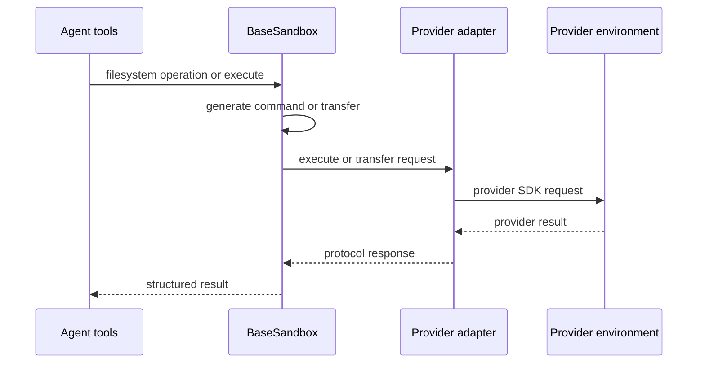
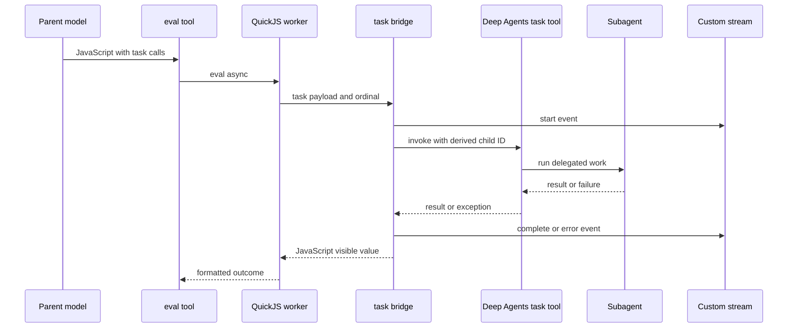
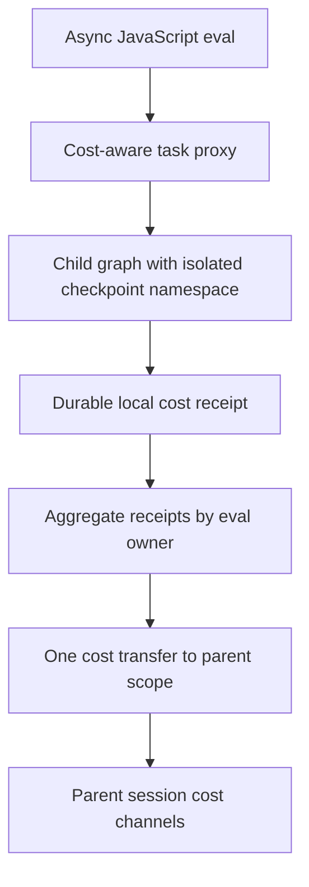

# Sandbox Provider Integrations

This page covers two deliberately different integration boundaries:

- A **sandbox provider** provisions or attaches to an execution environment that implements filesystem and shell capabilities.
- `langchain-quickjs` is an **in-process JavaScript execution and middleware integration**. It gives an agent a constrained QuickJS REPL and can bridge selected agent tools or the existing Deep Agents `task` tool. It is not a remote sandbox provider and must not be represented as one.

The distinction matters for security and operations. Provider-backed execution gets its containment, credentials, network policy, and retention from the chosen provider and deployment. QuickJS supplies VM limits and a deliberately narrow host API, but tool bridges carry the authority of the surrounding agent process. See [Subagents and Skills](../concepts/subagents-skills.md), [Talon](talon.md), [Cost, Session, and Context Operations](../operations/cost-and-sessions.md), and the [System Ownership Map](../architecture/source-map.md).

## Provider-backed sandbox contract

`SandboxBackendProtocol` extends the generic backend contract with an `id` and synchronous/asynchronous command execution. It is intended for isolated containers, VMs, and remote hosts, but protocol conformance is not an isolation guarantee: the deployment and backend implementation establish the real trust boundary.

`BaseSandbox` implements that protocol by deriving filesystem operations from four adapter primitives: `id`, `execute()`, `upload_files()`, and `download_files()`. Reads, lists, searches, globs, writes, and edits are then implemented as generated commands or byte transfers. A transfer batch must return an ordered response for every requested file and carry individual errors, allowing partial success rather than turning one failed file into a lost batch.


```mermaid
sequenceDiagram
    participant Agent as Agent tools
    participant Base as BaseSandbox
    participant Adapter as Provider adapter
    participant Environment as Provider environment

    Agent->>Base: filesystem operation or execute
    Base->>Base: generate command or transfer
    Base->>Adapter: execute or transfer request
    Adapter->>Environment: provider SDK request
    Environment-->>Adapter: provider result
    Adapter-->>Base: protocol response
    Base-->>Agent: structured result
```

*Shared filesystem behavior is layered over provider-specific command and transfer primitives.*

These helpers do not reduce `execute()` authority. Shell quoting in recursive deletion merely ensures a path is one shell argument; it does not confine reachable paths. Likewise, output offload is not automatically enabled: `execute_with_offload()` returns normal full output unless an adapter opts in. With capture enabled, it stores excess output in the sandbox, returns a head/tail preview, caps captured bytes without killing the command, and therefore preserves its exit code.

## dcode provider discovery and ownership

`SandboxProviderMetadata` supports provider discovery without creating credential-dependent clients: it advertises installation guidance, capability flags, working-directory information, and dependency probes. `SandboxProvider` owns synchronous create/attach/delete operations and supplies async wrappers through `asyncio.to_thread`.

The registry merges curated providers, packages advertised through `deepagents_code.sandbox_providers`, and local `[sandboxes.providers]` declarations. A name resolves in this order: **configuration, entry point, built-in**. Treat a configured `class_path` as operator-trusted code. The `[sandboxes].default` selection is considered only after sandbox mode has been explicitly enabled, so declaring a default does not silently redirect normal execution.

The base `deepagents-code` distribution includes `langsmith[sandbox]`; optional extras install adapters for `agentcore`, `daytona`, `modal`, `runloop`, and `vercel`:

```bash
pip install 'deepagents-code[agentcore,daytona,modal,runloop,vercel]'
pip install 'deepagents-code[all-sandboxes]'
```

`deepagents-code` 0.1.79 requires Python `>=3.12,<4.0`, pins `deepagents==0.7.21`, and includes `langsmith[sandbox]>=0.14.2` and `langchain-quickjs>=0.3.4,<0.4.0` as base dependencies. The retained `quickjs` extra is empty, so it is only compatible with older install commands; it does not install an additional package.

`create_sandbox()` resolves metadata before construction, rejects unsupported snapshot requests and snapshot-plus-attached-ID combinations, and merges configured parameters with call parameters taking precedence. A supplied host setup file is expanded against the workspace environment and run as `bash -c` after acquisition. The context deletes only an environment it created. If setup or the body fails, cleanup still runs; cleanup errors are reported without concealing the original exception.


```mermaid
flowchart TD
    Request["Provider request"] --> Validate["Resolve metadata and validate options"]
    Validate --> Acquire["Create or attach backend"]
    Acquire --> Setup{"Setup file supplied"}
    Setup -->|"yes"| Run["Expand workspace variables and run bash"]
    Setup -->|"no"| Use["Yield backend"]
    Run --> Use
    Use --> Exit{"Context exits"}
    Exit -->|"new environment"| Delete["Delete provider resource"]
    Exit -->|"attached ID"| Retain["Leave resource running"]
```

*The factory owns only newly created resources; an attached resource remains the caller's responsibility.*

A dcode server keeps that context open for its process lifetime. Runtime construction is cached, so creation and cleanup registration occur once. The first sandboxed workspace claims the process-wide backend; another sandboxed workspace is rejected rather than receiving the first workspace's remote filesystem or credentials. Use a separate server process for an independent sandboxed workspace.

## Talon: shared provisioning, deliberately mixed plane

Talon reuses dcode's provider registry and `create_sandbox()` rather than implementing provider SDKs. `DEEPAGENTS_TALON_SANDBOX` opts in; otherwise Talon has no sandbox and uses its ordinary host backend. `DEEPAGENTS_TALON_SANDBOX_ID`, `_SNAPSHOT`, and `_SETUP` respectively attach an existing resource, choose a supported snapshot, and name a host setup script.

For a newly created LangSmith sandbox, Talon defaults to `talon-<assistant_id>`. An explicit Talon value wins; when `LANGSMITH_SANDBOX_SNAPSHOT_NAME` or its `DEEPAGENTS_CODE_` override is set, Talon defers to provider configuration. It keeps the context open for the host lifetime and deletes owned resources but not attachments. Provider startup happens in a worker thread; failures become `SandboxStartupError` instead of falling back to host execution, and cancellation handoff closes a sandbox whose worker completes after cancellation.

Talon's `CompositeBackend` routes default filesystem work and all `execute` calls to the remote backend. Only virtual host routes for the assistant's `skills/` and `memory/` directories remain local. This is a convenience and state-boundary design, not complete host containment: MCP and web tools, channel media, and provider credentials remain in the Talon process.

## QuickJS: JavaScript execution middleware, not sandboxing

`CodeInterpreterMiddleware` publishes an `eval` tool (or a configured name) whose input is JavaScript. The package uses `quickjs-rs`, requires Python `>=3.11,<4.0`, and is a middleware package rather than a sandbox-adapter package. The tool schema explicitly documents no direct filesystem, network, or real-clock access. It captures `console.log`, `warn`, and `error` when enabled, bounds collected stdout and tool output, awaits a final Promise, and returns structured success or error text to the model.

Each private QuickJS slot owns a dedicated worker thread, runtime, and context. A slot is keyed by a private ID in agent state, not directly by a shared environment. This prevents one conversation's JavaScript globals from leaking to another and keeps `quickjs-rs` objects on their owning worker thread. Concurrent evals against the same context fail loudly rather than being silently queued.

The middleware offers three persistence modes:

| Mode | State behavior |
| --- | --- |
| `thread` (default) | State persists within a run and is snapshotted after the agent so it can be restored on a later turn. |
| `turn` | State persists for calls in the current agent run only; the slot is evicted after it. |
| `call` | The REPL is reset after every `eval` call. |

Thread-mode snapshots are stored as a replayable delta chain and the live runtime is evicted after snapshotting. Snapshot creation or restoration failures clear the persisted payload rather than executing questionable state. Set `snapshot_signing_key` when the checkpointer is not fully trusted: the middleware signs reconstructed snapshot bytes with an HMAC tied to the slot ID and rejects missing or mismatched signatures. Snapshot size is bounded by `max_snapshot_bytes` (defaulting to the memory limit).

The default limits are a 64 MiB QuickJS heap, five seconds of VM execution, 4,000 output characters, and 256 programmatic-tool calls per eval. The VM timeout does **not** include time spent awaiting Python host calls, so it is not a wall-clock execution guarantee. Disabling `max_ptc_calls` permits unbounded host-call loops and is appropriate only in trusted settings.

### Tool and subagent bridges

With `ptc` configured, selected agent tools are exposed as asynchronous `tools.<camelCase>(input)` functions. The bridge normalizes JavaScript input, injects runtime/state/store values that the normal `ToolNode` would supply, and runs the actual tool on the parent loop so callbacks and runtime affinity remain correct. It deliberately bypasses the usual `ToolNode`, so parent-level `interrupt_on` and HITL approval are not applied to each bridged tool invocation. Do not expose approval-sensitive tools this way unless the `eval` tool itself is gated or the tool/subagent has its own approval policy.

When `subagents=True` and the active tool set contains the Deep Agents `task` tool, QuickJS also installs a top-level async `task({description, subagentType, label, responseSchema})`. It validates its payload, finds the existing task tool, and invokes it on the parent loop. Calls are limited to 32 concurrently active `task()` dispatches per REPL; extra calls wait. A task invocation is distinct from the PTC tool-call budget, but it inherits the same key approval caveat: dispatch occurs inside the already-approved `eval` invocation.


```mermaid
sequenceDiagram
    participant Model as Parent model
    participant Eval as eval tool
    participant QJS as QuickJS worker
    participant Bridge as task bridge
    participant Task as Deep Agents task tool
    participant Child as Subagent
    participant Stream as Custom stream

    Model->>Eval: JavaScript with task calls
    Eval->>QJS: eval async
    QJS->>Bridge: task payload and ordinal
    Bridge->>Stream: start event
    Bridge->>Task: invoke with derived child ID
    Task->>Child: run delegated work
    Child-->>Task: result or failure
    Task-->>Bridge: result or exception
    Bridge->>Stream: complete or error event
    Bridge-->>QJS: JavaScript visible value
    QJS-->>Eval: formatted outcome
```

*QuickJS orchestrates the existing task mechanism; it does not provision an execution environment for the child.*

## Replay-stable fan-out and stream lifecycle

For a `task()` dispatch, the bridge derives a child ID from the parent eval tool-call ID, task-tool name, host-invocation ordinal, and canonicalized request payload. Replaying the same eval and reaching calls in the same order therefore reproduces IDs; otherwise-identical sibling calls remain distinct through their ordinal. Without a usable parent eval ID, it mints a random ID and omits `eval_id` from events. The digest is an idempotency mechanism, not a security boundary.

The bridge emits `type: "subagent"` lifecycle records to LangGraph's custom stream:

- `start` has the child `id`, optional `eval_id`, subagent type, and bounded label and description.
- `complete` has the same ID and elapsed `duration_ms`.
- `error` has the same ID, elapsed duration, and the raised error string, then re-raises the dispatch failure.

An interrupt propagates without an error event. A stream-writer failure is intentionally swallowed so observability cannot alter dispatch semantics. Consumers should upsert a row on `start` using `id`, rather than append blindly: an interrupted replay may emit `start` again before later emitting `complete`. Consumers should also tolerate future lifecycle phases.

The replay integration tests exercise a three-way `Promise.all` fan-out across checkpoint resumes. They establish that logical workers keep their IDs, completed work is not restarted while sibling hooks interrupt, and the parent receives one successful eval tool result once all work finishes.

## Cost ownership for JavaScript fan-out

dcode's `CostAwareCodeInterpreterMiddleware` is an accounting transport layered over the QuickJS middleware. For an async eval it replaces the visible Deep Agents `task` tool with a proxy that gives each child invocation a request-isolated checkpoint namespace and a shared owner identity for the enclosing eval. It waits for active proxy tasks to settle or cancel before the eval returns.

Each nested graph records a durable local receipt before returning its graph update; a replay sees an existing receipt and does not replace it. At the outer eval boundary, the middleware aggregates receipts owned by that eval and adds one `_session_cost_transfers` entry addressed to the parent checkpoint scope. An already-owned nested invocation returns normally instead of forwarding another transfer, preventing double accounting. The result is that child spend survives interruptions, child failure, cancellation after a checkpoint, and fresh-process resume, while the parent cost middleware remains the final owner of session totals.


```mermaid
flowchart TD
    Eval["Async JavaScript eval"] --> Proxy["Cost-aware task proxy"]
    Proxy --> Child["Child graph with isolated checkpoint namespace"]
    Child --> Receipt["Durable local cost receipt"]
    Receipt --> Aggregate["Aggregate receipts by eval owner"]
    Aggregate --> Transfer["One cost transfer to parent scope"]
    Transfer --> Parent["Parent session cost channels"]
```

*Receipts make child cost replay-safe before the enclosing eval transfers its aggregate to the parent.*

## Change and verification guidance

- Implement a provider adapter through the four `BaseSandbox` primitives; put credentials, create/attach readiness, capability metadata, and deletion in `SandboxProvider`.
- Choose a provider by its actual image, network, filesystem, credential, and retention policy. Protocol conformance alone does not establish containment.
- Use QuickJS for computation, orchestration, and controlled access to explicitly bridged tools. Do not describe it as a sandbox or assume its VM timeout bounds slow host tools.
- Gate `eval`, disable `subagents`, or configure approvals inside child specifications when each delegated task must be approved independently.
- Run `libs/partners/quickjs/tests/unit_tests/test_repl_middleware.py` for REPL lifecycle, limits, tool bridges, snapshots, and modes; `test_subagent_events.py` for event semantics and IDs; `test_subagent_replay.py` for checkpoint fan-out; and `libs/code/tests/unit_tests/test_js_cost_tracking.py` for durable cost receipt ownership.
- Run dcode and Talon sandbox tests after changing provider selection, ownership, startup, routing, or cancellation behavior.
