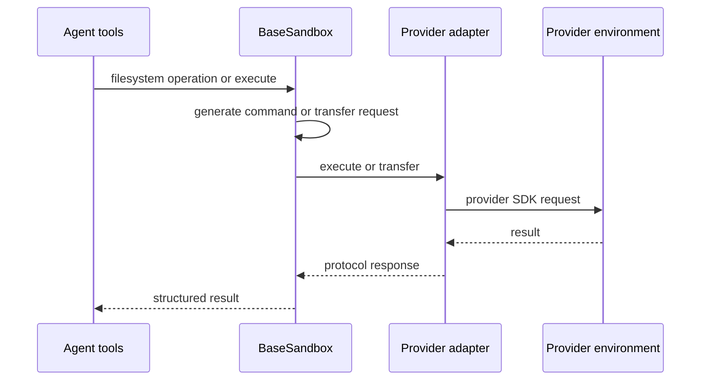
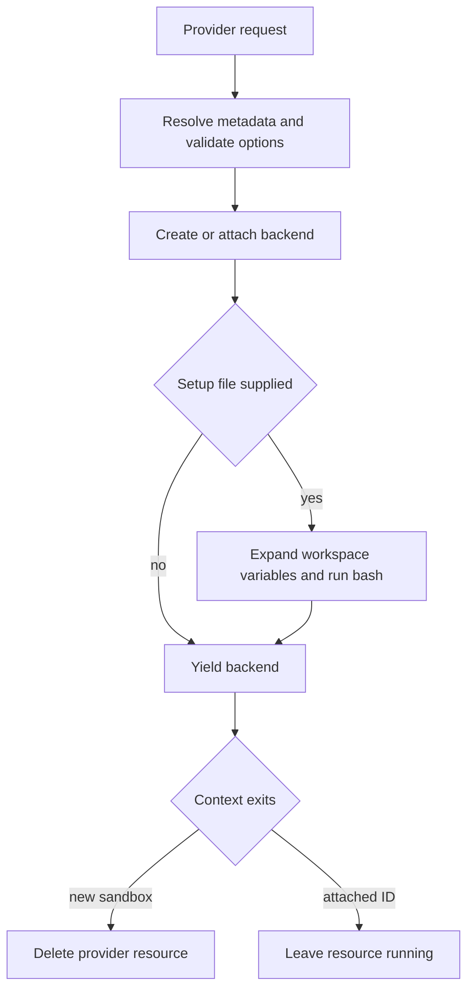
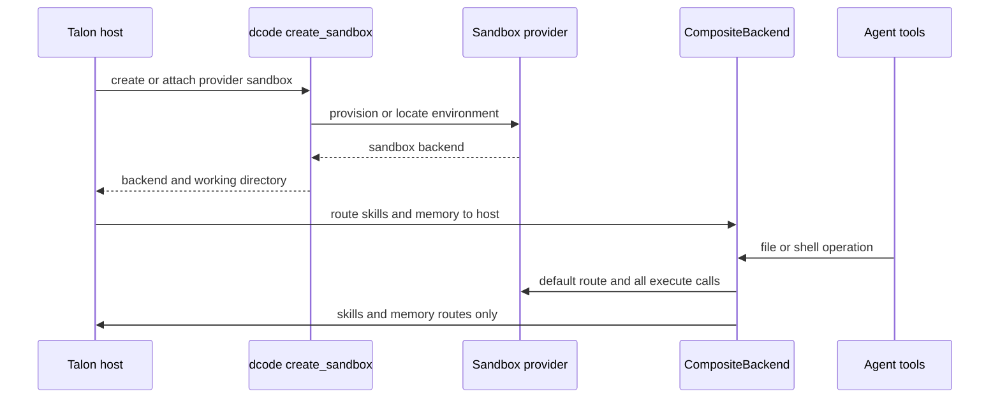

# Sandbox Providers and Execution Boundaries

A sandbox integration has two separate responsibilities:

- A **backend adapter** exposes a provider environment as the Deep Agents filesystem-and-shell contract.
- A dcode **provider** creates, attaches to, and—when it owns it—deletes that environment.

`SandboxBackendProtocol` adds `id`, `execute()`, and `aexecute()` to the generic backend contract. It is designed for containers, VMs, and remote hosts, but it is a capability contract rather than an isolation guarantee. In particular, `LocalShellBackend` conforms while executing commands directly on the host. The provider environment and deployment determine identity, network access, accessible files, retention, and actual containment. See [Backends](../concepts/backends.md), [Filesystem tools](../concepts/tools-filesystem.md), and [Security](../operations/security.md).

## Adapter contract and shared behavior

A `BaseSandbox` adapter implements four provider-facing primitives: `id`, `execute()`, `upload_files()`, and `download_files()`. The base class derives agent filesystem operations from these primitives: reads, listings, searches, and globbing run generated commands in the environment; writes transfer bytes; and edits execute a replacement script, transferring temporary old/new payloads for large edits. Transfer batches must return one ordered response per input and report individual errors, allowing partial success.


```mermaid
sequenceDiagram
    participant Agent as Agent tools
    participant Base as BaseSandbox
    participant Adapter as Provider adapter
    participant Env as Provider environment

    Agent->>Base: filesystem operation or execute
    Base->>Base: generate command or transfer request
    Base->>Adapter: execute or transfer
    Adapter->>Env: provider SDK request
    Env-->>Adapter: result
    Adapter-->>Base: protocol response
    Base-->>Agent: structured result
```

*Filesystem tools are shared behavior layered over an adapter's command and file-transfer primitives.*

The helpers do not narrow `execute()` authority. For example, shell quoting in recursive deletion makes the path one argument but does not confine what paths can be reached. `execute_with_offload()` is also opt-in: the default leaves a command unwrapped and returns full output. Adapters that opt in capture large output in the sandbox, return a preview, and preserve the command exit code even when capture reaches its hard limit.

## dcode discovery, configuration, and lifecycle

`SandboxProviderMetadata` lets dcode discover a working directory, supported attachment and snapshot features, installation hints, and an optional dependency probe without instantiating a provider that might need credentials. A `SandboxProvider` supplies synchronous create/attach and delete methods, with `asyncio.to_thread` wrappers.

The registry combines curated providers, packages registered in the `deepagents_code.sandbox_providers` entry-point group, and local `[sandboxes.providers]` declarations. Resolution order is **config, then entry point, then built-in**. A configured `class_path` imports code as the local user, so it is an operator trust boundary. The configured `[sandboxes].default` is considered only after sandbox mode was explicitly requested; setting it never enables remote execution by itself.

The built-in provider metadata covers `agentcore`, `daytona`, `langsmith`, `modal`, `runloop`, and `vercel`. `langsmith` is bundled through the base `langsmith[sandbox]` dependency. The other five have optional extras:

```bash
pip install 'deepagents-code[agentcore,daytona,modal,runloop,vercel]'
# or install all curated optional adapters
pip install 'deepagents-code[all-sandboxes]'
```

`deepagents-code` 0.1.78 requires Python `>=3.12,<4.0` and pins `deepagents==0.7.19`. Optional extras install adapter packages; they do not supply credentials or change the remote environment's security policy.

`create_sandbox()` resolves metadata before construction. It rejects snapshots unsupported by that provider and rejects a snapshot combined with an attached ID. It merges configured provider parameters with call parameters, with call parameters taking precedence, then calls `get_or_create()`. An optional host setup file is expanded with the active workspace environment and executed in the sandbox using `bash -c`.


```mermaid
flowchart TD
    Request["Provider request"] --> Validate["Resolve metadata and validate options"]
    Validate --> Acquire["Create or attach backend"]
    Acquire --> Setup{"Setup file supplied"}
    Setup -->|yes| Run["Expand workspace variables and run bash"]
    Setup -->|no| Use["Yield backend"]
    Run --> Use
    Use --> Close{"Context exits"}
    Close -->|new sandbox| Delete["Delete provider resource"]
    Close -->|attached ID| Keep["Leave resource running"]
```

*The context owns only a resource it created; attached resources remain available after it exits.*

If setup fails, an owned resource is still cleaned up. Cleanup failures are reported but do not hide the original error. The setup file is host input and commands run with the sandbox's authority; it is not a policy or escaping mechanism.

### dcode server invariant: one sandboxed workspace per process

The dcode server opens its sandbox context during runtime construction and stores it for process-lifetime cleanup with `atexit`. Its runtime factory is cached deliberately: recreating it per request would duplicate MCP discovery, leak sandbox sessions, and register repeated cleanup handlers. The process-wide backend is passed into `create_cli_agent()`.

A separate workspace-runtime cache supports multiple unsandboxed workspace runtimes, but a configured sandbox cannot be shared across them. The first sandboxed workspace claims `_sandbox_workspace_id`; another workspace whose configuration requests a sandbox receives a `WorkspaceConflictError` rather than inheriting the first workspace's remote filesystem and credentials. Run another server process for an independent sandboxed workspace.

## Talon: shared provider lifecycle, mixed execution plane

Talon is an experimental local runtime host. It reuses dcode's `create_sandbox()` and provider registry rather than implementing provider SDKs itself. `DEEPAGENTS_TALON_SANDBOX` enables this behavior; when it is unset, Talon yields no sandbox and shell/file tools use their normal host backend. The following configuration is read from Talon's environment:

| Variable | Meaning |
| --- | --- |
| `DEEPAGENTS_TALON_SANDBOX` | Registry provider name. Unset means host execution. |
| `DEEPAGENTS_TALON_SANDBOX_ID` | Existing resource to attach. Talon does not delete it. |
| `DEEPAGENTS_TALON_SANDBOX_SNAPSHOT` | Snapshot or blueprint where the selected provider supports it. |
| `DEEPAGENTS_TALON_SANDBOX_SETUP` | Host path to a setup script executed after startup. |

For a newly created LangSmith sandbox, Talon defaults the snapshot to `talon-<assistant_id>` to avoid the generic shared dcode snapshot name. An explicit Talon snapshot wins. If either `LANGSMITH_SANDBOX_SNAPSHOT_NAME` or its `DEEPAGENTS_CODE_` override is already configured, Talon leaves snapshot selection to the provider. An attachment or a non-LangSmith provider has no Talon-generated default.


```mermaid
sequenceDiagram
    participant Host as Talon host
    participant Factory as dcode create_sandbox
    participant Remote as Sandbox provider
    participant Composite as CompositeBackend
    participant Agent as Agent tools

    Host->>Factory: create or attach provider sandbox
    Factory->>Remote: provision or locate environment
    Remote-->>Factory: sandbox backend
    Factory-->>Host: backend and working directory
    Host->>Composite: route skills and memory to host
    Agent->>Composite: file or shell operation
    Composite->>Remote: default route and all execute calls
    Composite->>Host: skills and memory routes only
```

*Talon reuses dcode provisioning but constructs a composite backend with an intentionally mixed host/remote filesystem.*

Talon starts provisioning in a worker thread because dcode provider startup is synchronous. It keeps the context open for the Talon host lifetime, closing it at shutdown: resources it created are deleted and attached resources remain. Startup failure becomes `SandboxStartupError`; Talon does **not** fall back to host execution. Cancellation is handled explicitly: because cancelling `asyncio.to_thread` does not stop the worker, a handoff object closes the context whether cancellation happens before or after that worker finishes, preventing an owned sandbox leak.

### What remains on the Talon host

Talon constructs a `CompositeBackend` whose default route is the remote sandbox. Only the assistant's `skills/` and `memory/` directories use host `FilesystemBackend` routes in virtual mode; each is created with `0700` permissions. This keeps skills and memory usable locally while preventing sandbox filesystem tools from reaching `tools.json` and other assistant state through those routes. Traversal from a host-routed memory path is rejected. Every `execute` call goes to the sandbox.

This split is not a complete Talon security boundary. Talon's README explicitly notes that MCP tools, web tools, and channel media handling continue on the host; provider credentials are read by the Talon process and are not forwarded into the sandbox. Treat channel users as having access to the operator's configured agent capabilities unless separately constrained. See [Talon](talon.md) for host lifecycle and channel behavior.

## Operating and extending safely

Choose providers based on their actual service boundaries and image requirements, not merely on protocol conformance. Derived `BaseSandbox` operations require the commands they generate, including `python3` in several paths. A new adapter should implement the four primitives, maintain ordered per-file partial-failure responses, and place provisioning, credentials, readiness checks, attachment, and deletion in a `SandboxProvider`. Advertise snapshot and attachment support only when the provider lifecycle actually implements it.

Focused Talon tests exercise the relevant boundary conditions: no sandbox when unset; environment parsing and snapshot precedence; host-only `skills/` and `memory/` routes; sandbox cleanup; cancellation during synchronous startup; fail-closed provisioning; and rejection of external or traversing memory paths. The shared `BaseSandbox` tests separately verify server-side reads and edits, direct byte uploads, and the large-edit temporary-file path.
