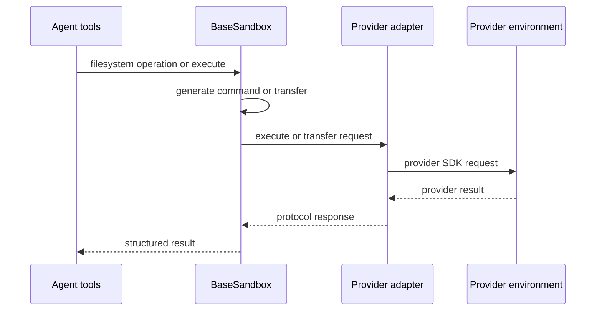

# Sandbox and Partner Integrations

A **sandbox provider** acquires or attaches to an environment that implements filesystem and shell execution. It is not the same thing as `langchain-quickjs`: QuickJS is JavaScript REPL middleware running in the agent process, not a selectable remote-sandbox provider. Provider containment, network policy, credentials, and retention are properties of the provider and its deployment; protocol conformance alone is not an isolation guarantee.

## The backend and provider boundary

`SandboxBackendProtocol` extends the generic backend contract with an `id` plus `execute()`/`aexecute()` for shell commands. `BaseSandbox` supplies the standard filesystem behavior on top of four provider-adapter primitives: `id`, `execute()`, `upload_files()`, and `download_files()`. Implement transfers as ordered, per-file responses: a failed file is reported in that response while unrelated transfers may succeed.

The base class is a convenience layer, not a security boundary. In particular, its recursive-delete quoting makes the supplied path one shell argument; it does not restrict deletion to a workspace root. Capture-at-source offload is also deliberately opt-in. When an adapter enables it, oversized output is captured in the sandbox and represented by a head/tail preview; capture can be capped without killing the command, preserving its exit code. With the default disabled setting, the command is unwrapped and full output is returned.


```mermaid
sequenceDiagram
    participant Agent as Agent tools
    participant Base as BaseSandbox
    participant Adapter as Provider adapter
    participant Environment as Provider environment

    Agent->>Base: filesystem operation or execute
    Base->>Base: generate command or transfer
    Base->>Adapter: execute or transfer request
    Adapter->>Environment: provider SDK request
    Environment-->>Adapter: provider result
    Adapter-->>Base: protocol response
    Base-->>Agent: structured result
```

*Provider-specific execution and transfer primitives support the shared sandbox filesystem interface.*

### Adapter-specific operational behavior

All curated partner adapters subclass `BaseSandbox`, but provider SDK semantics remain observable. Daytona runs each command in a newly created session, polls it, and deletes that session in `finally`; a positive timeout returns exit code `124`. Modal invokes `bash -c` and combines stdout and stderr. Vercel starts a detached `bash -lc` command, tries to kill it on timeout, and returns `124`; a failed kill can leave a command running. Vercel also caps returned output at `100_000` bytes and preserves a completed command's exit code if fetching its logs fails.

These differences matter when choosing timeout, output, and cleanup policy. Test the concrete adapter as well as the shared contract; do not infer identical cancellation or output behavior from `BaseSandbox`.

## dcode installation and selection

The `deepagents-code` distribution is version `0.1.83`, requires Python `>=3.12,<4.0`, and pins `deepagents==0.7.23`. It bundles `langsmith[sandbox]>=0.14.4` and `langchain-quickjs>=0.3.4,<0.4.0`. Thus LangSmith is available without a sandbox extra, and QuickJS is installed with dcode but remains middleware rather than a provider. The backward-compatible `quickjs` extra is empty.

The curated provider adapters are optional extras. Install only the needed adapter, or all five:

| Provider name | dcode extra and adapter constraint | Current partner package | Provider SDK dependency |
| --- | --- | --- | --- |
| `agentcore` | `agentcore`: `langchain-agentcore-codeinterpreter>=0.0.5,<1.0.0` | — | — |
| `daytona` | `daytona`: `langchain-daytona>=0.0.7` | `langchain-daytona` `0.0.8` | `daytona` |
| `modal` | `modal`: `langchain-modal>=0.0.5` | `langchain-modal` `0.0.6` | `modal` |
| `runloop` | `runloop`: `langchain-runloop>=0.0.6` | `langchain-runloop` `0.0.7` | `runloop-api-client` |
| `vercel` | `vercel`: `langchain-vercel-sandbox>=0.0.1` | `langchain-vercel-sandbox` `0.0.2` | `vercel>=0.5.9,<0.6` |

```bash
pip install 'deepagents-code[daytona]'
pip install 'deepagents-code[agentcore,daytona,modal,runloop,vercel]'
pip install 'deepagents-code[all-sandboxes]'
```

All listed partner packages require Python `>=3.11,<4.0` and `deepagents>=0.7.0,<0.8.0`; dcode's Python and Deep Agents constraints are therefore the effective constraints when it owns the installation. Package installation is separate from configuring provider credentials and any provider-specific operational setup.

`SandboxProviderMetadata` lets the CLI show install hints, working directory, and capability flags without creating credential-dependent clients. A provider then implements synchronous `get_or_create()` and `delete()`; the base interface exposes asynchronous wrappers using `asyncio.to_thread`.

The registry combines curated providers, third-party entry points in `deepagents_code.sandbox_providers`, and `[sandboxes.providers]` declarations. On a duplicate name, configuration wins over an entry point, which wins over a built-in. A configured `class_path` imports executable Python and is operator-trusted configuration. `[sandboxes].default` is considered only after the user enables sandbox mode; setting it does not silently enable remote execution.

Built-in working directories are provider metadata: AgentCore `/tmp`, Daytona `/home/daytona`, LangSmith `/root`, Modal `/workspace`, Runloop `/home/user`, and Vercel `/vercel/sandbox`. Snapshot names are supported by LangSmith and Runloop; AgentCore does not support attachment by sandbox ID. Capability metadata is the authority for validation, so extensions should advertise accurate flags rather than relying on provider-name special cases.

Runloop treats a snapshot as a blueprint name: it ensures a same-name blueprint is build-complete or creates it from the supplied Dockerfile, while an environment blueprint ID wins over names and skips that work. This is provider behavior behind the generic snapshot capability, not a portable snapshot lifecycle.

## Factory lifecycle and server ownership

`create_sandbox()` resolves metadata before constructing the provider. It rejects a snapshot unsupported by that provider and rejects a snapshot combined with `sandbox_id`, because snapshots apply only to newly created sandboxes. Configured provider parameters are loaded first and explicit call parameters override them. After acquisition, an optional host setup script is expanded using the workspace environment and executed with `bash -c` inside the sandbox.


```mermaid
flowchart TD
    Request["Provider request"] --> Validate["Resolve metadata and validate options"]
    Validate --> Acquire["Create or attach backend"]
    Acquire --> Setup{"Setup file supplied"}
    Setup -->|"yes"| Run["Expand workspace variables and run bash"]
    Setup -->|"no"| Use["Yield backend"]
    Run --> Use
    Use --> Exit{"Context exits"}
    Exit -->|"new environment"| Delete["Delete provider resource"]
    Exit -->|"attached ID"| Retain["Leave resource running"]
```

*The factory deletes an environment it created but never takes ownership of an attached ID.*

Setup failure still enters cleanup for an owned sandbox. Cleanup exceptions are reported but do not mask the setup or caller failure. This ownership rule is important for scripts and tests: attaching an ID is a deliberate retention decision.

A dcode server opens the factory context for the server-process lifetime. Its runtime factory is cached because repeated construction would recreate sandboxes and duplicate cleanup registration. The first sandboxed workspace reserves that process-wide backend; a request for another sandboxed workspace is rejected rather than sharing the first workspace's remote filesystem and credentials. Start a distinct server process for an independent sandboxed workspace.

## Talon reuse and routing

Talon does not implement separate provider adapters. `DEEPAGENTS_TALON_SANDBOX` opts into the dcode registry and factory; when it is unset, Talon yields no sandbox and uses its normal host backend. `DEEPAGENTS_TALON_SANDBOX_ID` attaches an existing environment, while `DEEPAGENTS_TALON_SANDBOX_SNAPSHOT` and `DEEPAGENTS_TALON_SANDBOX_SETUP` select a snapshot and host-side setup script.

For a new LangSmith sandbox, Talon proposes `talon-<assistant_id>` by default. An explicit Talon snapshot takes precedence. If `LANGSMITH_SANDBOX_SNAPSHOT_NAME`, including its dcode-prefixed resolution path, is set, Talon defers to that provider-level setting instead. Talon holds the factory context for its host lifetime, deletes owned resources, and retains an attached one. Configured startup failures become `SandboxStartupError`; Talon does not fall back to host execution. Its thread handoff also closes an owned resource if startup completes after the awaiting task was cancelled.

Talon constructs a `CompositeBackend` whose default target, including every `execute` call, is the remote sandbox. Only the assistant `skills/` and `memory/` directories route to host virtual filesystem backends; `tools.json` and other assistant state remain off those host routes. This is a mixed-plane routing decision, not complete host containment: Talon's MCP and web tools, channel media handling, and provider credentials remain in the Talon process.

## QuickJS is not a provider

`langchain-quickjs` version `0.3.8` is a JavaScript REPL middleware package, requiring Python `>=3.11,<4.0`. Its direct dependencies are `deepagents>=0.7.0,<0.8.0`, `quickjs-rs>=0.2.5,<0.3.0`, `langchain>=1.4.3,<2.0.0`, `langchain-core>=1.6.7,<2.0.0`, `langgraph>=1.2.14,<2.0.0`, and `bsdiff4>=1.2.6,<2.0.0`; it does not depend on a sandbox-provider SDK. It is installed by dcode's base dependency range, but it neither provisions an environment nor appears in the sandbox registry or `DEEPAGENTS_TALON_SANDBOX` choices.

Use `CodeInterpreterMiddleware` to expose an `eval` tool to the agent. The JavaScript evaluator has no direct filesystem, network, or real-clock access. Its default `thread` mode gives each LangGraph thread a separate QuickJS slot, while `turn` retains state only within one turn and `call` creates a fresh REPL per evaluation. Memory and VM-execution-time budgets are separate from host-call wall time.

Programmatic tool calling is an explicit extension boundary: an allowlist can expose tools in the REPL as `tools.<camelCase>(input)`. These bridge calls bypass the normal `ToolNode` path, so parent `interrupt_on` / HITL approval is not applied per bridge call. Keep the `eval` tool gated, apply approval within subagent specifications, or disable PTC/subagents where that bypass is unacceptable. Persisted thread snapshots are only integrity-checked when `snapshot_signing_key` is configured.

## Extension and verification guidance

- New provider adapters should implement the four `BaseSandbox` primitives and supply `SandboxProvider` lifecycle methods plus truthful metadata. Publish external providers through `deepagents_code.sandbox_providers`, or use a trusted config `class_path` for local deployment.
- Verify an adapter's create, attach, setup-failure cleanup, snapshot, and transfer partial-success behavior. dcode coverage is concentrated in `libs/code/tests/unit_tests/test_sandbox_factory.py`, `test_sandbox_provider.py`, `test_sandbox_registry.py`, and `test_sandbox_config.py`; provider integration coverage lives in `libs/code/integration_tests/test_sandbox_factory.py` and `test_sandbox_operations.py`.
- After changing Talon selection, ownership, cancellation, or routes, run `libs/talon/tests/unit_tests/test_sandbox.py`.
- Before selecting any provider for sensitive workloads, evaluate its image, filesystem persistence, network controls, credential exposure, and cleanup policy. Neither `BaseSandbox` nor Talon's routing changes those provider-level controls.
