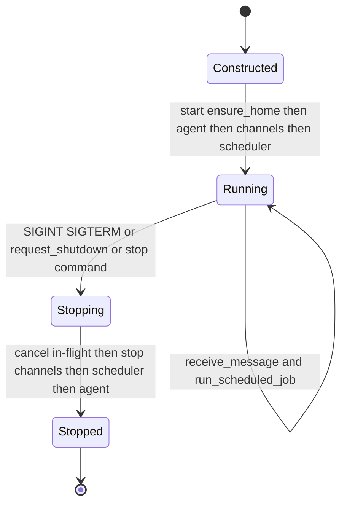
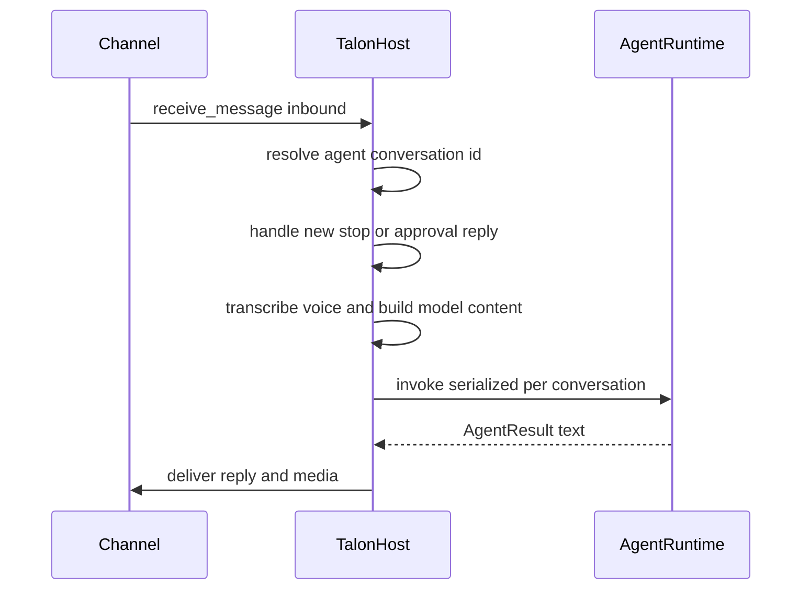

# Talon: Local Runtime Host

> **Experimental / alpha.** Talon is an experimental, alpha-status runtime that
> may change or be removed at any time. It is **not** intended for production or
> enterprise use, and it ships **no production security controls**: there is no
> complete human-in-the-loop (HITL) approval policy, no channel administrator
> gates, no sandbox-backed execution isolation, and no multi-tenant boundaries.
> Channel access must be treated as **direct access to the operator's agent,
> model credentials, MCP tools, and local host resources**. The maintainers do
> not accept security vulnerability reports for the absence of these known,
> unimplemented hardening features while Talon remains experimental.

Deep Agents Talon (`libs/talon`) is the local runtime host for long-running
Deep Agents. It owns the process lifecycle for channel adapters, cron
schedulers, and the agent runtime in a single event loop, so a single operator
can keep an agent reachable over messaging channels and on a schedule from their
own machine.

## Role and ownership

`TalonHost` is a long-running process host for exactly one assistant. It is
constructed with a `TalonConfig`, an `AgentRuntime`, a sequence of
`ChannelAdapter`s, an optional `CronScheduler`, and an optional voice
transcriber, and it starts and stops all of them together. `start()` calls
`config.ensure_home()`, starts the agent runtime, wires each channel's message
(and, where supported, reaction) handler back to the host and starts it, then
starts the scheduler. Everything runs in one asyncio loop.

Talon is single-operator by design. It does not provide multi-tenant isolation,
sandboxed execution, production HITL policy enforcement, or channel-admin
boundaries; any channel approval prompt is an experimental convenience, not a
security boundary.

## Startup and shutdown lifecycle

Talon host lifecycle from construction through graceful shutdown.

`run_until_stopped()` starts the host, installs signal handlers, and blocks on an
internal `_stopped` event until shutdown is requested. `stop()` cancels all
in-flight agent work first (`_cancel_all`), then stops channels in reverse order,
then the scheduler, then the agent runtime, giving a graceful, ordered teardown.
`request_shutdown()` simply sets the stop event so the host unwinds through the
same path. The CLI `--once` flag starts and immediately stops the host, which is
useful for verifying lifecycle and channel wiring without doing real work.

## Per-conversation serialization

Each inbound message maps to an agent conversation id, and every agent
invocation for a conversation is serialized behind a per-conversation
`asyncio.Lock` inside `_invoke_agent`. Turns for the same conversation therefore
run one at a time and share chat history, while different conversations proceed
concurrently. The host tracks in-flight tasks per conversation so it can cancel
just that conversation's work.

Two channel commands control conversation state: `/new` starts a fresh
conversation by cancelling the current run and bumping a per-conversation reset
counter that is appended to the thread id, and `/stop` cancels the in-flight run
for the conversation. When more than one channel is attached, the conversation
root is namespaced by channel key so identically named conversations on
different providers do not collide.

## Message and scheduled-run flow

Inbound channel message through serialized agent invocation and reply delivery.

`receive_message` resolves the conversation id, intercepts `/new`, `/stop`, and
pending tool-approval replies, and otherwise schedules `_run_agent_turn`.
`_run_agent_turn` transcribes voice messages when a transcriber is configured,
builds model content and metadata (channel, sender, message id, origin), sends a
typing indicator, invokes the agent, and delivers the result.

For scheduled work, `run_scheduled_job` builds a cron-origin conversation id and
invokes the agent with `trigger="cron"` metadata; `deliver_scheduled_result`
sends the output back to the job's origin conversation using retrying sends.

## The agent runtime

The `AgentRuntime` protocol (`start`/`stop`/`invoke`) decouples the host from any
particular agent implementation. Talon ships two:

- **`EchoAgentRuntime`** returns the request text unchanged. The host falls back
  to it when no model is configured (`AGENT_MODEL`/`DEEPAGENTS_TALON_MODEL`
  unset), which lets operators exercise host lifecycle and channel wiring
  without provider credentials.
- **`DeepAgentRuntime`** builds a real Deep Agents graph via `create_deep_agent`.
  Its `start()` wires tools, the resolved model, middleware, subagents, skills,
  memory, `interrupt_on` approval config, and a checkpointer (in-memory by
  default so turns in a conversation share history). `invoke` runs the graph with
  a per-invocation `recursion_limit` and a `thread_id` equal to the conversation
  id, then extracts the final assistant text.

`DeepAgentRuntime.invoke` is resilient: `_invoke_payload_with_retries` retries
transient provider, parse, context-limit, and transport errors with exponential
backoff; empty responses trigger continuation nudges and finally a force-summary
prompt so the host always has something to deliver. `_invoke_until_unblocked`
drives tool-approval interrupts, resuming the graph with the operator's
approve/reject decision, up to a bounded number of approval rounds.

Its execution backend defaults to a `LocalShellBackend` rooted at
`DEEPAGENTS_TALON_WORKSPACE` (or the current directory) with a scrubbed child
environment: only an allowlist of benign variables is passed through, secrets and
env-hijack keys are dropped, and `PATH` is replaced with a fixed safe path.

## Channel protocol and adapters

Channels are transport integrations behind the `ChannelAdapter` protocol
(`start`, `stop`, `set_message_handler`, `send_message`, `send_media`,
`edit_message`, `send_typing`, `status`). An optional `ReactionChannelAdapter`
surface lets a channel deliver reaction events, which Talon uses for emoji-based
tool-approval decisions. The host registers itself as each channel's handler so
inbound events flow into `receive_message`/`receive_reaction`. Outbound sends go
through `send_with_retry` so transient failures are retried.

The **WhatsApp** adapter (`WhatsAppChannel`) talks to a bundled Node bridge over
loopback (`127.0.0.1`) only, authenticated with a per-process bearer token, and
runs bridge draining and health checks on intervals. Inbound exposure defaults to
`self` (only the paired account triggers the agent); `allowlist` and `open`
modes are opt-in, and `open` additionally requires an explicit acknowledgement
env value because it lets arbitrary senders drive the operator's agent. WhatsApp
media is clamped to 64 MiB (below the cross-channel default cap) because the
bridge materializes downloads in memory. A **Telegram** adapter using the Bot
API with long polling is also available.

## Persistent cron scheduler and cron tools

`PersistentCronScheduler` is a minute-granularity ticker. On each tick it asks
the store for due jobs and runs them; the ticker loop wakes on either the tick
interval or a stop signal, so `stop()` is prompt. Before running a due job it
**claims** the next interval (`advance_next_run`) so a job is not double-run,
invokes the agent, records `ok`/`error` via `mark_job_run`, and delivers
non-silent output. Output beginning with the `[SILENT]` sentinel suppresses
delivery. Every phase emits a structured `talon_event` JSON log record
(`cron.tick`, `cron.dispatch`, `cron.success`, `cron.failure`, `cron.delivery`,
`cron.delivery_suppressed`, `cron.delivery_failure`).

`CronJobStore` persists jobs as JSON in `cron/jobs.json` under the assistant
state directory, writing atomically through a temp file with `fsync` and `0600`
permissions. Jobs are namespaced by assistant id and scoped by origin
conversation. Schedules are parsed from human text such as `in 30m` (one-shot)
or `every 15m` (recurring), enforce a one-minute minimum granularity, and
recurring jobs may carry an optional repeat cap.

Agent-facing cron tools (`CronTools` → `create_job`, `list_jobs`, `edit_job`,
`remove_job`) are exposed to `DeepAgentRuntime` when a cron store is supplied.
They are scoped to the current conversation origin via a context variable set on
each request, so an agent can only see and manage jobs belonging to the
conversation it is running in. Scheduled runs cannot surface interactive tool
approvals, so a gated tool call under a cron trigger is auto-denied with an
explanatory message rather than blocking.

## Tool approval over channels

When the agent hits a tool-approval interrupt during a channel-triggered run,
the host records a pending approval keyed by conversation, sends an approval
prompt to the originating conversation, and awaits the operator's decision. The
operator can reply with words like `approve`/`deny` or (on reaction-capable
channels) react with an emoji. Only the sender who started the run may
approve or deny it. The additive local override
`DEEPAGENTS_TALON_INTERRUPT_ON_TOOLS` (a comma-separated tool list) forces named
tools through this approval flow on top of any agent-provided HITL config. This
approval prompt is an experimental convenience, not a complete security control.

## MCP tool loading

Talon loads MCP servers from a single config file resolved through Deep Agents
Code discovery: it checks `DEEPAGENTS_TALON_MCP_CONFIG`, then `MCP_CONFIG`, then
`~/.deepagents/.mcp.json` (plus project-root locations). `load_mcp_tools` returns
the loaded LangChain tools plus per-server load status; failed servers are logged
but do not abort startup. `deepagents-talon mcp config` prints the resolved
discovery paths and `deepagents-talon mcp login <server>` performs OAuth for a
server. Fleet zip exports can be materialized into a local assistant directory
with `deepagents-talon import-fleet`, which also writes the runtime `.mcp.json`.

## Optional LangSmith tracing

Tracing is opt-in and considered enabled only when `LANGSMITH_TRACING` is truthy
**and** `LANGSMITH_API_KEY` is present. When enabled, every agent run
(channel- or cron-triggered) is wrapped in a LangSmith tracing context carrying
the assistant id, conversation id, trigger, and source message metadata, tagged
with the assistant and trigger. If tracing is requested but the `langsmith`
package is missing, Talon logs a warning and runs untraced. Structured
`talon_event` logs and other log output are redacted for obvious secrets and PII
markers before emission.

## Configuration and environment

`TalonConfig.from_env` reads configuration from the environment. Key variables:

- `AGENT_ASSISTANT_ID` (or `DEEPAGENTS_TALON_ASSISTANT_ID`) selects the
  assistant namespace; it is validated to a safe path segment (1–128 chars of
  letters, digits, `_`, `-`, `.`) and defaults to `default`.
- `AGENT_MODEL` (or `DEEPAGENTS_TALON_MODEL`) selects the chat model; when unset
  the host runs the echo runtime.
- `DEEPAGENTS_TALON_WORKSPACE` sets the local execution/backend root (defaults to
  the current working directory).
- `DEEPAGENTS_TALON_RECURSION_LIMIT` tunes the per-invocation graph recursion
  limit; the default is `500`.
- `DEEPAGENTS_TALON_INTERRUPT_ON_TOOLS` forces named tools through channel
  approval.
- `DEEPAGENTS_TALON_HOME` overrides the state root (otherwise `~/.deepagents`).

Only runtime-relevant env keys (a fixed allowlist plus `DEEPAGENTS_TALON_`,
`AGENT_`, `LANGSMITH_`, `OPENAI_`, `SPEECH_`, and `TELEGRAM_` prefixes) are
captured into the config's `env` mapping.

## State, persistence, and retention

Per-assistant state lives under `~/.deepagents/<assistant_id>/` by default.
`ensure_home()` creates the home and its subdirectories (manifest, `agents/`,
`cron/`, `channels/`, `media/inbound/`) with restrictive `0700` permissions; cron
files are written `0600`. The materialized assistant manifest (`AGENTS.md`,
`skills/`, `agents/`) supplies the system prompt, skills, and subagents to
`DeepAgentRuntime`.

On startup the host runs `cleanup_sensitive_state`: completed cron jobs older
than `DEEPAGENTS_TALON_CRON_RETENTION_DAYS` (default `30`) are pruned, and
downloaded inbound media older than
`DEEPAGENTS_TALON_INBOUND_MEDIA_RETENTION_HOURS` (default `24`) is deleted.
WhatsApp credentials under `channels/whatsapp/` are retained until the operator
deletes them, because automatic deletion would silently unpair the channel.
Conversation state is intentionally in-memory and not durable across restarts
unless a future backend adds thread persistence.

## Relationships

- Talon runs the same Deep Agents graph described in the
  [architecture overview](../architecture/overview.md), hosted for long-running,
  channel- and schedule-driven use.
- MCP tool loading reuses Deep Agents Code discovery; see
  [MCP integration](./mcp.md) for the config format and discovery precedence.
- Talon's threat model and outbound-data surface are operator-facing security
  concerns; see [security operations](../operations/security.md).
