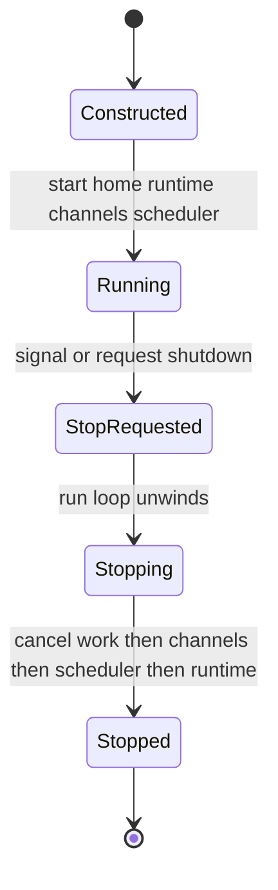
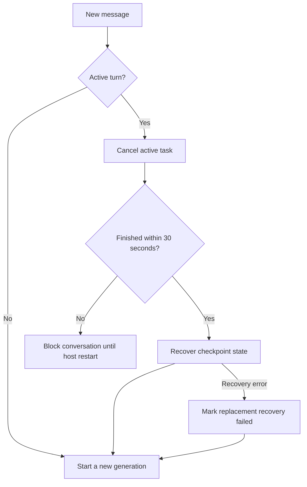

# Talon: Local Runtime Host

> **Experimental / single-operator limitation.** Talon is an experimental, alpha-status runtime that may change or be removed at any time; it is not intended for production or enterprise use. It has no production-grade complete human-in-the-loop (HITL) policy, channel administrator controls, sandbox-backed execution isolation, or multi-tenant boundaries. Treat channel access as direct access to the operator's agent, model credentials, MCP tools, and local host resources. While these hardening features remain unimplemented, their absence is not a security-vulnerability report category.

Talon (`libs/talon`) runs one long-lived Deep Agents assistant locally. It makes the assistant reachable through WhatsApp, Telegram, and Discord adapters and can run self-contained prompts later through persistent cron jobs. Its central boundary is `TalonHost`: channels deliver messages to it; it invokes an `AgentRuntime`; it returns text or permitted attachments to the originating channel; and it owns the optional scheduler lifecycle.

## Boot and host lifecycle

The CLI builds `TalonConfig`, a per-assistant `CronJobStore`, cleans retained state, selects channel adapters from `--whatsapp`, `--telegram`, and `--discord`, and builds the runtime. A scheduler is installed only when at least one channel exists, because its results need a channel destination. With a configured model it asynchronously loads MCP tools and constructs `DeepAgentRuntime`; without one it uses `EchoAgentRuntime`, which returns the inbound text and is useful for testing boot and transport wiring without provider credentials.

`TalonHost.start()` creates the restricted assistant home, starts the runtime, registers its message callback on every adapter (and reaction callback where supported), starts channels, and finally starts the scheduler. `run_until_stopped()` installs `SIGINT`/`SIGTERM` handlers and waits for a stop event. `--once` performs this bootstrap and then stops immediately.

Talon host lifecycle and ordered teardown.

Shutdown cancels all in-flight work and pending approval futures first, then stops channels in reverse registration order, stops the scheduler, stops the runtime, and sets the stopped event. `request_shutdown()` and signals use the same teardown path. A stopped-but-not-running host simply sets the event.

## Conversations: replacement, cancellation, and recovery

A channel conversation is the unit of agent history and task ownership. When multiple adapters are attached, Talon prefixes the root with the provider key so equal provider-local conversation IDs cannot collide. `/new` adds a reset suffix to form a fresh agent thread; `/stop` cancels the current one. Both commands accept a Telegram-style `@bot` command suffix.

Normal inbound messages are not queued behind an active turn: a new message replaces it. Talon cancels the active task, waits up to 30 seconds, then asks `AgentRuntime.recover_interrupted()` to record recovery before it starts the replacement on the same thread. `DeepAgentRuntime` implements recovery by reading the latest checkpoint, repairing pending tool calls, and appending a system interruption marker. The cancelled turn's partial response is never delivered; generation checks also prevent an obsolete task from delivering after replacement.

Per-conversation interruption and recovery for an inbound replacement.

If cancellation times out, Talon leaves the old run isolated, blocks further messages for that conversation, tells the sender the new message was not started, and requires a host restart to recover. If checkpoint recovery itself fails, Talon still starts the replacement but marks its metadata as failed recovery. Process shutdown only cancels tasks; it does not perform interruption recovery. Cron runs instead use a per-job lock and a `<job-id>:talon-cron` thread, preventing overlapping invocations of the same job.

## Runtime graph and tools

`AgentRuntime` defines `start`, `stop`, `invoke`, and `recover_interrupted`, separating host orchestration from agent implementation. `DeepAgentRuntime.start()` builds a graph with `create_deep_agent`. The graph receives the resolved model, backend, tools, middleware, `interrupt_on`, memory, subagents, skills, system prompt, and checkpointer. Its default `InMemorySaver` shares history between turns of one thread but is not durable across a host restart.

Unless explicit values override them, the materialized assistant directory supplies `AGENTS.md`, `skills/`, local subagents under `agents/`, and memory paths. The runtime also includes `fetch_url` and `web_search` by default; cron tools appear only when a cron store was supplied. It invokes the graph with a thread-specific `thread_id` and a recursion limit of 500 by default, tunable with `DEEPAGENTS_TALON_RECURSION_LIMIT`.

Transient provider, parse, context-limit, and transport failures are retried up to the configured retry count with capped exponential backoff. If the graph yields no text, the runtime sends bounded continuation nudges and then a no-tools summary prompt. Tool-approval interrupts are resumed with an approval or rejection payload, capped at 50 rounds.

The default backend is a non-virtual `LocalShellBackend` rooted at `DEEPAGENTS_TALON_WORKSPACE` or the current directory. Its child environment is not inherited wholesale: it permits a small benign set and `LC_` variables, removes secret and environment-hijack keys, and substitutes a fixed safe `PATH`. This reduces accidental secret propagation, but it is not sandbox isolation.

## Channels, media, and approvals

Adapters implement `ChannelAdapter` for lifecycle, inbound handler registration, status, typing, text, media, and edits. `ReactionChannelAdapter` additionally registers a reaction handler. For each ordinary inbound message, the host obtains provider metadata, augments voice or media input where applicable, refreshes a best-effort typing indicator while invoking the agent, and sends the resulting text. Markdown image/video references in results become attachments only if their resolved paths are inside the configured outbound-media root (or workspace); rejected or failed attachments yield explanatory fallback text.

The shared channel exposure model defaults to `self`; adapters can use `allowlist` or `open`. Open exposure requires the acknowledgement value `allow-arbitrary-senders` and deliberately permits arbitrary senders to drive the operator's agent, so it does not change the experimental security warning above. The common media cap is `DEEPAGENTS_TALON_MAX_MEDIA_BYTES`, default 1 GiB; provider API limits still apply. WhatsApp uses a bundled Node bridge bound to `127.0.0.1` and a per-process bearer token, and clamps media to 64 MiB because the bridge materializes downloads in memory. Telegram uses Bot API long polling, and Discord uses the Gateway client.

When the graph pauses for an approval during a channel run, the host stores a pending future keyed by agent conversation, sends a prompt showing tool names and arguments, and resumes only after `approve`/`deny` text or a matching thumbs-up/thumbs-down reaction. The initiating sender is the only authorized decision maker. A pending approval does not make arbitrary text a new agent turn: invalid text receives instructions, and a non-initiator is rejected. Scheduled runs and requests without a channel approval handler auto-deny gated tools rather than waiting indefinitely. `DEEPAGENTS_TALON_INTERRUPT_ON_TOOLS` adds comma-separated names to, rather than replaces, the graph's `interrupt_on` configuration.

## Persistent cron

`CronJobStore` saves assistant-scoped records to `cron/jobs.json`. Each record carries prompt, schedule, repeat state, origin conversation, next run, and last outcome. It writes through a temporary file, `fsync`, atomic replacement, directory sync, and `0600` permissions. Agent-facing `create_job`, `list_jobs`, `edit_job`, and `remove_job` are origin-scoped through a context variable set for each runtime request, so a turn can manage only jobs from its conversation.

Schedules support `in 30m` one-shots and `every 15m` recurring runs, have minute minimum granularity, and may have a recurring repeat cap. `PersistentCronScheduler` scans immediately and then at a 60-second default interval, waking early on its stop event. It first advances and persists a due job's next run—claiming that interval before invoking the agent—then records `ok` or `error`. One-shots and exhausted recurring jobs are disabled. Non-empty output returns to the recorded origin; leading `[SILENT]` suppresses delivery. A delivery failure changes the persisted outcome to an error even if generation succeeded.

## Operations, state, and observability

`TalonConfig.from_env()` gives `DEEPAGENTS_TALON_ASSISTANT_ID` precedence over `AGENT_ASSISTANT_ID`, validates the value as a safe path segment, and defaults it to `default`. It similarly prefers `DEEPAGENTS_TALON_MODEL` to `AGENT_MODEL`. State defaults to `~/.deepagents/<assistant-id>/` (override the base with `DEEPAGENTS_TALON_HOME`); `ensure_home()` creates the manifest, `agents/`, `cron/`, `channels/`, and `media/inbound/` directories at `0700`.

Before host construction, startup deletes completed cron records older than `DEEPAGENTS_TALON_CRON_RETENTION_DAYS` (30 by default) and inbound media older than `DEEPAGENTS_TALON_INBOUND_MEDIA_RETENTION_HOURS` (24 by default). WhatsApp credentials are deliberately retained until removed by the operator because cleanup would unpair the channel.

`log_event` emits JSON payloads prefixed `talon_event`, redacting recognized secret keys, bearer values, URL query strings, and direct `conversation_id`, `message_id`, and `sender_id` fields. Cron emits `cron.tick`, dispatch, success/failure, and delivery events; interruption and approval paths also emit structured events. Set `DEEPAGENTS_TALON_AGENT_ACTIVITY_LOGGING=true` for local run, model-lifecycle, and tool activity events. Tool input/output previews are redacted and truncated to 1,000 characters, but may still include sensitive application data; restrict local log access. Thinking events expose model-call lifecycle rather than hidden chain-of-thought.

LangSmith is opt-in only when `LANGSMITH_TRACING` is truthy and `LANGSMITH_API_KEY` is set. Each host invocation is then wrapped with assistant, conversation, trigger, and message metadata and tags; if the optional package is absent, Talon warns and continues untraced. Treat this and every other external integration as an outbound data surface.

## MCP and focused verification

For a configured model, Talon loads MCP tools before creating the graph. Explicit `DEEPAGENTS_TALON_MCP_CONFIG` takes precedence over `MCP_CONFIG`; otherwise discovery uses the Deep Agents Code project context, including user and project `.mcp.json` locations. `deepagents-talon mcp config` prints paths and precedence, while `deepagents-talon mcp login <server>` delegates OAuth login. Per-server loading status is logged, but a malformed selected configuration can fail loading.

Focused tests cover host boot/shutdown, message replacement, reset, cancellation timeout, checkpoint-recovery degradation, media containment, typing refresh, and approval authorization in `libs/talon/tests/test_host.py`. Runtime tests exercise graph wiring, retries, recovery, environment scrubbing, and approval resumption; cron scheduler tests verify pre-run claiming, status persistence, silent results, delivery failures, and structured event ordering. See [MCP integration](./mcp.md), [permissions and HITL](../concepts/permissions-hitl.md), [subagents and skills](../concepts/subagents-skills.md), and [security operations](../operations/security.md) for the adjacent concerns.
