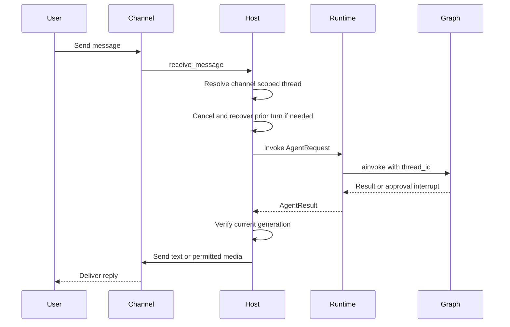
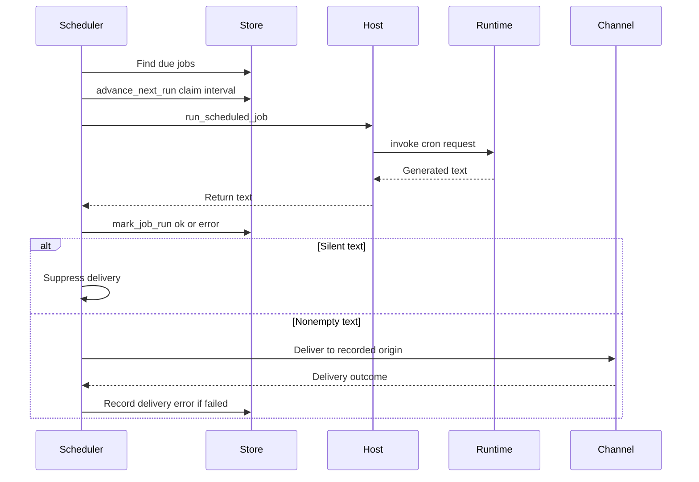

# Talon Runtime Host

> **Experimental, not production-hardened.** Talon is alpha software and is not intended for production or enterprise use. It has no complete production HITL policy, channel administrator controls, sandbox isolation, or multi-tenant boundary. Treat access to a Talon channel as direct access to the operator's agent, credentials, MCP tools, and local host.

Talon (`libs/talon`) is a long-running host for **one assistant**. `TalonHost` owns an `AgentRuntime`, zero or more channel adapters, and optionally a cron scheduler in one asyncio event loop. The standard CLI can attach WhatsApp, Telegram, and Discord adapters; without a configured model it instead uses the echo runtime, which returns the incoming text.

## Start, ownership, and shutdown

Run the CLI from `libs/talon`:

```bash
cd libs/talon
uv sync --group test
AGENT_ASSISTANT_ID=local AGENT_MODEL=<provider>:<model-id> uv run deepagents-talon --once
```

`TalonConfig.from_env()` selects `DEEPAGENTS_TALON_ASSISTANT_ID` before `AGENT_ASSISTANT_ID`, validates the identifier as a safe path segment, and defaults it to `default`. It similarly prefers `DEEPAGENTS_TALON_MODEL` over `AGENT_MODEL`. The assistant home defaults to `~/.deepagents/<assistant-id>/`; `ensure_home()` creates the home, manifest, agent, cron, channel, and inbound-media locations with `0700` permissions, and initializes the per-assistant tool policy.

The model-backed CLI opens a local SQLite LangGraph checkpointer and an archive, wraps both in `ConversationSaver`, then creates `DeepAgentRuntime` with MCP tools and the cron store. It attaches `PersistentCronScheduler` only when one or more channels exist, wiring job execution to `TalonHost.run_scheduled_job` and delivery to the originating channel. `--once` starts and immediately stops the host; otherwise `run_until_stopped()` waits for a shutdown request or supported `SIGINT`/`SIGTERM` signal.

`start()` ensures the home, starts the runtime, binds each channel's message handler and optional reaction handler, starts channels, then starts the scheduler. A partial startup unwinds already-started components. On stop, Talon cancels the background loop, in-flight work, and pending approval/authorization futures; stops channels in reverse order; then stops scheduler and runtime. Component-stop failures are logged so subsequent teardown still runs.

## Channel turn lifecycle

`ChannelAdapter` is the transport boundary: adapters provide lifecycle methods, inbound message registration, text/media send, editing, typing, and status; `ReactionChannelAdapter` adds reaction registration. The host uses a trusted provider/channel key plus channel conversation ID as the conversation root. This unconditional channel scoping avoids provider collisions, but old bare-key checkpoints/reset counters from a prior deployment are intentionally not migrated.



This shows a channel turn; the generation check drops a reply made stale by a later turn.

A new ordinary message replaces rather than queues behind an active turn in the same conversation. Talon increments that turn's generation, cancels it, and attempts `recover_interrupted()` within the shared 30-second cancellation budget. Recovery patches pending tool calls in the latest graph state and appends an interruption marker. A result is delivered only if its thread and generation are still current, while separate conversations can proceed concurrently. If cancellation or recovery times out, the conversation is blocked until restart; if recovery fails, the replacement is allowed with degraded-interruption metadata.

`/new` cancels current work, atomically increments the persisted reset counter, and makes subsequent turns use a fresh thread ID with the reset suffix. `/stop` cancels the current conversation. `/reset-all-history`, when a history-capable runtime is active, cancels work, clears only the channel/chat archive and checkpoints, and advances the reset; failures roll the reset counter back where possible. `/mcp-reload` requests an MCP reload without restart, and `/help` does not interrupt work.

## Runtime and execution boundary

The `AgentRuntime` protocol (`start`, `stop`, `invoke`, and `recover_interrupted`) separates host orchestration from the implementation. `DeepAgentRuntime.start()` resolves subagents and builds the Deep Agents graph; direct construction defaults to `InMemorySaver`, while the normal model-backed CLI provides persistent `ConversationSaver`. Each graph call supplies the Talon conversation ID as LangGraph `thread_id` and applies the per-invocation recursion limit.

The runtime adds time and progress-message tools, history tools when `ConversationSaver` is used, and cron tools when supplied a cron store. It sets history scope, archive session, cron origin, approval authority, authorization handler, and message handler in context variables around each invocation. Retryable provider, parse, context-limit, and transport errors are retried with exponential backoff. If the graph returns no text, it sends configured continuation nudges and then a force-summary prompt.

MCP refresh or explicit reload builds a replacement graph before assigning it, so failed reload leaves the existing graph usable. Subagent reload similarly validates a replacement graph and affects later turns; an active invocation retains its captured graph and capabilities.

The default backend is a non-virtual `LocalShellBackend` rooted at `DEEPAGENTS_TALON_WORKSPACE` or the current directory. Its child environment removes known secret and environment-hijack keys and sets a fixed safe `PATH`. This is defensive hygiene, **not sandboxing**.

## Approvals, OAuth, and media

Tool approval policy is a fixed per-assistant `tools.json`: exact tool names mapped to booleans determine which calls interrupt for approval; unspecified names do not prompt. The policy store validates a bounded regular file and supports revision-based atomic updates. An invocation captures a policy snapshot, so saved changes take effect on a later invocation rather than changing a running turn.

For a channel approval interrupt, the host records a pending decision keyed by agent conversation and accepts text or a matching emoji decision only from the sender who initiated the turn. Cron and unattended/background turns have no interactive handler, so gated calls are auto-denied instead of blocking work. This approval mechanism is useful interaction control but does not alter Talon's experimental security posture.

For channel-mediated MCP OAuth, the host sends an authorization URL or device code only to the origin chat. It accepts a callback only from the same sender, provider, and conversation before the binding expires; authorization values travel through the authorization handler rather than model content. Host shutdown cancels outstanding authorization futures.

Talon refreshes channel typing while a turn runs and can send agent progress messages only while the originating turn remains current. Result Markdown media is converted to outbound attachments only when the resolved file is contained by the configured outbound-media root (or workspace fallback); failed attachments are represented in fallback text.

## History and scheduled work

The standard model-backed CLI persists checkpoints and a channel/chat-scoped archive through `ConversationSaver` in `checkpoints.sqlite`; a directly constructed runtime is in-memory by default. Archives are namespaced by assistant ID. `DEEPAGENTS_TALON_HISTORY_URI` can select built-in SQLite, MongoDB, PostgreSQL, or exactly one trusted operator-installed entry-point backend; persistent checkpoints stay local. History access is scoped to the active channel/chat, and scheduled runs do not receive that history scope.

`CronJobStore` keeps assistant-scoped jobs in `cron/jobs.json`, including schedule, origin, and run outcome, using a fsynced temporary file and atomic replacement with restrictive permissions. The runtime exposes create, list, edit, and remove cron tools only when it has a store, and those tools use the request's origin context so they operate within the current conversation's jobs.



This shows the scheduled-work lifecycle: claiming occurs before invocation, and a failed delivery replaces an otherwise successful run outcome with an error.

`PersistentCronScheduler` scans immediately and normally every minute; it also wakes promptly for stop. A failed scan is logged and retried on the usual interval, so due jobs remain due. For each due job it claims the next interval before invoking it, preventing that claimed interval from being rerun after a crash between invocation and outcome recording. Output whose trimmed text starts or ends with `[SILENT]` is not delivered. Scheduled jobs use a job-specific thread and recorded origin channel; if no matching channel exists, delivery cannot occur.

## Observability and operations

Talon emits structured, redacted `talon_event` logs. The optional `DEEPAGENTS_TALON_AGENT_ACTIVITY_LOGGING=true` callback emits local run/model/tool activity with bounded, redacted previews and does not expose hidden chain-of-thought. LangSmith tracing requires both a truthy `LANGSMITH_TRACING` and `LANGSMITH_API_KEY`, and includes assistant, conversation, and request metadata. These traces, remote history stores, embedding providers, and MCP services are outbound data surfaces.

Channel log verbosity comes from `DEEPAGENTS_CODE_DEBUG` or `DEEPAGENTS_CODE_LOG_LEVEL`; valid explicit levels are `DEBUG`, `INFO`, `WARNING`, `ERROR`, and `CRITICAL`. Focused host tests exercise lifecycle, routing, turn cancellation, approval/OAuth identity binding, commands, and media containment. Runtime tests cover graph configuration, retries, continuation, recovery, policy snapshots, history, and reload; scheduler tests cover claims, silence, and delivery-failure recording.

See [architecture overview](../architecture/overview.md), [permissions and HITL](../concepts/permissions-hitl.md), [state persistence](../concepts/state-persistence.md), [subagents and skills](../concepts/subagents-skills.md), [MCP integration](./mcp.md), and [security operations](../operations/security.md).
