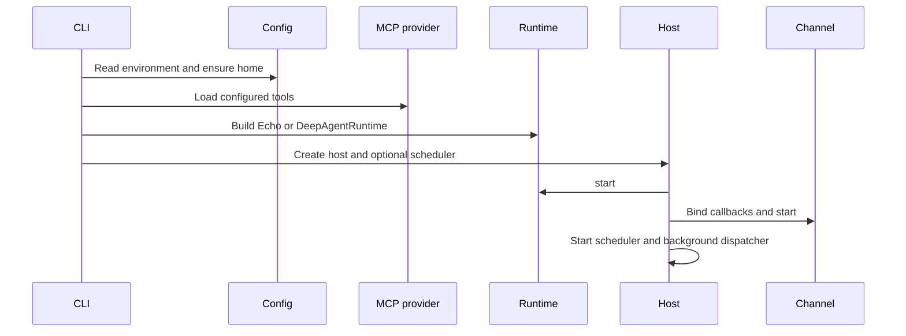
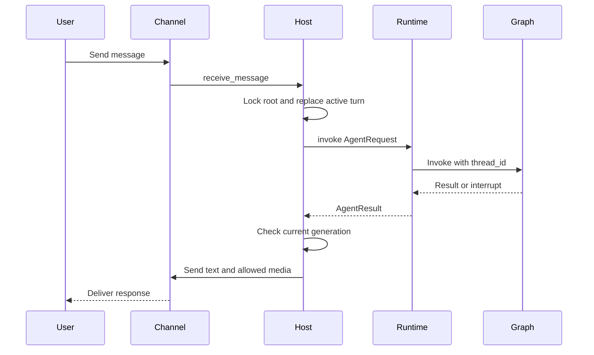
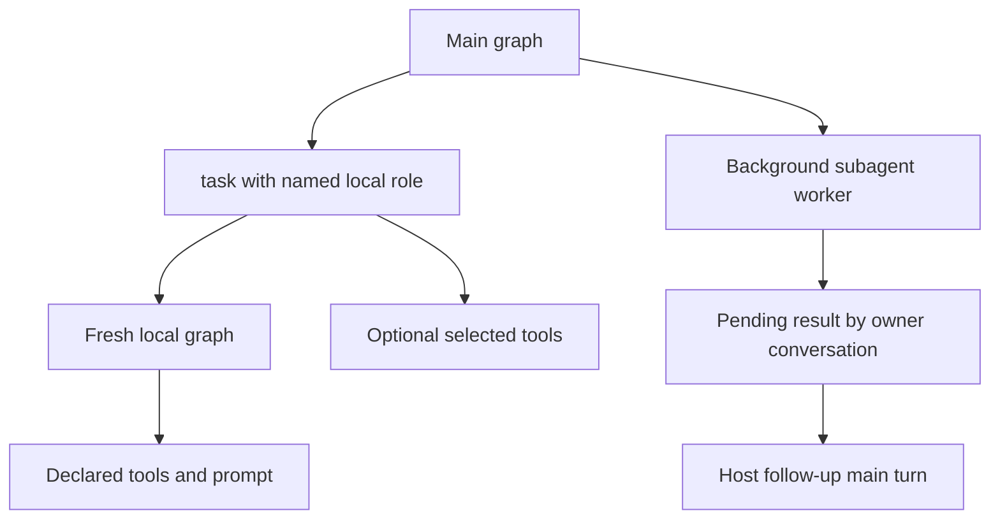
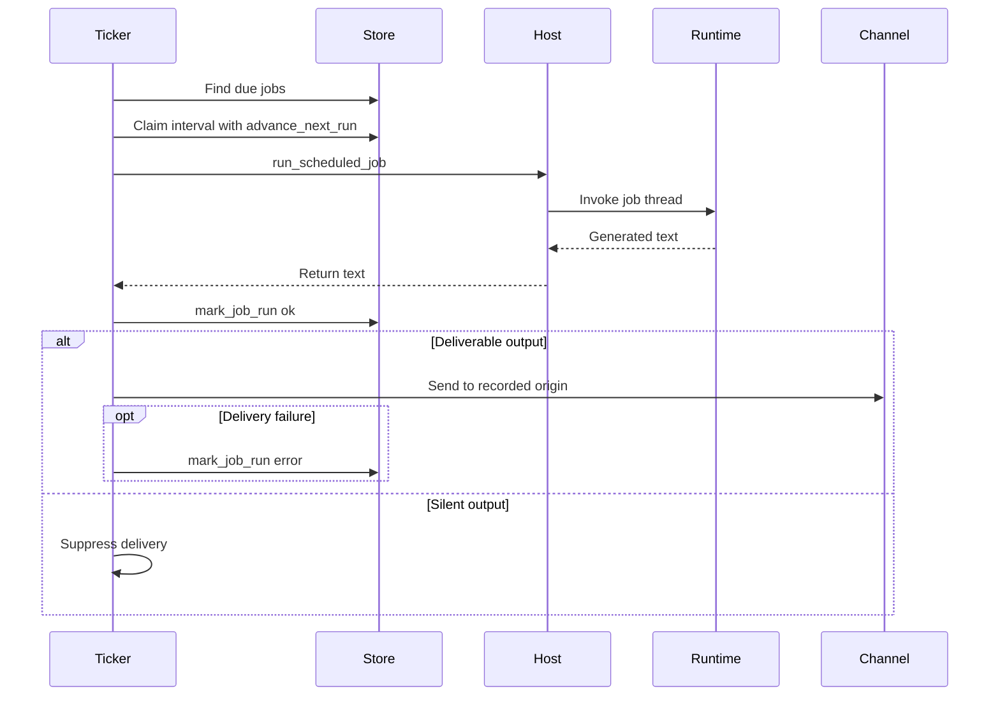

# Talon Long-Running Host

> **Experimental and not production-hardened.** Talon is alpha software and is not intended for production or enterprise use. It does not provide complete HITL policy, channel administrator controls, sandbox isolation, or multi-tenant boundaries. Treat access to a configured channel as direct access to the operator's agent, credentials, MCP tools, and local host.

Talon (`libs/talon`) is the process boundary for **one assistant**. `TalonHost` owns an `AgentRuntime`, zero or more channel adapters, and optionally a persistent cron scheduler in one asyncio event loop. The host owns transport-facing state—turn replacement, delivery, resets, approvals, and authorization callbacks—rather than making the agent graph own it.

## Bootstrap and lifecycle

Run the packaged `deepagents-talon` command from `libs/talon` (or use `uv --directory libs/talon`). `--whatsapp`, `--telegram`, and `--discord` select the built-in adapters, and `--once` proves startup and teardown without serving. The CLI constructs `TalonConfig`, ensures the assistant home, creates the cron store, cleans sensitive state, then selects channels.

If no model is configured, the CLI uses `EchoAgentRuntime`, which returns request text and is useful for lifecycle and adapter wiring checks. With a model, it opens the local SQLite LangGraph checkpointer and history archive, wraps them in `ConversationSaver`, loads MCP tools, and constructs `DeepAgentRuntime`. A `PersistentCronScheduler` is attached only when a channel exists, because scheduled output requires a routable channel origin.

`DEEPAGENTS_TALON_ASSISTANT_ID` takes precedence over `AGENT_ASSISTANT_ID`; it defaults to `default`, is validated as a safe path segment, and namespaces the assistant home. `DEEPAGENTS_TALON_MODEL` similarly takes precedence over `AGENT_MODEL`. `ensure_home()` creates the manifest, agent, cron, channel, and inbound-media directories with mode `0700`, and initializes the per-assistant tool approval store.

This is the normal model-backed bootstrap; the echo branch omits persistent graph setup and MCP loading.

`start()` starts the runtime, binds channel callbacks, starts channels, and then starts the scheduler. A partial-start failure unwinds scheduler, already-started channels, and runtime. `run_until_stopped()` installs supported signal handlers; `request_shutdown()` sets the stop event. Shutdown first cancels the background dispatcher, turns, approvals, and authorizations; it then stops channels in reverse order, followed by scheduler and runtime. It attempts every component stop even after an earlier failure.

## Conversation turns and delivery

A channel conversation root is `provider:channel-conversation-id`. It is the serialization-lock key, the LangGraph thread root, and the persisted reset-counter key, preventing provider collisions. A reset suffix (`:talon-reset:<n>`) makes the active agent thread distinct after `/new`.

This is the normal inbound turn. Work in one conversation is serialized, while different conversations may run concurrently. A new message replaces an active turn: Talon cancels it, attempts recovery from the latest checkpoint, and increments a generation that prevents stale progress or final output from being delivered. A cancellation that exceeds 30 seconds blocks that conversation until restart; failed checkpoint recovery instead permits the replacement with failure metadata.

Commands are case-insensitive and accept an optional bot suffix. `/new` cancels current work and atomically advances the persisted reset counter. `/stop` cancels the active conversation. `/reset-all-history` is available only to a history-capable runtime: it stops work, clears this channel/chat's archive and checkpoints, and advances the reset counter, but does not remove cron jobs, memory, media, traces, or backups. `/mcp-reload` reloads MCP configuration outside an agent turn and returns a generic failure message rather than a configuration or transport error.

`ChannelAdapter` defines lifecycle, inbound-message registration, typing, text/media send, edit, and status operations; `ReactionChannelAdapter` adds reaction callbacks. The host refreshes typing best-effort, can transcribe supported voice input, includes inbound-media context in model content, and routes nonempty results. Markdown media becomes an attachment only when its resolved path remains inside the outbound media root; failures are represented in fallback text.

## Runtime graph, policy, and resumption

`AgentRuntime` (`start`, `stop`, `invoke`, and `recover_interrupted`) separates host orchestration from a particular graph. `DeepAgentRuntime.start()` resolves subagents, snapshots the tool-approval policy, and calls `create_deep_agent`. Its graph receives the resolved model, local-shell backend, system prompt, skills, memory, checkpointer, tools, middleware, approval `interrupt_on` configuration, and subagents. Each invocation captures the then-current graph and uses its conversation ID as LangGraph `thread_id` with a configurable recursion limit.

The standard tool set includes `current_time` and host-mediated messaging, plus archive tools when the checkpointer is a `ConversationSaver` and cron tools when a cron store is supplied. The runtime scopes archive access and cron mutations with context variables around each invocation. It retries retryable provider, parse, context-limit, and transport failures with exponential backoff. Empty final graph output gets continuation nudges and finally a no-tools summary prompt; approval resumption is capped at 50 rounds.

The default backend is a non-virtual `LocalShellBackend`, rooted at `DEEPAGENTS_TALON_WORKSPACE` or the current directory. Its child environment is scrubbed of secret and environment-hijack keys and uses a fixed `PATH`. This reduces accidental credential propagation, but it is **not** a sandbox boundary.

Tool approvals come from the per-assistant `tools.json` policy. The policy is a flat mapping of exact tool names to whether the call requires an interactive prompt; a `false` value does not remove the tool or authorize an untrusted caller. Policy writes use a revision-based atomic compare-and-swap, and a changed snapshot takes effect on the next invocation, while active turns and tasks retain their captured graph. An invalid policy fails closed on the next invocation.

For an attended channel interrupt, the host stores a pending approval by conversation and accepts a recognized text response or a matching reaction only from the originating sender. Cron and background-delivery turns have no interactive handler, so protected calls are auto-denied rather than left blocked. The runtime turns the decision into a LangGraph `Command` resume payload.

## MCP loading, authorization, and safe replacement

`MCPToolProvider` reads the configured MCP file (or `~/.deepagents/.mcp.json`), loads each server independently, prefixes loaded tool names with the server name, marks them as Talon MCP tools, and records per-server availability. Its resulting tool set also contains status, reload, configuration-management, and—when OAuth is present—authorization tools. Duplicate names fail loading rather than selecting an ambiguous capability. The CLI passes this provider's refresh and explicit reload callbacks to `DeepAgentRuntime` and adds `talon_mcp_middleware()` to the main graph.

The middleware applies only to metadata-marked MCP tools. It normalizes a tool call's arguments against its schema, establishes the authorization invocation context, and converts an `MCPError` to a bounded protocol-error `ToolMessage` instead of exposing error data. Fresh local subagent graphs also receive this middleware, so directly attached MCP tools retain the same authorization and error boundary.

For channel OAuth, Talon sends the authorization URL or device code directly to the origin chat. A callback is accepted only when its sender, provider, conversation, binding, and expiry match the pending flow. Callback values bypass model context and tracing. Unattended work cannot start an authorization interaction.

Both automatic refresh and `/mcp-reload` build a replacement graph before assigning it. An invalid MCP edit therefore leaves the previous graph usable; failed automatic refresh is logged as inactive saved changes. The same replacement discipline applies to explicit subagent reloads, and each active invocation continues on its captured graph.

## Fresh, configured, and background subagents

Talon has no implicit general-purpose subagent. Local definitions are resolved from the assistant's `agents/<name>/AGENTS.md`; the CLI also loads remote async definitions from `~/.deepagents/config.toml`'s `[async_subagents]` tables. Invalid remote configuration fails the entire load rather than silently omitting an agent.

Local subagents are **fresh-context** agents. They receive their declared prompt and explicitly attached tools, not parent conversation history, parent memory, implicit skills, or delegation tools. `mode: fork` is rejected. A local role can declare built-in web access, and the main agent can add a unique selection of available tools to a named local task for that task only; the selection augments rather than replaces its configured tools. Shell access is likewise explicit. The safe `get_agent_tools` inventory distinguishes each graph's attached tools from selectable tools and flags saved changes that have not been activated.

This shows that a fresh local task has explicit capabilities, while background results return to the owning main conversation rather than becoming an unsolicited channel reply.

For runtimes with `BackgroundRuntime`, the host polls once per second. When an owner conversation is idle, it starts a route-preserving follow-up turn that injects completed results. Repeated failures back off exponentially. If a consuming turn is replaced, cancelled, or cannot be delivered, the host requeues the background result instead of losing it. A scheduled job registers its origin route before invocation, so delegated work can still return to the job origin even if the initial scheduled run fails.

## Persistence and scheduled work

The model-backed CLI uses `ConversationSaver` over local `checkpoints.sqlite`; a directly constructed `DeepAgentRuntime` defaults to `InMemorySaver`. Archive history is channel/chat-scoped, retained without automatic expiry, and stores text, tool-call arguments, and revisions. Scheduled runs are excluded from chat archive history. `DEEPAGENTS_TALON_HISTORY_URI` can select built-in SQLite, MongoDB, PostgreSQL, or a trusted installed entry-point backend; archives are assistant-namespaced while checkpoints stay local. Operate with one writer per assistant.

`CronJobStore` persists assistant-scoped jobs in `cron/jobs.json` with origin, scheduling, and outcome state. It uses fsynced temporary-file replacement and mode `0600`. Cron tools are exposed only when a store is configured and are origin-scoped through the invocation context.

This shows interval claiming before generation and the separate delivery outcome. The scheduler scans immediately, normally ticks at minute granularity, and logs a failed scan before retrying. It suppresses text that begins or ends with `[SILENT]`. Each job runs on its own `<job-id>:talon-cron` graph thread under a separate lock; delivery failure replaces an otherwise successful recorded outcome with an error.

## Operations and focused verification

Talon emits redacted structured `talon_event` logs and can emit bounded local agent-activity logs. LangSmith tracing requires both `LANGSMITH_TRACING` and `LANGSMITH_API_KEY` and carries assistant, conversation, and request metadata. MCP services, remote history stores, remote embedding services, and tracing are outbound data surfaces. Channel logging follows `DEEPAGENTS_CODE_DEBUG` or `DEEPAGENTS_CODE_LOG_LEVEL` (`DEBUG`, `INFO`, `WARNING`, `ERROR`, or `CRITICAL`).

The focused subagent tests verify the key containment properties: fresh tasks do not inherit parent history or memory, tools and shell access must be attached explicitly, fork mode is rejected, local MCP tools retain middleware protections, and failed subagent edits leave the effective graph unchanged. Host and runtime tests cover lifecycle unwinding, cancellation/recovery, approval identity, authorization binding, background result recovery, graph reload safety, retries, and cron delivery outcomes.

See [permissions and HITL](../concepts/permissions-hitl.md), [state persistence](../concepts/state-persistence.md), [subagents and skills](../concepts/subagents-skills.md), [MCP integration](./mcp.md), [security operations](../operations/security.md), and the [testing guide](../testing/testing-guide.md).
