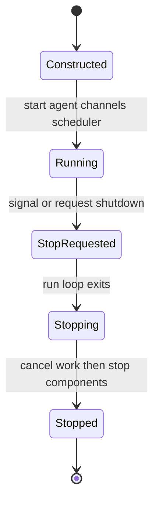
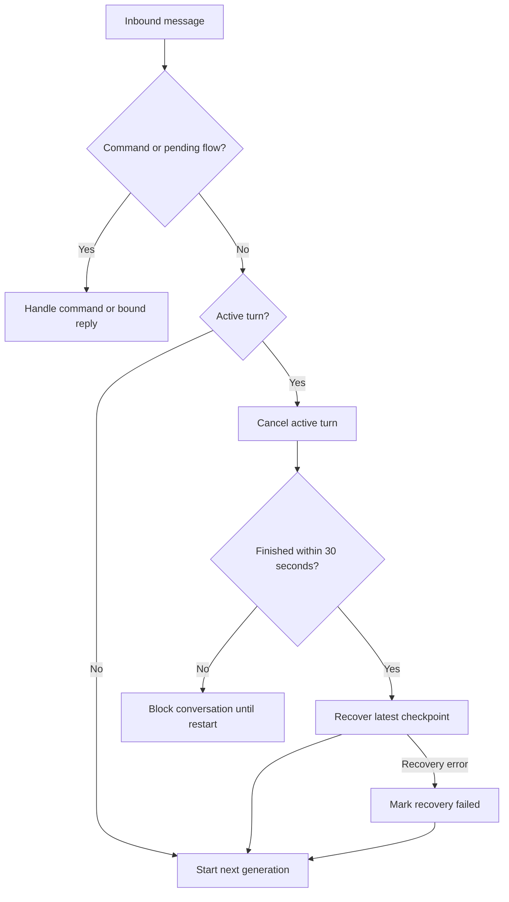
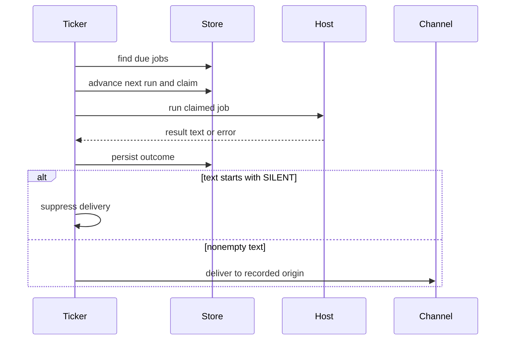

# Talon: Local Runtime Host

> **Experimental and non-isolated.** Talon is alpha software, not intended for production or enterprise use. It does not provide complete production HITL policy, channel administrator controls, sandbox-backed execution isolation, or multi-tenant boundaries. Treat channel access as direct access to the operator's agent, credentials, MCP tools, and local host resources.

Talon (`libs/talon`) is the long-running local process for one assistant. `TalonHost` joins an `AgentRuntime`, zero or more channel adapters, and an optional cron scheduler in one asyncio event loop. The CLI supplies WhatsApp, Telegram, and Discord adapters; with a configured model it builds `DeepAgentRuntime`, and without one it intentionally uses `EchoAgentRuntime` to exercise host and transport wiring without provider credentials.

## Composition and lifecycle

Startup first creates the assistant home, then starts the agent, registers channel callbacks, starts channels in registration order, and starts the scheduler. The main run loop installs `SIGINT` and `SIGTERM` handlers and waits for the stop event; `--once` starts and immediately stops. Shutdown cancels all tracked agent tasks and pending approval/authorization futures, stops channels in reverse order, then the scheduler, then the runtime. A scheduler is attached by the CLI only if channels exist, because its results require a delivery destination.

Talon host lifecycle. Channel startup follows agent startup; teardown reverses channel order before scheduler and runtime teardown.

## Conversation execution and replacement

A channel conversation is the agent thread and task-ownership unit. With more than one configured channel, Talon prefixes the thread root with the provider key to avoid cross-provider ID collisions. It persists reset counters in `conversations.json`; `/new` cancels the current work, increments that counter, and uses the resulting suffix for a fresh thread. The real CLI supplies SQLite-backed LangGraph checkpoints at `checkpoints.sqlite`, so conversation history and recovery checkpoints survive a restart; `DeepAgentRuntime` itself defaults to an in-memory checkpointer when embedded without one.

`receive_message` recognizes `/new`, `/stop`, and `/mcp-reload` before ordinary work. It also intercepts a pending tool-approval decision or an MCP authorization response before it can become a replacement prompt. Normal messages do not queue: a newer message cancels the active task in that conversation, attempts checkpoint recovery, and starts a new generation. Different conversations remain independent.

Inbound replacement control flow. Generation checks prevent a cancelled or superseded task from delivering a stale result.

Cancellation consumes a 30-second total budget, including recovery. On timeout the conversation is blocked until host restart and the replacement is not started. If recovery fails, the replacement still runs with failure metadata. Deep runtime recovery reads the current graph state, repairs pending tool calls, and appends a system interruption marker after the latest committed checkpoint. `/stop` and `/new` perform this recovery path; process shutdown only cancels work.

## Graph, tools, and local execution

`AgentRuntime` separates host orchestration from implementation through `start`, `stop`, `invoke`, and `recover_interrupted`. `DeepAgentRuntime.start()` calls `create_deep_agent` with the resolved model, backend, tools, middleware, approvals, memory, subagents, skills, system prompt, and checkpointer. Each invocation passes its conversation as LangGraph `thread_id` and a recursion limit of 500 by default, configurable through `DEEPAGENTS_TALON_RECURSION_LIMIT`.

Absent explicit overrides, the materialized assistant directory supplies `AGENTS.md`, `skills/`, local `agents/` subagents, and memory configuration. The runtime always exposes `current_time`; it includes `fetch_url` and `web_search` by default, and adds conversation-scoped cron tools only when it has a cron store. MCP tools are loaded before graph construction, refreshed between turns when authorization changes their availability, and can be reloaded through `/mcp-reload` when the runtime supports it. Replacement graph construction occurs before swapping the active tool set, preserving the old graph if construction fails.

Provider, parsing, context-limit, and transport errors are retried with capped exponential backoff. Empty results receive bounded continuation nudges followed by a no-tools summary request. Approval interrupts resume with explicit LangGraph decisions and are capped at 50 rounds.

The default backend is non-virtual `LocalShellBackend`, rooted at `DEEPAGENTS_TALON_WORKSPACE` or the current directory. Its child environment has a small allowlist, excludes secret and environment-hijack keys, and receives a fixed safe `PATH`. This reduces accidental credential exposure but does **not** sandbox local filesystem or shell execution.

## Channel ingress, approvals, and outbound data

A channel adapter registers its inbound message handler with the host; reaction-capable adapters also register `receive_reaction`. During a turn, Talon transcribes eligible voice input, represents media metadata in model content, refreshes a best-effort typing indicator, and returns the result to the originating conversation. Markdown media references are turned into attachments only when their resolved files stay under the configured outbound-media root; rejected or failed attachments are reported in fallback text.

The shared exposure policy defaults to `self`, also supports `allowlist` and `open`, and requires `allow-arbitrary-senders` acknowledgement for open access. WhatsApp is a bundled Node bridge bound to loopback and protected with a per-process bearer token; its media cap is 64 MiB because bridge downloads are materialized in memory, below the common 1 GiB default. These controls do not change Talon's experimental security boundary.

For a channel-triggered approval interrupt, the host records a pending future by agent conversation, displays requested tool names and arguments, and accepts `approve`/`deny` text or matching thumbs-up/thumbs-down reaction only from the initiating sender. Invalid text gets instructions and another sender is rejected. `DEEPAGENTS_TALON_INTERRUPT_ON_TOOLS` additively marks listed tool names for this flow. Cron and requests without an approval handler auto-deny gated calls rather than waiting.

MCP OAuth/device authorization is similarly bound to provider, conversation, and initiating sender. The URL or device code is delivered directly to the channel; callback URLs are intercepted outside model context and tracing. A terminal successful authorization suppresses the redundant agent result only when Talon delivered the completion notice.

## Durable cron jobs

`CronJobStore` persists assistant-owned jobs in a versioned `cron/jobs.json` envelope. Jobs include the self-contained prompt, schedule/repeat state, delivery origin, next run, and last outcome. The store uses temporary-file write, fsync, atomic replacement, directory sync, restrictive `0700` directory and `0600` file permissions. Its read-all/write-all design is a single-writer store rather than a cross-process coordination mechanism.

The agent receives `create_job`, `list_jobs`, `edit_job`, and `remove_job` only when a store is configured. A context variable derives its `CronOrigin` from the active request, so those tools can only see or mutate jobs for the current conversation and channel.

Schedules are minute-granularity and support `in 30m`, `every 15m`, `at 2026-09-04 13:30 America/New_York`, and `daily at 08:00 America/New_York`. Wall-clock forms require a valid IANA zone; daily schedules recompute from local dates to retain local time across DST, snapping nonexistent times forward and choosing the earlier occurrence of ambiguous times. Interval schedules remain phase-locked to their previous due time, and one-shot wall-clock times in the past are rejected.

Cron dispatch order. Persisting the claimed next interval before invocation prevents the same due record from being run again by a later scan.

`PersistentCronScheduler` scans immediately and then every 60 seconds by default, while allowing stop to wake it early. It catches unexpected tick errors, logs `cron.tick_failure`, and continues scanning on the normal interval; jobs still due can be picked up later. Before invocation it claims the due interval by advancing `next_run_at`; one-shots and exhausted repeat caps are disabled. It records agent failures as `error`, records generation success as `ok`, suppresses text beginning with `[SILENT]`, and converts a delivery failure to a persisted error.

## Configuration, retention, and observability

`TalonConfig.from_env()` prefers `DEEPAGENTS_TALON_ASSISTANT_ID` over `AGENT_ASSISTANT_ID`, validates a safe path segment, and defaults to `default`; it gives `DEEPAGENTS_TALON_MODEL` the same precedence over `AGENT_MODEL`. State is normally `~/.deepagents/<assistant-id>/` (or `DEEPAGENTS_TALON_HOME`) and `ensure_home()` creates the manifest, `agents/`, `cron/`, `channels/`, and `media/inbound/` directories at `0700`.

Before the host is constructed, CLI startup prunes completed cron records older than `DEEPAGENTS_TALON_CRON_RETENTION_DAYS` (30 days by default) and inbound media older than `DEEPAGENTS_TALON_INBOUND_MEDIA_RETENTION_HOURS` (24 hours by default). WhatsApp credentials remain until an operator removes them, since cleanup would unpair the client.

Structured `talon_event` JSON logs redact recognized secrets, bearer strings, URL query values, and direct PII marker keys including conversation, message, and sender IDs. Cron emits tick, dispatch, success/failure, and delivery lifecycle events alongside persisted status. Optional `DEEPAGENTS_TALON_AGENT_ACTIVITY_LOGGING=true` emits run, model, and tool activity with bounded/redacted previews; it reports model lifecycle rather than hidden chain-of-thought. LangSmith tracing requires both truthy `LANGSMITH_TRACING` and `LANGSMITH_API_KEY`, and wraps each host invocation with assistant, conversation, trigger, and message metadata. It is an outbound data boundary.

## Focused verification and related pages

Focused host tests cover startup/shutdown, command and replacement behavior, cancellation timeout and degraded recovery, persisted reset state, media containment, approval authorization, and MCP authorization interception. Runtime tests cover graph wiring, checkpoint recovery, retries, environment scrubbing, tool refresh/reload, and interrupt decisions. Cron job and scheduler tests exercise schedule validation including DST behavior, scoped tools, atomic persistence, pre-run claiming, tick resilience, silent output, delivery failure, and structured event ordering.

See [MCP integration](./mcp.md), [permissions and HITL](../concepts/permissions-hitl.md), [subagents and skills](../concepts/subagents-skills.md), [security operations](../operations/security.md), and the [testing guide](../testing/testing-guide.md) for adjacent concerns.
