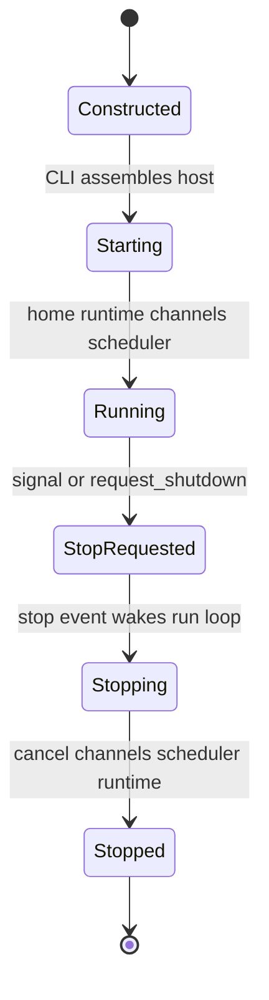
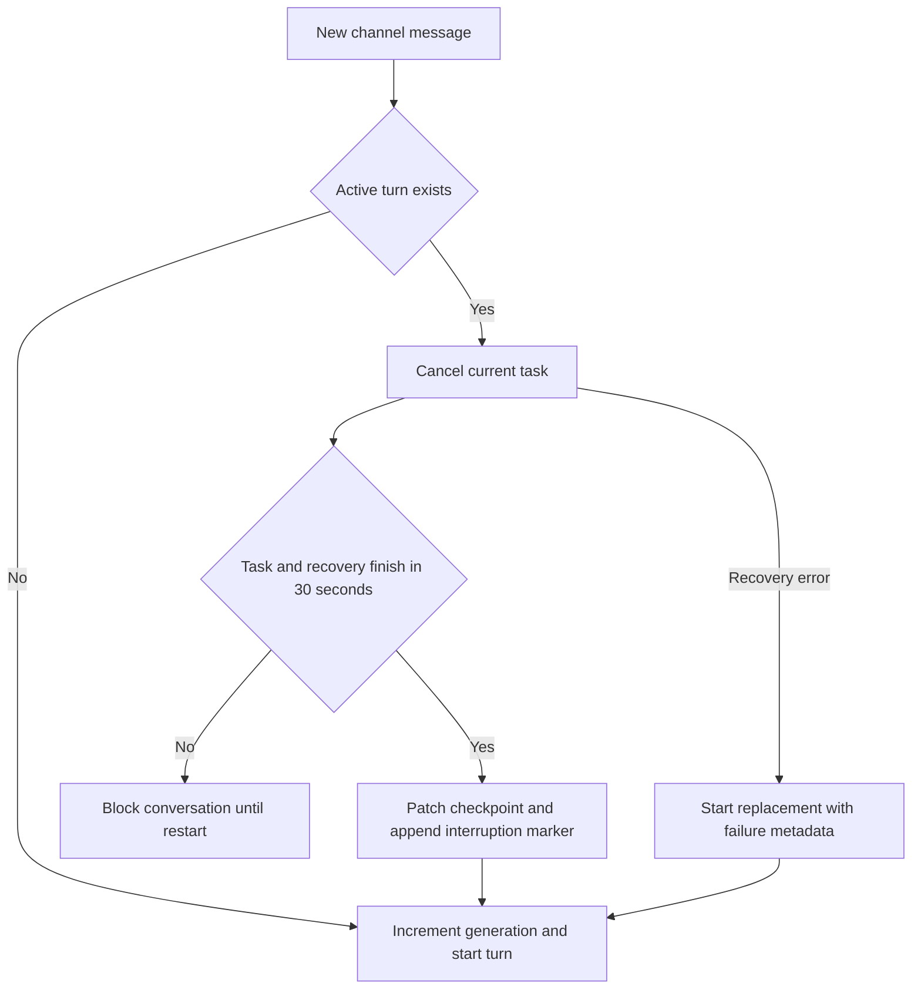
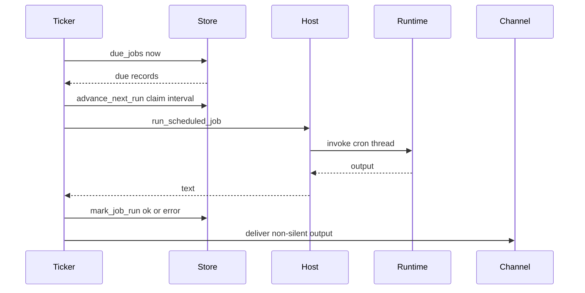

# Talon Local Runtime Host

> **Experimental and single-operator only.** Talon is alpha software, not intended for production or enterprise use. It does not provide complete production HITL policy, channel administrator controls, sandbox isolation, or multi-tenant boundaries. Treat the ability to send a channel message as direct access to the operator's agent, credentials, MCP tools, and local host resources.

Talon (`libs/talon`) is the long-running process boundary around one assistant. `TalonHost` owns an `AgentRuntime`, zero or more channel adapters, and optionally a persistent scheduler in one asyncio loop. Channels send it inbound work; it supplies a conversation-specific agent request and routes the result back to the originating conversation. WhatsApp, Telegram, and Discord are the built-in adapters.

## CLI boot and lifecycle

Run `deepagents-talon` from `libs/talon`; `--whatsapp`, `--telegram`, and `--discord` select adapters (or their enabled environment flags do). `--once` starts then immediately stops the assembled host. The CLI reads `TalonConfig`, builds the cron store, creates the assistant home, cleans retained cron/media state, constructs channels, and enters the async host. It attaches `PersistentCronScheduler` only when at least one channel exists, since a scheduled result needs a delivery destination.

If `DEEPAGENTS_TALON_MODEL` (or fallback `AGENT_MODEL`) is absent, boot uses `EchoAgentRuntime`, which returns the request text and is useful for validating lifecycle and transport wiring without model-provider credentials. Otherwise it opens `checkpoints.sqlite` with an async SQLite checkpointer and archive, wraps them in `ConversationSaver`, loads MCP tools, and creates `DeepAgentRuntime`.

Talon host lifecycle. The scheduler transition occurs only when the CLI attached it.

`start()` ensures the restricted home, starts the runtime, installs each channel's message handler (and reaction handler when supported), starts channels, then starts the scheduler. `run_until_stopped()` waits on an event after attempting to register `SIGINT` and `SIGTERM`; `request_shutdown()` sets that event. On teardown the host first cancels its background-results loop, then all in-flight agent tasks and pending approval/authorization futures; it stops channels in reverse registration order, then the scheduler, then the runtime, and finally marks itself stopped. Shutdown cancels work but deliberately does not write interruption-recovery state.

## Conversations, history, replacement, and recovery

A channel conversation owns the agent thread, task, generation, pending approval, and—when the standard CLI runtime is used—durable archive scope. Roots are provider-prefixed if there are multiple channels **or** persistent history is enabled, avoiding cross-provider collisions. `/new`, `/stop`, `/reset-all-history`, `/mcp-reload`, and `/help` are recognized case-insensitively with an optional `@bot` suffix.

`/new` cancels current work, persists an incremented reset counter in `conversations.json`, and makes the next thread id `<root>:talon-reset:<n>`; earlier sessions remain searchable. `/reset-all-history` is available only to a history-capable runtime: after cancellation it deletes archived sessions and checkpoints for this channel/chat and advances the reset counter. It does not delete cron jobs, memory files, media, traces, or backups. A cancellation timeout leaves data intact and a storage failure can leave a partial reset that should be retried.

Replacement control flow for one conversation.

Ordinary inbound messages replace rather than queue behind the active turn. Talon increments a per-thread generation before cancellation, waits no more than 30 seconds, and calls `recover_interrupted()`. `DeepAgentRuntime` reads the latest committed graph state, repairs pending tool calls, and appends a system interruption marker. Delivery additionally checks the current thread and generation, so an obsolete task cannot emit stale output. A cancellation timeout blocks that conversation until restart and refuses the new message; a recovery failure permits the replacement but annotates its metadata. Separate conversations may run concurrently.

The CLI's `ConversationSaver` persists checkpoints and a channel/chat-scoped archive in `checkpoints.sqlite`, so history survives restarts and context compaction. Archive tools let the agent list, search, and read bounded pages of its own channel/chat history; text, tool arguments, and message revisions are retained. Scheduled runs do not create archive history. The echo runtime, and custom checkpointers not wrapped in `ConversationSaver`, do not provide archive or reset support; `DeepAgentRuntime` alone defaults to in-memory checkpoints.

## Runtime graph, workspace, and subagents

`AgentRuntime` (`start`, `stop`, `invoke`, and `recover_interrupted`) isolates host orchestration from agent implementation. `DeepAgentRuntime.start()` builds the Deep Agents graph with `create_deep_agent`. It wires the resolved model, backend, runtime tools, middleware, approval policy, memory, skills, subagents, and checkpointer. Every invocation uses the conversation id as LangGraph `thread_id` and a recursion limit of 500 by default (`DEEPAGENTS_TALON_RECURSION_LIMIT`).

Unless explicitly supplied, Talon obtains the system prompt from `AGENTS.md`, skills from `skills/` plus configured skill directories, local subagents from `agents/<name>/AGENTS.md`, and memory from manifest/environment paths or `memory/AGENTS.md`. It adds `current_time`, optionally web `fetch_url`/`web_search`, archive tools when history is enabled, and cron tools when a cron store exists. Local and remote background subagents can be reloaded for subsequent turns; background results cause a later main-agent turn, while workers and pending results are in-memory only.

The default execution backend is non-virtual `LocalShellBackend`, rooted at `DEEPAGENTS_TALON_WORKSPACE` or the current directory. Its child environment is allowlisted, removes common secret and environment-hijack variables, and uses a fixed `PATH`; this reduces accidental credential propagation but is not sandboxing. Runtime retries retryable provider, parse, context-limit, and transport failures with capped exponential backoff. When the graph returns no text, it makes bounded continuation attempts then requests a no-tools summary. Approval interrupt/resume processing is capped at 50 rounds.

## Channels, media, and approvals

A `ChannelAdapter` supplies lifecycle, inbound handler registration, status, typing, text/media sends, and edits. A `ReactionChannelAdapter` additionally supplies inbound reactions. During an agent turn Talon best-effort refreshes typing every four seconds, transcribes opted-in voice input, augments model content with media context, and routes nonempty output. Markdown image/video references become attachments only when their resolved paths are within the configured outbound-media root (or the workspace when no distinct media directory is set); rejected or failed files are named in fallback text.

The shared exposure policy is `self` by default, with `allowlist` and `open` modes. `open` requires the explicit `allow-arbitrary-senders` acknowledgement and must be understood as giving arbitrary senders access to the operator's agent. The shared media maximum is `DEEPAGENTS_TALON_MAX_MEDIA_BYTES` (1 GiB by default, subject to provider limits). WhatsApp uses a bundled Node bridge bound to loopback and authenticated by a per-process bearer token; its effective cap is 64 MiB because downloads are materialized in memory. Telegram uses Bot API long polling and Discord uses its Gateway client.

When a channel invocation pauses for a tool approval, the host records a future keyed by agent conversation, sends tool names and argument previews, and resumes only after an approving or rejecting text reply or matching thumbs-up/down reaction. The same provider, chat, and initiating sender must decide; unrelated text receives the prompt again and other users are rejected. `DEEPAGENTS_TALON_INTERRUPT_ON_TOOLS` additively overlays tool names onto `interrupt_on`. Cron-triggered requests, or requests with no channel approval handler, auto-deny gated calls rather than blocking forever.

## Persistent cron scheduling

`CronJobStore` persists assistant-scoped jobs in `cron/jobs.json`, including prompt, schedule, repeat state, origin conversation/channel/message, next run, and last outcome. Writes use a temporary file, `fsync`, atomic replacement, and mode `0600`. Cron tools—`create_job`, `list_jobs`, `edit_job`, and `remove_job`—are present only when the runtime has a store and obtain their origin from a request context variable, so an agent turn can manage only jobs from its own origin conversation.

Schedules have one-minute minimum granularity and accept `in 30m`, `every 15m`, `at 2026-09-04 13:30 America/New_York`, and `daily at 08:00 America/New_York`. Wall-clock forms require an IANA zone and preserve local time across daylight-saving changes; daily gaps advance to the first existing minute and ambiguous times choose the earlier occurrence. Interval schedules remain phase-locked to the preceding due time, and recurring jobs can carry a repeat cap.

The scheduler claims and persists the next interval before it invokes the agent, preventing a due interval from being run twice after a crash between invocation and outcome recording.

`PersistentCronScheduler` scans immediately and then every 60 seconds by default, but wakes promptly on its stop event. A tick failure is logged and the loop continues, leaving jobs due for a later scan. One-shots and exhausted recurrences are disabled. It records `ok` or `error`; nonempty output goes to the recorded origin unless trimmed output begins or ends with `[SILENT]`. A delivery error overwrites the successful generation outcome with an error.

## MCP, configuration, and observability

For model-backed boot, `MCPToolProvider` loads MCP tools before graph construction and can refresh/rebuild the graph when tools change. `DEEPAGENTS_TALON_MCP_CONFIG` selects an explicit configuration; otherwise Talon uses the default `.deepagents/.mcp.json` discovery location. `deepagents-talon mcp config` prints resolved paths and `deepagents-talon mcp login <server>` runs terminal OAuth. In chat, an OAuth-capable server can send its authorization link directly to the originating chat and accept a callback URL only from that same sender/provider/chat; those values bypass model context and tracing. `/mcp-reload` reloads manual configuration changes.

`TalonConfig` chooses `DEEPAGENTS_TALON_ASSISTANT_ID` before `AGENT_ASSISTANT_ID`, validates a safe 1–128-character path segment, and defaults to `default`; model selection likewise prefers the Talon variable. State is `~/.deepagents/<assistant-id>/` unless `DEEPAGENTS_TALON_HOME` changes the base. `ensure_home()` makes the home, manifest, `agents/`, `cron/`, `channels/`, and `media/inbound/` at `0700`. Startup removes completed cron records after 30 days and inbound media after 24 hours by default; WhatsApp credentials remain until the operator removes them.

Structured `talon_event` JSON logging redacts recognized secret/PII fields, including direct conversation, message, and sender IDs. Cron emits tick, dispatch, success/failure, delivery, suppression, and delivery-failure events, complementing persisted job status. `DEEPAGENTS_TALON_AGENT_ACTIVITY_LOGGING=true` enables local run, model-lifecycle, and bounded/redacted tool previews; it does not log hidden chain-of-thought. LangSmith tracing requires both a truthy `LANGSMITH_TRACING` and `LANGSMITH_API_KEY`; each channel or cron invocation is wrapped with assistant, conversation, trigger, and message metadata. External traces and MCP servers are outbound data surfaces.

## Verification and related concepts

Focused host tests cover boot/shutdown ordering, commands, replacement/cancellation timeout, recovery degradation, history reset, media containment, typing, approval authorization, and MCP authorization. Runtime tests cover graph wiring, retry/continuation behavior, recovery, environment scrubbing, persistent history, and approval resumption. Cron tests cover parsing and DST behavior, persistence/atomic writes, pre-run claiming, silent output, delivery failures, and event ordering.

See [permissions and HITL](../concepts/permissions-hitl.md), [state persistence](../concepts/state-persistence.md), [subagents and skills](../concepts/subagents-skills.md), [MCP integration](./mcp.md), and [security operations](../operations/security.md) for related concerns.
