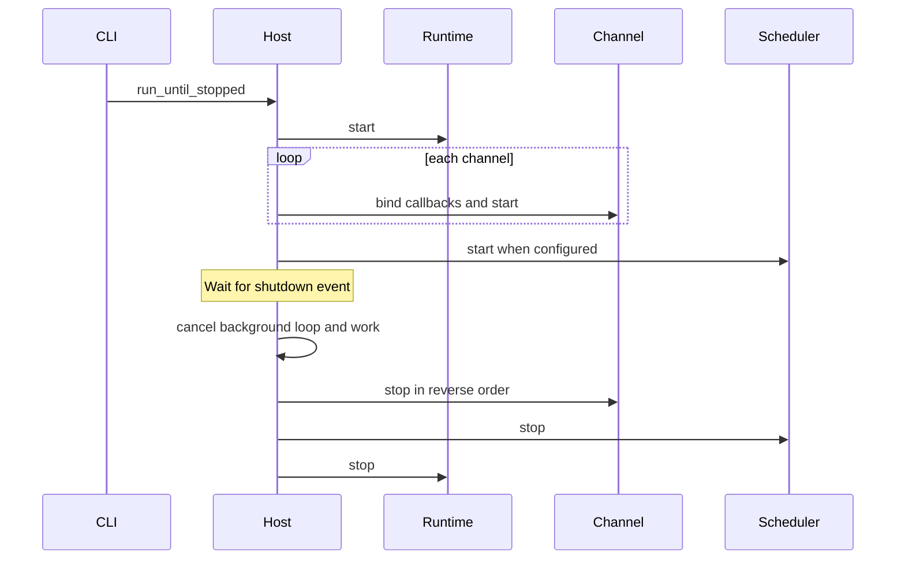
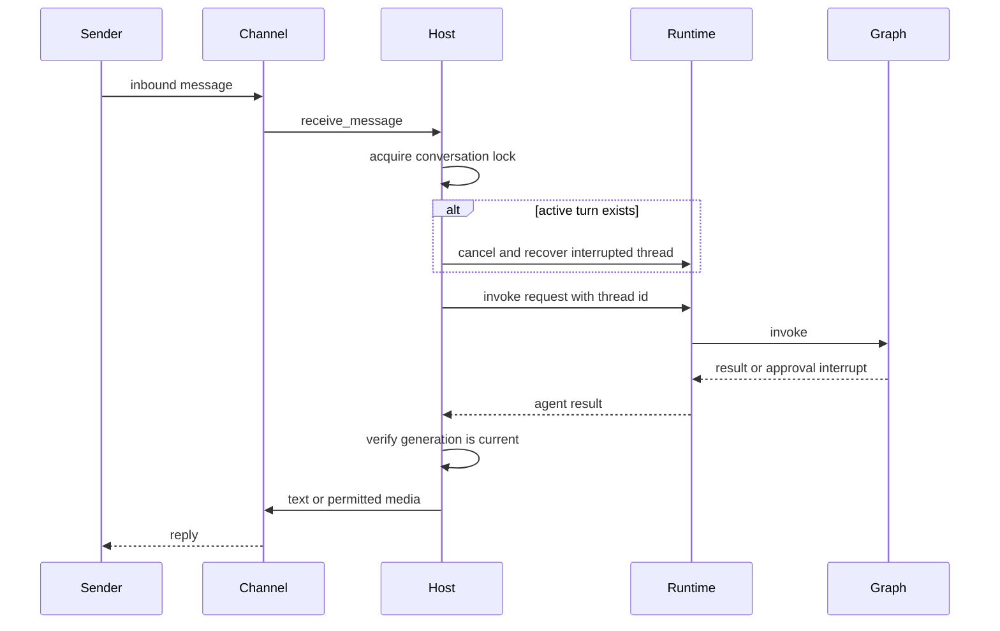
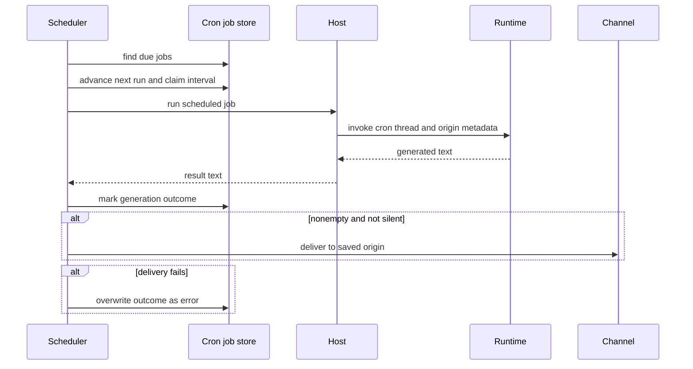

# Talon Runtime Host

> **Experimental, not production-hardened.** Talon is alpha software and is not intended for production or enterprise use. It lacks complete human-in-the-loop policy, channel administrator controls, sandbox-backed isolation, and multi-tenant boundaries. Channel access must be considered direct access to the operator's agent, credentials, MCP tools, and local host resources.

Talon (`libs/talon`) is a local host process for **one assistant**. `TalonHost` owns an agent runtime, channel adapters, and optionally a cron scheduler in one asyncio event loop. It translates channel events into conversation-scoped agent work and routes results to the originating chat. The bundled CLI can attach WhatsApp, Telegram, and Discord; WhatsApp uses a loopback Node bridge.

## Startup and failure-safe lifecycle

Run the CLI from `libs/talon`:

```bash
cd libs/talon
uv sync --group test
AGENT_ASSISTANT_ID=local AGENT_MODEL=<provider>:<model-id> uv run deepagents-talon --once
```

`--whatsapp`, `--telegram`, and `--discord` select adapters (environment enablement is also supported); `--once` verifies bootstrap by starting and immediately stopping. The CLI builds `TalonConfig`, initializes the cron store and state home, performs sensitive-state cleanup, creates channels, and chooses the runtime. Without a model it uses `EchoAgentRuntime`, which returns the request text; with a model it opens a SQLite checkpointer and archive, wraps them in `ConversationSaver`, loads MCP tools, and builds `DeepAgentRuntime`. A `PersistentCronScheduler` is connected only when a channel exists, since a scheduled result needs an origin delivery route.

`start()` creates the assistant home, starts the agent, binds channel callbacks before each channel starts, then starts the scheduler. Startup is transactional at the component level: if a channel or scheduler start raises, Talon stops the started scheduler if any, channels in reverse order—including a channel that partially started—and the agent before propagating the error. `run_until_stopped()` installs `SIGINT`/`SIGTERM` handlers where supported; either a signal or `request_shutdown()` sets the stop event.



This lifecycle shows start ordering and best-effort reverse-order teardown. A start failure unwinds already-started components before it escapes.

`stop()` first cancels the background-result loop, all conversation tasks, and outstanding tool-approval and authorization futures. It then stops channels in reverse order, the scheduler, and the runtime. Each stop is attempted even if an earlier one fails, so shutdown releases as much as possible. Runtime teardown is intentionally conservative: if background workers outlive their cancellation wait, `DeepAgentRuntime.stop()` leaves its graph/checkpointer resources open rather than close them under a still-writing worker; the host logs that component failure and continues shutting down.

## Configuration and local state

`DEEPAGENTS_TALON_ASSISTANT_ID` takes precedence over `AGENT_ASSISTANT_ID`, defaults to `default`, and is validated as a 1–128 character safe path segment. `DEEPAGENTS_TALON_MODEL` takes precedence over `AGENT_MODEL`. By default state is under `~/.deepagents/<assistant-id>/`; `DEEPAGENTS_TALON_HOME` changes the base directory. `ensure_home()` materializes defaults and makes the home, manifest, `agents/`, `cron/`, `channels/`, and `media/inbound/` directories `0700`; approval and other state files are restrictive.

The principal local state is `checkpoints.sqlite`, `conversations.json`, `tools.json`, and `cron/jobs.json`. The reset-counter file is atomically replaced with a fsynced `0600` temporary file. Cron state uses the same durable replacement pattern. These permissions reduce accidental local exposure, but do not make Talon a security boundary.

## Channel routing, threads, and interruption

A channel implements `ChannelAdapter`: lifecycle, inbound-handler registration, text/media sends, editing, typing, and status. A reaction-capable adapter also implements `ReactionChannelAdapter`. The host registers callbacks that send inbound messages to `receive_message` and reactions to `receive_reaction`.

Every channel/chat pair is keyed as `<provider>:<conversation-id>`; that key is the conversation lock, LangGraph thread ID, and reset-counter key. This permanently avoids provider collisions. It also means the change from an older bare-key host intentionally leaves prior bare-key checkpoints and reset counters unreachable rather than migrating them.

Commands are case-insensitive and may have an `@bot` suffix: `/help`, `/new`, `/stop`, `/reset-all-history`, and `/mcp-reload`. `/new` cancels the current work, then increments and persists the reset counter; subsequent work uses `<conversation>:talon-reset:<n>`, creating a fresh thread while retaining earlier sessions. `/reset-all-history` is only available with a history-capable runtime. It cancels work, advances the reset counter, clears that channel/chat archive and checkpoints, and rolls the counter back if clearing fails. It does not remove cron jobs, memory files, downloaded media, traces, or backups.

One conversation is serialized, while distinct conversations may run concurrently. A new ordinary message replaces an active turn rather than queueing: Talon advances its generation, cancels the existing task, and attempts checkpoint recovery within the same 30-second cancellation budget. `DeepAgentRuntime.recover_interrupted()` repairs dangling tool calls in the latest state and appends an interruption marker. A reply/progress message is sent only if its generation and current thread still match, preventing stale delivery. A cancellation that exceeds the budget blocks that conversation until restart; recovery failure permits the replacement turn but labels its metadata as failed recovery.



This is the channel execution path. Generation checks discard output from a superseded turn, rather than allowing it to reach the chat.

While a turn runs, typing refresh is best effort. Talon can transcribe voice and augment model content with inbound-media information. It converts Markdown media references in a result to attachments only when the resolved path is within `DEEPAGENTS_TALON_OUTBOUND_MEDIA_DIR`, or the workspace/current directory fallback; rejected or failed attachments are reported in fallback text.

## Runtime, tools, approvals, and MCP

The `AgentRuntime` protocol (`start`, `stop`, `invoke`, and `recover_interrupted`) separates host orchestration from agent implementation. `DeepAgentRuntime.start()` resolves subagents and calls `create_deep_agent` with the model, shell backend, tools, middleware, approvals, skills, memory, subagents, and checkpointer. Direct construction defaults to `InMemorySaver`; the normal model-backed CLI instead supplies persistent `ConversationSaver`. Invocation uses the conversation key as LangGraph `thread_id` and a per-invocation recursion limit (default 500, configurable through `DEEPAGENTS_TALON_RECURSION_LIMIT`). Retryable provider, parsing, context-limit, and transport errors get exponential backoff; empty graph responses get continuation nudges followed by a no-tools summary request.

The default backend is non-virtual `LocalShellBackend`, rooted at `DEEPAGENTS_TALON_WORKSPACE` or the current directory. Its child environment is allowlisted, strips known secrets and environment-hijack variables, and replaces `PATH` with a fixed safe path. That limits inherited environment exposure; it is explicitly not filesystem/process sandboxing.

Tool approvals are configured from the assistant approval store and can interrupt a graph. For a normal channel turn, the host records a pending request by conversation, displays tool names and argument previews, and accepts text (`approve`/`deny` or emoji) or a matching reaction only from the sender who started the run. Unattended work has no interactive decision: cron, background delivery, and a channel turn without an approval handler auto-deny protected calls with an explanatory tool result.

MCP tools are loaded before runtime construction. Refresh or explicit `/mcp-reload` builds a replacement graph before swapping it in, so a failed MCP configuration or graph build leaves the previous graph usable. Explicit subagent reload also builds a replacement for later turns; an active turn/task retains the graph and capabilities it captured.

For channel-based MCP OAuth, the authorization URL or device code is sent directly to the originating chat. The host accepts a callback only when provider, chat, sender, binding, and expiry match the pending flow. Authorization callback values are handled outside model input and are not attached to tracing. `deepagents-talon mcp config` displays discovery paths, while `deepagents-talon mcp login <server>` performs terminal OAuth.

## History, cron, and background work

The standard CLI stores checkpoints and a channel/chat-scoped archive through `ConversationSaver`; history has no automatic expiry. Archive tools are limited to the current channel/chat and bounded retrieval. `/new` retains old sessions for search; scheduled runs do not enter chat history. `DEEPAGENTS_TALON_HISTORY_URI` selects SQLite, MongoDB, PostgreSQL, or one trusted operator-installed entry-point backend. Archives are namespaced by assistant ID and require one writer per assistant; checkpoints remain local.

Cron tools (`create_job`, `list_jobs`, `edit_job`, and `remove_job`) are included only when the runtime has a cron store. A request-scoped context variable supplies the current origin, so agents can only list/edit/remove jobs from the originating conversation. `CronJobStore` persists assistant-scoped prompts, schedules, repeat state, origin, next-run state, and outcomes in `cron/jobs.json`.



This flow shows that the job interval is claimed before generation, and delivery uses the origin stored with the job.

`PersistentCronScheduler` scans immediately and then normally every 60 seconds; scan failures are logged and retried after the normal interval. It claims each due interval with `advance_next_run` before invoking the host, then records `ok` or `error`. This prevents a claimed interval from being rerun after a crash between execution and outcome recording; one-shot and exhausted recurring jobs are disabled at claim time. Output beginning or ending with `[SILENT]` is not delivered. A successful generation followed by delivery failure is recorded as an error.

`BackgroundSubagents` lets a main-agent task continue after its foreground turn. It is in-memory only, limits the host to 128 tasks and four concurrent workers, and gives each worker up to one hour. The host polls completed results, then starts a follow-up main-agent turn for the owning conversation to interpret and deliver them. If that response is superseded before delivery, consumed result IDs are requeued; repeated failures to process a result eventually drop it after three attempts. Cron background follow-ups preserve the job metadata and route to the saved origin, but remain unattended and unarchived.

## Operations and verification

Talon emits redacted structured `talon_event` logs. Optional `DEEPAGENTS_TALON_AGENT_ACTIVITY_LOGGING` adds local bounded/redacted agent activity logging. LangSmith tracing requires both a truthy `LANGSMITH_TRACING` and `LANGSMITH_API_KEY`, and attaches assistant, conversation, trigger, and request metadata. Treat tracing, remote history/vector providers, and MCP services as outbound data surfaces. Channel logger verbosity follows `DEEPAGENTS_CODE_DEBUG` or `DEEPAGENTS_CODE_LOG_LEVEL` (`DEBUG`, `INFO`, `WARNING`, `ERROR`, or `CRITICAL`).

Focused integration tests verify inbound message-to-reply routing, persisted cron delivery to origin, and agent-created jobs. Host tests exercise lifecycle unwind/shutdown, commands, cancellation/recovery, approval and OAuth identity binding, media containment, and background delivery. Runtime tests cover graph wiring, checkpointer/thread configuration, retries, shell-environment scrubbing, approval resumption, and transactional reload. Scheduler tests cover interval claiming, silent results, and delivery-failure outcomes.

See [architecture overview](../architecture/overview.md), [permissions and HITL](../concepts/permissions-hitl.md), [state persistence](../concepts/state-persistence.md), [subagents and skills](../concepts/subagents-skills.md), [MCP integration](./mcp.md), and [security operations](../operations/security.md).
