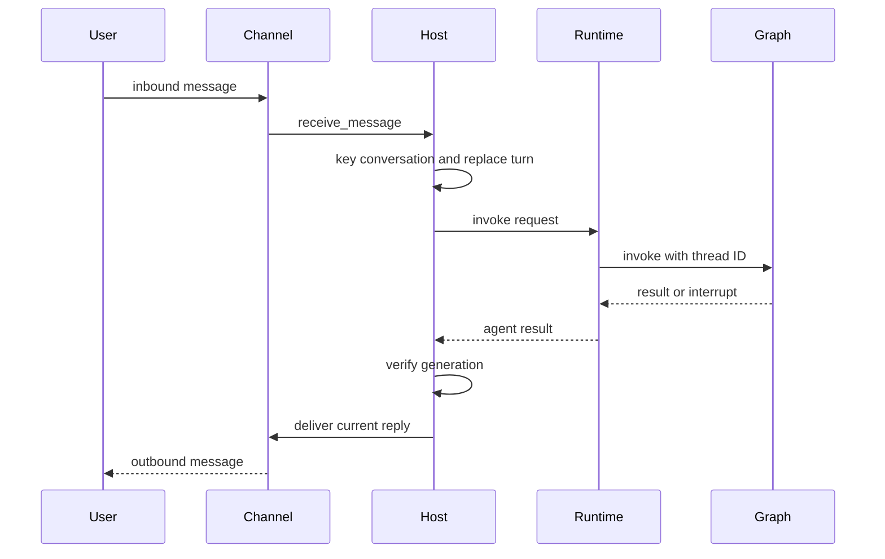

# Talon Runtime Host

> **Experimental, not production-hardened.** Talon is alpha software and is not intended for production or enterprise use. It lacks complete HITL policy, channel-administrator gates, sandbox isolation, and multi-tenant boundaries. Giving somebody channel access is effectively giving them access to the operator's agent, model credentials, MCP tools, and local host.

`libs/talon` is the long-running process boundary for one assistant. `TalonHost` owns one `AgentRuntime`, zero or more channel adapters, and an optional scheduler in one asyncio event loop. The built-in CLI can attach WhatsApp, Telegram, and Discord; without a configured model it uses `EchoAgentRuntime`, which replies with the received text and is useful for checking channel wiring.

## Boot, ownership, and shutdown

The `AgentRuntime` protocol separates the host from the agent implementation: it starts, stops, invokes a conversation request, and recovers an interrupted conversation. `DeepAgentRuntime` is the graph-backed implementation. The model-backed CLI opens a local SQLite LangGraph checkpointer and an archive, wraps them in `ConversationSaver`, loads MCP tools, and constructs the runtime. A scheduler is installed only if a channel exists, because its result needs a delivery route.

`TalonConfig` selects `DEEPAGENTS_TALON_ASSISTANT_ID` before `AGENT_ASSISTANT_ID` (default `default`) and `DEEPAGENTS_TALON_MODEL` before `AGENT_MODEL`. It materializes a restrictive per-assistant home—normally `~/.deepagents/<assistant-id>/`—including manifest, `agents/`, `cron/`, `channels/`, and inbound-media directories. `checkpoints.sqlite` and `conversations.json` must resolve inside that home.

`start()` ensures the home, starts the runtime, binds channel callbacks, starts channels, then starts the scheduler. If a component start fails, already-started channels are unwound in reverse order and the runtime is stopped. A running background-capable runtime also gets a one-second result-dispatch loop. `run_until_stopped()` installs supported `SIGINT`/`SIGTERM` handlers; `request_shutdown()` sets its stop event. Shutdown cancels the background loop and active work, approval and authorization futures, then stops channels in reverse order, scheduler, and runtime. Component-stop errors are logged rather than preventing remaining teardown.

This is the normal channel-to-runtime path; commands, approvals, and scheduled work take controlled variants of it.

## Conversation lifecycle and recovery

A channel's conversation is always keyed by trusted channel/provider plus its channel conversation ID; this key is both the LangGraph thread root and the persisted reset key. That unconditional namespacing deliberately abandons checkpoints and reset counters created by older bare-key hosts: there is no migration. `/new` cancels the current turn and its owned background workers, atomically increments the persisted reset counter, and makes the next turn use `:talon-reset:<n>`. `/stop` cancels current work without starting a new thread. `/reset-all-history`, when the runtime supports history, cancels work, deletes that channel/chat's archived sessions and checkpoints, then advances the reset counter; it does not remove cron jobs, memory, media, traces, or backups.

Ordinary inbound messages replace, rather than queue behind, an active turn in the same conversation. The host increments a generation, cancels the task, then gives cancellation and `recover_interrupted()` one shared 30-second budget. `DeepAgentRuntime` reads the latest committed graph state, repairs pending tool calls, and appends a system interruption marker. A reply is sent only if its thread and generation are still current, so cancelled work cannot emit stale output. Conversations with distinct roots run concurrently. A cancellation timeout blocks that conversation until restart; recovery failure allows the replacement turn but records degraded recovery metadata.

## Runtime graph, tools, and reload behavior

At start `DeepAgentRuntime` resolves local, configured, and async subagents; reads its fixed approval snapshot; and creates a Deep Agents graph with its model, backend, tools, middleware, skills, memory, subagents, approval interrupts, and checkpointer. Invocation pins `thread_id` to the Talon conversation ID and applies the configurable recursion limit (default 500). It retries retryable provider, parse, context-limit, and transport errors with exponential backoff. If graph output is empty, it issues continuation nudges and finally a no-tools summary prompt. Approval resume loops are capped at 50 rounds.

The default backend is a non-virtual `LocalShellBackend` rooted at `DEEPAGENTS_TALON_WORKSPACE` or the current directory. Its child environment drops recognized secrets and environment-hijack keys and uses a fixed safe `PATH`; this reduces accidental propagation but is not sandboxing.

MCP refresh before a turn and explicit `/mcp-reload` build a replacement graph before swapping it in. Consequently, a bad tool update leaves the prior graph usable. Reloading subagent configuration follows the same replacement pattern and applies only to subsequent turns: an active turn captures its graph and capabilities. `get_agent_tools` exposes a credential-free attachment inventory and reports saved-but-inactive changes.

## Subagents and background delivery

Local subagents are fresh-context agents; Talon rejects `fork` mode. Local definitions can receive explicitly configured tools, and the main agent can add exact catalog tools for one task only. Fresh subagents do not inherit the parent history or skills. Remote/compiled subagents are opaque in the capability inventory. Tool approval policy is retained when a fresh local agent is compiled, but an interrupt means its protected action has not run.

`BackgroundSubagents` detaches `task` and `start_async_task` work from the main turn, keeps jobs and final results in memory, and scopes inspection/cancellation to the owning thread. It limits retained jobs to 128, concurrent workers to 4, and each worker to one hour. Completed results are fed into a later main-agent turn by the host dispatcher rather than delivered raw. A discarded reply requeues only the results it consumed, preventing silent loss when a newer turn supersedes it; after three failed delivery attempts, a result is dropped. `/stop` and `/new` cancel only that conversation's workers. Runtime shutdown refuses to close checkpoint resources if background workers outlive cancellation.

## Approvals, channels, media, and OAuth

The per-assistant `tools.json` is an exact-name boolean approval policy. Defaults require prompts for `update_tool_approvals`, `delete_conversations`, `update_mcp_server`, and `start_async_task`; unspecified tools do not prompt. The file is bounded, regular-file/no-symlink read, and updates are atomic revision compare-and-swap. A change becomes active on the next invocation; active turns and tasks retain their snapshot. A prompt is not authorization: self-edits require an operator under the pre-edit policy, and setting `false` affects prompting rather than tool availability.

For an approval interrupt, the host records a future by agent conversation and sends an action summary. It accepts a textual or matching-reaction decision only from the sender that started the run. The host marks a sender as an approval operator only when the configured channel exposure identifies that sender as an operator (or a `from_self` sender in self exposure). Scheduled and background-delivery turns cannot request approvals and auto-deny gated calls with an explanatory tool result.

Channel adapters register the host's message callback; reaction-capable adapters additionally register a reaction callback. The host prepares inbound media and voice transcription, sends typing best-effort, and maps Markdown media references to attachments only when they resolve inside the configured outbound root (or workspace default). Failed or rejected attachments are represented in fallback text.

For MCP OAuth, authorization URLs/device codes go directly to the originating chat. Callback acceptance is bound to the same provider, conversation, sender, server binding, and expiry; authorization values bypass model context and tracing. `DEEPAGENTS_TALON_MCP_CONFIG` chooses a config path, `deepagents-talon mcp config` prints discovery paths, and `deepagents-talon mcp login <server>` provides terminal login.

## History and cron

The standard model-backed CLI persists checkpoints and a channel/chat-scoped archive through `ConversationSaver`; directly constructed `DeepAgentRuntime` defaults to `InMemorySaver`. Runtime context variables scope archive operations to the current channel/chat and cron tools to the current `CronOrigin`. Archives can use SQLite, MongoDB, PostgreSQL, or a trusted installed entry-point backend; they remain namespaced by assistant ID while checkpoints stay local. Archives require one writer per assistant. Scheduled runs deliberately do not enter history.

`CronJobStore` stores assistant jobs in `cron/jobs.json`, including schedule, origin, next-run state, and outcome. Its writes use a fsynced temporary file, atomic replacement, and `0600` permissions. Agent-facing cron tools are present only when the runtime has a cron store and use the request's origin.

`PersistentCronScheduler` scans immediately and normally once per minute, or wakes early for stop. It logs a failed scan and retries at the normal interval. Before generation, it claims the interval with `advance_next_run`; it then records success or failure with `mark_job_run`. One-shot or exhausted jobs are disabled by the claim operation. Output whose trimmed text starts or ends with `[SILENT]` is not delivered. Otherwise the CLI resolves the job's origin channel and sends to its recorded conversation; a delivery error replaces an otherwise successful outcome with an error.

## Operations and verification

Talon emits redacted structured `talon_event` logs and can emit bounded local activity logs. LangSmith tracing requires both `LANGSMITH_TRACING` and `LANGSMITH_API_KEY`, carrying assistant, conversation, trigger, and request metadata. History backends, tracing, MCP servers, and remote embedding services are outbound data surfaces. Channel logger level follows `DEEPAGENTS_CODE_DEBUG` or `DEEPAGENTS_CODE_LOG_LEVEL` (`DEBUG`, `INFO`, `WARNING`, `ERROR`, `CRITICAL`).

Focused tests cover lifecycle unwind/shutdown, channel routing, interruption timeout and recovery, identity-bound approvals and OAuth, attachment containment, reload atomicity, archive scope, cron interval claims and delivery failures, and background ownership/capacity/result requeue. In particular, `tests/unit_tests/test_background.py` verifies that a conversation continues while detached research runs, later processes its result in a main turn, and cannot inspect or cancel another conversation's worker.

See [architecture overview](../architecture/overview.md), [permissions and HITL](../concepts/permissions-hitl.md), [subagents and skills](../concepts/subagents-skills.md), [MCP integration](./mcp.md), and [security operations](../operations/security.md).
