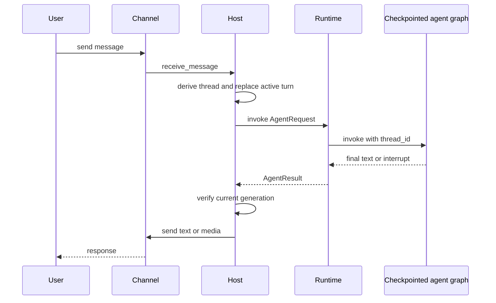

# Talon Long-Running Assistant Host

> **Experimental, single-operator software.** Talon is alpha software and is not intended for production or enterprise use. It lacks complete production HITL policy, channel administrator controls, sandbox isolation, and multi-tenant boundaries. Treat channel access as direct access to the operator's agent, model credentials, MCP tools, and local-host resources.

Talon (`libs/talon`) is the long-running process boundary for **one assistant**. `TalonHost` owns an `AgentRuntime`, zero or more channel adapters, and optionally a persistent cron scheduler in one asyncio event loop. Built-in adapters are WhatsApp, Telegram, and Discord. The host turns a channel event into a conversation-scoped agent request and returns the result to that conversation.

## Boot, home, and lifecycle

Run `deepagents-talon` from `libs/talon`; `--whatsapp`, `--telegram`, and `--discord` select adapters, while `--once` validates startup and immediately tears it down. The CLI loads `TalonConfig`, creates `CronJobStore`, ensures the assistant home, cleans retained sensitive state, builds channels, and runs the host. It attaches a `PersistentCronScheduler` only when a channel exists, because scheduled output requires a delivery destination.

`DEEPAGENTS_TALON_ASSISTANT_ID` takes precedence over `AGENT_ASSISTANT_ID`; it defaults to `default` and must be a safe 1–128-character path segment. `DEEPAGENTS_TALON_MODEL` similarly takes precedence over `AGENT_MODEL`. The default home is `~/.deepagents/<assistant-id>/` (or the `DEEPAGENTS_TALON_HOME` base) and `ensure_home()` creates the home, manifest, `agents/`, `cron/`, `channels/`, and `media/inbound/` with mode `0700`.

Without a model, the CLI uses `EchoAgentRuntime`, which returns request text and is useful for testing lifecycle and channel wiring. With a model, it opens the local SQLite LangGraph checkpointer and the selected history archive, wraps them in `ConversationSaver`, loads MCP tools, and constructs `DeepAgentRuntime`.

`start()` ensures the home, starts the runtime, registers message and supported reaction handlers, starts channels, then starts the scheduler. `run_until_stopped()` installs `SIGINT`/`SIGTERM` where supported and waits for the stop event. `request_shutdown()` sets that event. On teardown, the host cancels the background-results loop, all in-flight work, and pending approval/authorization futures; stops channels in reverse order; then stops scheduler and runtime. Shutdown cancellation intentionally does not write interruption recovery state.

## Channel message to response

This is the normal channel path; a newer message or an approval interrupt changes the path as described below.

## Conversation identity, replacement, and durable history

A conversation root normally comes from the channel conversation ID. Talon prefixes it with the provider when more than one channel is configured or persistent history is enabled, avoiding cross-provider collisions. The current reset counter, persisted in `conversations.json`, is appended as `:talon-reset:<n>` to form the agent thread ID. Commands are case-insensitive and accept an optional `@bot` suffix: `/help`, `/new`, `/stop`, `/reset-all-history`, and `/mcp-reload`.

`/new` cancels the current work and atomically persists an incremented reset counter; the next turn uses a fresh thread while prior sessions remain searchable. `/reset-all-history` is available only to a history-capable runtime. After cancellation it deletes the archive and checkpoints for that channel/chat and advances the reset counter. It does not delete cron jobs, memory files, media, traces, or backups. A cancellation timeout preserves history; a deletion failure can leave a partial reset that should be retried.

A new ordinary message replaces rather than queues behind an active turn. Talon increments a generation, cancels the task, allows **30 seconds total** for cancellation and recovery, and calls `recover_interrupted()`. `DeepAgentRuntime` reads the latest committed graph state, repairs pending tool calls, and appends a system interruption marker. Before delivery, the host verifies both current thread and generation, preventing an obsolete task from sending stale output. A timeout blocks that conversation until restart; recovery failure allows the replacement turn but marks its metadata as degraded. Separate conversations can run concurrently.

The model-backed CLI stores checkpoints in `checkpoints.sqlite` and uses `ConversationSaver` for a channel/chat-scoped archive. The agent can list, search, and read bounded pages of its own archived sessions; scheduled runs do not enter that archive. `DeepAgentRuntime` used directly defaults to `InMemorySaver`, and echo or unwrapped custom checkpointers do not provide archive tools or history reset. The archive backend may instead be selected with `DEEPAGENTS_TALON_HISTORY_URI`; checkpoints remain local.

## Runtime graph, tools, and execution boundary

The `AgentRuntime` protocol (`start`, `stop`, `invoke`, `recover_interrupted`) separates host orchestration from agent implementation. `DeepAgentRuntime.start()` resolves subagents and builds a Deep Agents graph with `create_deep_agent`. Its graph wiring includes the model, filesystem backend, runtime tools, middleware, HITL configuration, skills, memory, subagents, and checkpointer. Each invocation passes the Talon conversation ID as LangGraph `thread_id` and applies a recursion limit of 500 by default, configurable through `DEEPAGENTS_TALON_RECURSION_LIMIT`.

When an assistant directory is supplied, Talon resolves `AGENTS.md`, `skills/`, local `agents/`, and memory sources there, supplemented by configured paths. It adds `current_time`; optional `fetch_url` and `web_search`; archive tools when using `ConversationSaver`; and cron tools when a store is available. MCP tools can refresh before a turn or be explicitly reloaded; a failed replacement leaves the prior graph active. Subagent definitions reload only on request and affect subsequent turns, while running tasks retain their original graph and capabilities.

The default backend is a non-virtual `LocalShellBackend`, rooted at `DEEPAGENTS_TALON_WORKSPACE` or the current directory. Its child environment is allowlisted, removes common secret and environment-hijack keys, and supplies a fixed safe `PATH`. This reduces accidental credential propagation; it is **not** a sandbox. The runtime retries retryable provider, parse, context-limit, and transport failures with exponential backoff. If the graph returns no text, it sends bounded continuation nudges and finally asks for a no-tools summary. Approval interruption/resumption is capped at 50 rounds.

## Channels, media, approvals, and MCP authorization

Adapters implement the channel protocol for lifecycle, handler registration, status, typing, text/media sends, and edits; reaction-capable adapters also register reactions. A turn refreshes typing best-effort, transcribes opted-in voice messages, adds inbound media context to model content, then routes nonempty output. Markdown image/video references are converted to attachments only when their resolved files remain under `DEEPAGENTS_TALON_OUTBOUND_MEDIA_DIR`, or the workspace when no distinct root is configured. Rejected or failed files are named in fallback text.

Exposure defaults to `self`; `allowlist` and `open` are alternatives. `open` requires the explicit `allow-arbitrary-senders` acknowledgement and is equivalent to granting arbitrary senders the operator's agent access. `DEEPAGENTS_TALON_MAX_MEDIA_BYTES` defaults to 1 GiB subject to provider limits; WhatsApp clamps it to 64 MiB because its bridge materializes downloads in memory. Its bundled Node bridge listens only on loopback and uses a per-process bearer token. Telegram uses Bot API long polling and Discord uses its Gateway client.

For a gated tool call in a channel turn, the host records a pending future keyed by agent conversation, sends tool names and argument previews, and accepts an approve/deny text response or matching thumbs-up/down reaction only from the initiating sender in the same provider and chat. Other text repeats the prompt and other users are refused. `DEEPAGENTS_TALON_INTERRUPT_ON_TOOLS` additively overlays tool names onto configured `interrupt_on`. Cron runs—and channel invocations without an approval handler—auto-deny gated calls rather than waiting forever.

MCP tools are loaded before graph construction. `DEEPAGENTS_TALON_MCP_CONFIG` selects an explicit configuration; otherwise discovery uses the default `.deepagents/.mcp.json` location. `deepagents-talon mcp config` prints discovery paths, `deepagents-talon mcp login <server>` performs terminal OAuth, and `/mcp-reload` reloads channel-triggered runtime configuration. For channel OAuth, Talon sends the authorization URL or device code to the origin chat; a callback URL is accepted only from the initiating sender in the same provider and conversation before expiry. Authorization values bypass model context and tracing.

## Persistent cron work

`CronJobStore` persists assistant-scoped jobs in `cron/jobs.json`, including prompt, schedule/repeat state, origin, next run, and last outcome. It writes a fsynced temporary file, atomically replaces the target, and applies mode `0600`. Agent-facing `create_job`, `list_jobs`, `edit_job`, and `remove_job` tools are available only when the runtime has a store and obtain their origin from a context variable, so they are scoped to the current conversation origin.

`PersistentCronScheduler` scans immediately and normally every 60 seconds, waking early for stop. A failed scan is logged and retried on the normal interval, leaving jobs due. For each due job it first claims the interval by `advance_next_run`, invokes the host on a cron-specific thread, and records `ok` or `error` with `mark_job_run`. This pre-run claim prevents rerunning a claimed interval after a crash between invocation and outcome recording. One-shots and exhausted repeat jobs are disabled. Delivery goes to the recorded origin unless trimmed output begins or ends with `[SILENT]`; delivery failure replaces the successful outcome with an error.

## Observability and verification

Structured `talon_event` logs redact recognized secret and PII fields, including direct conversation, message, and sender IDs. Cron logs tick, dispatch, success/failure, suppression, delivery, and delivery-failure events. `DEEPAGENTS_TALON_AGENT_ACTIVITY_LOGGING=true` enables local run, model lifecycle, and bounded/redacted tool previews; it does not emit hidden chain-of-thought. LangSmith tracing requires both a truthy `LANGSMITH_TRACING` and `LANGSMITH_API_KEY`; channel and cron invocations carry assistant, conversation, trigger, and message metadata. MCP servers and external traces are outbound data surfaces.

Focused integration tests exercise inbound channel-to-reply routing and persisted cron delivery to its origin. Runtime tests cover graph wiring, tool refresh/reload transactionality, thread configuration, interruption recovery, retry/continuation behavior, backend environment scrubbing, history, and approval resumption. Host and cron tests cover lifecycle ordering, commands, cancellation timeouts, media containment, approval identity checks, scheduler claiming, silence, and failure behavior.

See [permissions and HITL](../concepts/permissions-hitl.md), [state persistence](../concepts/state-persistence.md), [subagents and skills](../concepts/subagents-skills.md), [MCP integration](./mcp.md), and [security operations](../operations/security.md) for related concerns.
