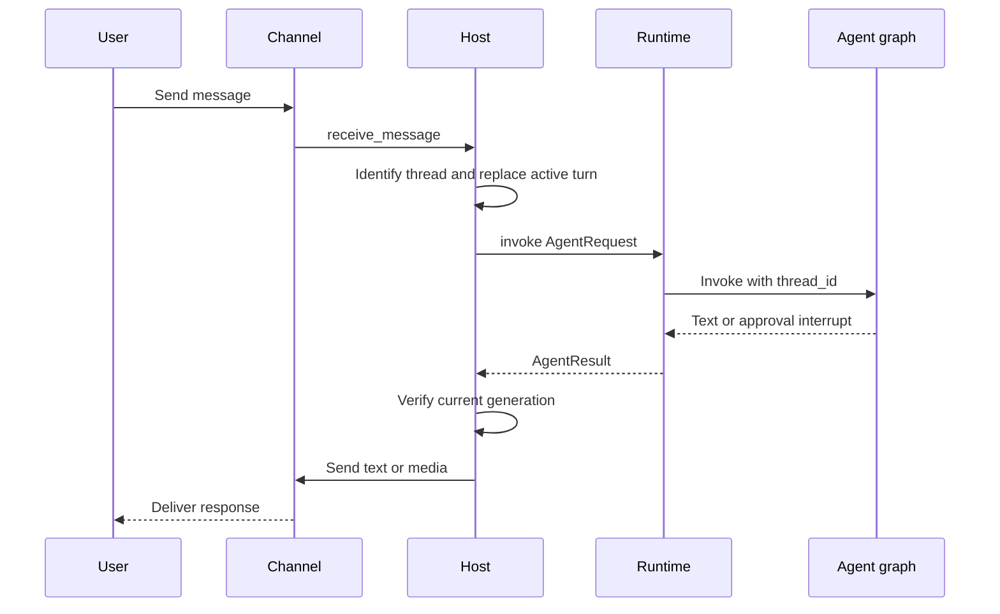

# Talon Runtime Host

> **Experimental and not production-hardened.** Talon is alpha software, subject to change or removal, and is not intended for production or enterprise use. It lacks complete production HITL policy, channel administrator controls, sandbox isolation, and multi-tenant boundaries. Treat channel access as direct access to the operator's agent, model credentials, MCP tools, and local-host resources.

Talon (`libs/talon`) is the long-running process boundary for **one assistant**. `TalonHost` owns an `AgentRuntime`, zero or more channel adapters, and optionally a persistent cron scheduler in one asyncio event loop. Its built-in adapters are WhatsApp, Telegram, and Discord; the host converts inbound channel events into conversation-scoped agent requests and routes current results back to the originating conversation.

## Entry points, configuration, and component lifecycle

Run `deepagents-talon` from `libs/talon`; `--whatsapp`, `--telegram`, and `--discord` attach adapters, while `--once` starts then tears down the host. The CLI reads `TalonConfig`, creates the cron store, ensures the assistant home, applies retention cleanup, constructs channels, and selects an agent. If no model is configured it uses `EchoAgentRuntime`, which returns request text and is useful for lifecycle and channel-wiring checks. With a model, it opens a local SQLite LangGraph checkpointer and history archive, wraps them in `ConversationSaver`, loads MCP tools, and builds `DeepAgentRuntime`. A `PersistentCronScheduler` is attached only when at least one channel is configured, because scheduled output needs a channel delivery route.

`DEEPAGENTS_TALON_ASSISTANT_ID` takes precedence over `AGENT_ASSISTANT_ID`; it defaults to `default` and must be a safe 1–128-character path segment. `DEEPAGENTS_TALON_MODEL` likewise takes precedence over `AGENT_MODEL`. The default home is `~/.deepagents/<assistant-id>/` (or the base selected by `DEEPAGENTS_TALON_HOME`). `ensure_home()` creates the assistant home plus manifest, `agents/`, `cron/`, `channels/`, and `media/inbound/` directories with mode `0700`.

`start()` ensures the home, starts the runtime, installs channel message and supported reaction callbacks, starts channels, and then starts the scheduler. `run_until_stopped()` installs `SIGINT` and `SIGTERM` where the event loop supports them; `request_shutdown()` sets the stop event. Teardown first cancels the background-result loop, in-flight work, and pending approval/authorization futures; it then stops channels in reverse order, followed by the scheduler and runtime. Shutdown cancellation deliberately does not persist interruption recovery state.

This shows the normal host, channel, and agent lifecycle for one turn. Interruptions, commands, and approval interrupts alter the path below.

## Conversation ownership, commands, and interruption

The channel conversation ID is the normal conversation root. Talon prefixes it with the provider when multiple channels are configured or persistent history is active, avoiding cross-provider collisions. The current reset counter from `conversations.json` is appended as `:talon-reset:<n>` to form the agent thread ID. Commands are case-insensitive and accept an optional `@bot` suffix: `/help`, `/new`, `/stop`, `/reset-all-history`, and `/mcp-reload`.

`/new` cancels current work and atomically persists an incremented reset counter, so the next turn starts a fresh agent thread while prior sessions remain searchable. `/reset-all-history` is available only to a history-capable runtime: after cancellation it removes archive/checkpoint state for that channel and chat, then advances the reset counter. It leaves cron jobs, memory files, media, traces, and backups intact. A cancellation timeout leaves history intact; an archive deletion failure can leave a partial reset that should be retried.

A new ordinary message **replaces rather than queues behind** an active turn in that conversation. Talon increments its generation, cancels the task, and uses the same 30-second total budget for cancellation and `recover_interrupted()`. `DeepAgentRuntime` repairs pending tool calls in the latest committed graph state and adds a system interruption marker. Delivery requires the current thread and generation to still match, preventing stale output from a cancelled turn. Separate conversations can run concurrently. If cancellation does not finish in time, Talon blocks that conversation until restart; if checkpoint recovery fails, it permits a replacement turn and marks its metadata as degraded.

## Runtime, graph, and execution boundary

The `AgentRuntime` protocol—`start`, `stop`, `invoke`, and `recover_interrupted`—decouples host orchestration from the agent implementation. Talon supplies `EchoAgentRuntime` and `DeepAgentRuntime`. On start, the latter resolves subagents and constructs a Deep Agents graph through `create_deep_agent`; its wiring includes model, backend, tools, middleware, HITL configuration, skills, memory, subagents, and checkpointer. Every invocation sets LangGraph `thread_id` to the Talon conversation ID and passes a recursion limit, defaulting to 500 and configurable with `DEEPAGENTS_TALON_RECURSION_LIMIT`.

The runtime adds `current_time`, optional conversation archive tools, and cron tools when a store is supplied. MCP tools load before graph construction and can be refreshed before a turn or explicitly reloaded. Reload builds a replacement graph before swapping it in, so an invalid MCP update leaves the previous graph usable. Subagent definitions reload only on request and apply to later turns; active turns and tasks retain the graph and capabilities with which they started.

The default execution backend is a non-virtual `LocalShellBackend` rooted at `DEEPAGENTS_TALON_WORKSPACE` or the current directory. Its child environment is allowlisted, removes known secrets and environment-hijack keys, and replaces `PATH` with a fixed safe value. This reduces accidental credential propagation but is **not** sandbox isolation. The runtime retries retryable provider, parsing, context-limit, and transport failures with exponential backoff. For empty graph text it sends configured continuation nudges and then a no-tools summary prompt; approval interruption/resumption is capped at 50 rounds.

## Channels, approvals, media, and MCP authorization

A channel adapter implements lifecycle, message-handler registration, typing, text/media sending, editing, and status; reaction-capable adapters additionally expose reaction-handler registration. During a turn the host refreshes typing best-effort, optionally transcribes voice, augments model content with inbound media context, and sends nonempty output. Markdown image or video references become attachments only if their resolved files stay within `DEEPAGENTS_TALON_OUTBOUND_MEDIA_DIR`, or the workspace/current directory when it is not set. Failed or rejected attachments are reported in fallback text.

For an agent tool-approval interrupt in a channel turn, the host stores a pending future under the agent conversation, sends tool names and argument previews, and accepts an approve/deny text reply or matching reaction only from the sender who started the run. `DEEPAGENTS_TALON_INTERRUPT_ON_TOOLS` additively overlays tool names onto configured `interrupt_on`. Scheduled runs cannot surface an interactive decision, so a gated tool call is denied with an explanatory result rather than blocking the job; channel turns without an approval handler are treated similarly.

For channel MCP OAuth, Talon sends the authorization URL or device code directly to the origin chat. It accepts a callback only when its sender, provider, conversation, binding, and expiry match the active authorization flow; authorization values bypass model context and tracing. `DEEPAGENTS_TALON_MCP_CONFIG` selects an explicit configuration, otherwise the default discovery location is used. `deepagents-talon mcp config` shows discovery paths, `deepagents-talon mcp login <server>` provides terminal OAuth, and `/mcp-reload` requests runtime reload without a restart.

## Durable history and scheduled work

The standard model-backed CLI keeps local checkpoints and a channel/chat-scoped conversation archive in `checkpoints.sqlite` using `ConversationSaver`; `DeepAgentRuntime` constructed directly defaults to `InMemorySaver`. The archive retains text, tool-call arguments, and message revisions without automatic expiry; archive retrieval is restricted to the current channel/chat and bounded pages. Scheduled runs do not enter archive history. Set `DEEPAGENTS_TALON_HISTORY_URI` to use a SQLite URI, MongoDB, PostgreSQL, or a trusted operator-installed history-backend entry point; checkpoints remain local. History stores are namespaced by assistant ID and require a single writer per assistant. Optional vector search is enabled with `DEEPAGENTS_TALON_HISTORY_VECTOR_SEARCH=1`; selecting a remote embedding adapter sends archived text and queries to that provider.

`CronJobStore` persists assistant-scoped jobs at `cron/jobs.json`, including prompt, schedule/repeat state, delivery origin, next run, and final outcome. Writes use a fsynced temporary file followed by atomic replacement and mode `0600`. The agent sees `create_job`, `list_jobs`, `edit_job`, and `remove_job` only when the runtime has a cron store; a context variable scopes them to the current conversation origin.

`PersistentCronScheduler` scans immediately and normally once per minute, waking sooner for stop. A failed scan is logged and retried on the normal interval, leaving jobs due. Before invoking a due job, it calls `advance_next_run` to claim that interval; it then records `ok` or `error` with `mark_job_run`. This prevents re-running a claimed interval after a crash between invocation and outcome recording. One-shots and exhausted repeats are disabled. Delivery targets the recorded origin unless trimmed output starts or ends with `[SILENT]`; a delivery failure overwrites a successful generation outcome with an error.

## Observability and focused verification

Talon emits structured `talon_event` JSON logs. Log redaction recognizes secret-bearing fields and direct conversation, message, and sender IDs; sensitive identifiers can instead be represented by a stable short hash. Cron logs tick, dispatch, generation failure/success, suppression, delivery, and delivery failures. `DEEPAGENTS_TALON_AGENT_ACTIVITY_LOGGING=true` enables local run, model-lifecycle, and bounded/redacted tool previews; it does not log hidden chain-of-thought. LangSmith tracing is enabled only when `LANGSMITH_TRACING` is truthy and `LANGSMITH_API_KEY` is set, and carries assistant, conversation, trigger, and request metadata. Those traces, MCP services, history backends, and remote embedding providers are outbound data surfaces.

Channel logging follows `DEEPAGENTS_CODE_DEBUG` or `DEEPAGENTS_CODE_LOG_LEVEL`; the latter accepts `DEBUG`, `INFO`, `WARNING`, `ERROR`, or `CRITICAL`. This is a logging seam, not a security boundary.

Focused integration tests cover inbound channel-to-reply routing and persisted cron delivery to its recorded origin. Host tests cover lifecycle ordering, commands, cancellation timeout/recovery, media containment, approval identity checks, and OAuth callback binding. Runtime tests cover graph wiring, thread configuration, retry and continuation behavior, environment scrubbing, history, approval resumption, and transactional reload behavior. Scheduler tests cover interval claiming, silence, and delivery-failure outcome handling.

See [architecture overview](../architecture/overview.md), [permissions and HITL](../concepts/permissions-hitl.md), [state persistence](../concepts/state-persistence.md), [MCP integration](./mcp.md), [security operations](../operations/security.md), and the [testing guide](../testing/testing-guide.md).
