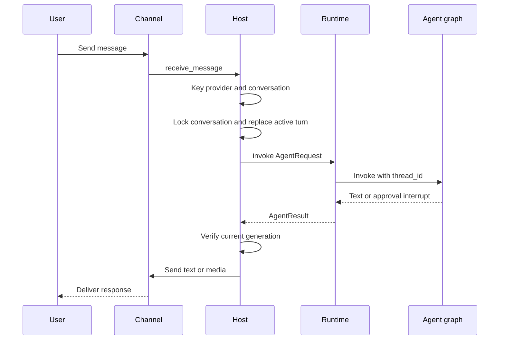
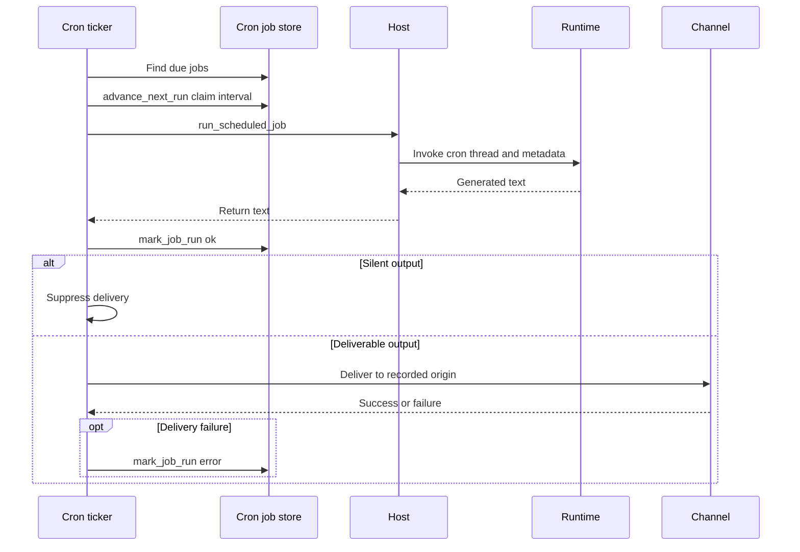

# Talon Long-Running Host

> **Experimental and not production-hardened.** Talon is alpha software, subject to change or removal, and is not intended for production or enterprise use. It lacks complete production HITL policy, channel administrator controls, sandbox isolation, and multi-tenant boundaries. Treat channel access as direct access to the operator's agent, model credentials, MCP tools, and local-host resources.

Talon (`libs/talon`) is the long-running process boundary for **one assistant**. `TalonHost` owns an `AgentRuntime`, zero or more channel adapters, and optionally a persistent cron scheduler in one asyncio event loop. Built-in adapters include WhatsApp, Telegram, and Discord. The host turns channel events into scoped agent requests, sends current results to their origin, and manages the state that an agent graph should not own: turn replacement, delivery, resets, approvals, and authorization callbacks.

## Bootstrap, configuration, and lifecycle

Run `deepagents-talon` from `libs/talon`; `--whatsapp`, `--telegram`, and `--discord` attach adapters, while `--once` starts then tears down the host. The CLI ensures the assistant home, constructs the cron store and configured channels, and selects a runtime. Without a model it uses `EchoAgentRuntime`, which returns the request text and is useful for lifecycle and wiring checks. With a model, it opens a local SQLite LangGraph checkpointer and history archive, wraps them in `ConversationSaver`, loads MCP tools, and builds `DeepAgentRuntime`. It attaches `PersistentCronScheduler` only if there is a channel, because scheduled output needs a delivery route.

`DEEPAGENTS_TALON_ASSISTANT_ID` takes precedence over `AGENT_ASSISTANT_ID`; it defaults to `default` and is validated as a safe path segment. `DEEPAGENTS_TALON_MODEL` likewise takes precedence over `AGENT_MODEL`. The default state home is `~/.deepagents/<assistant-id>/` (or the base in `DEEPAGENTS_TALON_HOME`). `ensure_home()` creates the home, manifest, `agents/`, `cron/`, `channels/`, and `media/inbound/` directories with mode `0700`.

`start()` ensures the home, starts the runtime, registers message and supported reaction callbacks, starts channels, then starts the scheduler. A failed partial start unwinds started channels and the runtime in reverse order. `run_until_stopped()` installs `SIGINT` and `SIGTERM` where supported, and `request_shutdown()` sets the stop event. During shutdown the host cancels its background dispatcher, in-flight work, and pending approval/authorization futures; stops channels in reverse order; and finally stops scheduler then runtime. Each component stop is attempted even if an earlier stop failed.

## Inbound turns: serialization, replacement, and commands

Every channel turn is keyed by `provider:channel-conversation-id`, not by a bare chat ID. That root is the lock key, LangGraph thread ID, and persisted reset-counter key; chats on separate providers therefore cannot collide. A reset counter is appended as `:talon-reset:<n>` after `/new`.

This is the normal inbound turn. A lock serializes operations within one conversation, while unrelated conversations can proceed concurrently.

An ordinary new message **replaces rather than queues behind** an active turn. Talon increments its generation, cancels the task, and uses one 30-second budget for cancellation and `recover_interrupted()`. `DeepAgentRuntime` repairs pending tool calls in the latest committed state and appends a system interruption marker. A response is delivered only if its thread and generation are still current, preventing stale output. If cancellation does not finish, the conversation is blocked until restart; if recovery fails, the replacement proceeds with `interruption_recovery: failed` metadata.

Commands are case-insensitive and accept an optional `@bot` suffix: `/help`, `/new`, `/stop`, `/reset-all-history`, and `/mcp-reload`. `/new` cancels current work and atomically increments the persisted counter in `conversations.json`, so the next message uses a fresh agent thread while earlier sessions remain searchable. `/reset-all-history` is available only to a history-capable runtime; it stops work, removes archive and checkpoints for the current channel/chat, and advances the reset counter. If clearing fails, it rolls the counter back where possible. It does not remove cron jobs, memory, media, traces, or backups.

## Runtime graph and background work

The `AgentRuntime` protocol—`start`, `stop`, `invoke`, and `recover_interrupted`—separates host orchestration from agent implementation. Talon provides `EchoAgentRuntime` and `DeepAgentRuntime`. At startup the latter resolves subagents, loads approval policy, and calls `create_deep_agent` with model, backend, tools, middleware, HITL configuration, skills, memory, subagents, and checkpointer. Each invocation passes its conversation ID as LangGraph `thread_id` and a recursion limit (500 by default, configurable with `DEEPAGENTS_TALON_RECURSION_LIMIT`).

The graph includes `current_time`; archive tools when using `ConversationSaver`; cron tools when a cron store exists; and MCP tools supplied by the CLI. It captures the graph per invocation. MCP refresh or explicit reload first builds a replacement graph, so an invalid update leaves the old one usable. Subagent definitions reload only on request and affect later turns; active turns and tasks retain their captured capabilities.

`DeepAgentRuntime` can delegate background subagents. The host runs a one-second dispatcher for runtimes with the `BackgroundRuntime` capability. It retains a route for each owning conversation, avoids a locked or active conversation, then starts a follow-up main-agent turn to consume completed results. Retry spacing grows exponentially when a follow-up repeatedly fails. If a turn becomes stale or is cancelled after consuming background results, the host requeues them rather than silently losing work.

The default execution backend is a non-virtual `LocalShellBackend`, rooted at `DEEPAGENTS_TALON_WORKSPACE` or the current directory. Its child environment is allowlisted, removes recognized secret and environment-hijack keys, and replaces `PATH` with a fixed safe path. This limits accidental credential propagation; it is **not** sandbox isolation. Invocation retries retryable provider, parse, context-limit, and transport errors with exponential backoff. Empty graph text triggers configured continuation nudges followed by a no-tools summary prompt; approval resumption is capped at 50 rounds.

## Channel delivery, approvals, and authorization

A `ChannelAdapter` supplies lifecycle, inbound-handler registration, typing, text/media send, edit, and status operations; `ReactionChannelAdapter` adds reaction registration. While a turn runs, Talon refreshes typing best-effort, optionally transcribes voice, augments model content with inbound media context, and routes nonempty results. Markdown image/video references become outbound attachments only when their resolved paths are contained by the configured outbound media root. Failed or rejected attachments are represented in fallback text.

For a tool-approval interrupt on an attended channel turn, the host stores a pending future by agent conversation and sends tool names and argument previews. It accepts a recognized text reply, or a matching reaction on the approval prompt, only from the sender who started the run. Scheduled and background-delivery turns receive no interactive handlers. The runtime auto-denies gated calls for cron and for channel turns lacking a handler rather than waiting indefinitely.

For channel MCP OAuth, the authorization URL or device code is sent directly to the origin chat. A pasted callback is accepted only when sender, provider, conversation, binding, and expiry match the pending flow; its value bypasses model context and tracing. `/mcp-reload` invokes a reload-capable runtime without creating an agent turn and returns a generic failure rather than exposing configuration or transport details.

## History and scheduled delivery

The standard model-backed CLI persists local checkpoints and a channel/chat-scoped archive in `checkpoints.sqlite` through `ConversationSaver`; a directly constructed `DeepAgentRuntime` instead defaults to `InMemorySaver`. The archive preserves text, tool-call arguments, and revisions without automatic expiry, and retrieval is limited to the current channel/chat. Scheduled runs are not added to chat archive history. `DEEPAGENTS_TALON_HISTORY_URI` selects SQLite, MongoDB, PostgreSQL, or one trusted installed entry-point backend; archives are namespaced by assistant ID while checkpoints remain local. Use one writer per assistant.

`CronJobStore` persists assistant-scoped jobs in `cron/jobs.json`, including prompt, schedule/repeat state, delivery origin, next-run time, and outcome. It writes a fsynced temporary file then atomically replaces the target with mode `0600`. Agent-facing cron tools exist only with a store and use a context variable to restrict operations to the request's origin.

This shows a claimed scheduled generation and its conditional delivery. Cron uses a separate `<job-id>:talon-cron` thread and a per-job conversation lock, so overlapping fires do not write the same graph thread.

`PersistentCronScheduler` scans immediately and normally every minute, or wakes promptly for stop. A failed scan is logged and retried on the normal interval. Before invocation it calls `advance_next_run` to claim the interval, then records `ok` or `error` with `mark_job_run`; one-shots and exhausted repeats become disabled. It suppresses output whose trimmed text begins or ends with `[SILENT]`. A delivery failure overwrites an otherwise successful generation outcome with an error. The CLI resolves the recorded origin to a matching channel; absent channel service drops delivery, while a background result from a scheduled task is routed back to the same origin when possible.

## Operations and verification

Talon emits redacted structured `talon_event` logs and can emit bounded local agent-activity logs. LangSmith tracing requires both `LANGSMITH_TRACING` and `LANGSMITH_API_KEY`, and records assistant, conversation, trigger, and request metadata. These traces, MCP services, remote history backends, and remote embedding providers are outbound data surfaces. Channel log verbosity follows `DEEPAGENTS_CODE_DEBUG` or `DEEPAGENTS_CODE_LOG_LEVEL`, whose explicit values are `DEBUG`, `INFO`, `WARNING`, `ERROR`, and `CRITICAL`.

Focused integration tests establish inbound channel-to-reply routing, persisted cron delivery to the stored origin, and an agent-created job that later runs. Host tests cover lifecycle unwinding, cancellation/recovery and blocking, reset persistence, typing, background follow-ups, approval identity checks, media containment, and OAuth callback binding. Runtime and scheduler tests cover graph construction, retry/continuation, context scoping, reload safety, interval claiming, silence, and delivery-error recording.

See [permissions and HITL](../concepts/permissions-hitl.md), [state persistence](../concepts/state-persistence.md), [subagents and skills](../concepts/subagents-skills.md), and [MCP integration](./mcp.md).
