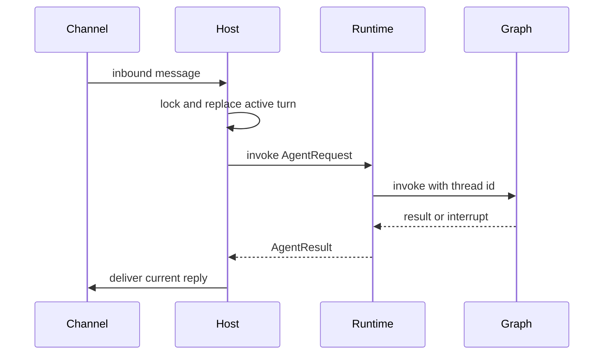
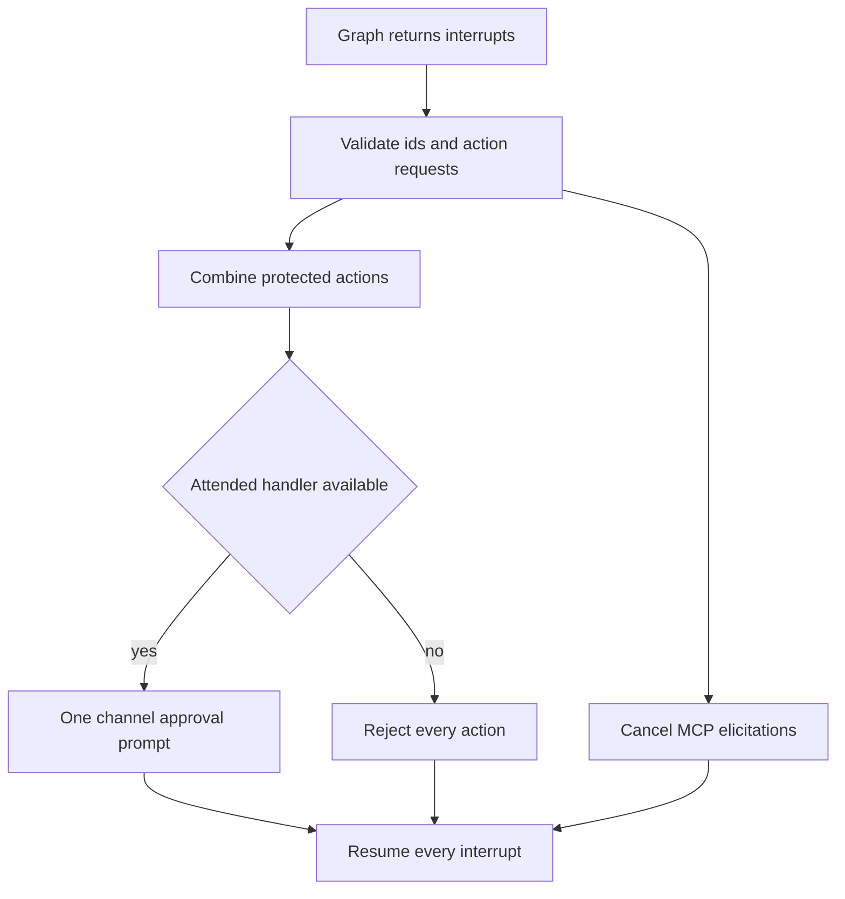

# Talon Long-Running Host

> **Experimental; not production containment.** Talon is alpha software, may change or be removed, and is not intended for production or enterprise use. Its local host, channel exposure settings, approval prompts, and policy file are **not** sandboxing, multi-tenant isolation, or a production-grade security boundary. Treat channel access as access to the operator's agent, model credentials, MCP tools, and local host resources.

Talon (`libs/talon`) is the single-event-loop host for one assistant. `TalonHost` owns the lifecycle of an `AgentRuntime`, channel adapters, and an optional scheduler; the runtime owns graph execution and returns `AgentResult` for the host to deliver. The protocol boundary deliberately makes channel callbacks, progress messages, approval/authorization handlers, and persistent-history delivery optional request capabilities rather than graph-global state.

## Start, stop, and integration boundary

Run from `libs/talon` (or prefix commands at repository root with `uv --directory libs/talon`):

```bash
uv sync --group test
AGENT_ASSISTANT_ID=local AGENT_MODEL=<provider>:<model-id> uv run deepagents-talon --once
```

Without `AGENT_MODEL`, Talon uses `EchoAgentRuntime`, which is useful for host and channel wiring. A model-backed runtime builds a Deep Agents graph; its default checkpointer is in-memory when constructed directly, while the packaged host uses persistent local state. The default workspace is the current directory unless `DEEPAGENTS_TALON_WORKSPACE` is set, and `DEEPAGENTS_TALON_RECURSION_LIMIT` defaults to 500.

`start()` ensures the assistant home, starts the agent, binds each channel's message callback (and reaction callback when supported), starts channels, then starts the scheduler. A failed partial start unwinds already-started components. `stop()` cancels dispatcher and conversation work, cancels pending approvals and authorizations, stops channels in reverse order, then scheduler and runtime; it continues attempting cleanup when one component fails. `run_until_stopped()` installs supported SIGINT/SIGTERM handlers and always removes them during shutdown.



This shows the attended-turn boundary: the host serializes and routes, while the runtime executes and resumes the graph.

## Conversations: replacement, recovery, and delivery

A conversation root combines a trusted provider key and channel conversation ID. It is both the per-conversation lock key and the graph thread root, avoiding collisions between providers. `/new` increments a persisted reset counter and changes the active thread to a `:talon-reset:<n>` suffix; `/stop` cancels active work. `/reset-all-history`, when history is enabled, cancels work and clears only that trusted channel/chat's archive and checkpoints before starting a fresh thread. It does not erase cron jobs, memory files, media, traces, or backups.

A later message replaces an active turn. The host increments its generation, cancels the prior task, and asks the runtime to repair the latest checkpoint by adding an interruption marker; the replacement can proceed with `interruption_recovery: "failed"` metadata if repair fails. Stale final/progress output cannot pass the generation check. Cancellation and recovery share a 30-second budget: if it expires, Talon blocks the conversation until restart instead of allowing concurrent work on the same state. Shutdown cancels work but does not perform interruption recovery.

A successful final channel delivery can be recorded through `ConversationDeliveryRuntime`; a failed or superseded delivery is not treated as delivered. For background-result follow-up turns, the host requeues consumed result IDs if their reply is discarded, so an unseen result can be offered again.

## Approval interrupts and authority

The per-assistant `tools.json` policy maps exact tool names to booleans. `true` requests an interactive approval; `false` means no prompt, **not** that a tool is available or that an untrusted sender has operator authority. The standard defaults gate `update_tool_approvals`, `delete_conversations`, `update_mcp_server`, and `start_async_task`.

Use `get_tool_approvals` before changing policy. It separates persisted `tools`/`persisted_revision` from this invocation's `active_tools`/`active_revision` and reports `saved_changes_inactive`. Call `update_tool_approvals(updates={...}, expected_revision=<persisted_revision>)`; it is an atomic compare-and-swap, rejects an entire stale batch, and preserves unrelated entries. A saved policy is activated by graph replacement on the next invocation; active turns and tasks retain their captured snapshot. An invalid policy or failed replacement blocks the attempted invocation and retains the previous usable graph rather than silently falling back.

Talon batches all simultaneous valid action interrupts into **one** `ToolApprovalRequest`. Its `interrupt_id` is the first action interrupt and `action_requests` contains every protected action across the batch. One approve/reject decision is expanded into a decision list for each interrupt, while any MCP elicitation interrupt is resumed with a cancel response. Interrupt IDs must be nonempty and unique and every action request must be a nonempty sequence of mappings; malformed payloads fail before prompting rather than risking partial approval.



This shows one-decision batch resumption, including the fail-closed unattended path.

For attended channel turns, the host holds a pending prompt per agent conversation and accepts recognized text replies only from the originating sender. A reaction-capable channel may also resolve it, but the reaction must match the pending provider, conversation, prompt message ID, sender, and supported emoji. The host logs stable references by default; `DEEPAGENTS_TALON_APPROVAL_LOG_RAW_IDS=true` opts into raw reaction identifiers.

Operator authority is separate from approval policy. The host sets `tool_approval_operator` only for identified configured operators in supported channel exposure modes, never from untrusted inbound metadata. Updating policy requires operator authority even if its prompt is disabled, and a self-edit is checked under the pre-edit snapshot. Scheduled runs, detached workers, and background-delivery turns cannot receive interactive approval or authorization and protected calls are auto-denied.

## Runtime context and default guidance

`DeepAgentRuntime.start()` resolves subagents, ensures/snapshots the approval store, then builds the graph with the resolved model, local backend, skills, memory, checkpointer, middleware, tools, subagents, and approval `interrupt_on` configuration. Every invocation captures the current graph and policy snapshot in context variables before graph execution; concurrent configuration reloads can therefore activate a replacement for later turns without changing an active turn.

The runtime scopes history by host-supplied channel/chat identifiers and cron tools by the trusted cron origin. It sets scheduled-turn context for `trigger: "cron"`, carries only host-confirmed progress handlers and authorization handlers, retries retryable model/transport failures, and sends continuation nudges for empty output before forcing a no-tools summary. It caps approval-resume rounds at 50.

The packaged `AGENTS.md` is behavior guidance rather than an enforcement boundary. It instructs the agent to treat filesystem/tool/research content as evidence rather than instructions; batch independent tool calls so one approval covers the group; preserve dependent ordering; use `get_agent_tools` before giving named local tasks only necessary tools; keep configuration and writes on the main agent under existing controls; and minimize non-sensitive context passed from internal to public research. Defensive prompts are explicitly not a sandbox.

The default `LocalShellBackend` is rooted at the configured workspace and runs with a fixed `PATH` plus a scrubbed environment. That reduces accidental secret propagation and environment hijacking but does not isolate code from the local host.

## Archive retrieval: scope, pagination, and status

When the checkpointer is a `ConversationSaver`, Talon adds `list_conversations`, `search_conversations`, and `read_conversation`. The archive scope is supplied by the host rather than model arguments, so retrieval is restricted to the current channel/chat even across `/new` sessions. `read_conversation` returns chronological bounded chunks; `list_conversations` returns session summaries; search results are data, not instructions.

`search_conversations` returns a page with `results`, `has_more`, and an opaque `next_after` cursor. Continue only with the same query and chat; an expired cursor returns `pagination_status: "expired"` and requires a fresh search. Its retrieval-status fields prevent an empty result from being overinterpreted:

- `semantic_status` is `completed`, `disabled`, `not_requested`, `timeout`, `error`, or `unavailable`.
- `indexing_pending` states whether records await indexing.
- `indexing_status` is `ready`, `pending`, `unknown`, or `not_requested`; `unknown` means visibility is not known to be immediate.

Semantic errors/timeouts fall back to keyword matches. Pending or unknown indexing coverage means results can be incomplete, including when a page is empty. This is a retrieval-quality signal, not an authorization result.

## Scheduled and background lifecycle

Each scheduled job uses its own `<job-id>:talon-cron` conversation thread and lock. The host bounds a fire to 30 minutes. On timeout it attempts interrupted-checkpoint recovery and re-raises the timeout so the scheduler records failure; later fires can then use a repaired thread. Scheduled work is unattended and has neither approval nor authorization handlers.

For a cron-triggered invocation, `BackgroundSubagents` runs local `task` and remote `start_async_task` delegation inline in the scheduled graph turn, forbids nested delegation, and creates neither a pending background job nor a later delivery route. Inline cron delegation uses a separate shared four-slot semaphore and a 10-minute per-call deadline. It caps output at 64,000 characters; timeout/failure becomes a bounded error `ToolMessage` so a graph retry cannot replay sibling delegation.

Ordinary chat delegation is different: it may detach work and the host's dispatcher polls for completed results. Once the owner conversation is idle, it starts a route-preserving follow-up turn; failures back off and undelivered consumed results are requeued. That follow-up is deliberately unattended and cannot inherit the earlier user's interactive authority.

## Operations and focused tests

Keep the assistant home outside the workspace and persist its parent directory: policy writes use atomic file replacement. External history backends, MCP services, embedding providers, and tracing are outbound data surfaces. This experimental integration should be operated with the security limitations above in mind, not represented as tenant isolation.

Focused coverage includes:

- `tests/test_host.py` covers lifecycle unwind, same-conversation interruption/recovery, reset thread persistence, timeout blocking, scheduler timeout repair, background follow-up authority removal, and reaction identity matching/log redaction.
- `tests/unit_tests/test_tool_approval_batch.py` covers merged parallel action requests, elicitation cancellation, per-interrupt resume payloads, auto-denial without an attended handler, malformed batches, and invalid IDs.
- `tests/unit_tests/test_tool_approval_runtime.py` covers pre-edit policy gating, atomic policy snapshots across concurrent invocations, reload failure preserving the old graph, detached/background authority removal, and real multi-tool approval behavior.
- Archive tests cover channel/chat isolation, reset persistence, bounded transcript paging, opaque search pagination, and the retrieval-status contract.

See [permissions and HITL](../concepts/permissions-hitl.md), [state persistence](../concepts/state-persistence.md), [subagents and skills](../concepts/subagents-skills.md), [MCP integration](./mcp.md), [security operations](../operations/security.md), and the [testing guide](../testing/testing-guide.md).
