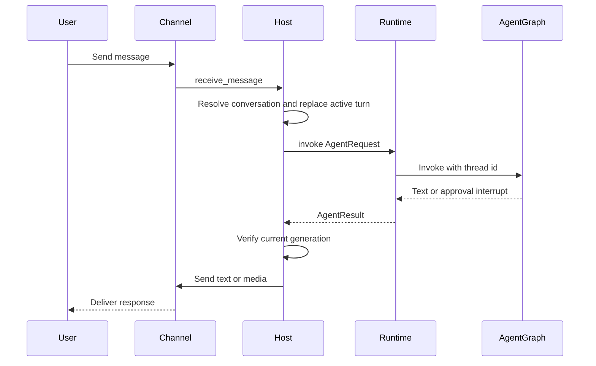
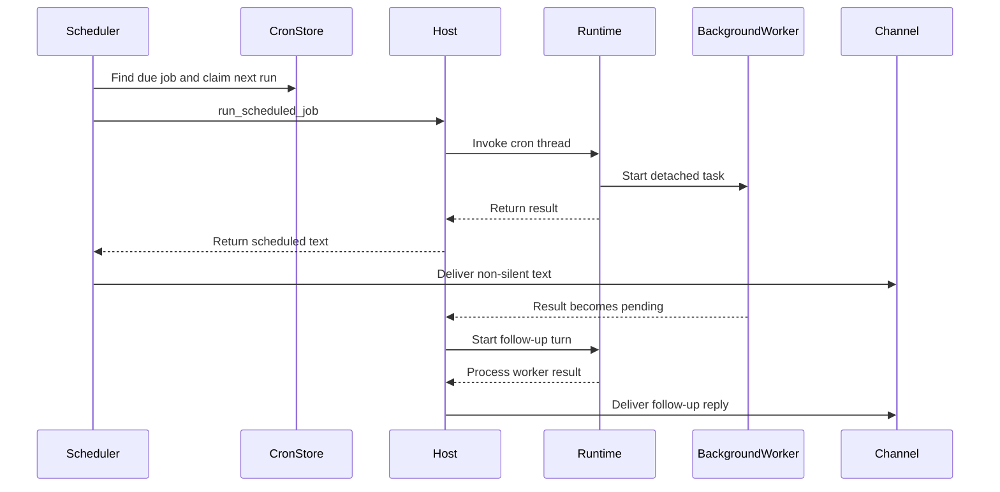

# Talon Runtime Host

> **Experimental and not production-hardened.** Talon is alpha software, subject to change or removal, and is not intended for production or enterprise use. It does **not** provide complete production HITL policy, channel administrator controls, sandbox-backed isolation, or multi-tenant boundaries. Treat channel access as direct access to the operator's agent, model credentials, MCP tools, and local-host resources. Environment scrubbing and tool prompts are defense-in-depth measures, **not** a sandbox or an authorization boundary.

Talon (`libs/talon`) is a long-running process boundary for **one assistant**. `TalonHost` owns an `AgentRuntime`, zero or more channel adapters, and optionally a persistent cron scheduler in one asyncio event loop. Built-in channel adapters are WhatsApp, Telegram, and Discord; adapters translate provider events into `ChannelMessage` objects, while the host owns conversation serialization, cancellation, and delivery.

## Startup, configuration, and shutdown

Run `deepagents-talon` from `libs/talon`. `--whatsapp`, `--telegram`, and `--discord` attach adapters; `--once` performs startup followed immediately by teardown. The CLI reads `TalonConfig`, creates the cron store, ensures the assistant home, performs sensitive-state cleanup, constructs channels, and chooses the runtime. If no model is configured, it uses `EchoAgentRuntime`, which returns the request text and is useful for lifecycle and channel-wiring checks. With a model, it opens a local SQLite LangGraph checkpointer and a history archive, wraps them in `ConversationSaver`, loads MCP tools, and constructs `DeepAgentRuntime`. A `PersistentCronScheduler` is attached only when channels exist, since scheduled output needs a delivery route.

`DEEPAGENTS_TALON_ASSISTANT_ID` takes precedence over `AGENT_ASSISTANT_ID`; it defaults to `default` and must be a safe 1–128-character path segment. `DEEPAGENTS_TALON_MODEL` similarly takes precedence over `AGENT_MODEL`. The default home is `~/.deepagents/<assistant-id>/` (or the base selected by `DEEPAGENTS_TALON_HOME`). `ensure_home()` creates that home and its manifest, `agents/`, `cron/`, `channels/`, and `media/inbound/` directories with mode `0700`; it also ensures the per-assistant `tools.json` approval policy exists.

`start()` ensures the home, starts the runtime, binds inbound message callbacks and optional reaction callbacks, starts channels, then starts the scheduler. If channel or scheduler startup fails, already-started components are stopped in reverse order before the error propagates. `run_until_stopped()` installs `SIGINT` and `SIGTERM` handlers where supported; `request_shutdown()` sets the stop event. Normal teardown cancels the background-result loop and in-flight work, cancels pending approval and authorization futures, stops channels in reverse order, then stops scheduler and runtime. Component-stop errors are logged so later components still get a chance to stop. Shutdown cancellation intentionally does not run checkpoint interruption recovery.

This is the ordinary channel message lifecycle. Commands, authorization flows, interruptions, and approvals branch from it.

## Conversation identity, commands, and interruption

Every channel conversation is unconditionally keyed by trusted channel/provider plus the channel's conversation ID. This channel-qualified root is both the LangGraph thread ID and the persisted reset-counter key, preventing provider collisions. This changed from an older bare-ID scheme: upgrading a host using that old scheme leaves its old checkpoints and reset counters unreachable; Talon deliberately does not migrate them. A nonzero reset counter appends `:talon-reset:<n>` to produce the active agent thread ID.

Commands are case-insensitive and accept an optional `@bot` suffix: `/help`, `/new`, `/stop`, `/reset-all-history`, and `/mcp-reload`. `/help` does not interrupt a running turn. `/new` cancels the active turn and that conversation's background workers, persists an incremented reset counter, and starts later input on a fresh thread; previous history remains searchable. `/stop` cancels the active turn and its workers. `/reset-all-history` is available only with a history-capable runtime: it cancels the conversation, advances the reset counter, clears archive and checkpoint data for that channel/chat, and rolls the counter back if clearing fails. It does not remove cron jobs, memory files, media, traces, or backups.

A new ordinary message **replaces rather than queues behind** an active turn in the same conversation. Talon increments a generation, cancels the task, then shares a 30-second total budget between cancellation and `recover_interrupted()`. `DeepAgentRuntime` repairs pending tool calls in the latest committed graph state and adds a system interruption marker. A reply is delivered only when its thread and generation remain current, preventing stale output from a superseded turn; separate conversations can run concurrently. A cancellation that exceeds the budget blocks that conversation until Talon restarts. If recovery fails, Talon permits the replacement turn but marks it with failed-recovery metadata.

## Runtime construction and execution boundary

The `AgentRuntime` protocol—`start`, `stop`, `invoke`, and `recover_interrupted`—separates host orchestration from agent implementation. Talon supplies `EchoAgentRuntime` and `DeepAgentRuntime`. On startup, `DeepAgentRuntime` resolves subagents, takes a tool-approval snapshot, and builds a Deep Agents graph via `create_deep_agent`. Its graph wiring includes model, backend, runtime and MCP tools, approval tools, middleware, skills, memory, subagents, and a checkpointer. Invocations use the Talon conversation ID as LangGraph `thread_id` and set a recursion limit of 500 by default, overridable with `DEEPAGENTS_TALON_RECURSION_LIMIT`.

The runtime contributes `current_time` and `send_message`; it adds conversation tools only for `ConversationSaver`, cron tools only when given a cron store, and a subagent-reload tool when subagent configuration exists. It scopes history, session, cron origin, progress messaging, and authorization handlers through context variables for each invocation. MCP refreshes and explicit reload construct a replacement graph before swapping it in, so a failed update leaves the old graph usable. Reloaded subagent definitions apply to later turns, while active turns and running tasks retain their captured graph and capabilities.

The default backend is non-virtual `LocalShellBackend`, rooted at `DEEPAGENTS_TALON_WORKSPACE` or the current directory. A child process receives a small allowlist of conventional environment values; secret-bearing and environment-hijack variables are removed, and `PATH` is replaced with a fixed safe path. It still executes on the local host, so deployments needing containment must enforce it outside Talon. The runtime retries retryable provider, parse, context-limit, and transport errors with exponential backoff. When a graph returns no text, it sends up to three continuation nudges and then a no-tools summary prompt. Tool-approval interruption/resumption is capped at 50 rounds.

## Channels, approvals, media, and MCP authorization

A `ChannelAdapter` supplies lifecycle, inbound handler registration, text/media sends, editing, typing, and status; a reaction-capable adapter can additionally register a reaction callback. During a turn, the host refreshes typing best-effort, can transcribe voice, adds inbound media context to model content, and permits the agent to send same-chat progress messages only while that originating turn remains current. Markdown image/video references in the final output become attachments only when they resolve inside the configured outbound media root; rejected or failed attachments are reported in fallback text.

Tool approval policy is a fixed, per-assistant `tools.json` mapping exact tool names to booleans. `true` means prompt for channel approval and `false` means no prompt; it does not grant availability or authorization. The defaults gate `update_tool_approvals`, `delete_conversations`, `update_mcp_server`, and `start_async_task`. Updates are atomic compare-and-swap by revision and activate for the next invocation; an invalid policy fails closed. The policy is not a security boundary: a process running as the same UID can edit the file or bypass local tool APIs.

For an approval interrupt in an attended channel turn, the host records a pending future by agent conversation, shows tool names and argument previews, and accepts an approve/deny text reply or matching reaction only from the sender that started the turn. Policy self-edits require a trusted operator even if their prompt setting is false. Scheduled turns, background-result follow-ups, and channels without an approval handler auto-deny gated calls rather than blocking. Unattended work cannot start an interactive approval or authorization flow.

For channel MCP OAuth, Talon sends an authorization URL or device code directly to the origin chat. A pasted callback is accepted only when provider, conversation, sender, active binding, and expiry match; authorization values bypass model context and tracing. `DEEPAGENTS_TALON_MCP_CONFIG` selects an explicit configuration, otherwise the normal discovery path is used. `deepagents-talon mcp config` shows discovery paths, `deepagents-talon mcp login <server>` runs terminal OAuth, and `/mcp-reload` reloads tools without restarting the host.

## History, cron, and background work

The standard model-backed CLI persists local checkpoints and a channel/chat-scoped archive in `checkpoints.sqlite` through `ConversationSaver`; a directly constructed `DeepAgentRuntime` defaults to `InMemorySaver`. The archive retains text, tool-call arguments, and distinct message revisions without automatic expiry. Agent retrieval is restricted to the current channel/chat and bounded pages; scheduled work does not enter the chat archive. `DEEPAGENTS_TALON_HISTORY_URI` can select SQLite, MongoDB, PostgreSQL, or a trusted installed history-backend entry point. Stores are namespaced by assistant ID and archives require one writer per assistant, while checkpoints remain local. Enabling vector search can send archived text and queries to a chosen remote embedding provider.

`CronJobStore` persists assistant-scoped jobs in `cron/jobs.json`, including schedule/repeat state, delivery origin, next run, and outcome. Writes use an fsynced temporary file and atomic replacement with mode `0600`. Agent-facing `create_job`, `list_jobs`, `edit_job`, and `remove_job` appear only when a cron store is available and use the invocation's origin context. Schedules have minute granularity and support `in <N>{m,h}`, `every <N>{m,h}`, `at <YYYY-MM-DD> <HH:MM> <tz>`, and `daily at <HH:MM> <tz>`; wall-clock forms require an IANA timezone.

`PersistentCronScheduler` scans immediately and normally once per minute, waking sooner on stop. Failed scans are logged and retried at the ordinary interval. Before invoking a due job, it calls `advance_next_run` to claim that interval, then records `ok` or `error` with `mark_job_run`; claimed intervals are not rerun after a crash between invocation and outcome recording. One-shots and exhausted repeats become disabled. `[SILENT]` at either end of trimmed output suppresses delivery. Delivery goes to the recorded origin and a delivery failure overwrites an otherwise successful generation outcome with an error.

This shows the scheduled and background paths. A scheduled run uses a dedicated `<job-id>:talon-cron` thread and holds its conversation lock for the run. When background-capable, the host records a route before invoking, so a task started by a failing cron run is not stranded. The background dispatcher polls each second, skips busy conversations, and starts a synthetic follow-up turn when a completed result exists. Those follow-ups preserve the cron identity and origin, are not archived into a chat, and have no interactive handlers.

`BackgroundSubagents` detaches local `task` and remote `start_async_task` calls from the main turn. Jobs and results are in memory only, are scoped to their owner thread, and disappear on restart. At most four workers run concurrently, at most 128 jobs are retained, each worker has a one-hour timeout, and results are truncated to 64,000 characters. A completed result is injected into a later main-agent turn rather than polled; if that turn's reply is superseded or cancelled before delivery, the host requeues precisely the results it had consumed. A model failure can retry delivery three times before the result is dropped. `/stop` and `/new` cancel workers and discard results for their conversation; host shutdown cancels all workers. Background workers inherit request-scoped history/cron context but explicitly do not inherit the authorization handler.

## Observability and verification

Talon emits structured, redacted `talon_event` logs. Optional `DEEPAGENTS_TALON_AGENT_ACTIVITY_LOGGING=true` adds local run, model-lifecycle, and bounded/redacted tool previews, not hidden chain-of-thought. LangSmith tracing requires both `LANGSMITH_TRACING` and `LANGSMITH_API_KEY`, and attaches assistant, conversation, trigger, and request metadata. Logs, traces, MCP servers, history backends, and remote embedding providers are outbound data surfaces. Channel log verbosity follows `DEEPAGENTS_CODE_DEBUG` or `DEEPAGENTS_CODE_LOG_LEVEL`; valid explicit levels are `DEBUG`, `INFO`, `WARNING`, `ERROR`, and `CRITICAL`.

Focused host tests cover lifecycle ordering and failed startup cleanup, channel routing, reset persistence and rollback, cancellation timeout/recovery, media containment, approval identity, OAuth callback binding, cron routing, and background-result delivery. `test_background.py` covers thread ownership, capacity, cancellation, result acknowledgement/requeueing, retries, timeout/failure reporting, context inheritance, authorization-handler exclusion, and shutdown behavior when a worker outlives cancellation.

See [permissions and HITL](../concepts/permissions-hitl.md), [state persistence](../concepts/state-persistence.md), [subagents and skills](../concepts/subagents-skills.md), [MCP integration](./mcp.md), [security operations](../operations/security.md), and the [testing guide](../testing/testing-guide.md).
