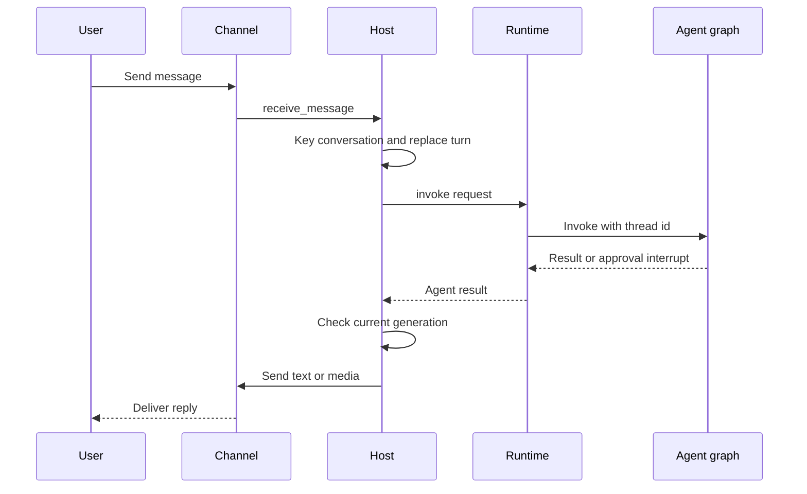
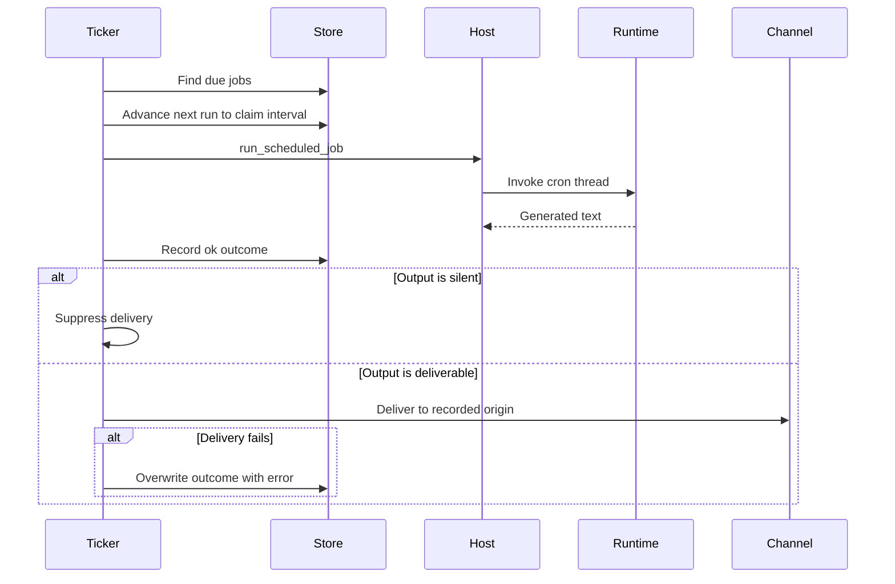

# Talon Runtime Host

> **Experimental and not production-hardened.** Talon is alpha software, subject to change or removal, and is not intended for production or enterprise use. It does not provide complete production HITL policy, channel administrator controls, sandbox isolation, or multi-tenant boundaries. Treat channel access as direct access to the operator's agent, credentials, MCP tools, and local host resources; the local shell environment scrubbing described below is not a sandbox.

Talon (`libs/talon`) is a local, long-running process for **one assistant**. `TalonHost` coordinates an `AgentRuntime`, zero or more channel adapters, and, when channels are present in the standard CLI, a persistent cron scheduler in one asyncio event loop. WhatsApp, Telegram, and Discord are the built-in channel options; adapters can supply other transports through the channel protocol.

## Start-up, configuration, and shutdown

From `libs/talon`, run `deepagents-talon`; `--whatsapp`, `--telegram`, and `--discord` attach adapters and `--once` exercises start/stop without waiting. The CLI builds `TalonConfig`, creates the cron store, ensures the assistant home, performs sensitive-state cleanup, and selects a runtime. Without a configured model it uses `EchoAgentRuntime`, which returns the request text; otherwise it opens a SQLite checkpointer and history archive, wraps them in `ConversationSaver`, loads MCP tools, and creates `DeepAgentRuntime`.

`DEEPAGENTS_TALON_ASSISTANT_ID` takes precedence over `AGENT_ASSISTANT_ID`, defaults to `default`, and is restricted to a safe 1–128 character path segment. `DEEPAGENTS_TALON_MODEL` similarly takes precedence over `AGENT_MODEL`. State is namespaced below `~/.deepagents/<assistant-id>/` unless `DEEPAGENTS_TALON_HOME` changes the base. `ensure_home()` creates the home, manifest, `agents/`, `cron/`, `channels/`, and `media/inbound/` directories at `0700`; checkpoints and persisted conversation reset counters remain inside that home.

`start()` ensures the home, starts the runtime, binds channel message and optional reaction handlers, starts channels, and then starts the scheduler. If a component fails during startup, already-started components are unwound in reverse order. `run_until_stopped()` registers `SIGINT` and `SIGTERM` where the event loop supports them; `request_shutdown()` sets the stop event. On shutdown the host cancels the background-result loop, all turn work, and pending approval/OAuth futures before stopping channels in reverse order, then scheduler and runtime. It attempts every component stop even if another fails.

This is the normal channel-to-runtime path; current-generation checks prevent a superseded turn from sending a late reply.

## Conversation turns, commands, and cancellation

A conversation is always keyed as `<provider>:<channel-conversation-id>`. That key is both the agent thread root and the persisted reset-counter key. This intentionally leaves old bare-key checkpoints and reset counters unreachable when upgrading from the former single-channel keying scheme; Talon provides no migration. A nonzero reset counter appends `:talon-reset:<n>` to form the active agent conversation ID.

Commands are case-insensitive and accept an optional `@bot` suffix. `/help` replies without disrupting work. `/new` stops work for the active thread and atomically persists a larger reset counter, making the next turn a fresh thread while prior history remains searchable. `/stop` cancels work. `/reset-all-history` is available only when the runtime has persistent history: after cancellation it clears that provider/chat's archive and checkpoints and advances the reset counter. Cron jobs, memory files, media, traces, and backups are outside that reset.

A new ordinary message **replaces, rather than queues behind**, active work in the same conversation. The host increments its generation, cancels the task, and uses one 30-second total deadline for cancellation plus `recover_interrupted()`. `DeepAgentRuntime` repairs pending tool calls in the latest checkpoint and records a system interruption marker. A replacement may proceed with degraded-recovery metadata if recovery itself fails, but a timeout blocks that conversation until Talon is restarted. Distinct conversation roots can run concurrently. `/new` and `/stop` also cancel background subagent work for the conversation; shutdown deliberately cancels rather than records interruption recovery.

## Runtime and local execution boundary

The `AgentRuntime` protocol (`start`, `stop`, `invoke`, and `recover_interrupted`) keeps host orchestration independent of the implementation. Talon supplies `EchoAgentRuntime` and `DeepAgentRuntime`. The latter resolves subagents and builds a Deep Agents graph through `create_deep_agent`, wiring its model, filesystem backend, tools, middleware, approvals, skills, memory, subagents, and checkpointer. Graph invocation receives the Talon conversation ID as LangGraph `thread_id` and a recursion limit that defaults to 500 and can be set with `DEEPAGENTS_TALON_RECURSION_LIMIT`.

The default `LocalShellBackend` is non-virtual and runs in `DEEPAGENTS_TALON_WORKSPACE` or the current directory. Its child environment is allowlisted, drops secret-bearing and environment-hijack variables, and sets a fixed safe `PATH`. This limits accidental credential propagation; it does not prevent the agent process from accessing paths or executing commands available to its user.

The runtime retries retryable provider, parse, context-limit, and transport errors with exponential backoff. If a graph yields no text, it sends configured continuation nudges and then a no-tools summary prompt. It bounds approval interrupt/resume rounds at 50. Request-scoped context variables carry the archive scope/session and cron origin, so archive and cron tools do not infer global state.

## MCP loading and reload

`MCPToolProvider` loads configured MCP servers, exposes server status and reload management tools, and adds channel authorization only for OAuth servers. `DEEPAGENTS_TALON_MCP_CONFIG` selects the file; otherwise Talon uses `~/.deepagents/.mcp.json`. Use `deepagents-talon mcp config` to display the selected path and `deepagents-talon mcp login <server>` for terminal OAuth.

A config update schedules refresh before the next turn; `/mcp-reload` requests an immediate reload through a reload-capable runtime. Runtime tool refresh and explicit reload build a replacement graph before assigning it, so invalid new tools leave the previous graph usable. Likewise, explicit subagent reload validates and builds a replacement graph first. These changes affect later turns only: an active turn captures its graph and running tasks retain their original capabilities.

Channel OAuth sends an authorization URL or device code directly to the initiating chat. A callback is accepted only when the provider, conversation, sender, binding, and expiry match its pending flow. Authorization values use the host handler rather than model content and are not sent to tracing metadata.

## Approvals, media, and delivery

When a channel turn reaches a gated tool interrupt, the host records a pending decision, sends tool names and argument previews, and accepts recognized text or a matching reaction only from the sender that started the run. A missing channel approval handler, a scheduled run, and a background follow-up are auto-denied with an explanatory tool result instead of waiting indefinitely. The host passes a separate trusted operator boolean to the runtime; untrusted inbound metadata cannot assert operator authority.

During a channel turn, typing refresh is best effort. The host can transcribe configured voice input, augments model content with inbound-media context, and allows an agent progress message only while the turn remains current. It extracts Markdown image/video references from final output and turns them into attachments only when they resolve below the configured outbound media root. Failed or rejected attachments are reported in fallback text.

## Durable history and scheduled jobs

The model-backed CLI persists local LangGraph checkpoints and a channel/chat-scoped archive in `checkpoints.sqlite` via `ConversationSaver`; a directly constructed `DeepAgentRuntime` defaults to `InMemorySaver`. History tools retain text, tool-call arguments, and revisions, restrict retrieval to the current channel/chat, and do not archive scheduled runs. `DEEPAGENTS_TALON_HISTORY_URI` supports built-in SQLite, MongoDB, PostgreSQL, or a trusted installed entry-point backend; archive records are namespaced by assistant ID while checkpoints remain local. Operators must provide one writer per assistant.

`CronJobStore` persists assistant-scoped jobs in `cron/jobs.json`, including schedule, delivery origin, next-run state, and last outcome. Its writes use a temporary fsynced file, atomic replacement, and `0600` permissions. Agent-facing cron tools exist only when the runtime has a cron store and use the request's cron-origin context.

This shows durable claiming before generation and the delivery outcome correction after a failed send.

`PersistentCronScheduler` scans immediately and normally every minute, or wakes early to stop. Failed scans are logged and retried at the normal interval. Before generation it calls `advance_next_run`, which claims the interval and advances/disables the schedule; it then records `ok` or `error`. Empty output is not delivered, and output whose trimmed form starts or ends with `[SILENT]` is withheld. The standard CLI only attaches this scheduler when a channel exists, and routes delivery to the job's recorded origin channel.

## Observability and verification

Talon emits structured, redacted `talon_event` logs. Logging redacts secret-bearing fields and sanitizes URL query data; `stable_log_ref` supports correlation without raw sensitive IDs. `DEEPAGENTS_TALON_AGENT_ACTIVITY_LOGGING=true` adds bounded and redacted run, model-lifecycle, and tool previews to local logs, without hidden chain-of-thought. LangSmith tracing requires both truthy `LANGSMITH_TRACING` and `LANGSMITH_API_KEY`, and includes assistant, conversation, trigger, and request metadata. Treat tracing, MCP services, remote history stores, and remote embedding providers as outbound data surfaces.

Channel logger verbosity comes from `DEEPAGENTS_CODE_DEBUG` or `DEEPAGENTS_CODE_LOG_LEVEL`; valid explicit levels are `DEBUG`, `INFO`, `WARNING`, `ERROR`, and `CRITICAL`.

Focused tests in `libs/talon/tests/test_host.py`, `test_runtime.py`, `cron/test_scheduler.py`, and integration channel tests cover lifecycle unwind/order, commands and resets, cancellation/recovery and stale-delivery prevention, approval and OAuth identity binding, media containment, graph and retry behavior, reload rollback, cron claiming/silence/delivery failure, and channel routing.

See [architecture overview](../architecture/overview.md), [permissions and HITL](../concepts/permissions-hitl.md), [state persistence](../concepts/state-persistence.md), [subagents and skills](../concepts/subagents-skills.md), [MCP integration](./mcp.md), and [security operations](../operations/security.md).
