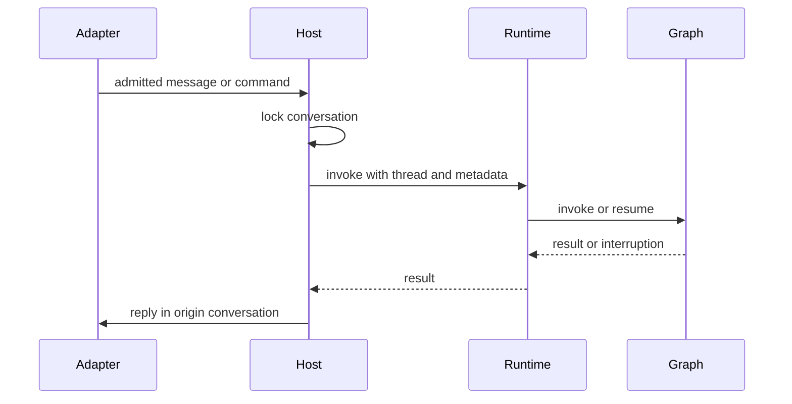

# Talon Runtime Host

> **Experimental, alpha software.** Talon is not for production or enterprise workloads and is not a production containment or multi-tenant boundary. It lacks complete HITL policy and channel-administrator controls. Treat an admitted channel sender as having access to the operator's agent, model credentials, MCP tools, and—unless sandboxing is configured—local-host resources. Sandboxing is opt-in and does **not** cover MCP tools.

Talon is a local single-event-loop host for one long-running Deep Agents assistant. It owns the agent runtime, channel adapters, and—when channels are configured—a persistent cron scheduler. Adapters perform provider-specific admission and translate events; the host serializes a provider-qualified conversation, handles commands and interruption, invokes the runtime, and returns results through the originating adapter. See [Architecture overview](../architecture/overview.md), [state persistence](../concepts/state-persistence.md), [channel admission](../concepts/talon-channel-admission.md), [scheduling](../concepts/talon-scheduling.md), and [security](../operations/security.md).

## Start, composition, and lifecycle

Talon 0.0.9 requires Python 3.12 or later and exposes the `deepagents-talon` CLI. From `libs/talon` (or use `uv --directory libs/talon` from the repository root):

```bash
uv sync --group test
AGENT_ASSISTANT_ID=local AGENT_MODEL=<provider>:<model-id> uv run deepagents-talon --once
```

`--whatsapp`, `--telegram`, `--discord`, and `--slack` attach those adapters; their `DEEPAGENTS_TALON_<CHANNEL>_ENABLED` flags do the same. Without `AGENT_MODEL` or `DEEPAGENTS_TALON_MODEL`, the CLI builds the echo runtime, which returns inbound text and is useful for wiring/lifecycle checks. With a model, it opens checkpoint and history stores, loads MCP tools, wraps the checkpointer in `ConversationSaver`, and constructs `DeepAgentRuntime`. The scheduler is attached only if at least one channel was configured.


```mermaid
sequenceDiagram
    participant Adapter
    participant Host
    participant Runtime
    participant Graph
    Adapter->>Host: admitted message or command
    Host->>Host: lock conversation
    Host->>Runtime: invoke with thread and metadata
    Runtime->>Graph: invoke or resume
    Graph-->>Runtime: result or interruption
    Runtime-->>Host: result
    Host->>Adapter: reply in origin conversation
```

This shows the verified normal channel-turn path; commands may finish in the host without invoking the graph.

The host starts the runtime first, then binds and starts adapters, then starts the scheduler. A failed partial startup stops already-started components in reverse order. Shutdown cancels active work before stopping channels, scheduler, and runtime; it continues stopping later components even if one stop fails.

Each inbound channel message gets a provider-qualified conversation root. The host uses a per-root lock and a history-scope lock, dispatches recognized commands before model invocation, and otherwise replaces any active turn. A new message cancels the prior turn, records an interruption marker after the latest committed checkpoint, and starts on the same thread. If cancellation exceeds 30 seconds, that conversation is blocked: the new message is not started and restarting Talon is required for recovery.

## Assistant home and persistent state

`TalonConfig` validates the assistant identifier and defaults its home to `~/.deepagents/<assistant-id>`; `DEEPAGENTS_TALON_HOME` changes the parent. It creates restrictive home, manifest, `agents/`, `cron/`, `channels/`, and inbound-media directories, materializes missing defaults, and ensures the assistant `tools.json` approval store exists. The local execution workspace is the current directory unless `DEEPAGENTS_TALON_WORKSPACE` is set.

Keep the assistant home and MCP configuration outside the agent-writable workspace. Their permissions and the approval file do not protect against code executing as the same operating-system user.

### Checkpoints, archive, and history search

`DEEPAGENTS_TALON_CHECKPOINT_URI` selects the LangGraph checkpointer; no value uses local SQLite in the assistant home. SQLite (`sqlite:` or `file:`), PostgreSQL (`postgres:` or `postgresql:`), MongoDB (`mongodb:` or `mongodb+srv:`), and one trusted installed `deepagents_talon.checkpoint_backends` plugin are supported. Built-in schemes win; an unknown or duplicate plugin scheme is a configuration failure. Remote checkpoint thread IDs are not automatically assistant-namespaced, so separate assistant databases are safer.

`DEEPAGENTS_TALON_HISTORY_URI` independently selects the conversation archive. SQLite, PostgreSQL, MongoDB, and one trusted installed history plugin are supported; archive data is namespaced by assistant ID and requires one writer per assistant. At model-host startup, Talon opens both stores and passes `ConversationSaver(checkpointer, archive=archive)` to the runtime.

The archive preserves channel conversations through restarts and context compaction. `/new` begins fresh context but retains prior sessions. The intentionally hidden `/reset-all-history` stops current work and deletes only the current chat's archive sessions and checkpoints; it does not remove cron jobs, memory, downloaded media, traces, or backups. A deletion failure may leave a partial reset that can be retried.

Set `DEEPAGENTS_TALON_HISTORY_VECTOR_SEARCH=1` for optional semantic history search. A changed embedding profile is incompatible with an existing vector index; set `DEEPAGENTS_TALON_HISTORY_REINDEX=1` explicitly to rebuild vectors from retained transcripts, then remove the flag.

### Schedules

Cron state lives under the assistant home. A scheduled run is serialized by a per-job conversation lock, bounded to 30 minutes, and repairs its interrupted graph thread after timeout. It reads the recorded origin chat's history scope only when that channel is still available. Results go only through the adapter serving the recorded origin; if it is absent, Talon drops rather than reroutes them. The live host is the cron store's only writer, so run `deepagents-talon pairing pause-jobs` only while Talon is stopped.

## Channels and commands

All adapters share `self`, `allowlist`, and explicitly acknowledged `open` exposure. `open` requires the provider-specific acknowledgement value `allow-arbitrary-senders` and allows arbitrary senders to trigger an agent with operator credentials and host access. Configure admission before enabling a channel.

The shared command registry drives host parsing, `/help`, and platform advertisements. `/reset-all-history` and `/pair` remain executable but are hidden from help and platform registration; `/model` and `/smart-model` are visible. Discord can register visible commands as native slash commands. Slack uses one app-configured slash command and translates its argument to the same typed host command.

Pairing is available only for Discord, Slack, and Telegram and is refused in `open` exposure. An unknown sender is stopped before the host/model and receives a channel-bound, one-hour, one-use code; an operator can approve it with `/pair approve <code>` or `deepagents-talon pairing approve <channel> <code>`. Pairing grants admission, never operator authority. Its persisted store uses locked atomic updates and fails closed when unreadable or invalid, leaving only environment-configured admission.

Supported inbound images are converted to bounded multimodal data-URL blocks. Outbound Markdown media must resolve to a supported regular file below the trusted outbound root; URLs, traversal, and symlink escape are rejected.

## Slack Socket Mode

Enable Slack with `--slack` or `DEEPAGENTS_TALON_SLACK_ENABLED=true`, plus `DEEPAGENTS_TALON_SLACK_BOT_TOKEN` (`xoxb-`) and `DEEPAGENTS_TALON_SLACK_APP_TOKEN` (`xapp-`). The adapter authenticates the bot and opens a Socket Mode connection, so it needs no public HTTP endpoint. It acknowledges every Socket Mode envelope before dispatch—Slack redelivers unacknowledged envelopes quickly—and keeps the most recent 1,024 event IDs to suppress duplicate event turns.

A DM channel is one Talon conversation. In channels, only `app_mention` events produce a turn; the bot replies in the mentioned message's thread. Each thread has a separate active conversation and reply destination, identified by `<channel-id>:<thread-ts>`, while its archived history is scoped to the channel. Thus sibling threads can share archive-history tools but not active context. Bot messages, edits, deletions, and duplicate plain-message delivery of a mention are dropped before host dispatch.

Slack slash commands have no thread identity. The app may name its single command `/talon`, `/talon-dev`, or another manifest-owned name; `/talon new` is translated to `/new`. It works only in a bot DM (except operator pairing approval); in a channel thread, mention the bot followed by the typed command, for example `@Talon /new`. Rejections and command results use Slack's validated `response_url`, so they are private to the invoking user rather than posted into the DM/channel.

For an admitted thread message, Talon may retrieve bounded preceding replies as context. By default it includes only configured operator and allowlisted-user replies; `DEEPAGENTS_TALON_SLACK_INCLUDE_OTHER_THREAD_PARTICIPANTS=1` also permits other humans and bots. This changes context, not inbound admission, and increases prompt-injection risk in shared or Slack Connect channels. OAuth callback messages are excluded before truncation; retrieval failure or an over-limit thread is represented as unavailable context rather than stale context.

Outbound Markdown becomes Slack `mrkdwn`, is split at 4,000 characters, and may preserve literal valid `<@USER_ID>` mentions. `DEEPAGENTS_TALON_SLACK_MENTION_ALLOWLIST_USERS` restricts those outbound mentions independently of inbound admission; an empty configured value permits none. Approval prompts suppress mentions. Inbound files use the bot token only for `https://files.slack.com`; redirects, unexpected hosts, excessive or incomplete downloads, and symlinked destinations are rejected. Upload URLs are likewise restricted to Slack's file host.

## Models, MCP, sandbox, and observability

`/model` is assistant-wide in the host: an operator can select a credentialed, tool-calling provider-catalog model or restore the default. The saved selection applies on the next turn across chats and survives `/new` and restarts. Scheduled jobs and subagents retain configured/startup models. `/smart-model` separately sets the assistant-wide model for approved `ask_for_help` consultations.

At startup, `MCPToolProvider` loads configured MCP tools (default `~/.deepagents/.mcp.json`, overridden with `DEEPAGENTS_TALON_MCP_CONFIG`) and management capabilities. `deepagents-talon mcp config` shows configuration discovery and `deepagents-talon mcp login <server>` provides terminal OAuth. `/mcp-reload` replaces runtime tools and rebuilds the graph under the runtime lock. On failure, the previous graph remains usable and reload is marked inactive; already-active tasks retain their original capabilities.

Without `DEEPAGENTS_TALON_SANDBOX`, agent shell and file tools run on the host. A configured `deepagents-code` provider creates a sandbox for the host lifetime; startup fails rather than falling back to host execution if it cannot start. An attached `DEEPAGENTS_TALON_SANDBOX_ID` is retained, while a Talon-owned session is closed at shutdown. The composite backend routes only assistant `skills/` and `memory/` to host storage; all other filesystem and execution operations go to the sandbox. MCP, web, and channel/media handling remain host-side, so this is not complete containment.

LangSmith tracing runs only when `LANGSMITH_TRACING` is truthy and `LANGSMITH_API_KEY` is present. It tags invocations with Talon assistant, conversation, trigger, and request metadata; a missing optional package produces a warning and disables tracing. `DEEPAGENTS_TALON_AGENT_ACTIVITY_LOGGING=true` enables local agent/model/tool lifecycle logs. Tool input/output previews are redacted, structurally bounded, and truncated to 1,000 characters, but can still contain sensitive data.

## Verification

Run the Talon suite from `libs/talon`:

```bash
uv run --group test pytest tests/
```

For deployment changes, run `deepagents-talon --once` with the intended model, channel, checkpoint/history URI, MCP configuration, and sandbox environment. For Slack changes, focus on `tests/channels/test_slack.py`: it exercises admission, event conversion, DM/thread identity, private slash-command routing, mentions, media, reactions, and thread context. `tests/unit_tests/test_slack_oauth_context.py` specifically verifies that loopback OAuth callbacks are excluded from retrieved thread context before truncation and never reach the model request. Also exercise host lifecycle/interruption tests and the relevant persistence, pairing, and cron tests for changes at those boundaries.
