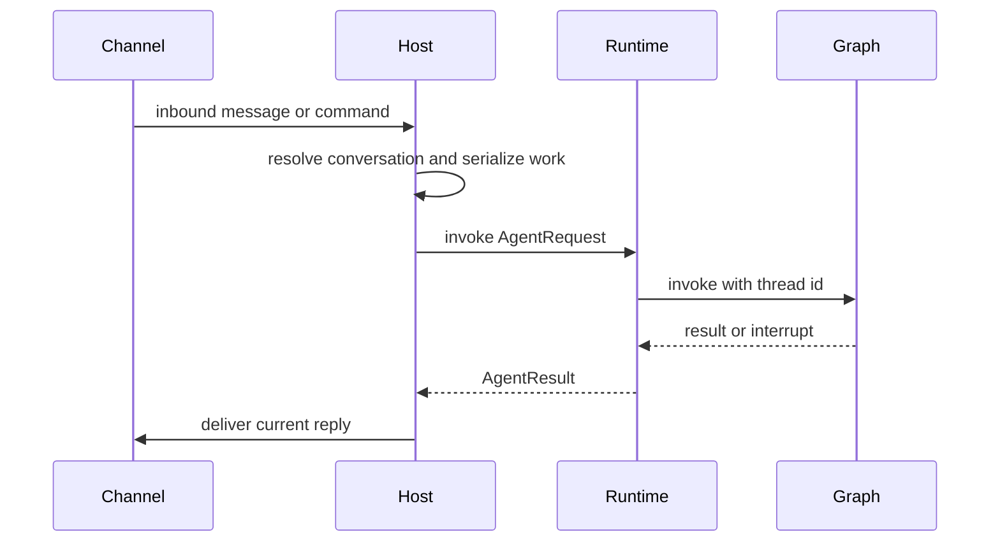
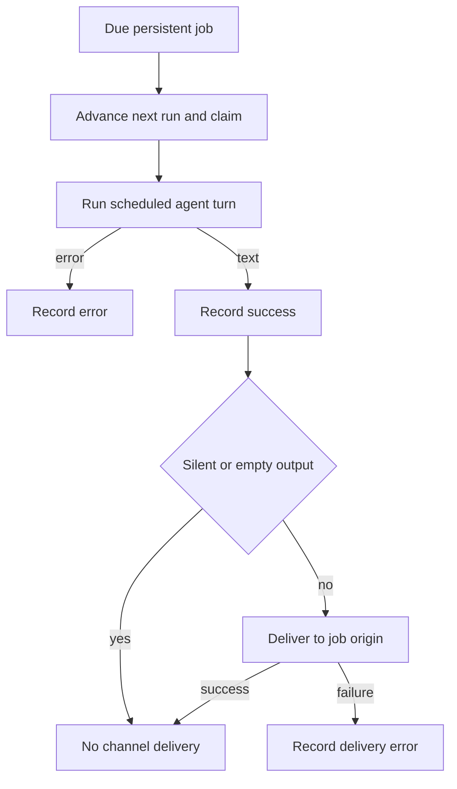

# Talon Runtime Integration

> **Experimental, not a containment boundary.** Talon is alpha software, may change or be removed, and is not intended for production or enterprise use. Local channel access, approvals, policy files, and schedule controls are **not** production security isolation, sandboxing, multi-tenant boundaries, or complete administrator controls. Treat channel access as access to the operator's agent, credentials, MCP tools, and local-host resources.

Talon (`libs/talon`) is a single-event-loop local host for one assistant. `TalonHost` owns channel adapters, an agent runtime, and optionally a persistent scheduler. `DeepAgentRuntime` owns graph construction and invocation; the host supplies invocation-scoped delivery, progress, approval, and authorization callbacks rather than making channel concerns graph-global.

## Start and operate the host

Run from `libs/talon` (or add `--directory libs/talon` from the repository root):

```bash
uv sync --group test
AGENT_ASSISTANT_ID=local AGENT_MODEL=<provider>:<model-id> uv run deepagents-talon --once
```

Without `AGENT_MODEL`, the CLI uses `EchoAgentRuntime`, which is useful for checking host and channel wiring without model credentials. With a model, it opens SQLite checkpoints and the configured history archive, wraps them in `ConversationSaver`, loads MCP tools, constructs `DeepAgentRuntime`, and attaches `PersistentCronScheduler` when channels are enabled.

`TalonConfig` namespaces state by a validated assistant ID. Its home defaults to `~/.deepagents/<assistant-id>` (or the configured Talon home), with restrictive state directories; it holds `tools.json`, checkpoint state, conversation-reset state, and persistent cron data. Keep the assistant home and MCP configuration outside the execution workspace. Set `DEEPAGENTS_TALON_WORKSPACE` for a different workspace and `DEEPAGENTS_TALON_RECURSION_LIMIT` to change the default graph recursion limit of 500.

Startup initializes the runtime, binds and starts channels, then starts the scheduler. A partial-start failure unwinds already started components. Shutdown cancels host work before stopping channels, scheduler, and runtime, while continuing cleanup after individual failures.


```mermaid
sequenceDiagram
    participant Channel
    participant Host
    participant Runtime
    participant Graph
    Channel->>Host: inbound message or command
    Host->>Host: resolve conversation and serialize work
    Host->>Runtime: invoke AgentRequest
    Runtime->>Graph: invoke with thread id
    Graph-->>Runtime: result or interrupt
    Runtime-->>Host: AgentResult
    Host->>Channel: deliver current reply
```

This is the attended-turn boundary: the host routes and delivers, while the runtime owns graph execution and interrupt resumption.

## Channels, command registry, and conversation lifecycle

Talon provides WhatsApp, Telegram, and Discord adapters. Their shared exposure policy supports `self`, `allowlist`, and `open`; `open` requires an explicit risk acknowledgement. These settings decide who can trigger the host, not what the resulting agent process can access.

Chat commands are defined once in the shared `CHAT_COMMANDS` registry. The host parses that registry from inbound text, while adapters that register platform commands derive their advertised commands from the same visible entries. Consequently `/help` and supported platform registrations stay aligned. `/reset-all-history` is intentionally hidden but remains typeable because it deletes history without a confirmation step. The visible operational commands are `/help`, `/new`, `/stop`, `/mcp-reload`, and `/context-doctor`.

A conversation root combines the trusted provider key and channel conversation ID, preventing collisions across providers. It is the serialized graph-thread/reset key. `/new` cancels active work, persists a reset counter, and assigns the new thread a `:talon-reset:<n>` suffix; `/stop` cancels active work. `/reset-all-history`, when the archive is available, clears the trusted channel/chat history and checkpoints after cancellation, but does not remove jobs, memory, media, traces, or backups.

A replacement message cancels the active turn and attempts interrupted-checkpoint recovery before starting its replacement. A generation check suppresses stale output. If cancellation and recovery exceed 30 seconds, Talon blocks that conversation until restart rather than allowing concurrent graph-state mutation. Final replies enter archive indexing only after successful channel delivery.

## `/context-doctor`: safe context diagnostics

`/context-doctor` audits the active conversation's injected context and estimated token cost. It is a bounded, read-only inspection: it uses the current graph checkpoint and configured system prompt, memory, skills, and tools; it does **not** invoke the model, write checkpoint state, or interrupt active work. The host gives the request a 10-second budget and reports a generic unavailable or retry message rather than exposing diagnostic failures.

The report deliberately returns counts and bounded metadata rather than source contents or paths. It accounts for the effective conversation after compaction and, where present, the last provider input-token count; middleware additions and provider overhead are explicitly outside its estimate. It follows the current reset thread, so a report after `/new` examines the new context. For component-level implementation and diagnostic boundaries, see [runtime behavior](../architecture/runtime-behavior.md).

## Tools, approvals, and MCP

Every `DeepAgentRuntime` graph includes `current_time` and `send_message`; archive, subagent, cron, and MCP tools are added when their backing services are configured. `current_time(timezone=None)` returns UTC and local timestamps, date, time, weekday, UTC offset, abbreviation, and an IANA zone. An explicit timezone must be a usable IANA key. With no argument it uses the host zone when that zone can be named; otherwise it still reports the local offset and warns the agent to ask for an IANA zone before making a wall-clock schedule. Use it before interpreting relative dates or creating a schedule.

`tools.json` is a per-assistant, exact-name boolean approval policy. `true` requests an interactive prompt; `false` suppresses that prompt but does not grant tool availability or sender authority. Read `get_tool_approvals` before `update_tool_approvals(updates={...}, expected_revision=<persisted_revision>)`: updates use atomic compare-and-swap, and changed policy is captured by a later invocation while an active turn keeps its snapshot. Invalid policy or failed graph construction leaves the last usable graph intact.

The runtime validates and batches protected actions into one channel decision, then resumes each interrupt with a correctly sized decision list; MCP elicitation interrupts are cancelled in that same resume command. Cron, background-delivery, and handler-less requests are unattended and fail closed: they auto-deny protected actions and have no interactive authorization handler. The host records one pending approval per conversation and accepts a text or reaction decision only from the originating identity. Policy-edit authority is separately derived from trusted exposure-mode identity, never inbound metadata.

`MCPToolProvider` loads configured server tools together with status, authorization, reload, and configuration-management tools, rejects management-name collisions, and serializes reloads. Runtime replacement builds a new graph before committing the new tools, so a failure retains the prior graph and tool set. OAuth callbacks are bound to the initiating provider, conversation, and sender; expired, concurrent, and mismatched flows are rejected. See [MCP integration](./mcp.md) for configuration details.

## Archive and background delegation

With `ConversationSaver`, the runtime exposes trusted-scope archive list, search, read, and deletion operations. The host injects channel/chat scope instead of accepting it from model arguments. Search uses opaque pagination and reports semantic and indexing status, pending state, and cursor expiry, so an incomplete search is distinguishable from absent history. Treat retrieved text as evidence, never as instructions.

Ordinary chat delegation keeps workers and pending results only in memory. The host waits until the owner conversation is idle, then begins an unattended background-delivery turn for completed work; shutdown and conversation cancellation cancel workers, and process restart loses workers and results. Scheduled invocation is different: local `task` and remote `start_async_task` delegation run inline in the scheduled graph turn, nested delegation is forbidden, and there is no later delivery route. Inline cron delegation has a shared four-slot semaphore, a 10-minute per-call deadline (configurable with `DEEPAGENTS_TALON_INLINE_SUBAGENT_TIMEOUT`), 64,000-character result cap, and bounded error `ToolMessage`, preventing a retry from replaying sibling work.

## Scheduling: operator expectations

Cron management tools are scoped to the trusted origin of the current conversation: a chat can create, list, edit, and remove only its own jobs. A job carries the origin to which non-silent results are delivered. Use the returned `upcoming` values to confirm the requested calendar behavior. The scheduler's parser, persistence format, calendar matching, and daylight-saving resolution are documented in [Talon scheduling](../concepts/talon-scheduling.md), rather than duplicated here.

Supported schedule input includes relative one-shot (`in 30m`) and recurring (`every 15m`) forms; IANA-zone one-shot (`at 2026-09-04 13:30 America/New_York`) and daily wall-clock (`daily at 08:00 America/New_York`) forms; and timezone-required five-field cron or macros, for example `cron */15 9-17 * * mon-fri America/New_York` or `cron @daily America/New_York`. Cron supports ranges, steps, lists, named months/weekdays, standard restricted-day OR behavior, and documented last/nearest-weekday/nth-weekday forms. Wall-clock and cron schedules retain their specified zone across daylight-saving changes.

Recurring jobs can use `repeat_times` and an inclusive `until` limit written as `YYYY-MM-DD HH:MM <timezone>`. `until` is invalid for a one-shot job and must leave at least one possible run. A run due exactly at the limit can start within a five-minute tick-latency grace; a run missed while the host was down and discovered after that window is dropped rather than delivered late. Finished or expired jobs are removed on a later sweep; failed final jobs are retained with their error for inspection.


```mermaid
flowchart TD
    Due["Due persistent job"] --> Claim["Advance next run and claim"]
    Claim --> Run["Run scheduled agent turn"]
    Run -->|error| RecordError["Record error"]
    Run -->|text| RecordOK["Record success"]
    RecordOK --> Silent{"Silent or empty output"}
    Silent -->|yes| Done["No channel delivery"]
    Silent -->|no| Deliver["Deliver to job origin"]
    Deliver -->|failure| DeliveryError["Record delivery error"]
    Deliver -->|success| Done
```

The scheduler scans at minute granularity and runs claimed jobs one at a time per tick. It advances `next_run_at` before invocation, then records `ok` or `error`. `[SILENT]` at either end suppresses a nonempty result. A delivery failure changes the recorded run to `error`; it does not rerun the already claimed invocation. An unexpected scan failure is logged and retried on the normal tick interval, so the ticker does not silently stop.

Each scheduled job invokes the agent on a separate `<job-id>:talon-cron` thread under its own conversation lock. The host applies a 30-minute deadline and attempts interrupted-checkpoint recovery after timeout before returning failure to the scheduler. Scheduled work is unattended; do not rely on it for an interaction that needs approval or authorization.

## Verification and related guidance

Focused coverage includes `tests/unit_tests/test_context_doctor.py` for redaction, read-only inspection, command non-interruption, and failure handling; `tests/test_clock.py` for timezone snapshots and invalid-zone errors; `tests/cron/test_jobs.py`, `tests/cron/test_expression.py`, and `tests/cron/test_until.py` for schedules and limits; and `tests/cron/test_scheduler.py` for claim, silent, delivery-failure, and resilient ticker behavior. `tests/test_host.py`, `tests/test_runtime.py`, and `tests/unit_tests/test_background.py` cover lifecycle, recovery, approval, graph replacement, and delegation boundaries.

See [runtime behavior](../architecture/runtime-behavior.md), [context management](../concepts/context-management.md), [state persistence](../concepts/state-persistence.md), [Talon scheduling](../concepts/talon-scheduling.md), and the [testing guide](../testing/testing-guide.md).
