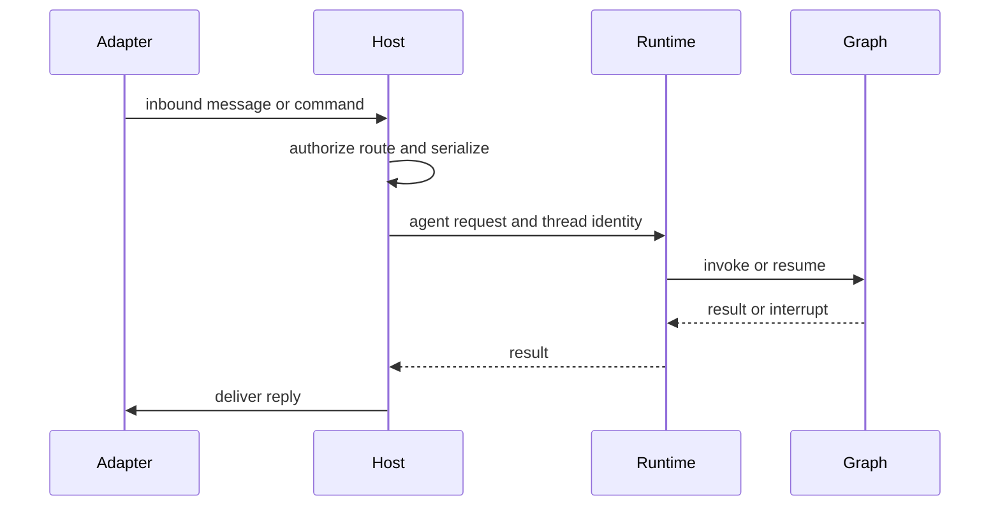
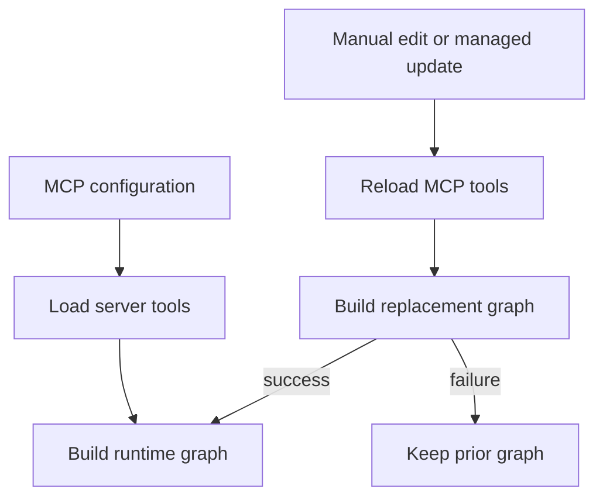

# Talon Runtime Integration

> **Experimental—do not use for production or enterprise workloads.** Talon is alpha software and may change or be removed. It does not provide production-grade complete HITL policy, channel-administrator controls, or multi-tenant isolation. An admitted sender can invoke an agent using the operator's model credentials, MCP tools, and (without a sandbox) local-host resources. Sandboxing does not cover MCP tools.

Talon is the single-event-loop local host for a Deep Agents assistant. It owns channel adapters, the optional persistent cron scheduler, and the agent runtime; adapters normalize provider events and the host routes, serializes, cancels, and delivers turns. See [Runtime behavior](../architecture/runtime-behavior.md), [State persistence](../concepts/state-persistence.md), [Talon channel admission](../concepts/talon-channel-admission.md), and [Talon scheduling](../concepts/talon-scheduling.md) for related design detail.

## Start and assemble a host

Run from `libs/talon` (or add `--directory libs/talon` from the repository root):

```bash
uv sync --group test
AGENT_ASSISTANT_ID=local AGENT_MODEL=<provider>:<model-id> uv run deepagents-talon --once
```

`--once` starts and stops the assembled host, so it is a useful configuration check. `--whatsapp`, `--telegram`, `--discord`, and `--slack` attach adapters; the matching `DEEPAGENTS_TALON_<CHANNEL>_ENABLED` environment variables do the same. With no `AGENT_MODEL` or `DEEPAGENTS_TALON_MODEL`, the CLI uses `EchoAgentRuntime`, useful for channel and lifecycle checks. With a model, it opens the SQLite checkpoint store and history archive, loads MCP tools, and constructs `DeepAgentRuntime`. A `PersistentCronScheduler` is attached only if there is at least one channel.


```mermaid
sequenceDiagram
    participant Adapter
    participant Host
    participant Runtime
    participant Graph
    Adapter->>Host: inbound message or command
    Host->>Host: authorize route and serialize
    Host->>Runtime: agent request and thread identity
    Runtime->>Graph: invoke or resume
    Graph-->>Runtime: result or interrupt
    Runtime-->>Host: result
    Host->>Adapter: deliver reply
```

This is the normal attended-turn path. Startup starts the agent, then channel adapters, then the scheduler; a failure unwinds components already started. Shutdown cancels work before stopping channels, scheduler, and runtime. A new message in the same conversation cancels the active turn and continues from a repaired checkpoint; if cancellation does not complete within 30 seconds, Talon declines the new turn and requires a restart to recover.

`TalonConfig` validates the assistant ID and by default namespaces state under `~/.deepagents/<assistant-id>`; `DEEPAGENTS_TALON_HOME` changes the parent. Home, manifests, agents, cron, channel, and inbound-media directories are created with restrictive permissions. The home holds `checkpoints.sqlite`, model selection, conversation-reset, pairing, cron, and tool-approval state. Keep it outside the workspace, which defaults to the current directory and can be changed with `DEEPAGENTS_TALON_WORKSPACE`.

## Persistent conversations, history, and cron

The model runtime wraps the SQLite LangGraph checkpointer in `ConversationSaver`. It archives channel conversations without automatic expiry so that history survives context compaction and restarts; `/new` begins a fresh context while retaining searchable prior sessions. `/reset-all-history` cancels active work, deletes checkpoints and archive sessions only for the current chat, then starts fresh. It is hidden because deletion is irreversible and may be partial on failure; it does not remove cron jobs, memory, downloaded media, traces, or backups.

SQLite is the default history archive. Set `DEEPAGENTS_TALON_HISTORY_URI` to a MongoDB, PostgreSQL, or supported plugin URI for an archive backend; checkpoints remain local. Archives require one writer per assistant. Optional semantic history search is enabled with `DEEPAGENTS_TALON_HISTORY_VECTOR_SEARCH=1`; it uses a separately managed vector index, and an incompatible embedding configuration requires explicit `DEEPAGENTS_TALON_HISTORY_REINDEX=1` to rebuild retained transcripts.

Cron state is in the assistant home’s `cron/` directory. The agent’s cron tools create and edit jobs with the origin channel and conversation. A scheduled result is delivered only through the adapter serving that recorded origin; if that channel is absent, the result is dropped rather than redirected. Do not manually write the active cron store or run the pairing `pause-jobs` command while the host is live.

## Channels, exposure, and commands

Adapters implement the provider-neutral channel boundary: register inbound handling, start and stop, deliver text or media, and report status. The shared exposure modes are:

- `self` admits the provider self identity or configured operator IDs;
- `allowlist` admits configured chats, with optional text-based mention patterns; and
- `open` admits arbitrary senders only after the provider-specific acknowledgement is set to `allow-arbitrary-senders`.

Mention patterns are text matching, not sender authentication. `open` grants arbitrary senders a route to the operator’s credentials and local-host resources. Configure admission before enabling an adapter; see [Talon channel admission](../concepts/talon-channel-admission.md).

The shared command registry supplies host parsing, `/help`, and native command advertisements where supported. `/reset-all-history` and `/pair` are hidden but remain executable, while `/model` is visible. Commands are intercepted by the host, not sent to the model.

| Adapter | Setup | Important behavior |
| --- | --- | --- |
| WhatsApp | Loopback Node bridge; set `DEEPAGENTS_TALON_WHATSAPP_ENABLED=true`, and optionally `DEEPAGENTS_TALON_WHATSAPP_START_BRIDGE=true`. | QR pairing authenticates the operator account, not sender pairing. |
| Telegram | Bot API long polling; set `DEEPAGENTS_TALON_TELEGRAM_BOT_TOKEN` or `TELEGRAM_BOT_TOKEN`. | Channel state is under the assistant home. |
| Discord | Gateway; set `DEEPAGENTS_TALON_DISCORD_BOT_TOKEN` and enable Message Content intent. | Visible shared commands can be native slash commands; a guild-scoped registration is immediate but cannot reach DMs. |
| Slack | Socket Mode; set `DEEPAGENTS_TALON_SLACK_BOT_TOKEN` (`xoxb-`) and `DEEPAGENTS_TALON_SLACK_APP_TOKEN` (`xapp-`). | A DM is one conversation; each mentioned channel thread is a conversation. |

Slack acknowledges Socket Mode envelopes before handling them and deduplicates recent event IDs, preventing redelivery from starting a duplicate turn. It exposes one slash command, normally `/talon`, only in a bot DM; its text is translated to a typed Talon command. In channel threads, mention the bot and include the typed command, such as `@Talon /new`. Slack outbound text uses `mrkdwn`, splits at 4,000 characters, and can make literal valid `<@USER_ID>` references into mentions; use `DEEPAGENTS_TALON_SLACK_MENTION_ALLOWLIST_USERS` to restrict recipients. Inbound file downloads send the bot token only to `https://files.slack.com` and reject redirects.

### Sender pairing

Sender pairing is opt-in for Discord, Slack, and Telegram, but not WhatsApp, and is refused with `open` exposure. An unknown sender is stopped before the host or model and receives a short-lived, single-use code bound to that channel. An operator approves it in an operator DM with `/pair approve <code>` or through `deepagents-talon pairing approve <channel> <code>`.

Pairing grants allowlisted access, not operator authority: paired users cannot administer pairing or tool-approval policy. `pairing.json` uses locked atomic updates; an unreadable or invalid store fails closed, retaining only environment-configured admission. The CLI also provides `list`, `revoke`, and `pause-jobs`; run `pause-jobs` only while Talon is stopped because the live host is the cron store’s sole writer.

## Models, diagnostics, and approvals

`/model` is assistant-wide. It lists the default and models discoverable from credentialed tool-calling provider packages; `/model <provider>` lists a provider, `/model <provider:model>` selects one, and `/model default` restores the startup model. Only an operator may select. The choice is persisted in `models.json`, captured at turn start, lazily built and cached, then bound into main-agent turns along with a context-aware summarizer. Scheduled jobs and subagents retain their own configured or startup model.

`/smart-model` independently selects the assistant-wide model for `ask_for_help`; `off` disables it and `default` restores `DEEPAGENTS_TALON_HELP_MODEL`. The help tool is available only to an operator’s main conversation and always requires a channel approval before it sends its bounded question and fixed instruction to the helper model. It does not send chat history, tools, or filesystem context.

`/context-doctor` reads the active graph checkpoint to render bounded context estimates with content and paths redacted. It does not invoke the model or alter state. The host limits the diagnostic to 10 seconds, sends a generic unavailable or failure response, and leaves an active turn running.

Each assistant has a fixed `tools.json` policy in its home. It maps exact tool names to whether a channel approval prompt is required; it is not an authorization or sandbox boundary. Changes are atomic compare-and-swap updates, take effect on the next invocation, and invalid policy fails closed. Tool approvals are still experimental controls: only trusted operator identity may manage policy, while scheduled and unattended runs cannot satisfy interactive approvals.

## MCP configuration and authentication

At model-runtime startup, `MCPToolProvider` reads `~/.deepagents/.mcp.json` unless `DEEPAGENTS_TALON_MCP_CONFIG` supplies a path. It expands `${ENV_VAR}` references, loads available server tools, prefixes MCP tool names with the server name, and adds management tools for status, reload, configuration, and OAuth where applicable. Malformed configuration or a collision with management-tool names fails that load; individual server failures are recorded so other servers can remain usable.


```mermaid
flowchart TD
    Config["MCP configuration"] --> Load["Load server tools"]
    Load --> Graph["Build runtime graph"]
    Edit["Manual edit or managed update"] --> Reload["Reload MCP tools"]
    Reload --> Build["Build replacement graph"]
    Build -->|success| Graph
    Build -->|failure| Prior["Keep prior graph"]
```

This shows MCP activation and safe graph replacement. Use `/mcp-reload` after a manual edit. The agent-side `reload_mcp_configuration` schedules refresh for a subsequent turn. Replacement runs under the runtime tool lock: a failure retains the prior graph and marks saved MCP changes inactive, while already active turns and tasks retain their original capabilities.

Use `deepagents-talon mcp config` to show discovery paths and `deepagents-talon mcp login <server>` for terminal OAuth. An OAuth-configured remote server can also authorize through an interactive originating channel: Talon sends the authorization URL there and accepts the callback outside model context and traces; a completed login schedules a refresh. Use `${ENV_VAR}` for credentials and keep the configuration outside the agent workspace. See [MCP integration](./mcp.md).

## Subagents and observability

Talon loads local definitions from `agents/<name>/AGENTS.md` and remote `[async_subagents]` configuration at startup. Local frontmatter requires `description`; `name` defaults to its directory and `model` is optional. Definitions are not automatically reloaded: call `reload_subagent_configuration` after edits. Invalid edits retain the last valid setup, and running tasks retain their original graph.

`task` launches local subagents and `start_async_task` launches remote ones. In chat, background work returns immediately; when it completes, Talon starts a follow-up main-agent turn on the next idle opportunity to process and deliver results. Workers and pending results are memory-only, `/stop`, `/new`, and shutdown cancel them, and scheduled runs instead execute delegation inline because they are unattended. Local attachments use explicit `tools: [exact_tool_name]`; `web: true` grants the available built-in web tools only to that agent.

LangSmith tracing runs only when `LANGSMITH_TRACING` is truthy and `LANGSMITH_API_KEY` is present. Traced invocations include assistant, conversation, trigger, and request metadata; a missing optional tracing package only warns. `DEEPAGENTS_TALON_AGENT_ACTIVITY_LOGGING=true` enables local agent, model-lifecycle, and tool events. Tool input/output previews are redacted, structurally bounded, and truncated to 1,000 characters, but logs can still contain sensitive data.

Inbound supported images are converted to bounded multimodal data-URL blocks. Outbound Markdown media must resolve to a supported regular file beneath the trusted outbound root; URLs, traversal, and symlink escapes are rejected.

## Optional sandbox execution

Without `DEEPAGENTS_TALON_SANDBOX`, agent shell and file tools execute on the host. Choose a `deepagents-code` provider to run them in a sandbox:

```bash
DEEPAGENTS_TALON_SANDBOX=langsmith AGENT_MODEL=<provider>:<model-id> uv run deepagents-talon
```

`langsmith` works directly. `agentcore`, `daytona`, `modal`, `runloop`, and `vercel` need their matching `deepagents-code` extras and provider credentials in the Talon process. `DEEPAGENTS_TALON_SANDBOX_ID` attaches an existing sandbox that Talon does not delete; otherwise Talon owns the session and closes it on shutdown. `DEEPAGENTS_TALON_SANDBOX_SNAPSHOT` and `DEEPAGENTS_TALON_SANDBOX_SETUP` provide supported bootstrap configuration. A configured sandbox that cannot start fails startup rather than falling back to host execution.

In sandbox mode, the composite backend routes only assistant `skills/` and `memory/` to host storage. Its filesystem and `execute` operations use the sandbox, which prevents sandbox tools from rewriting `tools.json` and other assistant state. This is not broad containment: MCP and web tools, channels, media processing, credentials, and host-side state remain outside that backend. See [Sandbox partners](./sandbox-partners.md).

## Verification

Run the full Talon suite from `libs/talon`:

```bash
uv run --group test pytest tests/
```

For focused changes, prioritize `tests/test_host.py`, `tests/channels/test_slack.py`, `tests/test_mcp.py`, `tests/test_runtime.py`, `tests/unit_tests/test_subagent_reload.py`, history tests, and sandbox tests. Also use `deepagents-talon --once` with the intended model, channel, MCP, history, and sandbox environment as a deployment configuration check.
