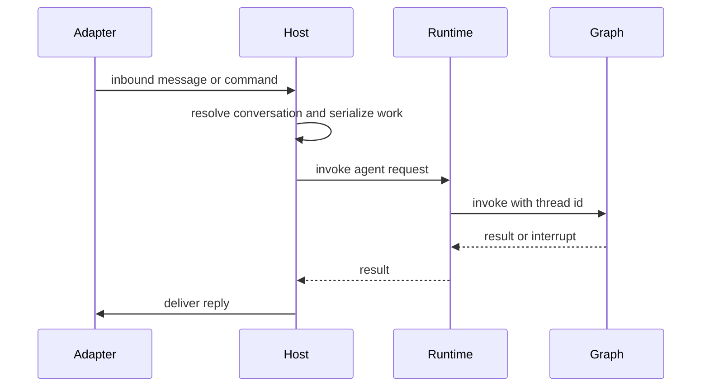
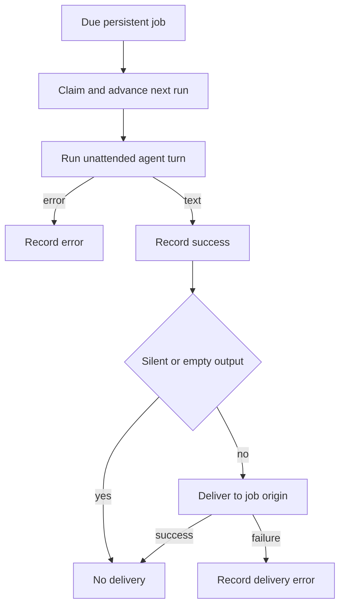

# Talon Runtime Integration

> **Experimental local-host authority.** Talon is alpha software and may change or be removed; it is not intended for production or enterprise use. A sender admitted to a channel can cause work to run with the operator's model credentials, MCP tools, and local-host authority. Channel exposure, approval prompts, and sandboxing are useful controls, but are not complete containment, administrator control, or a multi-tenant security boundary.

Talon (`libs/talon`) is the single-event-loop local host for a Deep Agents assistant. It owns channel adapters, the agent runtime, and—when a channel is attached—the persistent cron scheduler. The host supplies channel-scoped delivery and authorization callbacks to the runtime rather than making a channel a graph-global concern.

## Start modes and lifecycle

Run from `libs/talon` (or add `--directory libs/talon` at repository root):

```bash
uv sync --group test
AGENT_ASSISTANT_ID=local AGENT_MODEL=<provider>:<model-id> uv run deepagents-talon --once
```

`--once` starts and immediately stops the assembled host, which is useful for startup validation. The `--whatsapp`, `--telegram`, `--discord`, and `--slack` flags attach their respective adapters; each can instead be enabled by its `DEEPAGENTS_TALON_<CHANNEL>_ENABLED` environment flag. No model selects `EchoAgentRuntime`, allowing lifecycle and channel-wiring checks without provider credentials. With a model, Talon opens local SQLite graph checkpoints, opens the configured history archive, wraps them in `ConversationSaver`, loads MCP tools, and builds `DeepAgentRuntime`. Channels also cause a `PersistentCronScheduler` to be attached.


```mermaid
sequenceDiagram
    participant Adapter
    participant Host
    participant Runtime
    participant Graph
    Adapter->>Host: inbound message or command
    Host->>Host: resolve conversation and serialize work
    Host->>Runtime: invoke agent request
    Runtime->>Graph: invoke with thread id
    Graph-->>Runtime: result or interrupt
    Runtime-->>Host: result
    Host->>Adapter: deliver reply
```

This shows the attended-turn boundary: the host routes, serializes, and delivers; the runtime owns graph invocation and resume behavior. Startup creates state and performs sensitive-state cleanup before adapter construction. It starts the runtime and channels, then the scheduler; on shutdown it cancels host work before stopping channels, scheduler, and runtime.

## Assistant home, workspace, checkpoints, and history

`TalonConfig` validates an assistant ID and namespaces local state under `~/.deepagents/<assistant-id>/` by default; set `DEEPAGENTS_TALON_HOME` to choose its parent. Home and managed child directories are created with restrictive permissions. Important contents include:

- `checkpoints.sqlite` for persistent LangGraph checkpoints;
- `conversations.json` for reset generations and `models.json` for per-conversation `/model` selections;
- `tools.json`, `pairing.json`, `cron/`, `channels/`, `media/inbound/`, and materialized manifests, skills, and local agents.

The execution workspace defaults to the current directory and can be changed with `DEEPAGENTS_TALON_WORKSPACE`; graph recursion defaults to 500 and is configurable with `DEEPAGENTS_TALON_RECURSION_LIMIT`. Keep assistant state and MCP configuration outside that workspace. History uses the default local SQLite archive unless `DEEPAGENTS_TALON_HISTORY_URI` selects a supported URI; checkpoints remain local. For archive retention, reset semantics, scope, and backend details, see [state persistence](../concepts/state-persistence.md).

A trusted provider key plus channel conversation ID identifies a conversation and its serialized graph thread. `/new` cancels active work and advances a persisted reset generation; `/stop` cancels the active turn. A replacement message cancels and repairs interrupted checkpoint state before replacing it. If recovery exceeds 30 seconds, Talon leaves the conversation blocked until restart instead of permitting concurrent mutation. Archive indexing occurs only after successful channel delivery.

## Commands and channel admission

The shared `CHAT_COMMANDS` registry is the single source for host parsing, `/help`, and platform advertisements where the adapter supports registration. Visible commands are `/help`, `/new`, `/stop`, `/mcp-reload`, `/context-doctor`, and `/model`. `/reset-all-history` and `/pair` remain executable as typed commands but are hidden from help and platform menus: the former is irreversible without a confirmation step, while the latter needs operator-only, argument-bearing handling. Do not assume every provider advertises commands in the same way.

Adapters share `self`, `allowlist`, and `open` exposure modes. `open` requires the provider-specific acknowledgement value `allow-arbitrary-senders`; it does not limit the authority of a resulting run. `allowlist` can admit configured chat IDs and mention patterns, and the latter matches text rather than sender identity. Detailed admission invariants and sender identities belong in [Talon channel admission](../concepts/talon-channel-admission.md), not in copied configuration rules here.

### Provider boundaries

- **WhatsApp** uses a local Node bridge over loopback. Start/install the bridge as described in the README, then use `DEEPAGENTS_TALON_WHATSAPP_ENABLED=true` and, when Talon should launch it, `DEEPAGENTS_TALON_WHATSAPP_START_BRIDGE=true`. Its QR code pairs the operator account; this is distinct from sender pairing. It does not provide sender pairing.
- **Telegram** uses Bot API long polling and requires `DEEPAGENTS_TALON_TELEGRAM_BOT_TOKEN` (or `TELEGRAM_BOT_TOKEN`). Its session offset defaults beneath the assistant's `channels/telegram` directory.
- **Discord** uses the Gateway and needs `DEEPAGENTS_TALON_DISCORD_BOT_TOKEN` plus the Message Content privileged intent. It can register visible registry commands as native slash commands. `DEEPAGENTS_TALON_DISCORD_COMMAND_GUILD_ID` gives immediate guild-only registration; global registration reaches DMs but may propagate slowly. `DEEPAGENTS_TALON_DISCORD_SLASH_COMMANDS=false` disables registration while typed commands remain available.
- **Slack** uses Socket Mode, so it needs both `DEEPAGENTS_TALON_SLACK_BOT_TOKEN` (`xoxb-`) and `DEEPAGENTS_TALON_SLACK_APP_TOKEN` (`xapp-`). It exposes a single `/talon` slash command rather than a separate platform command per registry entry. `/talon` operates only in bot DMs; in a channel thread, mention the bot followed by ordinary command text. Channel replies are threaded, with each thread a distinct conversation.

For provider installation, app manifests/scopes, allowlist variables, and WhatsApp bridge setup, follow the README rather than extrapolating one adapter's behavior to another.

## Per-chat models, diagnostics, MCP, and approvals

`/model` reports the current chat model and available providers; `/model <provider>` lists that provider's models; `/model <provider:model>` changes only that conversation; and `/model default` removes its override. Eligible choices come from the installed tool-calling provider catalog, restricted to credentials present in Talon's environment, with exact catalog matching before construction. A selected model is built lazily, cached, bound for the turn, and persists across `/new` and restarts. Model-aware summarization uses the selected model's context budget; scheduled jobs and subagents retain their own models.

`/context-doctor` audits injected context and estimated token cost without calling the model or changing state. It reports bounded metadata rather than context contents or filesystem paths. See [runtime behavior](../architecture/runtime-behavior.md) for its detailed diagnostic boundary.

Talon reads MCP server configuration from `~/.deepagents/.mcp.json` by default or `DEEPAGENTS_TALON_MCP_CONFIG`. `deepagents-talon mcp config` prints discovery paths, while `deepagents-talon mcp login <server>` runs terminal OAuth. `/mcp-reload` makes manual configuration edits take effect without host restart. MCP tools and configuration-management tools are loaded into a replacement graph only after successful construction, preserving the prior usable graph on failure. Keep config outside the workspace and use `${ENV_VAR}` credential references. See [MCP integration](./mcp.md) for server configuration and OAuth details.

`tools.json` is per-assistant exact-name boolean approval policy: `true` requests a channel prompt and `false` suppresses that prompt, but neither setting grants tool availability or sender authority. Updates use a persisted revision for atomic compare-and-swap, and active turns retain their policy snapshot. Scheduled, background, and otherwise unattended work fail closed for interactive approvals. For the authority and human-in-the-loop model, see [permissions and HITL](../concepts/permissions-hitl.md).

## Pairing and media

Sender pairing is opt-in for Discord, Telegram, and Slack DMs only; it is unavailable for WhatsApp and refused with open exposure. Enable it through the relevant `DEEPAGENTS_TALON_<CHANNEL>_PAIRING=enabled`. An unknown DM sender is stopped before the host/model and can receive one short-lived code. An operator approves that code through an operator DM `/pair approve <code>` surface or `deepagents-talon pairing approve <channel> <code>`; pairing never grants operator privileges. Pairing state is atomically persisted in `pairing.json`, and unreadable state fails closed. Use the pairing CLI `list`, `approve`, `revoke`, and (only while Talon is stopped) `pause-jobs` operations for administration. See [Talon channel admission](../concepts/talon-channel-admission.md) for the complete admission and revocation behavior.

Inbound media is stored under the assistant home by default, with provider-specific media directory overrides. `DEEPAGENTS_TALON_MAX_MEDIA_BYTES` caps inbound and outbound media globally; providers may impose smaller limits (WhatsApp is additionally clamped). Outbound files must validate as the declared type and resolve beneath `DEEPAGENTS_TALON_OUTBOUND_MEDIA_DIR`, or the workspace/current directory fallback. Treat attachment metadata and files as untrusted input. Slack downloads inbound files only from `files.slack.com` and refuses redirects.

## Scheduling and time

The agent's built-in `current_time` tool reports local and UTC calendar data and supports an optional validated IANA zone. The scheduler persists jobs under `cron/` and attaches each job to its trusted origin for delivery and management scope. It supports relative, wall-clock, and timezone-required five-field cron schedules and macros. Use `upcoming` returned by job creation/editing to verify calendar intent; detailed grammar, daylight-saving behavior, persistence, and ownership rules are in [Talon scheduling](../concepts/talon-scheduling.md).


```mermaid
flowchart TD
    Due["Due persistent job"] --> Claim["Claim and advance next run"]
    Claim --> Run["Run unattended agent turn"]
    Run -->|error| RecordError["Record error"]
    Run -->|text| RecordOK["Record success"]
    RecordOK --> Silent{"Silent or empty output"}
    Silent -->|yes| Finished["No delivery"]
    Silent -->|no| Deliver["Deliver to job origin"]
    Deliver -->|failure| DeliveryError["Record delivery error"]
    Deliver -->|success| Finished
```

This is the scheduler's claim, execution, and delivery sequence. Scheduled work gets its own job thread and is unattended: do not design a scheduled task that requires an approval or authorization exchange.

Recurring cron supports timezone-required five-field expressions and macros alongside relative and wall-clock forms, and can be capped by an inclusive IANA-local `until`; late discovery after the five-minute grace drops an expired run rather than delivering it after its window. The scheduler marks a successful agent run before attempting delivery, but changes the run record to `error` if channel delivery fails; it does not rerun the already claimed invocation.

## Sandbox operation and security posture

Without `DEEPAGENTS_TALON_SANDBOX`, shell and file tools execute on the host. Set it to a `deepagents-code` provider, for example:

```bash
DEEPAGENTS_TALON_SANDBOX=langsmith AGENT_MODEL=<provider>:<model-id> uv run deepagents-talon
```

`langsmith` works directly; `agentcore`, `daytona`, `modal`, `runloop`, and `vercel` need their matching extras and provider credentials in the Talon process. `DEEPAGENTS_TALON_SANDBOX_ID` attaches an existing sandbox which Talon does not delete; otherwise Talon owns the sandbox lifetime. `DEEPAGENTS_TALON_SANDBOX_SNAPSHOT` and `DEEPAGENTS_TALON_SANDBOX_SETUP` choose provider-supported bootstrap behavior. A configured sandbox that cannot start fails startup rather than falling back to host execution.

In sandbox mode, `skills/` and `memory/` remain host-routed, while the default backend and execution go to the sandbox. MCP tools, web tools, channel/media processing, credentials, and host-side state are not thereby contained. Sandboxing therefore reduces a narrow execution surface but is not a tenant boundary or a substitute for operating-system and deployment isolation. See [security](../operations/security.md) for the broader operating posture.

## Verification

Run Talon's focused suite with:

```bash
uv run --group test pytest tests/
```

Useful focused coverage includes `tests/unit_tests/test_model_selection.py` for catalog validation and model-aware context behavior, `tests/unit_tests/test_pairing.py` and `tests/unit_tests/test_pairing_slack.py` for pairing boundaries, and `tests/unit_tests/test_sandbox.py` for sandbox lifecycle and routing. Also retain coverage for context diagnostics, clock handling, cron jobs, and scheduler delivery failures. See the [testing guide](../testing/testing-guide.md) for repository-wide test conventions.
