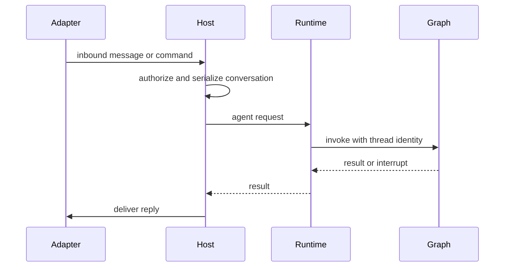
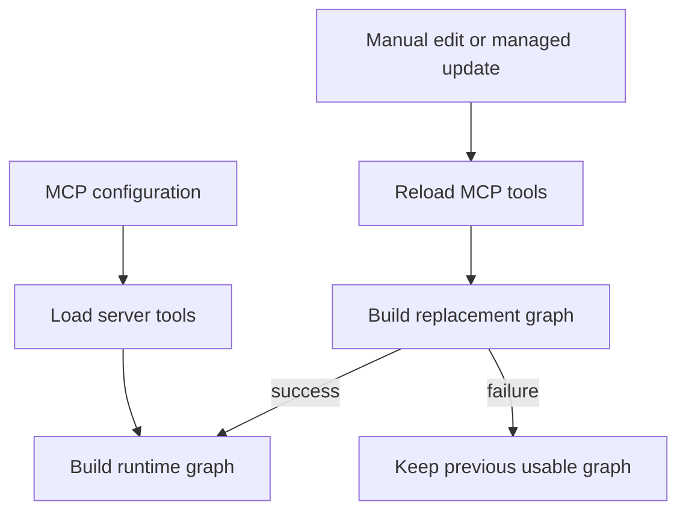

# Talon Channels, Models, MCP, and Sandboxes

> **Experimental local-host authority.** Talon is alpha software, not a production or enterprise security boundary. An admitted channel sender can cause work to run with the operator's model credentials, MCP tools, and (without a sandbox) local-host authority. Channel admission, approval prompts, and sandboxing are useful controls, not complete HITL policy, channel-administrator controls, or multi-tenant isolation.

Talon (`libs/talon`) is the single-event-loop local host for a Deep Agents assistant. It assembles adapters, the runtime, and—when a channel is present—the persistent scheduler. The host owns conversation routing, serialization, cancellation, and delivery; the runtime owns graph execution and tools. This page covers the external integration boundaries; use [Talon channel admission](../concepts/talon-channel-admission.md) and [Talon scheduling](../concepts/talon-scheduling.md) for their detailed policies.

## Start and state lifecycle

Run from `libs/talon` (or use `--directory libs/talon` from the repository root):

```bash
uv sync --group test
AGENT_ASSISTANT_ID=local AGENT_MODEL=<provider>:<model-id> uv run deepagents-talon --once
```

`--once` starts then stops the assembled host, making it useful for validating configuration. The `--whatsapp`, `--telegram`, `--discord`, and `--slack` flags attach adapters; the equivalent `DEEPAGENTS_TALON_<CHANNEL>_ENABLED` flags also attach them. With no model, Talon uses `EchoAgentRuntime` for lifecycle and channel-wiring checks. With a model, it opens SQLite checkpoints and the configured history archive, wraps them in `ConversationSaver`, loads MCP tools, and creates `DeepAgentRuntime`; a `PersistentCronScheduler` is attached only if channels exist.


```mermaid
sequenceDiagram
    participant Adapter
    participant Host
    participant Runtime
    participant Graph
    Adapter->>Host: inbound message or command
    Host->>Host: authorize and serialize conversation
    Host->>Runtime: agent request
    Runtime->>Graph: invoke with thread identity
    Graph-->>Runtime: result or interrupt
    Runtime-->>Host: result
    Host->>Adapter: deliver reply
```

This is the attended-turn boundary: adapters normalize provider events, the host routes and delivers, and the runtime invokes or resumes the graph. The host starts runtime and channels before its scheduler; shutdown cancels host work before stopping channels, scheduler, and runtime.

`TalonConfig` validates the assistant ID and namespaces state under `~/.deepagents/<assistant-id>` by default (`DEEPAGENTS_TALON_HOME` selects the parent). It creates the home and managed directories with restrictive permissions. `checkpoints.sqlite`, `conversations.json`, `models.json`, `tools.json`, `pairing.json`, `cron/`, `channels/`, and `media/inbound/` all belong to that assistant. The workspace is separate: it defaults to the current directory and is set with `DEEPAGENTS_TALON_WORKSPACE`. Keep the assistant home and MCP configuration outside it.

## Channel adapters and admission

All adapters implement a provider-neutral channel boundary and use the shared exposure modes:

- `self` (the default) admits the configured operator identity or a provider's self-message identity;
- `allowlist` admits configured conversation IDs, and can also match configured message-text mention patterns; and
- `open` admits arbitrary senders, but requires the provider-specific `*_OPEN_ACK=allow-arbitrary-senders` acknowledgement.

A mention pattern is text matching, not sender authentication. `open` does not reduce the authority of a run; it permits arbitrary senders to invoke the operator's credentials and local-host access. Treat either choice as an operator decision, not as authorization supplied by the model.

The shared command registry drives typed parsing, `/help`, and native command advertisement where a platform supports it. Visible commands include `/help`, `/new`, `/stop`, `/mcp-reload`, `/context-doctor`, `/model`, and `/smart-model`. `/reset-all-history` and `/pair` are intentionally hidden but still executable as typed commands: the former is irreversible, and the latter is operator-only and argument-bearing.

### Adapter-specific operational notes

| Adapter | Transport and required setup | Command and conversation behavior |
| --- | --- | --- |
| WhatsApp | Local Node bridge over loopback; enable with `DEEPAGENTS_TALON_WHATSAPP_ENABLED=true`, optionally let Talon start it with `DEEPAGENTS_TALON_WHATSAPP_START_BRIDGE=true`. | The QR code pairs the operator account, not a sender-pairing identity. Sender pairing is unavailable. |
| Telegram | Bot API long polling; set `DEEPAGENTS_TALON_TELEGRAM_BOT_TOKEN` or `TELEGRAM_BOT_TOKEN`. | Typed commands work in normal messages. Its offset/session state is under the assistant channel directory by default. |
| Discord | Gateway; requires `DEEPAGENTS_TALON_DISCORD_BOT_TOKEN` and the Message Content privileged intent. | It can register visible commands as native slash commands. `DEEPAGENTS_TALON_DISCORD_COMMAND_GUILD_ID` makes registration immediate but guild-only; global commands can reach DMs but propagate more slowly. Set `DEEPAGENTS_TALON_DISCORD_SLASH_COMMANDS=false` to retain typed commands without registration. |
| Slack | Socket Mode; requires both `DEEPAGENTS_TALON_SLACK_BOT_TOKEN` (`xoxb-`) and `DEEPAGENTS_TALON_SLACK_APP_TOKEN` (`xapp-`). | It exposes one `/talon` command in bot DMs. In channel threads, mention the bot followed by typed command text; each thread is a distinct conversation. |

Sender pairing is opt-in only for Discord, Slack, and Telegram DMs, and is refused with `open` exposure. An unknown sender receives a channel-bound, short-lived code before reaching the host/model. An operator approves it in an operator DM or through `deepagents-talon pairing approve <channel> <code>`. Pairing grants access as an allowlisted sender, never operator authority; invalid or unreadable persisted pairing state fails closed. Use `deepagents-talon pairing list`, `approve`, and `revoke` to administer state. Run `pairing pause-jobs` only while Talon is stopped because the live host is the cron store's writer.

## Per-chat and help models

`/model` is a conversation-scoped override: `/model` reports the active model and available providers, `/model <provider>` lists models, `/model <provider:model>` selects one, and `/model default` removes the override. A selection is persisted in host state and survives `/new` and restart. Choices are discovered from installed tool-calling provider packages, filtered to credentials available in Talon's environment; the default model remains selectable. Talon exact-matches the catalog before building a selected model, then lazily builds and caches it.

The selected model is bound for main-agent calls without recompiling the graph. Its context budget also controls its replacement summarizer and compaction thresholds. Scheduled jobs and subagents keep their own configured/startup models rather than inheriting a chat override.

`/smart-model` is separate from `/model`: it selects or disables the assistant-wide model used by `ask_for_help`, not the conversation model. `DEEPAGENTS_TALON_HELP_MODEL=<provider>:<model-id>` supplies its default. That tool sends only the question and fixed instruction to the stronger model, requires an operator approval, and is unavailable to scheduled runs and channels that cannot support the interaction. Inspect the question before approval: it may contain private content.

`/context-doctor` reads the active checkpoint to report bounded, redacted context estimates. It does not call a model, mutate state, or interrupt a running turn.

## MCP loading, reload, and OAuth

At model-runtime startup, `MCPToolProvider` reads `~/.deepagents/.mcp.json` unless `DEEPAGENTS_TALON_MCP_CONFIG` supplies a path, loads server tools, then adds Talon's MCP status, reload, and configuration-management capabilities. Startup logs a failed server and can continue with other server tools. A tool-name collision with Talon's management tools is a configuration error.


```mermaid
flowchart TD
    Config["MCP configuration"] --> Load["Load server tools"]
    Load --> Graph["Build runtime graph"]
    Edit["Manual edit or managed update"] --> Reload["Reload MCP tools"]
    Reload --> Build["Build replacement graph"]
    Build -->|success| Graph
    Build -->|failure| Previous["Keep previous usable graph"]
```

This is the MCP activation lifecycle. `/mcp-reload` performs the forced reload after manual edits; the agent-side `reload_mcp_configuration` schedules refresh before the next turn. A successful reload replaces the runtime tools and graph. If refresh/reload construction fails, the previous graph remains usable and the saved edit is inactive; active tasks retain their original capabilities.

Use `deepagents-talon mcp config` to print discovered configuration paths and `deepagents-talon mcp login <server>` for terminal OAuth. For a configured server with `"auth": "oauth"`, Talon can also provide `authenticate_mcp_server` in the originating interactive channel. The authorization link and returned callback are handled by Talon rather than fed through model context or traces, and completing login schedules a tool refresh. Store credentials with `${ENV_VAR}` references and keep the configuration outside the workspace. See [MCP integration](./mcp.md) for configuration format and OAuth details.

## Media boundary

Inbound provider attachments are stored beneath the assistant home by default, subject to provider-specific media-directory overrides and `DEEPAGENTS_TALON_MAX_MEDIA_BYTES` (default 1 GiB). Providers can impose smaller limits; WhatsApp is additionally constrained because its bridge materializes downloads in memory. Treat attachment metadata and files as untrusted.

For model input, Talon injects readable supported documents only within a bounded size, passes eligible images as bounded base64 data-URL content blocks, and otherwise supplies fallback attachment text. Voice and audio do not become generic inline content. For outbound responses, Markdown image references are extracted as attachments only when they name supported local files. The path must be relative to and resolve inside `DEEPAGENTS_TALON_OUTBOUND_MEDIA_DIR`, or the workspace/current-directory fallback; traversal, URLs, symlink escapes, missing files, invalid types, and oversized media are rejected. Slack additionally sends its bot token only to `https://files.slack.com` and refuses redirects for inbound downloads.

## Tracing and local activity logs

LangSmith tracing is opt-in: set both `LANGSMITH_TRACING=true` and `LANGSMITH_API_KEY`, with optional `LANGSMITH_PROJECT` (default `deepagents-talon`). Each enabled agent invocation opens a LangSmith context tagged with Talon and assistant identity and carries assistant ID, conversation ID, trigger, and request metadata. If the optional LangSmith package is unavailable, Talon logs a warning and runs without tracing.

For process-local observability, set `DEEPAGENTS_TALON_AGENT_ACTIVITY_LOGGING=true`. Talon emits run, model-lifecycle, and tool-call events. Tool previews are redacted, bounded to 1,000 characters, and structurally limited, but may still contain sensitive application data; enable them only where local log access is appropriate. “Thinking” events represent model-call lifecycle, not hidden chain-of-thought.

## Optional sandbox execution

Without `DEEPAGENTS_TALON_SANDBOX`, agent shell and file tools execute on the host. Configure a `deepagents-code` provider to move that backend to a sandbox:

```bash
DEEPAGENTS_TALON_SANDBOX=langsmith AGENT_MODEL=<provider>:<model-id> uv run deepagents-talon
```

`langsmith` works directly; `agentcore`, `daytona`, `modal`, `runloop`, and `vercel` require their matching extras and provider credentials in the Talon process. `DEEPAGENTS_TALON_SANDBOX_ID` attaches an existing sandbox that Talon does not delete. Otherwise Talon owns the provider session for the host lifetime. `DEEPAGENTS_TALON_SANDBOX_SNAPSHOT` and `DEEPAGENTS_TALON_SANDBOX_SETUP` select provider-supported bootstrap behavior. A configured sandbox that cannot start fails host startup; Talon never silently falls back to host execution.

In sandbox mode, a composite backend routes only the assistant's `skills/` and `memory/` paths to host storage; its default filesystem and every `execute` call go to the sandbox. This deliberately prevents sandbox tools from rewriting `tools.json` and other assistant state, but it is not broad containment: MCP tools, web tools, channel/media processing, credentials, and host-side state still run outside that execution backend. See [sandbox partners](./sandbox-partners.md) and [security](../operations/security.md) for provider and deployment guidance.

## Verification

Run Talon's focused suite from `libs/talon`:

```bash
uv run --group test pytest tests/
```

When modifying these boundaries, prioritize adapter admission and command tests, `tests/unit_tests/test_model_selection.py`, MCP reload/OAuth coverage, media path/size tests, `tests/unit_tests/test_sandbox.py`, and observability tests. Also run a `--once` startup check using the exact environment and optional channel/sandbox configuration intended for deployment.
