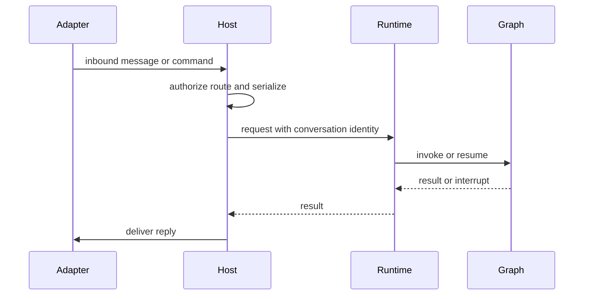

# Talon Runtime Integration

> **Experimental—do not use for production or enterprise workloads.** Talon is alpha software and may change or be removed. It does not provide production-grade complete HITL policy, channel-administrator controls, or multi-tenant isolation. An admitted sender can invoke an agent using the operator's model credentials, MCP tools, and (without a sandbox) local-host resources. Sandboxing does not cover MCP tools.

Talon 0.0.9 is the local, single-event-loop host for a Deep Agents assistant. It owns the channel adapters, optional persistent cron scheduler, and agent runtime. Adapters normalize provider events; the host authorizes, serializes, cancels, and delivers turns. See [Runtime behavior](../architecture/runtime-behavior.md), [State persistence](../concepts/state-persistence.md), [Talon channel admission](../concepts/talon-channel-admission.md), and [Talon scheduling](../concepts/talon-scheduling.md).

## Start a host

Talon requires Python 3.12 or later. Run from `libs/talon` (or add `--directory libs/talon` from the repository root):

```bash
uv sync --group test
AGENT_ASSISTANT_ID=local AGENT_MODEL=<provider>:<model-id> uv run deepagents-talon --once
```

`--once` starts and stops the assembled host and is a useful deployment check. `--whatsapp`, `--telegram`, `--discord`, and `--slack` attach the corresponding adapters; `DEEPAGENTS_TALON_<CHANNEL>_ENABLED` can do the same. When neither `AGENT_MODEL` nor `DEEPAGENTS_TALON_MODEL` is set, the CLI uses `EchoAgentRuntime`. With a model, it opens the configured checkpointer and history archive, loads MCP tools, wraps the saver in `ConversationSaver`, and constructs `DeepAgentRuntime`. A `PersistentCronScheduler` is attached only when at least one channel is present.


```mermaid
sequenceDiagram
    participant Adapter
    participant Host
    participant Runtime
    participant Graph
    Adapter->>Host: inbound message or command
    Host->>Host: authorize route and serialize
    Host->>Runtime: request with conversation identity
    Runtime->>Graph: invoke or resume
    Graph-->>Runtime: result or interrupt
    Runtime-->>Host: result
    Host->>Adapter: deliver reply
```

This shows the attended-turn path. Startup starts the agent, then adapters, then the scheduler; failure unwinds components already started. Shutdown cancels work before stopping channels, scheduler, and runtime. A new message in an active conversation cancels the prior turn, records an interruption marker after the latest committed checkpoint, and starts on the same thread. If cancellation exceeds 30 seconds, Talon declines the new turn; restart the host to recover.

`TalonConfig` validates the assistant ID and by default namespaces local state under `~/.deepagents/<assistant-id>`; `DEEPAGENTS_TALON_HOME` changes the parent. It creates the home and manifest, agents, cron, channel, and inbound-media directories with restrictive permissions. The home holds local state such as model settings, pairing, cron, tool approvals, downloaded media, and—unless a remote checkpoint URI is selected—`checkpoints.sqlite`. The workspace is the current directory by default; set `DEEPAGENTS_TALON_WORKSPACE` to change it.

## Checkpoints, history, and cron

### Select a checkpoint backend

Set `DEEPAGENTS_TALON_CHECKPOINT_URI` to choose persistent LangGraph checkpoints. If it is unset, Talon uses the local `checkpoints.sqlite` file. SQLite also accepts `sqlite:///absolute/path/checkpoints.sqlite` or `file:///absolute/path/checkpoints.sqlite`; its path must be a file path without a host. Percent-encode spaces, and do not use query options for checkpoint SQLite URIs.

| URI scheme | Requirement |
| --- | --- |
| `sqlite:` or `file:` | Included default SQLite driver |
| `postgres:` or `postgresql:` | Install `uv sync --extra postgres` |
| `mongodb:` or `mongodb+srv:` | Install `uv sync --extra mongodb` |
| A custom scheme | Install exactly one trusted `deepagents_talon.checkpoint_backends` entry point for that scheme |

Remote PostgreSQL and MongoDB URIs must identify both a host and database. Talon imports only the selected driver, bounds PostgreSQL connection/setup to 15 seconds, and closes MongoDB clients on exit. Initialization failures are reported without echoing URI credentials. Checkpoint and history URIs are independent: changing a checkpoint URI neither migrates existing checkpoints nor changes the archive backend. Use separate remote databases per assistant because remote checkpoint thread IDs are not automatically assistant-namespaced.

A checkpoint plugin is an operator-installed async-context-manager factory registered as, for example:

```toml
[project.entry-points."deepagents_talon.checkpoint_backends"]
custom = "my_package:open_checkpointer"
```

Set `DEEPAGENTS_TALON_CHECKPOINT_URI=custom://...`. The factory receives that URI unchanged and must yield an initialized async `BaseCheckpointSaver`; it owns connection options, setup, timeout policy, cancellation handling, and cleanup. Built-in schemes take precedence, while unknown or duplicate plugin schemes fail startup. This experimental extension point is trusted code, not a configuration sandbox.

### Conversation archive and scheduled delivery

Talon wraps model-runtime checkpoints in `ConversationSaver`, so channel conversations survive context compaction and restarts. `/new` starts a fresh context while retaining prior searchable sessions. `/reset-all-history` cancels active work and deletes only the current chat's archive sessions and checkpoints; it does not remove cron jobs, memory, media, traces, or backups. It is deliberately hidden because deletion is irreversible and a failure can leave a partial reset.

`DEEPAGENTS_TALON_HISTORY_URI` configures a separate history archive; SQLite is the default, and MongoDB, PostgreSQL, SQLite URIs, and trusted history plugins are supported. Archives are assistant-namespaced but require one writer per assistant. Optional `DEEPAGENTS_TALON_HISTORY_VECTOR_SEARCH=1` adds semantic search; an incompatible embedding configuration requires explicit `DEEPAGENTS_TALON_HISTORY_REINDEX=1` to rebuild retained transcript vectors.

Cron state lives in the assistant home’s `cron/` directory. The cron tools record the origin channel and conversation with each job. A scheduled result is delivered only through the adapter that serves its recorded origin; it is dropped if that adapter is absent rather than redirected. Do not modify an active cron store directly. In particular, run `deepagents-talon pairing pause-jobs` only while Talon is stopped, because the live host is its only writer.

## Channels, Slack, and pairing

Channel exposure is shared as `self`, `allowlist`, or explicitly acknowledged `open`. `open` requires the provider’s `allow-arbitrary-senders` acknowledgement and lets arbitrary senders trigger the agent with operator credentials and host access. Configure admission before enabling an adapter.

The shared command registry parses host commands, supplies `/help`, and advertises commands where a platform supports it. `/reset-all-history` and `/pair` are hidden but executable; `/model` is visible. Commands are handled by the host rather than sent to the model. Discord can register visible shared commands as native slash commands.

### Slack Socket Mode

Enable Slack with `DEEPAGENTS_TALON_SLACK_ENABLED=true` or `--slack`, and provide `DEEPAGENTS_TALON_SLACK_BOT_TOKEN` (`xoxb-`) and `DEEPAGENTS_TALON_SLACK_APP_TOKEN` (`xapp-`). Talon uses Slack Socket Mode, so it opens an outbound connection rather than requiring a public HTTP endpoint. It authenticates the bot on startup, acknowledges each Socket Mode envelope before handling it, and keeps a bounded recent-event-ID set to suppress redelivery duplicates.

A Slack DM is one conversation. In a channel, Talon responds only to a bot mention and maps each thread to a separate active conversation. It returns responses in that thread. For context, it can include bounded preceding replies from operators and allowlisted users; OAuth callbacks are excluded. Channel-thread archive history is shared by channel while thread active contexts and reply destinations remain separate.

Slack exposes one slash command, conventionally `/talon`, but accepts the app’s actual command name. It works only in a bot DM because Slack slash commands have no thread identity: `/talon new` is the equivalent of `/new`. In a channel thread, mention the bot and type the command, for example `@Talon /new`. Slack command refusals are private to the invoking user.

Outbound Markdown becomes `mrkdwn`, text is split at 4,000 characters, and literal valid `<@USER_ID>` references can notify users. Set `DEEPAGENTS_TALON_SLACK_MENTION_ALLOWLIST_USERS` to restrict those outbound mentions; it is separate from inbound admission. Inbound files send the bot token only to `https://files.slack.com` and reject redirects.

### Sender pairing

Pairing is opt-in for Discord, Telegram, and Slack, not WhatsApp, and is refused with `open` exposure. Set `DEEPAGENTS_TALON_<CHANNEL>_PAIRING=enabled`. An unrecognized sender’s message is stopped before host or model handling. Talon sends a short-lived, single-use code in the requester’s DM—on Slack, including when the request originated as a channel mention—and an operator approves it with `/pair approve <code>` or `deepagents-talon pairing approve <channel> <code>`.

Pairing grants admission, not operator authority. A paired sender may reach the agent in every chat the bot can see but cannot administer pairing or tool-approval policy. Codes are channel-bound and expire after one hour. `pairing.json` uses locked atomic updates; an unreadable or invalid store fails closed so only environment-configured admission remains. The CLI also supports `list`, `revoke`, and `pause-jobs`. Treat paired access as terminal-equivalent access to the agent, credentials, MCP tools, and applicable host resources.

## Runtime operations and extension points

`/model` is per chat: an operator selects only from the credentialed tool-calling provider catalog and default model; the saved choice applies on the next turn, survives `/new` and restart, and does not affect other chats. Talon builds the selected model lazily and sizes the chat’s context for it. Scheduled jobs and subagents retain their configured or startup models. `/smart-model` remains an independent assistant-wide selection for approved `ask_for_help` consultations.

At model-runtime startup, `MCPToolProvider` loads tools from its configured source and installs MCP management capabilities. `deepagents-talon mcp config` shows discovery paths, and `deepagents-talon mcp login <server>` provides terminal OAuth. After a manual configuration edit, `/mcp-reload` builds replacement tools and graph under the runtime lock. A refresh failure retains the previous graph; active tasks keep their original capabilities.

Inbound supported images are converted to bounded multimodal data-URL blocks. Outbound Markdown media must resolve to a supported regular file beneath the trusted outbound root; URLs, traversal, and symlink escapes are rejected. LangSmith tracing requires truthy `LANGSMITH_TRACING` and `LANGSMITH_API_KEY`; activity logging is optional and redacts, bounds, and truncates tool previews, but may still contain sensitive data.

## Optional sandbox execution

Without `DEEPAGENTS_TALON_SANDBOX`, agent shell and file tools run on the host. Set it to a `deepagents-code` provider to use a sandbox instead:

```bash
DEEPAGENTS_TALON_SANDBOX=langsmith AGENT_MODEL=<provider>:<model-id> uv run deepagents-talon
```

`langsmith` works directly. `agentcore`, `daytona`, `modal`, `runloop`, and `vercel` require their matching `deepagents-code` extras and their provider credentials in the Talon process. `DEEPAGENTS_TALON_SANDBOX_ID` attaches an existing sandbox that Talon never deletes; otherwise Talon owns the session and closes it on shutdown. `DEEPAGENTS_TALON_SANDBOX_SNAPSHOT` and `DEEPAGENTS_TALON_SANDBOX_SETUP` select bootstrap inputs. A configured sandbox that cannot start fails startup rather than silently falling back to host execution.

In sandbox mode, the composite backend routes only assistant `skills/` and `memory/` to host storage; the sandbox receives other filesystem and `execute` operations. This prevents sandbox tools from rewriting `tools.json` and other assistant state. It is **not** complete containment or a multi-tenant boundary: MCP and web tools, channels, media processing, credentials, and host-side state remain outside that backend. See [Sandbox partners](./sandbox-partners.md).

## Verify an installation

Run the Talon suite from `libs/talon`:

```bash
uv run --group test pytest tests/
```

For deployment changes, also run `deepagents-talon --once` with the intended model, channel, checkpoint/history URI, MCP, and sandbox environment. Focus Slack changes on `tests/channels/test_slack.py`, checkpoint changes on `tests/test_checkpoint_backends.py`, pairing and scheduler changes on their corresponding tests, and host lifecycle changes on `tests/test_host.py`.
