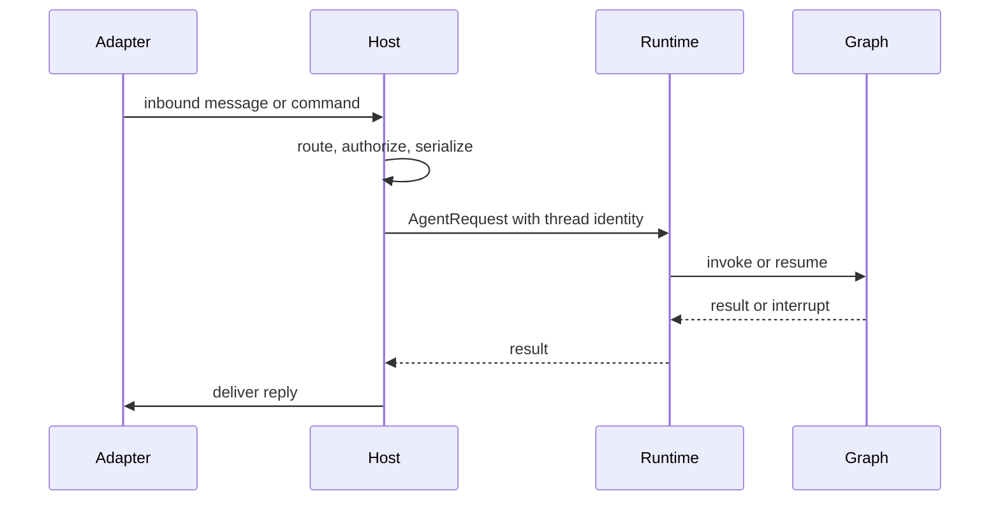
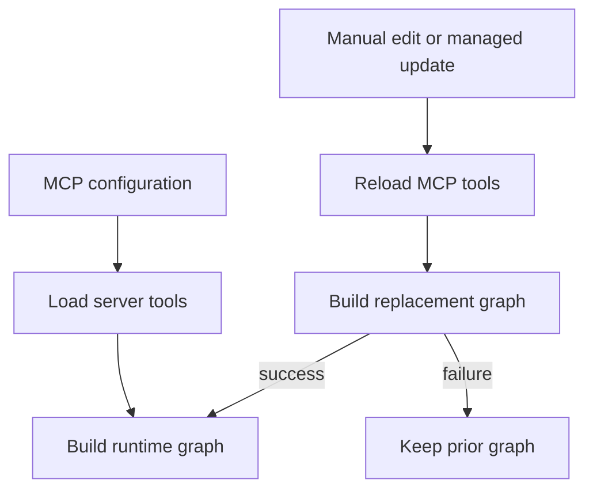

# Talon Channels, Models, MCP, and Sandboxes

> **Experimental local-host authority.** Talon is alpha software, not a production security or multi-tenant boundary. An admitted sender can invoke work with the operator's model credentials, MCP tools, and—without a sandbox—local-host authority. Channel admission, approvals, and sandboxing are useful controls, not complete HITL policy, channel-administrator controls, or isolation. Sandboxing does not cover MCP tools.

Talon is the single-event-loop local host for a Deep Agents assistant. It owns adapter lifecycle, conversation routing, per-conversation serialization and cancellation, delivery, and the optional persistent cron scheduler. Adapters normalize provider input into `ChannelMessage`; the runtime owns graph invocation and tools. See [Talon channel admission](../concepts/talon-channel-admission.md) and [Talon scheduling](../concepts/talon-scheduling.md) for their detailed policies.

## Start, assembly, and state

Run from `libs/talon` (or prefix repository-root commands with `--directory libs/talon`):

```bash
uv sync --group test
AGENT_ASSISTANT_ID=local AGENT_MODEL=<provider>:<model-id> uv run deepagents-talon --once
```

`--once` starts and then stops the assembled host, making it a useful configuration check. `--whatsapp`, `--telegram`, `--discord`, and `--slack` attach adapters; the matching `DEEPAGENTS_TALON_<CHANNEL>_ENABLED` variables also do so. Without a model, Talon uses `EchoAgentRuntime` for lifecycle and channel-wiring checks. With a model, it opens SQLite checkpoints and the history archive, wraps them in `ConversationSaver`, loads MCP tools, and creates `DeepAgentRuntime`. A `PersistentCronScheduler` is attached only when at least one channel exists.


```mermaid
sequenceDiagram
    participant Adapter
    participant Host
    participant Runtime
    participant Graph
    Adapter->>Host: inbound message or command
    Host->>Host: route, authorize, serialize
    Host->>Runtime: AgentRequest with thread identity
    Runtime->>Graph: invoke or resume
    Graph-->>Runtime: result or interrupt
    Runtime-->>Host: result
    Host->>Adapter: deliver reply
```

This shows the adapter-to-host attended-turn lifecycle. On startup the host starts the agent, then adapters, then its scheduler. If startup fails it unwinds started components; on shutdown it cancels work, then stops channels, scheduler, and runtime.

`TalonConfig` validates the assistant ID and uses `~/.deepagents/<assistant-id>` by default; `DEEPAGENTS_TALON_HOME` selects its parent. It creates the home and managed directories with restrictive permissions. Checkpoints, conversation-reset state, assistant-wide model state, smart-model state, pairing state, `cron/`, `channels/`, and inbound media live under that home. The workspace is separate: it defaults to the current directory and is changed with `DEEPAGENTS_TALON_WORKSPACE`. Keep the assistant home and MCP configuration outside the workspace.

## Channels, commands, and Slack

All adapters implement the provider-neutral `ChannelAdapter` boundary: start and stop, register an inbound handler, deliver text or media, and report status. The host adds reaction handling when an adapter supports it. Shared exposure modes are:

- `self` admits configured operator identities or a provider self-message identity;
- `allowlist` admits configured chats and users, with optional message-text mention patterns; and
- explicitly acknowledged `open` admits arbitrary senders.

A mention pattern is text matching, not sender authentication. `open` therefore grants arbitrary senders a path to the operator's credentials and host resources.

The shared command registry supplies host parsing, `/help`, and native command advertisements where supported. `/reset-all-history` and `/pair` are deliberately hidden but remain executable; `/model` and `/smart-model` are visible. Commands are handled by the host rather than sent to the model.

| Adapter | Transport and setup | Operational behavior |
| --- | --- | --- |
| WhatsApp | Local Node bridge over loopback. Enable with `DEEPAGENTS_TALON_WHATSAPP_ENABLED=true`; `DEEPAGENTS_TALON_WHATSAPP_START_BRIDGE=true` lets Talon start it. | Its QR flow pairs the operator account, not sender pairing. |
| Telegram | Bot API long polling. Set `DEEPAGENTS_TALON_TELEGRAM_BOT_TOKEN` or `TELEGRAM_BOT_TOKEN`. | Typed commands use normal messages; polling state is under the assistant channel directory. |
| Discord | Gateway. Set `DEEPAGENTS_TALON_DISCORD_BOT_TOKEN` and enable Message Content intent. | Visible shared commands can be registered as native slash commands. Guild-scoped registration is immediate but does not reach DMs; global commands propagate more slowly. |
| Slack | Socket Mode. Set `DEEPAGENTS_TALON_SLACK_BOT_TOKEN` (`xoxb-`) and `DEEPAGENTS_TALON_SLACK_APP_TOKEN` (`xapp-`). | A DM is one conversation. In channels, Talon responds only to a bot mention and replies in that thread; each thread is a conversation. |

Slack acknowledges Socket Mode envelopes before handling them to avoid Slack redelivery while an agent turn runs, and deduplicates recent event IDs. It exposes one slash command, normally `/talon`: it is accepted only in a bot DM, and its remaining text is translated to the corresponding typed Talon command. In a channel thread, mention the bot and include the typed command, for example `@Talon /new`. Slash-command refusals are private. Slack text is rendered as `mrkdwn`, split at 4,000 characters, and can turn literal valid `<@USER_ID>` prose references into mentions; use `DEEPAGENTS_TALON_SLACK_MENTION_ALLOWLIST_USERS` to restrict those recipients. The inbound-download path sends the bot token only to `https://files.slack.com` and refuses redirects.

### Pairing administration

Sender pairing is opt-in for Discord, Slack, and Telegram; WhatsApp is excluded. It is refused with `open` exposure. An unknown sender is stopped before the host or model and receives a short-lived, channel-bound, single-use code. An operator approves it from an operator DM with `/pair approve <code>` or with `deepagents-talon pairing approve <channel> <code>`; the CLI also provides `list`, `revoke`, and `pause-jobs`.

Pairing adds an allowlisted sender, not operator authority: paired senders cannot administer pairing or tool-approval policy. The persisted `pairing.json` store uses locked, atomic updates; unreadable or invalid state fails closed, leaving only environment-configured senders admitted. A live host owns cron-store writes, so run `deepagents-talon pairing pause-jobs <channel> <sender-id>` only while Talon is stopped. Revocation through the live host also cancels relevant active work and pauses jobs created by that sender.

## Models, diagnostics, and cron state

`/model` is **assistant-wide**, not per-chat. It reports the active choice and credentialed providers; `/model <provider>` lists a provider, `/model <provider:model>` selects one, and `/model default` restores the startup model. Only an operator can change it. The choice is persisted in `models.json`, restored across restarts, and captured at turn start, so a later switch does not affect an already-running turn. The model catalog comes from installed tool-calling provider packages with credentials available to Talon, plus the default model; exact catalog matching occurs before lazy construction and caching.

The selected model is bound into main-agent turns without recompiling the graph. Its context budget also controls the selected model's summarizer and compaction thresholds. Scheduled jobs and subagents keep their own configured or startup models rather than inheriting this override.

`/smart-model` is separate: it controls the assistant-wide model used by `ask_for_help`, persists independently, and can be set to `off` or restored to `DEEPAGENTS_TALON_HELP_MODEL`. The help tool is restricted to an operator main conversation and requires channel approval before sending its question to that model. It sends the question and fixed instruction, not chat history, tools, or filesystem; inspect the question before approving.

`/context-doctor` reads the active checkpoint to produce bounded, content- and path-redacting context estimates. It does not invoke a model or mutate state. The host gives it 10 seconds, returns generic unavailable or failure responses, and leaves an active turn running.

Cron state belongs in the assistant home's `cron/` directory. The CLI creates the scheduler only when a channel is attached, and delivery resolves the job's origin back to a serving channel; missing channel service drops the result rather than redirecting it. Operate schedule creation and retention through the agent tools and the scheduling guide, not by concurrent manual writes to the store.

## MCP configuration, reload, and OAuth

At model-runtime startup, `MCPToolProvider` reads `~/.deepagents/.mcp.json` unless `DEEPAGENTS_TALON_MCP_CONFIG` selects a path. It loads server tools, adds Talon's MCP status/reload/configuration capabilities, and fails configuration on a collision with a management-tool name. Individual server failures are logged while other servers can remain available.


```mermaid
flowchart TD
    Config["MCP configuration"] --> Load["Load server tools"]
    Load --> Graph["Build runtime graph"]
    Edit["Manual edit or managed update"] --> Reload["Reload MCP tools"]
    Reload --> Build["Build replacement graph"]
    Build -->|success| Graph
    Build -->|failure| Prior["Keep prior graph"]
```

This shows MCP activation and replacement. `/mcp-reload` forces a reload after manual edits. The agent-side `reload_mcp_configuration` schedules a refresh before the next turn. Runtime replacement is serialized under a lock: failure leaves the previous graph usable and the reload inactive; active tasks retain their original capabilities.

Use `deepagents-talon mcp config` to print configuration discovery paths and `deepagents-talon mcp login <server>` for terminal OAuth. For an OAuth-configured server, Talon can also send an authorization URL to the originating interactive channel and accept its callback outside model context and traces; completing login schedules refresh. Use `${ENV_VAR}` references for credentials and keep the configuration outside the workspace. See [MCP integration](./mcp.md).

## Media and observability

Inbound supported images become bounded multimodal data-URL blocks. Outbound Markdown media must resolve to a supported regular file below the trusted outbound root; URLs, traversal, and symlink escapes are rejected. Treat inbound attachment metadata and files as untrusted.

LangSmith tracing runs only when `LANGSMITH_TRACING` is truthy and `LANGSMITH_API_KEY` is present. Each traced invocation carries Talon assistant, conversation, trigger, and request metadata; a missing optional tracing package produces a warning and normal operation continues. `DEEPAGENTS_TALON_AGENT_ACTIVITY_LOGGING=true` enables local agent, model-lifecycle, and tool events. Tool previews are redacted, structurally bounded, and truncated to 1,000 characters, but can still contain sensitive application data.

## Optional sandbox execution

Without `DEEPAGENTS_TALON_SANDBOX`, agent shell and file tools run on the host. Select a `deepagents-code` provider to start a sandbox for the host lifetime:

```bash
DEEPAGENTS_TALON_SANDBOX=langsmith AGENT_MODEL=<provider>:<model-id> uv run deepagents-talon
```

`langsmith` works directly. `agentcore`, `daytona`, `modal`, `runloop`, and `vercel` require their matching extras and provider credentials in the Talon process. `DEEPAGENTS_TALON_SANDBOX_ID` attaches an existing sandbox that Talon does not delete; otherwise Talon owns the session and closes it on shutdown. `DEEPAGENTS_TALON_SANDBOX_SNAPSHOT` and `DEEPAGENTS_TALON_SANDBOX_SETUP` configure supported bootstrap behavior. A configured sandbox that cannot start fails host startup; Talon never silently falls back to host execution.

In sandbox mode, the composite backend routes only `skills/` and `memory/` to host storage. Its default filesystem and all `execute` calls go to the sandbox, preventing sandbox tools from rewriting `tools.json` and other assistant state. This is not broad containment: MCP and web tools, channels and media processing, credentials, and host-side state remain outside that backend. See [sandbox partners](./sandbox-partners.md).

## Verification

Run focused checks from `libs/talon`:

```bash
uv run --group test pytest tests/
```

For these boundaries, prioritize `tests/channels/test_slack.py`, `tests/unit_tests/test_pairing.py`, host/model-selection tests, MCP reload/OAuth coverage, sandbox tests, and a `--once` startup check using the intended channel and sandbox environment.
