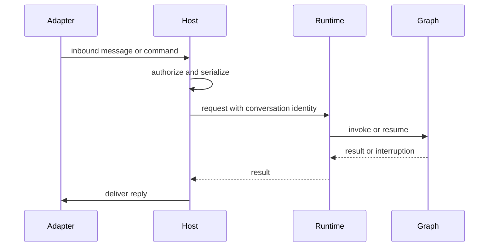

# Talon Runtime Host

> **Experimental, alpha software — not for production or enterprise workloads.** Talon has no production-grade complete HITL policy, channel-administrator controls, or multi-tenant boundary. An admitted sender can invoke the agent with the operator's model credentials, MCP tools, and—without a sandbox—local-host resources. A sandbox is opt-in and **does not cover MCP tools**; do not treat it as containment for channels, credentials, media, or web tools.

Talon is the local, single-event-loop host for a long-running Deep Agents assistant. It owns channel adapters, an optional persistent cron scheduler, and the runtime that invokes the agent. Adapters turn provider events into messages; the host applies admission and per-conversation serialization, runs or cancels turns, and routes replies back to the originating adapter. See [Runtime behavior](../architecture/runtime-behavior.md), [State persistence](../concepts/state-persistence.md), [Talon channel admission](../concepts/talon-channel-admission.md), and [Talon scheduling](../concepts/talon-scheduling.md).

## Start and lifecycle

Talon 0.0.9 requires Python 3.12 or later and installs `deepagents-talon`. From `libs/talon` (or prefix `uv` with `--directory libs/talon` at the repository root):

```bash
uv sync --group test
AGENT_ASSISTANT_ID=local AGENT_MODEL=<provider>:<model-id> uv run deepagents-talon --once
```

`--once` starts and immediately stops the assembled host, making it a useful deployment check. `--whatsapp`, `--telegram`, `--discord`, and `--slack` select adapters; the equivalent `DEEPAGENTS_TALON_<CHANNEL>_ENABLED` environment variables also attach them. If neither `AGENT_MODEL` nor `DEEPAGENTS_TALON_MODEL` is set, Talon uses the echo runtime. With a model, it opens checkpoint and history stores, loads MCP tools, wraps the checkpoint saver in `ConversationSaver`, and constructs the Deep Agents runtime. The persistent scheduler is attached only if at least one channel exists.


```mermaid
sequenceDiagram
    participant Adapter
    participant Host
    participant Runtime
    participant Graph
    Adapter->>Host: inbound message or command
    Host->>Host: authorize and serialize
    Host->>Runtime: request with conversation identity
    Runtime->>Graph: invoke or resume
    Graph-->>Runtime: result or interruption
    Runtime-->>Host: result
    Host->>Adapter: deliver reply
```

This shows the normal attended-turn path.

Startup starts the agent runtime before adapters and the scheduler. If a component fails, Talon unwinds components already started; shutdown cancels work before stopping channels, scheduler, and runtime. A new message in an active conversation cancels the current turn, records an interruption marker after the most recently committed checkpoint, then starts the new message on the same thread. If cancellation takes over 30 seconds, the new turn is not started and the host must be restarted to recover.

## Assistant home and durable state

`TalonConfig` validates the assistant ID and gives each assistant a state home at `~/.deepagents/<assistant-id>` by default; `DEEPAGENTS_TALON_HOME` changes the parent. It creates the home plus manifest, `agents/`, `cron/`, `channels/`, and inbound-media directories with restrictive permissions, installs missing defaults, and ensures `tools.json` exists. The workspace for local execution is the current directory unless `DEEPAGENTS_TALON_WORKSPACE` is set.

The home contains state such as `checkpoints.sqlite` when using local checkpoints, pairing data, cron data, model/conversation selection state, downloaded media, manifests, and tool-approval policy. Keep this home and MCP configuration outside an agent-writable workspace; the permissions and policy file are not a security boundary against code running as the same user.

## Checkpoints, history, and schedules

### Checkpoint and archive backends

`DEEPAGENTS_TALON_CHECKPOINT_URI` selects a durable LangGraph checkpointer. When unset, it uses local SQLite at the assistant-home checkpoint path.

| URI scheme | Requirement |
| --- | --- |
| `sqlite:` or `file:` | Included SQLite support |
| `postgres:` or `postgresql:` | `uv sync --extra postgres` |
| `mongodb:` or `mongodb+srv:` | `uv sync --extra mongodb` |
| Custom scheme | Exactly one trusted `deepagents_talon.checkpoint_backends` entry point |

SQLite checkpoint URIs must name a file without a host; percent-encode spaces and do not add query options. PostgreSQL and MongoDB URIs must name both host and database. Talon imports only the selected driver and reports initialization failures without exposing URI credentials. A custom checkpoint factory receives the URI unchanged and must yield an initialized async `BaseCheckpointSaver`; it is trusted operator-installed code responsible for setup, connection policy, cancellation, and cleanup. Built-in schemes win, while unknown or duplicate plugin schemes fail startup.

Checkpoint and history storage are independent. `DEEPAGENTS_TALON_HISTORY_URI` selects the conversation archive (local SQLite is the default); built-in SQLite, PostgreSQL, and MongoDB as well as trusted `deepagents_talon.history_backends` plugins are supported. Archives are namespaced by assistant ID and require one writer per assistant. Remote checkpoint thread IDs are not automatically assistant-namespaced, so use separate remote databases for separate assistants.

At model-host startup, Talon opens the selected checkpointer and history archive and gives `ConversationSaver(checkpointer, archive=archive)` to the runtime. That wrapper archives conversations across restarts and context compaction. `/new` retains earlier sessions while starting fresh context. `/reset-all-history` affects only the current chat's sessions and checkpoints—not cron jobs, memory, media, traces, or backups—and can leave a partial reset if deletion fails, so it is intentionally hidden.

Optional `DEEPAGENTS_TALON_HISTORY_VECTOR_SEARCH=1` enables semantic history search. An incompatible embedding profile requires explicit `DEEPAGENTS_TALON_HISTORY_REINDEX=1` to rebuild vectors while retaining transcripts; operators should remove that flag after a successful rebuild.

### Scheduled runs

Cron state is kept under the assistant home’s `cron/` directory. Jobs record their origin channel and conversation. A scheduled result is delivered only through the currently attached adapter that serves that recorded origin; if it is absent, Talon drops the result rather than redirecting it. Do not write to the live cron store. In particular, run `deepagents-talon pairing pause-jobs` only while Talon is stopped because the live host is the store’s only writer.

## Channels, commands, and Slack

Each adapter uses the shared exposure modes `self`, `allowlist`, or explicitly acknowledged `open`. `open` requires the channel-specific acknowledgement value `allow-arbitrary-senders`; it permits arbitrary senders to trigger the agent with operator credentials and local-host access. Configure exposure and admission before enabling an adapter.

The shared command registry parses host commands, produces `/help`, and supplies platform advertisements where available. `/reset-all-history` and `/pair` are hidden but still executable; `/model` is visible. Discord registers visible commands as native slash commands when enabled. Slack instead provides one app-configured slash command (usually `/talon`): because Slack slash commands have no thread identity, it works only in a bot DM. In a channel thread, mention the bot followed by a typed command, such as `@Talon /new`.

### Slack Socket Mode

Enable Slack using `--slack` or `DEEPAGENTS_TALON_SLACK_ENABLED=true`, with `DEEPAGENTS_TALON_SLACK_BOT_TOKEN` (`xoxb-`) and `DEEPAGENTS_TALON_SLACK_APP_TOKEN` (`xapp-`). Talon authenticates the bot and uses Socket Mode—an outbound connection, not a public HTTP endpoint. It acknowledges each envelope before work begins and retains a bounded recent-event-ID set to prevent redelivered events from starting duplicate turns.

A Slack DM is one conversation. In a channel, Talon responds only to a bot mention and gives every thread its own active conversation and reply destination. It can include bounded preceding replies from operators and allowlisted users as thread context; channel-thread archive history is shared at channel scope while each thread's active context stays separate. Outbound Markdown is converted to `mrkdwn` and split at 4,000 characters. Slack user mentions in generated text are independent of inbound admission and can be restricted with `DEEPAGENTS_TALON_SLACK_MENTION_ALLOWLIST_USERS`. For inbound files, the bot token is sent only to `https://files.slack.com`, with redirects rejected.

### Pairing and media boundaries

Sender pairing is opt-in for Discord, Slack, and Telegram, never WhatsApp, and is refused for `open` exposure. An unknown sender is stopped before host or model handling; an operator approves the sender’s channel-bound short-lived code with `/pair approve <code>` or `deepagents-talon pairing approve <channel> <code>`. Pairing grants admission, not Talon operator authority. The persistent store uses locked atomic updates and fails closed when unreadable or invalid, leaving only environment-configured admission.

Supported inbound images become bounded multimodal data-URL blocks. An outbound Markdown media reference must resolve to a supported regular local file beneath the trusted outbound root; URLs, parent traversal, and symlink escapes are rejected.

## Models, MCP, and observability

`/model` selection is assistant-wide in the current host: an operator may select a credentialed tool-calling provider-catalog model or the default, and the saved choice applies on the next turn across all chats and survives `/new` and restarts. Scheduled jobs and subagents retain their configured or startup models. `/smart-model` is separate: it controls the assistant-wide model used for approved `ask_for_help` consultations.

At runtime startup, `MCPToolProvider` loads MCP tools from the configured provider path (default `~/.deepagents/.mcp.json`, overridable with `DEEPAGENTS_TALON_MCP_CONFIG`) and supplies MCP-management capabilities. Use `deepagents-talon mcp config` to inspect configuration discovery and `deepagents-talon mcp login <server>` for terminal OAuth. After manual edits, `/mcp-reload` replaces tools and the graph under the runtime lock. A failed refresh leaves the prior graph usable and marks reload inactive; already-active tasks retain their original capabilities. See [MCP](./mcp.md).

LangSmith tracing runs only when `LANGSMITH_TRACING` is truthy and `LANGSMITH_API_KEY` is set; invocations carry Talon assistant, conversation, trigger, and request metadata. If the optional tracing package is unavailable, Talon warns and continues without tracing. `DEEPAGENTS_TALON_AGENT_ACTIVITY_LOGGING=true` enables local lifecycle and tool events. Tool previews are redacted, structurally bounded, and truncated to 1,000 characters, but may still contain sensitive application data.

## Optional sandbox execution

Without `DEEPAGENTS_TALON_SANDBOX`, agent shell and file tools execute on the host. Set it to a `deepagents-code` provider to create a provider-backed sandbox for the host lifetime:

```bash
DEEPAGENTS_TALON_SANDBOX=langsmith AGENT_MODEL=<provider>:<model-id> uv run deepagents-talon
```

`langsmith` works directly. `agentcore`, `daytona`, `modal`, `runloop`, and `vercel` require their matching `deepagents-code` extras and provider credentials in the Talon process. `DEEPAGENTS_TALON_SANDBOX_ID` attaches to an existing sandbox that Talon does not delete; otherwise Talon owns the session and closes it on shutdown. `DEEPAGENTS_TALON_SANDBOX_SNAPSHOT` and `DEEPAGENTS_TALON_SANDBOX_SETUP` provide provider bootstrap inputs. If a configured sandbox fails to start, startup fails—Talon never silently falls back to host execution.

In sandbox mode, the composite backend routes only assistant `skills/` and `memory/` to host storage; all other filesystem operations and `execute` go to the sandbox. This protects other assistant state such as `tools.json` from sandbox tools, but is not comprehensive containment: MCP tools, web tools, channel handling, media processing, credentials, and host-side state remain outside that backend. See [Sandbox partners](./sandbox-partners.md) and [Security](../operations/security.md).

## Verification

Run the Talon suite from `libs/talon`:

```bash
uv run --group test pytest tests/
```

For an operational change, also run `deepagents-talon --once` with the intended model, channel, checkpoint/history URI, MCP configuration, and sandbox environment. Focus adapter work on `tests/channels/`, checkpoint work on `tests/unit_tests/test_checkpoint_backends.py`, lifecycle work on `tests/test_host.py`, and pairing or cron changes on their corresponding tests.
