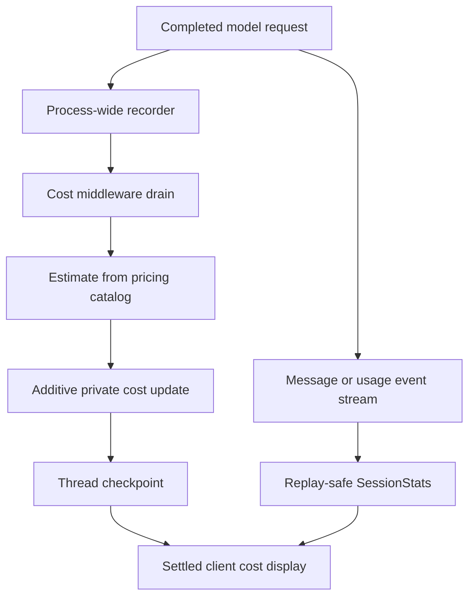
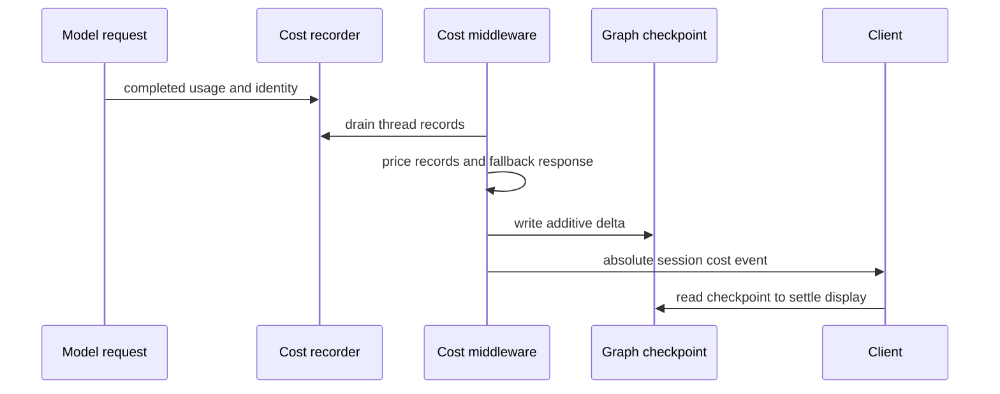

# dcode Sessions, Cost, and Local State

A dcode session is a LangGraph **thread**, identified by a time-ordered UUID7. In local mode, its checkpoints live in the local SQLite database `DEFAULT_STATE_DIR/sessions.db`; a checkpoint is the durable source for thread state and cumulative estimated cost. This is distinct from a server checkpoint in remote execution and from client-side stream statistics: those views help display and diagnose a run, but do not replace the state held by the graph.

Cost figures are **estimates**, not provider invoices or a spend-control mechanism. A request can be unpriced because usage, model identity, or catalog data is unavailable; an unpriced estimate must not be interpreted as a zero provider charge. See [State persistence](../concepts/state-persistence.md), [Context management](../concepts/context-management.md), [Profiles and models](../concepts/profiles-models.md), [Security](security.md), and [Run a dcode session](../workflows/run-dcode-session.md).

## Ownership boundaries

| Concern | Owner | Operational meaning |
| --- | --- | --- |
| Thread identity and local durability | `sessions.py` + LangGraph `AsyncSqliteSaver` | Local checkpoint history is stored in `sessions.db`; a selected checkpoint supplies the state to resume. |
| Resumable runtime facts | `ResumeState` private channels | Model, context, goal, and cache facts are checkpoint-versioned state rather than a client reconstruction of history. |
| Durable lifetime estimate | `CostTrackingMiddleware` + `CostState` | `_session_cost_usd` is a private additive checkpoint channel. |
| Live request statistics | `SessionStats` | Stream-local, replay-safe display ledger for requests, tokens, model/kind breakdowns, and estimated cost. |
| Pricing data | `genai-prices`, user overrides, and bundled stopgaps | Best-effort data lookup only; upstream catalog matches take precedence. |
| Server-side compaction/offload | `offload_api.py` | Server work must atomically checkpoint its state update and prepared cost update, or roll the recorded calls back. |

*The checkpointed graph total settles the display; streamed statistics provide responsive, provisional diagnostics.*

## Thread lifecycle and resume

`get_db_path()` hardens the state directory and caches the `sessions.db` path. `get_checkpointer()` creates an `AsyncSqliteSaver` using a module-owned `aiosqlite` connection, including cleanup intended to avoid leaked worker threads during interrupted shutdown. A SQLite lock can therefore affect local thread operations; database access is not an external service checkpoint.

A resume reads `state_values` from the selected checkpoint. `ResumeState` keeps these facts schema-private, including the latest context token count, effective model specification and parameters, goal/rubric state, pending goal data, and prompt-cache identity. Because they are versioned channels, values describe that checkpoint—not a thread-wide aggregate—and let the CLI restore session facts without replaying or re-tokenizing history. The model specification recorded for a successful turn can also preserve what the thread actually used rather than reverting to a current global default.

The cache fields `_last_model_request_at`, `_last_cache_model_spec`, and `_last_cache_endpoint` are paired state for cold-cache detection. They are committed only after a successful request, so an old or malformed checkpoint must be treated as uncertain diagnostic input rather than evidence that a provider cache is warm.

`list_threads()` can filter on stored agent, branch, or exact working-directory metadata. It opportunistically creates a covering SQLite index; failure is non-fatal but can make large histories slower to list. Message count and initial prompt may need reconstruction from checkpoint writes when message deltas are not inlined.

### Delete semantics and offloaded history

`delete_thread(thread_id)` removes that thread's `checkpoints` and `writes` rows, clears in-process listing/count caches, and then attempts to delete a matching offloaded conversation archive. Its Boolean only says whether checkpoint rows were removed: archive cleanup is best effort and an orphan archive can be cleaned even when it returns `False`.

Local offloaded history is held in a hardened `conversation_history` directory, with a temporary fallback if the normal profile location is unwritable. Archive deletion rejects path-escaping IDs. Treat a successful thread deletion as a request to remove local state, not proof that every optional archive file was removed; inspect logs or the storage location if cleanup matters.

## Durable cost accounting

`CostState` adds `_session_cost_usd` as a schema-private channel with the `operator.add` reducer. Each pricing pass emits only its newly priced delta, which makes the graph checkpoint—not a UI accumulator—the durable cumulative estimate and avoids read-modify-write races.

`_SessionCostRecorder` is a process-wide LangChain callback handler. It records completed calls by thread and checkpoint scope but intentionally does not price on the callback path. This covers the main agent, subagents, offload/summarization, and Auto-mode classifier without adding instrumentation at each call site. It has bounded in-flight and per-thread queues: if a call lacks a usable thread, or a bound evicts an old record, the session total can be short; warnings distinguish the pathological dropped-record case from an ordinary unthreaded invocation.

*Pricing is deferred from the callback; the checkpoint write is the durable accounting step.*

`after_model` drains calls since the previous checkpoint and prices the latest main response only when the recorder did not already cover it. `after_agent` performs a final drain for calls made after the last model step, such as a grading agent. Both hooks catch ordinary failures because each hook is a graph node: accounting failure must not fail the user's turn. If a drain/pricing pass fails before its update can reach a checkpoint, records are restored for a later drain where possible; this cannot recover a record already lost to a queue bound.

Nested middleware starts by overwriting its local cost channel with zero. It checkpoints local subagent spend, then publishes a completed total in `_session_cost_transfers`, keyed by checkpoint scope and addressed to the owning parent scope. The parent claims the transfer into its own checkpoint, so completed nested spend can survive an interruption in sibling work while private nested totals remain isolated.

### Server operation transaction rule

A server-owned operation such as offload must call `prepare_operation_cost(state, thread_id)` after its side-model work. Preparation destructively drains records and returns `PreparedOperationCost`; write `prepared.update` **atomically** with the operation state update, then call `commit()`. If no state is committed, validation fails, or the write fails, call `rollback()` so a later drain can price the restored records. This applies even when the delta is zero, because zero-priced/unpriceable records were still claimed. Rolling back after a successful state write risks a duplicate later charge; abandoning the object loses the drained contribution and emits a warning.

The offload HTTP boundary follows this rule: it rejects state writes outside the explicitly allowed offload channels, rolls prepared cost back when there is nothing to persist, and combines an operation update with `prepared.update` before deferred commit. If the thread advances during compaction, the completed summary and its spend cannot be committed to the old checkpoint; the operation reports a conflict rather than attributing it to a later turn.

## Estimation and pricing catalogs

`estimate_cost(usage_metadata, model_name, provider)` is the only pricing entrypoint. It lazily imports `genai-prices`, returning `None` rather than breaking a model turn when pricing cannot be used. It needs a usable model identity and an input/output token split; a combined total alone cannot be defensibly priced. Providers such as `openai_codex`, whose access model is not equivalent to per-token API billing, are deliberately unpriceable.

LangChain `input_tokens` is inclusive of cache reads/writes. dcode forwards that total and cache, audio, and reasoning detail buckets to `genai-prices`, which subtracts priceable details from their enclosing total before applying rates. Detail buckets absent from the matched model's rates remain ordinary input/output tokens. Inconsistent cache counts are clamped with a warning so one bad detail does not discard the whole estimate; audio-plus-cache intersections that LangChain cannot report are priced conservatively as ordinary input and may understate cost.

The first successful pricing import may start one daemon updater per process. It fetches upstream pricing data hourly and installs a successful snapshot for subsequent lookups. Set `DEEPAGENTS_CODE_PRICES_AUTO_UPDATE=0`, configure `[update].prices_auto_update = false`, or set `DEEPAGENTS_CODE_OFFLINE` to suppress it. A failed refresh retains the existing snapshot, and dcode refuses an upstream catalog with fewer providers than the bundled catalog so a truncated response does not replace a healthy catalog.

On a primary `genai-prices` miss only, dcode tries `~/.deepagents/prices.json`, then `bundled_prices.json`. Thus upstream prices win; for a conflicting provider/model pair, the user catalog wins over the maintainer bundle. Both use the upstream provider-array schema and rates per million tokens. Bundled entries are intended only as stopgaps for models upstream does not yet price and should carry an upstream issue or PR reference; remove them once upstream covers the model. Invalid overrides warn and are skipped, and a catalog edit requires a restart after a user catalog has been loaded successfully.

The override implementation uses the private upstream APIs `genai_prices.types._providers_from_raw` and `genai_prices.data_snapshot.find_provider_by_id`. The current dependency range is `genai-prices>=0.1.7,<0.2.0`, which spans 0.1.x patches without a private-API compatibility promise. Re-verify override parsing, lookup, precedence, and failure behavior whenever this dependency range or its resolved version changes.

## Live usage, replay, and diagnostics

`SessionStats` is a client-side accounting ledger. It tracks request count, input/output and cache tokens, priced request count, estimated USD, wall time, plus per-model `(provider, model_name)` and `UsageKind` breakdowns (`assistant`, `subagent`, `offload`, and `auto`). It is useful for `/cost` and end-of-run output, but the private checkpointed channel is the lifetime estimate to trust after a resume or missed stream event.

Stream chunks are corrected rather than independently counted. `record_message_usage` retracts the exact prior `RecordedRequest` and records the revised request contribution; a completed `AIMessage` is idempotent. This preserves alignment of totals with model and kind breakdowns when a final chunk changes usage or finally identifies the served model. Retry attempts are keyed by `(attempt_scope, message_id)` so reused provider IDs remain separate calls.

At every stream-round boundary, consumers must call `finalize_recorded_requests`. Finalization marks records closed and projects scoped retry keys to bare IDs, so replayed chunks on a human-in-the-loop resume cannot merge into the prior round and double tokens or estimates. Both the non-interactive and TUI stream paths must retain this boundary behavior.

The final usage table is controlled by `display.show_usage_stats`, enabled by default. The preference is loaded once, so headless output and TUI teardown cannot disagree. Cosmetic configuration errors fail open, while `BlockingError` is re-raised. A cost view should distinguish priced calls from unpriced calls instead of presenting omitted estimates as free usage.

### Long-running-session checklist

1. Start with the `thread_id`, its selected checkpoint, and its `state_values`; do not infer durable state from a terminal display alone.
2. Compare `_session_cost_usd` with `SessionStats` only as different layers: checkpointed thread estimate versus stream-local diagnostic ledger.
3. For a low or missing estimate, check model/provider identity, token split, pricing package health, catalog lookup, unpriceable provider behavior, recorder warnings, and server-operation commit/rollback paths.
4. For resume double-counting, verify the stream consumer finalizes request ledgers at each round boundary and inspect the retry attempt scope.
5. For a potential prompt-cache miss, treat checkpointed timestamp/model/endpoint data as an estimate. `estimate_rewarm_cost` prices synthetic warm and cold input through the normal pricing path and returns no estimate below the policy minimum or when pricing is unavailable.
6. Before changing this area, exercise `test_session_stats.py` for chunk correction, retries, nested events, and resume replay; `test_cold_cache.py` for cache identity and safe endpoint handling; and the cost/offload/session tests for checkpoint, transaction, and deletion failure paths.
