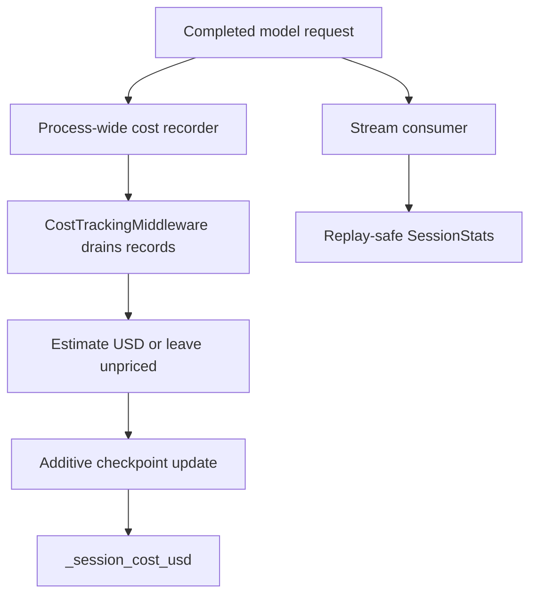
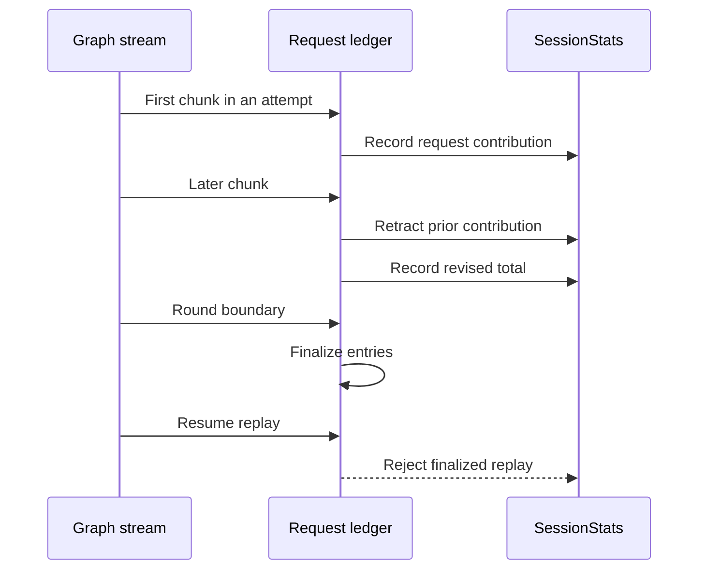

# dcode Sessions, Pricing, and Operational Diagnostics

A dcode thread has two intentionally separate accounting views. The graph checkpoint owns the durable cumulative estimate for the thread; the active client keeps `SessionStats` for responsive token and cost displays. Both are estimates, not billing controls: **dcode never caps spend or blocks execution from a cost estimate**.

Related: [Runtime behavior](../architecture/runtime-behavior.md), [State persistence](../concepts/state-persistence.md), [Security](security.md), and [Run a dcode session](../workflows/run-dcode-session.md).

## What is authoritative during support work

| Question | Record to inspect first | Why |
| --- | --- | --- |
| What was durable at a selected point in a thread? | The selected LangGraph checkpoint and its `state_values` | Checkpoint channels are versioned values at that checkpoint, not a thread-wide reconstruction. |
| What is the lifetime priced total? | `_session_cost_usd` in checkpoint state | This is the graph-owned, additive cost channel. |
| What did this client observe while streaming? | Its `SessionStats` and request ledger | It is replay-safe, but client-local display accounting rather than the durable total. |
| Why is cost missing or wrong? | Model/provider identity, pricing diagnostics, override warnings, and the request's usage metadata | Unpriceable requests are omitted rather than treated as zero. |
| Why did a resumed turn behave differently? | Checkpoint state, `dcode:resume` traces, and the stream-round ledger boundary | Resume is a new graph round over checkpoint state; the tag and finalized ledger distinguish it from initial streaming. |
| Is the installation/configuration healthy? | `dcode doctor` (or `dcode doctor --json`) | It reports offline install, update, tracing, and configuration health without exposing credential values. |

*The checkpoint is the durable lifetime-cost authority; stream statistics are the active client's diagnostic display.*

## Session persistence, resume, and deletion

Threads are LangGraph checkpoints in a single SQLite database at `DEFAULT_STATE_DIR/sessions.db`. `get_db_path()` hardens and caches the state directory, while `get_checkpointer()` creates an `AsyncSqliteSaver` over a module-owned `aiosqlite` connection. New thread IDs are time-ordered UUID7 strings. The connection handling explicitly closes and joins the SQLite worker during cleanup to avoid leaked handles after interrupted startup or shutdown.

`ResumeState` is the checkpoint schema for private runtime facts. On resume, the CLI reads the selected checkpoint's `state_values`, restoring history-related facts, effective model configuration, context count, and user/agent state without replaying or re-tokenizing prior history. This distinction matters: a chosen older checkpoint returns the values as of that checkpoint, not a later thread aggregate. Model-turn cache state pairs `_last_model_request_at`, `_last_cache_model_spec`, and `_last_cache_endpoint`; the graph commits the coherent set only after a successful request.

`list_threads()` uses checkpoint metadata and supports agent, Git branch, and exact working-directory filters. It opportunistically creates a covering SQLite index so listing can avoid scanning large checkpoint blobs; failure to create that index is non-fatal but can make a large profile slow. Message counts and initial prompts may need reconstruction from checkpoint writes because delta checkpoints do not necessarily embed all messages.

`delete_thread(thread_id)` deletes checkpoint and write rows, invalidates in-process listing/message caches, and then attempts to delete that thread's offloaded-history archive. Its Boolean says only whether checkpoint rows were deleted: archive cleanup is best effort and can remove an orphan archive even when the method returns `False`. Offloaded conversation history is stored under a hardened `conversation_history` directory, falling back to temporary storage when the profile root is unwritable; archive deletion rejects path-escaping thread IDs. At TUI startup, a background sweep removes only expired direct regular `.md` archives according to `history.retention_days` (30 days by default). Set it to zero to disable the sweep; individual filesystem failures leave archives in place and do not fail startup.

## Durable cost lifecycle

`CostState` extends `ResumeState` with schema-private `_session_cost_usd`. It has an `operator.add` reducer, so a pricing pass contributes only its new delta and never read-modify-writes the running total. This makes the graph's checkpointed total durable across turns and safe for independent additive writers.

`_SessionCostRecorder` is installed as a process-wide LangChain callback handler. It records completed model calls keyed to their thread and checkpoint scope, but does not price on the callback path. As a result, main-agent, subagent, offload/summarization, and Auto-classifier calls are covered without each caller adding instrumentation. A call without usable thread context cannot be attributed. The recorder is bounded: warnings about queue pressure or dropped undrained records identify a case where later accounting cannot recover the lost record.

`CostTrackingMiddleware.after_model` drains calls completed since the preceding checkpoint, prices the usable ones, and returns the additive update. `after_agent` does a final drain for work that occurs after the final model step, including grading-agent work. Both hooks catch exceptions because each hook is its own graph node: accounting failure must not fail the user's turn. A normal failed pricing pass returns drained records to the recorder for a later pass; unpriceable calls are deliberately omitted from the estimate.

### Nested graphs and server-owned operations

A nested `CostTrackingMiddleware` overwrites its local cost channel to zero in `before_agent`, checkpoints local deltas, then stages its completed amount in `_session_cost_transfers`. The map is addressed by checkpoint scope and records the parent `owner_scope` plus total. The parent claims its matching transfer into its own checkpoint, preserving completed subagent cost even if another sibling interrupts the parent flow.

Server operations outside the regular graph lifecycle must use `prepare_operation_cost(state, thread_id)` transactionally. It destructively drains and prices side-model records and returns a `PreparedOperationCost`; persist its `update` atomically with operation state and then `commit()`, or `rollback()` if persistence fails or work is abandoned. Even a zero-dollar preparation consumes records and requires settlement. An object garbage-collected without either action warns that its records have been lost from lifetime accounting.

## Pricing, catalog refresh, and local overrides

`estimate_cost` lazy-loads `genai-prices`. A load failure logs once and produces no estimate rather than failing a model call. Input and output must be split to estimate a rate; a missing model, unsupported/non-API provider, absent split, or no matching rate also leaves the request unpriced. LangChain `input_tokens` is inclusive of cache reads/writes, audio, and reasoning detail buckets. dcode forwards the inclusive count and details so `genai-prices` can subtract a detail from its containing bucket only when the selected model prices it; an unpriced detail remains part of ordinary input/output pricing rather than being dropped.

On the first successful pricing import, dcode may start one daemon updater to fetch upstream `data.json` hourly. Disable it with `DEEPAGENTS_CODE_PRICES_AUTO_UPDATE=0`, `[update].prices_auto_update = false`, or `DEEPAGENTS_CODE_OFFLINE`. A failed fetch preserves the already installed snapshot. The updater also rejects an upstream catalog with fewer providers than the bundled catalog, avoiding replacement by a truncated response.

When primary `genai-prices` lookup misses, dcode checks `~/.deepagents/prices.json` and then the packaged `bundled_prices.json`. Upstream pricing always wins; where both fallback sources define the same provider/model pair, the user file wins. The user catalog is read once on first fallback use, so restart dcode after editing it. It is a JSON provider array in the upstream schema, with rates per million tokens such as `input_mtok` and `output_mtok`; optional cache, audio, and reasoning buckets should be supplied only when their rates are known.

A malformed override is skipped with a diagnostic and never interrupts a model turn or ordinary upstream pricing. Provider aliases make a hand-written provider ID easy to get wrong; a fallback all-provider model sweep can match but emits a warning because it may price the request under another provider's rate. Override integration deliberately uses private `genai-prices` APIs (`genai_prices.types._providers_from_raw` and `genai_prices.data_snapshot.find_provider_by_id`), so test parsing, precedence, and lookup whenever its dependency range changes.

## Live usage: chunks, retries, and resume replay

`SessionStats` accumulates request count, input/output tokens, cache reads/writes, priced request count, estimated USD, wall time, and breakdowns by `(provider, model_name)` and `UsageKind` (`assistant`, `subagent`, `offload`, or `auto`). It is the basis for the live view and `/cost`, but it is not the durable checkpoint cost channel. `/cost` reports how many requests were priceable so missing estimates are not presented as free calls.

*Within a stream round chunks revise one request; finalization prevents a later HITL-resume replay from counting it again.*

`record_message_usage` counts a completed `AIMessage` idempotently. For chunks, it retracts the exact recorded request and records its revised aggregate, keeping totals and per-model/per-kind rows aligned even when final metadata supplies a different model. Retry attempts use `(attempt_scope, message_id)` so a provider that reuses a message ID does not collapse separate requests.

A client that retains its ledger across graph rounds must call `finalize_recorded_requests()` at every round boundary. Finalization closes entries and projects scoped retry keys onto their bare message IDs; an unscoped HITL resume replay then finds a finalized row rather than creating a second charge. Both headless and TUI stream paths perform this boundary operation. The end-of-run usage table is controlled by `display.show_usage_stats`, enabled by default; its preference is resolved once so TUI teardown and headless output agree. Configuration errors fail open for this cosmetic table, except `BlockingError`, which is re-raised.

## Tracing, debug logs, and doctor

`stream_trace_config(config, stream_input)` leaves initial graph input untagged. If the input is a LangGraph `Command` resume, it shallow-copies the config and adds `dcode:resume` exactly once. Tags are inheritable, so LangSmith can filter the resume root and associated model, tool, and subagent runs. Treat the tag literal as an external saved-view/cost-report contract. The returned resume config shares its `metadata` and `configurable` mappings with the input configuration; do not mutate them through the copy.

Set `DEEPAGENTS_CODE_DEBUG` before logging configuration to enable secured, per-thread file logs. The directory is resolved from `DEEPAGENTS_CODE_DEBUG_DIRECTORY`, legacy `DEEPAGENTS_CODE_DEBUG_FILE`, `[debug]` configuration, or the default. Unsafe/oversized thread IDs are converted to a safe hashed filename. dcode hardens directories and files to owner-only access (`0o700` and `0o600` on POSIX, current-user DACLs on Windows) and refuses symlinked files. On a security or setup failure it removes file handlers and warns rather than writing insecure logs. `DEEPAGENTS_CODE_LOG_LEVEL` accepts `DEBUG`, `INFO`, `WARNING`, `ERROR`, or `CRITICAL`; otherwise the default is `DEBUG` when debug files are enabled and `INFO` when they are not. For user-facing error hints, use `installed_debug_log_path()` rather than assuming an environment-configured path was actually attached.

Run `dcode doctor` for a pasteable, offline diagnostic report; `dcode doctor --json` emits the same sections as structured data. It reports diagnostics (versions, commit where available, Python/platform, install method and path), update-cache status, tracing state, and configuration/data locations. It never contacts PyPI: update status comes from local cache. Tracing credentials are reported only as configured/not set, not printed. Sections and their items have health flags, and the command exits `0` only if all sections are healthy (`1` otherwise). A corrupt configuration, unreadable required location, unhealthy managed policy, missing SDK, or enabled LangSmith SaaS tracing without credentials is consequently actionable in automation.

## Support checklist

1. Start with the `thread_id`, selected checkpoint, and `state_values`; do not treat a live client table as a historical source of truth.
2. Compare checkpoint `_session_cost_usd` with `SessionStats` only after accounting for their different scopes: durable graph lifetime versus stream-local display ledger.
3. For a cost gap, check whether usage was unpriceable, the model/provider fallback was wrong, `genai-prices` loaded, a local override matched, or recorder/transaction warnings indicate lost or rolled-back records.
4. For resume duplicates, inspect `dcode:resume` traces and confirm the client finalized its ledger after every round.
5. Enable debug before startup and report the path returned by `installed_debug_log_path()`.
6. Attach `dcode doctor --json` output to support reports; it is suited to sharing because it summarizes tracing configuration without secret values.
7. Focus regression coverage on `test_cost_tracking.py`, `test_session_stats.py`, `test_sessions.py`, `test_debug.py`, `test_tracing.py`, and `test_doctor.py` under `libs/code/tests/unit_tests/`, especially retry, replay, interruption, rollback, permissions, and unhealthy-config paths.
