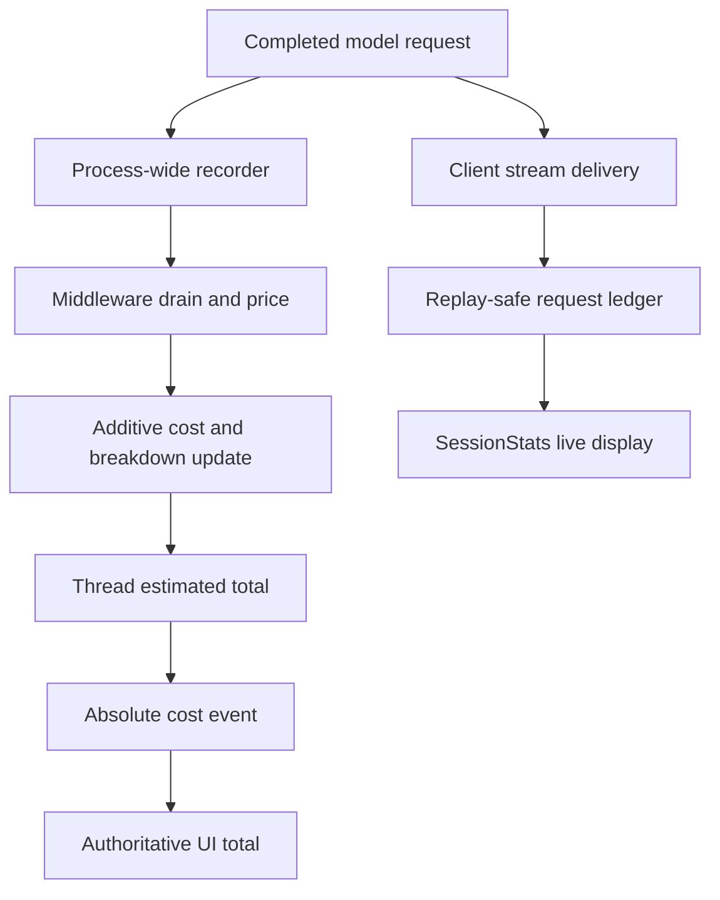
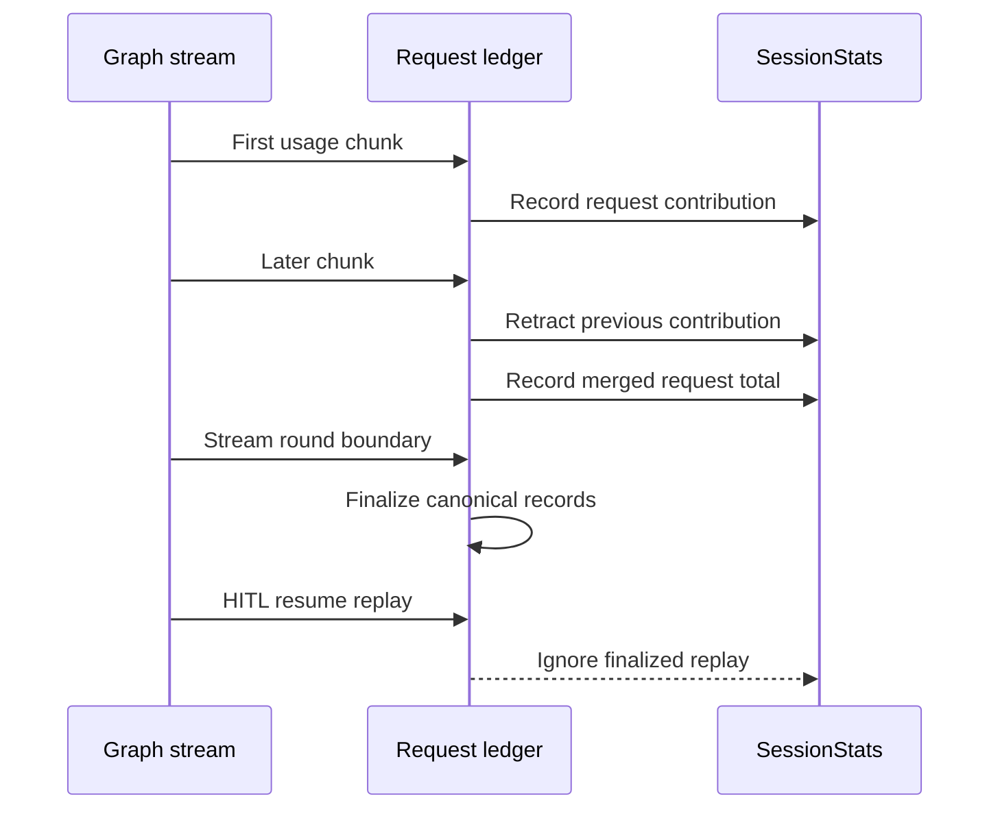
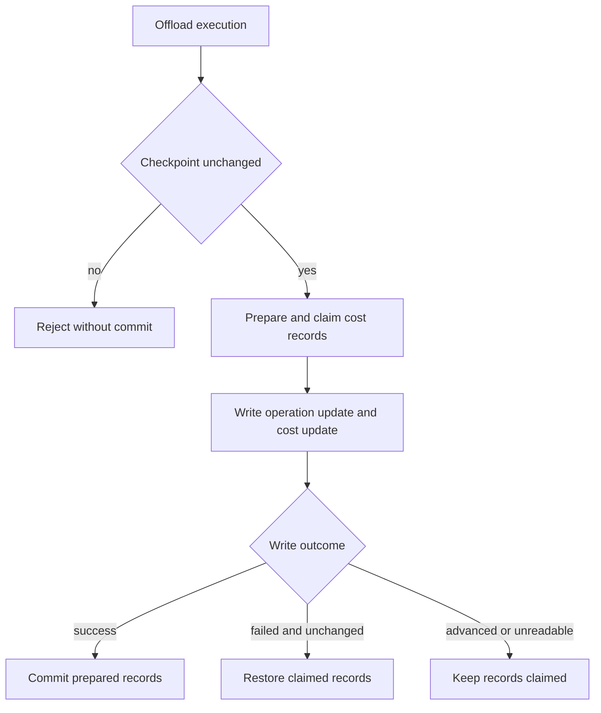

# Cost, Usage, and Session Operations

A dcode run has two separate accounting views. The graph checkpoints a thread-wide **estimated** USD total and structured breakdown; a client maintains `SessionStats` for responsive live usage. Both depend on reported usage and a pricing catalog. They are not provider invoices, do not authorize a request, and do not cap or gate spend. Reconcile billed usage with the provider's own usage and invoice surfaces.

Related material: [Runtime behavior](../architecture/runtime-behavior.md), [Context management](../concepts/context-management.md), [State persistence](../concepts/state-persistence.md), [Testing guide](../testing/testing-guide.md), and [Run a dcode session](../workflows/run-dcode-session.md).

## Ownership and accounting flow

| Concern | Owner | Operational meaning |
| --- | --- | --- |
| Durable estimate | `CostTrackingMiddleware` and checkpoint state | `_session_cost_usd` is the cumulative priceable-call estimate for the selected thread/checkpoint. `_session_cost_breakdown` preserves token and pricing detail when available. |
| Live usage ledger | Client-side `SessionStats` | A display accumulator corrected as stream chunks arrive; it is not the durable thread total. |
| Price lookup | `genai-prices` plus override catalogs | Best-effort estimation. Tokens can be recorded even when a model has no price. |
| Server-operation cost | `PreparedOperationCost` and `/offload` | Destructively claimed records must be committed with state or restored. |
| UI diagnostics | status display, Debug Console, and warning modal | The UI combines the last authoritative thread total with provisional live deltas and labels warnings as estimates. |

*Completed requests feed a durable checkpoint estimate and a separately owned, live client display.*

`CostState` makes `_session_cost_usd` schema-private and additive (`operator.add`), so each drain writes only its delta rather than performing a shared read-modify-write. `_session_cost_breakdown` has a merge reducer and is absent on older checkpoints. A process-wide `_SessionCostRecorder` records completed model calls by thread but deliberately does not price in its inline callback; pricing may load catalogs and is done when middleware drains records. The recorder retains configured model/provider identity and a checkpoint scope, so main-agent, nested, and side-model requests can be attributed correctly.

`CostTrackingMiddleware.after_model` drains and prices completed records after model steps; `after_agent` drains late work such as grading. Hook failures are logged and do not fail a user turn; records drained during a failed pricing pass are restored for a later drain when possible. A nested middleware instance starts with a local zeroed channel, checkpoints local deltas, and transfers its completed total and breakdown to its owning parent scope. The parent claims that transfer, avoiding loss when nested execution is interrupted.

The middleware also emits an **absolute** thread total and authoritative breakdown on the custom stream because private state channels are not on the state stream. The client applies a reported total only for its active thread, clears provisional request amounts that have settled, and renders the authoritative total plus remaining provisional cost. This makes a client resilient to missed deltas and prevents a background thread from overwriting the active thread display.

## Pricing is estimation, not billing

`estimate_cost` requires usable split input/output usage and a model identity. Input tokens are inclusive: cache, modality, and reasoning detail buckets are passed with the enclosing totals so `genai-prices` can subtract priced details before applying rates. Cache counts are normalized and clamped to the inclusive input total when provider metadata is inconsistent; detail counts that exceed their enclosing total are likewise clamped and warned about. These choices bias an inconsistent report toward a defensible estimate rather than letting a malformed detail bucket discard the whole request.

No estimate is returned for missing/unusable usage, missing model identity, explicitly unpriceable providers, unavailable pricing data, or an unmatched model. An unpriced request is not free: token/request accounting and the breakdown can still show it, while dollar totals omit it. A pricing import or schema incompatibility is tracked separately so the UI can distinguish a broken pricing installation from an ordinary catalog coverage gap.

On an upstream miss, override lookup consults `~/.deepagents/prices.json` before packaged `bundled_prices.json`; user entries therefore win on a conflict. These are fallback overrides, not a replacement for upstream catalog matches. Override parsing uses private `genai-prices` APIs, while `pyproject.toml` permits `genai-prices>=0.1.7,<0.2.0`; test lookup and precedence against the resolved dependency whenever that range changes.

The first successful pricing-library load can start one daemon updater. It fetches the upstream catalog hourly and leaves the current snapshot in place after a failed or refused refresh. Disable automatic refresh with `DEEPAGENTS_CODE_PRICES_AUTO_UPDATE`, `[update].prices_auto_update = false`, or truthy `DEEPAGENTS_CODE_OFFLINE`. dcode refuses an upstream snapshot with fewer providers than the bundled catalog, which protects against an evidently truncated mid-publish fetch. This freshness mechanism improves estimates; it does not make them billing records.

## Replay-safe live usage and presentation

`SessionStats` tracks requests, input/output tokens, cache reads/writes, wall time, total estimated USD, and priceable-request count. It has per-model rows keyed by `(provider, model_name)` and `UsageKind` rows. The provider is part of the key so one model name served through different providers does not collapse into one estimate.

*Each streamed provider request contributes once despite chunk corrections, retries, and a human-in-the-loop resume.*

`record_message_usage` prefers a LangChain invocation ID, then uses message identity with an optional `attempt_scope`. It retracts the exact preceding `RecordedRequest`, merges incremental usage, re-prices the whole accumulated request, and records the replacement. This handles providers that report cumulative usage on one chunk and providers that report incremental usage across chunks; it also lets a later chunk move a request to the model it finally names without leaving a stale per-model row. A completed message replaces partial chunk accounting once and is then idempotent.

Call `finalize_recorded_requests` at every stream-round boundary. It marks canonical records final and exposes unscoped message aliases; later replayed chunks are ignored rather than treated as fresh incremental usage. Nested model-usage events undergo version, shape, active-thread, and identity validation before being fed through the same ledger as `subagent` usage.

The end-of-run Rich usage table is controlled by `display.show_usage_stats` or `DEEPAGENTS_CODE_SHOW_USAGE_STATS` and defaults to enabled. Normal preference-resolution failures fail open because the table is cosmetic, but `BlockingError` is re-raised to expose blocking I/O on an async teardown. A row with no priceable requests displays `—`, not `$0.00`.

## Durable breakdown UI and estimated-cost warnings

The Debug Console can expose a copyable **entire-thread estimated** token-and-cost breakdown when a supported, historically complete structured breakdown is available. The console obtains it from the active app's durable `_session_cost_usd` and `_session_cost_breakdown`; the modal sanitizes control characters before display and offers `c` to copy and Escape to close. If the provider function fails, the console shows a warning rather than crashing; if breakdown history is missing or incompatible, the breakdown control is hidden while the total remains visible.

`warnings.session_cost_threshold_usd` configures a once-per-thread warning; `0` disables it. When an incoming authoritative estimate is strictly above a positive threshold, the TUI opens `SessionCostWarningScreen`. The persistent modal says the amount is an **estimated session cost**, suggests `/offload` or `/clear`, and stays visible until Enter or Escape acknowledges it. Restoring a thread already above the threshold marks the warning as shown, so resuming it does not repeatedly interrupt the user. This is an advisory display, not a budget guard.

## Offload reservation and settlement

`/offload` serializes each thread with a per-thread lock, requires an idle/error-status registered thread with no pending graph work, hydrates the checkpoint it read, and rechecks that checkpoint before preparing the operation's cost. If the thread advanced during compaction, no state is committed and the operation's unclaimed records remain outside an unrelated later turn rather than being silently added to it.

`prepare_operation_cost` destructively drains the operation's completed model-call records, produces an additive cost/breakdown update, and returns `PreparedOperationCost`. Every prepared object must be settled exactly once: `commit()` only marks that its accompanying checkpoint update persisted, while `rollback()` restores records for future pricing. An abandoned prepare is logged because its drained spend is otherwise permanently absent, including when the monetary delta is zero.

*Offload favors avoiding a later double charge when a failed write may already have persisted.*

If the state write fails and readback proves the checkpoint unchanged, `/offload` rolls records back. If it advanced or cannot be read, it commits the reservation conservatively: restoring could double charge on the next drain, although an unreadable outcome can leave an estimated amount absent from the thread total. The route reports an indeterminate failure and advises `/context` before retrying. It also restricts server writes to its allowlisted state channels and rejects a `messages` write.

## Focused verification and operations checklist

- Run `tests/unit_tests/test_cost_tracking.py` after changing pricing normalization, recorder drains/restores, nested transfer, catalog behavior, or operation preparation. It isolates the process-wide recorder per test.
- Run `tests/unit_tests/test_session_stats.py` after changing stream identities, chunk aggregation, replay behavior, nested usage events, or the usage-table preference. In particular, retain the HITL round-finalization replay cases.
- Run `tests/unit_tests/test_offload_api.py` for checkpoint conflict, state-write settlement, cancellation, and offload boundary changes.
- Run `tests/unit_tests/test_debug_console.py` and `tests/unit_tests/tui/modals/test_session_cost.py` for the breakdown modal and persistent threshold warning surfaces.
- When investigating a discrepancy, first identify the `thread_id` and checkpoint. Compare the durable total with client `SessionStats` only after accounting for their different owners and lifetimes.
- For a missing dollar amount, distinguish unpriced from zero. Inspect reported provider/model identity, pricing health and catalog source, callback/recorder warnings, and offload settlement before assuming no provider charge occurred.
- For an indeterminate offload, inspect `/context` and the latest checkpoint; do not blindly retry a compaction that may have landed.
