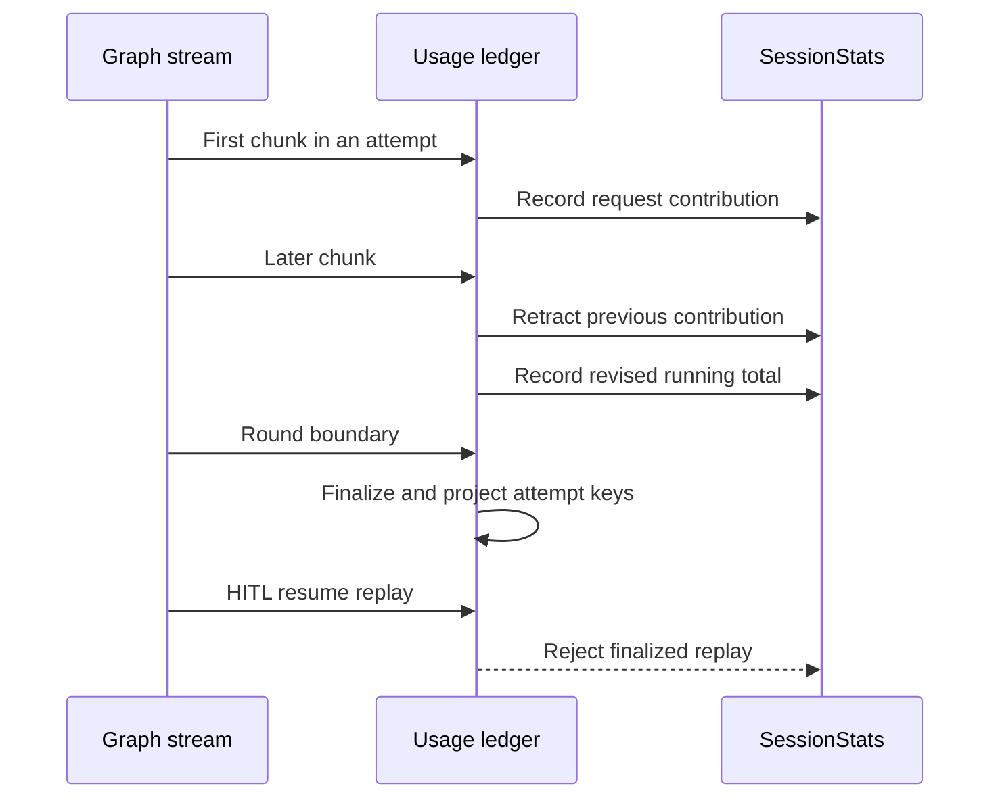

# dcode Sessions, Cost, and Observability

A dcode run has two complementary accounting paths. Graph checkpoint state owns the durable cost for a thread, while stream consumers keep `SessionStats` for responsive token and cost displays. Both are estimates rather than billing or a control plane: **nothing in the CLI caps spend or gates execution on them**.

Related material: [Runtime behavior](../architecture/runtime-behavior.md), [Context management](../concepts/context-management.md), [State persistence](../concepts/state-persistence.md), and [Run a dcode session](../workflows/run-dcode-session.md).

## Operational model

| Concern | Primary owner | What an operator should expect |
| --- | --- | --- |
| Thread durability | `sessions.py` and LangGraph checkpoints | A thread is recoverable from its selected checkpoint in local SQLite. |
| Lifetime cost | `CostTrackingMiddleware` and `CostState` | The checkpointed total is authoritative for a thread. |
| Live usage display | `SessionStats` | A replay-safe, client-side view of requests, tokens, and estimates. |
| Pricing catalog | `genai-prices` plus dcode overrides | Best-effort lookup; unavailable data leaves a request unpriced. |
| Per-run debugging | `_debug.py` | Optional secured, per-thread file logs. |
| Trace grouping | `_tracing.py` | Resume rounds receive an inheritable LangSmith tag. |
| Self-update diagnostics | `update_check.py` | Cached PyPI checks and retained subprocess logs diagnose update behavior. |

```mermaid
flowchart TD
    call["Completed model request"] --> recorder["Process-wide cost recorder"]
    recorder --> drain["Middleware drains thread records"]
    drain --> price["Estimate USD or leave unpriced"]
    price --> checkpoint["Additive checkpoint update"]
    checkpoint --> durable["Private session cost total"]
    call --> stream["Stream consumer"]
    stream --> stats["Replay-safe SessionStats"]
    durable --> display["Cost display"]
    stats --> display
```

*The graph checkpoint owns durable spend while stream statistics support the current client view.*

## Cost lifecycle

`CostState` extends resume state with schema-private `_session_cost_usd`. The channel has an `operator.add` reducer: each pricing pass writes only its new delta rather than reading and overwriting a running total. Thus the graph owns a durable per-thread cumulative total and parallel writers do not make a UI accumulator authoritative.

`_SessionCostRecorder` is installed through LangChain's configure hook process-wide. It captures completed calls by thread and checkpoint scope without doing pricing on the callback path. This includes the agent model, subagents, offload/summarization, and Auto-classifier invokes without per-caller instrumentation. A request without a usable thread cannot be attributed; bounded in-flight and per-thread queues also warn and can drop undrained records under pathological load.

`CostTrackingMiddleware.after_model` drains calls completed since its prior checkpoint, prices them, and persists the delta. `after_agent` performs a final drain for work that happens after the last model step, such as rubric grading. These hooks catch ordinary exceptions because each is a graph node and accounting must not fail the user's turn. Destructive drains are restored if pricing or the pass fails, so a later pass can retry them; queue-limit loss is the important exception to that recovery guarantee.

### Nested graphs and server operations

A nested middleware instance resets its local cost channel in `before_agent`, checkpoints its local spend, and publishes its completed amount via `_session_cost_transfers`. The transfer map is keyed by checkpoint scope and carries an `owner_scope` and total. The parent claims its matching transfer into its own checkpoint, preserving completed subagent spend if a sibling interrupts.

Server-owned work must use `prepare_operation_cost(state, thread_id)` as a small transaction: it drains and prices side-model records, then returns `PreparedOperationCost`. Persist its `update` atomically with operation state and call `commit()`, or call `rollback()` if the write fails or the operation is abandoned. This remains necessary for a zero delta because preparation has already consumed records. Rolling back after a successful write makes a later double charge possible; leaving the object unsettled warns because the drained records were not included in lifetime cost.

## Pricing behavior and catalog operations

`estimate_cost` lazy-loads `genai-prices`; a load failure logs once and returns no estimate rather than failing a model turn. It forwards LangChain's inclusive `input_tokens` and cache, audio, and reasoning detail buckets. `genai-prices` subtracts priced details from their enclosing bucket, avoiding double charges; details a matched model does not price remain in ordinary input/output totals. Missing input/output split, model identity, or an API price likewise results in no estimate. Cache/detail inconsistencies are clamped and warned about rather than silently discarding all usage.

Provider aliases are normalized before lookup. Response metadata takes precedence, followed by metadata configured for the request, checkpointed model specification, and runtime configuration fallbacks. Test both response-named and fallback-named models when changing provider behavior.

The first successful pricing import can start one daemon updater that refreshes upstream `data.json` hourly. Set `DEEPAGENTS_CODE_PRICES_AUTO_UPDATE=0`, `[update].prices_auto_update = false`, or `DEEPAGENTS_CODE_OFFLINE` to suppress it. A failed fetch keeps the installed snapshot. The update is also rejected when it contains fewer providers than the bundled catalog, preventing a truncated upstream response from replacing healthy rates.

On an upstream `genai-prices` miss only, dcode consults `~/.deepagents/prices.json`, then packaged `bundled_prices.json`; upstream wins, and the user source wins a provider/model conflict with the bundle. Override entries use upstream's provider-array schema and rates per million tokens (`input_mtok`, `output_mtok`, and optional cache/audio/reasoning buckets). A malformed or unusable fallback warns and is skipped, not allowed to interrupt a request. Restart after editing a successfully cached user catalog.

Override parsing and lookup deliberately call private `genai_prices.types._providers_from_raw` and `genai_prices.data_snapshot.find_provider_by_id`. These APIs have no compatibility promise, so re-verify override validation, provider lookup, user/bundled precedence, and degradation behavior whenever the `genai-prices` dependency range or lockfile changes.

## Live statistics, retries, and replay

`SessionStats` holds request count; input, output, cache-read, and cache-write tokens; priced request count; cumulative USD; and wall time. It additionally breaks data down by `(provider, model_name)` and `UsageKind`. It is a display/diagnostic ledger, not the durable graph cost channel.



*Chunks revise one request within a round; finalized entries make later resume data replay-safe.*

`record_message_usage` treats a completed `AIMessage` idempotently. For streamed chunks it retracts the exact prior `RecordedRequest` and records the updated aggregate, so one API call remains one request even when final metadata identifies a different model. Retry attempts use `(attempt_scope, message_id)`, allowing reused provider IDs to remain distinct. At each stream-round boundary, `finalize_recorded_requests` closes entries and projects scoped keys to bare message IDs; an unscoped HITL-resume replay therefore cannot merge and double tokens or cost. Both headless and TUI stream loops must preserve this finalization call.

`print_usage_table` is controlled by `usage_table_enabled()`, which resolves `display.show_usage_stats` once through `load_bool_display_preference` (enabled by default). TUI teardown and headless mode therefore share the decision. Config errors fail open because the table is cosmetic, except `BlockingError`, which is re-raised to surface event-loop blocking. `/cost` can distinguish priceable calls from unpriced calls rather than representing missing estimates as zero.

## Thread storage and lifecycle

Threads are LangGraph checkpoints in one SQLite database at `DEFAULT_STATE_DIR/sessions.db`. `get_db_path()` hardens and caches the state directory, and `get_checkpointer()` yields an `AsyncSqliteSaver` over a module-owned `aiosqlite` connection. Cancellation-aware connection cleanup closes and joins the worker to avoid leaked handles during shutdown. New IDs are time-ordered UUID7 strings.

`list_threads()` reads checkpoint metadata and can filter by agent, Git branch, or exact stored working directory. It creates a covering index opportunistically so normal listing can avoid scanning large state blobs; index failure is non-fatal but can make large histories slow. Message count and initial prompt are reconstructed from checkpoint/writes data when needed, because delta-channel checkpoints may not inline messages.

`ResumeState` declares private, versioned channels. The CLI reads `state_values` for the chosen checkpoint to rehydrate history and runtime facts without replaying or re-tokenizing it; selected-checkpoint values are not thread-wide aggregates. The model cache fields `_last_model_request_at`, `_last_cache_model_spec`, and `_last_cache_endpoint` are committed only after a successful request so cold-cache detection has a coherent timestamp and request identity.

`delete_thread(thread_id)` deletes checkpoint and write rows, invalidates local caches, then best-effort removes the matching offloaded conversation-history archive. Its Boolean reports checkpoint-row deletion only, so it can clean an orphan archive while returning `False`. Archives live in a hardened local `conversation_history` directory with a temporary fallback when the profile root is unwritable; deletion rejects path-escaping IDs. On TUI startup, a background sweep deletes only expired direct regular `.md` archives according to layered `history.retention_days` (30 days default); zero disables it and filesystem failures leave archives in place.

## Tracing and debug files

A turn's stream configuration carries its grouping metadata (`thread_id`, `turn_id`, and `turn_number`) across rounds. `stream_trace_config(config, stream_input)` leaves an initial input unchanged, but shallow-copies configuration for a LangGraph `Command` resume and adds `dcode:resume` exactly once. LangGraph inherits tags into model, tool, and subagent runs. The literal is an external LangSmith saved-view and cost-report contract; combine it with an `is_root` filter to select resume roots. The returned copy shares `metadata` and `configurable` with the original, so callers must not mutate them through it.

Set `DEEPAGENTS_CODE_DEBUG` truthy before logging is configured to enable per-thread file logging. `bind_debug_logging_to_thread()` routes registered loggers to a safe thread-derived filename in `DEEPAGENTS_CODE_DEBUG_DIRECTORY`, legacy `DEEPAGENTS_CODE_DEBUG_FILE`'s parent, configured `[debug]` paths, or the default debug directory. Invalid/oversized IDs are hashed for a traversal-safe filename. The directory and file are hardened to owner-only access (`0o700`/`0o600` on POSIX; a current-user DACL on Windows) and file creation refuses symlinks. If hardening or opening fails, handlers are removed and dcode warns rather than writing insecure logs.

`DEEPAGENTS_CODE_LOG_LEVEL` accepts `DEBUG`, `INFO`, `WARNING`, `ERROR`, or `CRITICAL`; its fallback is `DEBUG` with debug files enabled and `INFO` otherwise. `installed_debug_log_path()` reports the handler actually attached, which avoids advertising a file merely because an environment variable changed after logger configuration. Use it when surfacing a “full error in …” hint.

## Update checks and update diagnostics

Update checks cache stable and prerelease latest versions, release times, and relevant dependency metadata in `DEFAULT_STATE_DIR/latest_version.json` for 24 hours. The startup cache-only path never contacts PyPI; a missing, stale, corrupt, or unparsable cache simply provides no answer. A normal check uses PyPI with a three-second timeout, returns `(False, None)` on failure, and stable installs consider stable releases unless prerelease inclusion is requested or the installed build is prerelease.

An update command detects `uv`, Homebrew, editable/unknown, and other installations. Execution only uses the detected supported method rather than falling back to a package manager that could modify a different environment. `perform_upgrade()` streams combined stdout/stderr to a progress callback and an optional persisted log, has a 120-second cap, and kills the install process group on POSIX during timeout or cancellation. A successful installer is still considered failed when its read-back installed version is below the selected target.

Update logs are timestamped under the OS cache directory at `deepagents-code/update_logs`; cleanup retains at most ten and removes logs older than 14 days. Create an actual file with `create_update_log_file()` before telling a user to follow it; failed preflight or a log-open failure means a computed path may not exist. `format_log_follow_command()` provides `tail -f` on POSIX and a safely literal PowerShell `Get-Content -Wait` command on Windows.

Concurrent updates are guarded by an in-process lock plus a non-blocking installation-scoped `update.lock`, falling back to a profile lock if needed. A contender returns immediately and continues on its launched version. If locking infrastructure is unavailable, update behavior deliberately fails open with a warning rather than permanently disabling updates; this is a concurrency risk operators should resolve by restoring writable lock storage.

## Investigation and safe-change checklist

1. Identify the `thread_id`, then inspect its checkpoint/list metadata and selected checkpoint state before interpreting a display total.
2. Compare durable `_session_cost_usd` with the client `SessionStats` view: the former is checkpoint lifetime accounting, the latter is stream-local and replay-aware.
3. For missing cost, check unpriceable usage/model identity, pricing-package availability, catalog lookup, recorder warnings about missing thread context or bounded-record drops, and any rollback/commit path for server work.
4. For resume anomalies, inspect `dcode:resume` LangSmith traces and verify each stream consumer calls `finalize_recorded_requests` at the round boundary.
5. Enable debug before startup, bind the run to its thread, and use `installed_debug_log_path()` rather than assuming the configured path was secured and attached.
6. For update failures, inspect the retained update log, detected installation method, lock contention, cache freshness, and whether the installed distribution readback reached the intended version.
7. When changing this area, exercise `test_cost_tracking.py`, `test_session_stats.py`, `test_sessions.py`, `test_debug.py`, `test_tracing.py`, and `test_update_check.py` under `libs/code/tests/unit_tests/`, with particular attention to failure, cancellation, retry, and replay paths.
