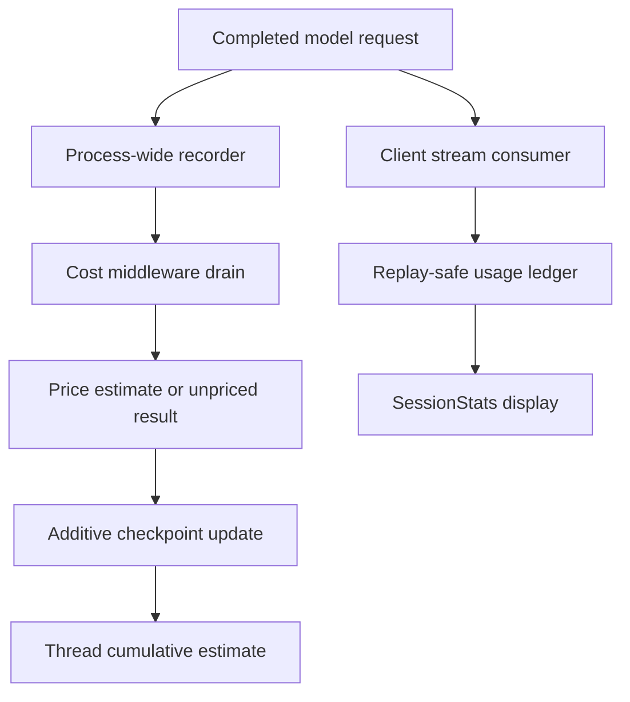
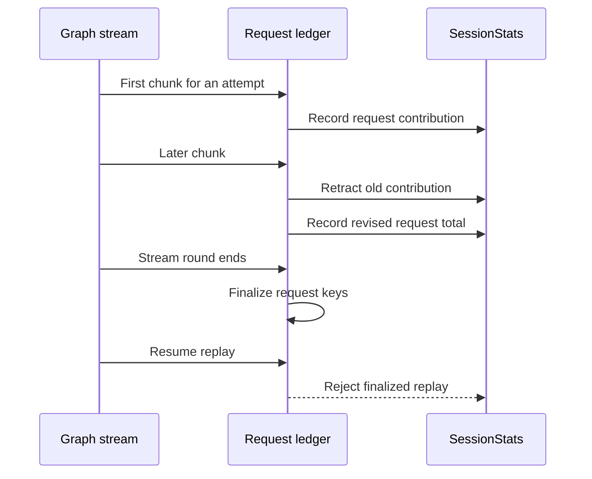

# Cost, Usage, and Session Operations

A dcode run has two accounting views: the graph checkpoints a thread's cumulative estimated cost, while stream consumers maintain `SessionStats` for responsive usage output. Neither is provider billing data or a spend-control mechanism. dcode does not cap spend or prevent a request based on an estimate; reconcile invoices and provider usage portals with the provider, not this display.

Related material: [Runtime behavior](../architecture/runtime-behavior.md), [Context management](../concepts/context-management.md), [State persistence](../concepts/state-persistence.md), and [Run a dcode session](../workflows/run-dcode-session.md).

## Ownership and lifecycle

| Concern | Owner | Operational meaning |
| --- | --- | --- |
| Durable lifetime estimate | `CostTrackingMiddleware` and checkpoint state | `_session_cost_usd` is the per-thread total recovered with the selected checkpoint. |
| Live request ledger | `SessionStats` in the client | A turn/session display that is corrected as streamed usage arrives. |
| Price lookup | `genai-prices` and local fallback catalogs | Best-effort estimation; a request can have tokens but no price. |
| Server offload cost | `prepare_operation_cost` and `/offload` settlement | Side-model cost must settle with the state change, not be independently accumulated. |
| Thread storage | `sessions.py` | LangGraph checkpoints in local SQLite. |

*The durable checkpoint total and the live display use different state owners.*

`CostState` keeps `_session_cost_usd` in a schema-private channel with an `operator.add` reducer. Each pricing pass writes its delta, rather than read-modify-writing a shared running total. `_SessionCostRecorder` is installed process-wide for completed LangChain model requests and records them by thread without pricing on the callback path. Consequently, ordinary agent calls, subagents, summarization/offload, and Auto-mode classifier calls enter the same accounting path.

After each model step, `CostTrackingMiddleware.after_model` drains newly completed records, prices them, and checkpoints the delta. `after_agent` performs a final drain for calls made after the last model step, such as grading. These accounting hooks catch exceptions because a hook failure would otherwise fail the user's graph turn. Nested graphs checkpoint local cost and transfer completed spend through `_session_cost_transfers` for the parent to claim, including when sibling execution interrupts.

## Estimates and pricing catalogs

`estimate_cost` receives LangChain usage metadata and model/provider identity. It forwards inclusive input tokens plus cache, audio, and reasoning detail buckets; the pricing library subtracts a priced detail bucket from its enclosing bucket before applying rates. Missing identity, unusable input/output usage, an unmatched model, or unavailable pricing returns no estimate rather than failing the request. An unpriced request is not a free request.

The bundled `bundled_prices.json` is an offline stopgap catalog with per-million-token rates. It currently contains entries for OpenAI, Baseten, and Fireworks, including tiered OpenAI rates. It is data for estimation only and may lag a provider's current product, regional, endpoint, batch, or contractual price. Treat it as a diagnostic fallback, never as an authorization to spend or as a billing record.

On a primary `genai-prices` miss, dcode tries `~/.deepagents/prices.json` and then the packaged bundle. Upstream data wins when it has the provider/model; on a fallback conflict, the user file wins over the bundle. Validate a custom catalog carefully: a typo, wrong provider/model mapping, stale rate, or incomplete detail-bucket definition can make the displayed estimate wrong while the actual provider call still succeeds and is billed.

The first successful pricing-library load may start one daemon updater that fetches upstream `data.json` hourly. Disable it with `DEEPAGENTS_CODE_PRICES_AUTO_UPDATE=0`, `[update].prices_auto_update = false`, or `DEEPAGENTS_CODE_OFFLINE`. A failed fetch preserves the previous snapshot, and dcode refuses an upstream catalog with fewer providers than the bundled catalog to avoid accepting an obviously truncated snapshot.

> **Compatibility warning:** local overrides use the private upstream names `genai_prices.types._providers_from_raw` and `genai_prices.data_snapshot.find_provider_by_id`. `pyproject.toml` permits `genai-prices>=0.1.7,<0.2.0`, spanning 0.1 patch releases without a promise for those names. Re-verify override parsing, lookup, precedence, and failure behavior whenever that dependency range or its resolved lockfile version changes.

## Usage presentation and replay safety

`SessionStats` tracks request count, input/output tokens, cache read/write tokens, priced-request count, estimated USD, and wall time. It also groups requests by `(provider, model_name)` and by `UsageKind` (`assistant`, `subagent`, `offload`, or `auto`). The per-model key intentionally includes provider so the same model name served through different providers does not collapse into one row.

*One streamed API request remains one statistics entry across chunk corrections and HITL resume.*

`record_message_usage` records completed messages idempotently. For chunks, it retracts the exact prior `RecordedRequest`, merges the running usage, and records the replacement; this keeps totals, model rows, and kind rows aligned even if a late chunk reveals the actual model. Retry attempts are keyed by `(attempt_scope, message_id)` so a provider-reused message ID can still represent separate attempts. At a stream-round boundary, callers must invoke `finalize_recorded_requests`: it closes entries and projects scoped entries to a bare ID, preventing unscoped HITL-resume replay from being counted again.

`print_usage_table` renders the end-of-run Rich table. `usage_table_enabled()` resolves `display.show_usage_stats` once with a default of enabled, so headless completion and TUI teardown use the same decision. Configuration failures fail open because the table is cosmetic, except `BlockingError`, which is re-raised. Cost cells display an em dash when no request in that row was priceable, distinguishing unavailable estimation from a literal zero estimate.

## Durable threads and server offload

`get_db_path()` hardens and caches `DEFAULT_STATE_DIR`, then uses `sessions.db`; `get_checkpointer()` supplies an `AsyncSqliteSaver` over a module-owned SQLite connection. Thread IDs are UUID7 strings, so they naturally sort by creation time. `delete_thread()` deletes checkpoint and write rows, invalidates local listing caches, and best-effort deletes the thread's offloaded-history archive; its Boolean result reports checkpoint deletion only.

Resume state is versioned checkpoint state, not a thread-wide roll-up. Reading `state_values` for a chosen checkpoint rehydrates the session without replaying or re-tokenizing its history, and therefore returns facts as of that checkpoint. Model-turn cache identity is committed only after a successful request: timestamp, model spec, and endpoint are paired so cold-cache diagnostics do not compare mismatched request facts.

Server `/offload` only operates on an idle or error-status thread with no pending graph work, and serializes work per thread. It hydrates the selected checkpoint, runs the offload operation, then prepares the side-model cost before updating state. Its state update and the prepared cost settle together: success commits; a confirmed unchanged failed write rolls records back. If a failed write may have landed or cannot be read back, `/offload` conservatively keeps records claimed to avoid a later double charge, while logging that some estimate may be absent from the thread total. Inspect `/context` before retrying an indeterminate offload.

## Cost-aware investigation checklist

1. Start with the `thread_id` and selected checkpoint. Compare `_session_cost_usd` with the local `SessionStats` display only after recognizing that they have different lifetimes and owners.
2. For a missing amount, distinguish **unpriced** from zero; inspect provider/model identity, pricing package/catalog availability, recorder warnings, and server-operation settlement.
3. For unexpectedly low or high estimates, check catalog source and precedence, custom overrides, price freshness, cache/detail token buckets, and the actual provider invoice. Do not infer billed usage from dcode's estimate.
4. For replay or retry anomalies, preserve `attempt_scope` and call `finalize_recorded_requests` at every stream-round boundary; run `tests/unit_tests/test_session_stats.py` after changing either behavior.
5. For offload problems, confirm the thread is quiescent, inspect the latest checkpoint and `/context`, and do not blindly repeat an operation after an indeterminate state-write error.
6. When changing pricing integration, test the bundled and user override paths against the resolved `genai-prices` version as well as ordinary upstream lookup.
